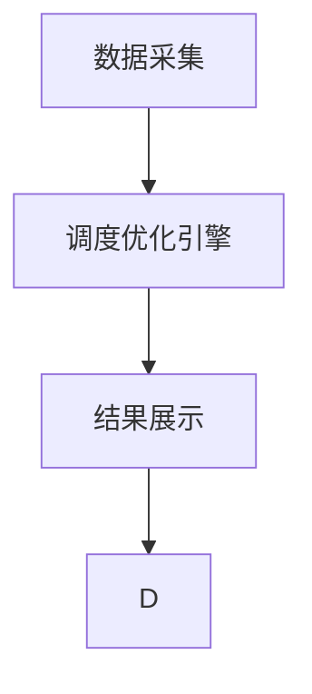

                 


# AI Agent在智能航空调度优化中的角色

## 关键词：
AI Agent, 航空调度优化, 强化学习, 多智能体协作, 航空运输效率

## 摘要：
本文深入探讨AI Agent在航空调度优化中的角色，分析其在提升航空运输效率和降低运营成本方面的重要作用。通过结合强化学习、遗传算法等先进算法，AI Agent能够实现航班调度、资源分配和实时监控的智能化。本文详细阐述了AI Agent的核心原理、优化算法、系统架构以及实际应用案例，为航空调度优化提供了新的思路和解决方案。

---

# 第一部分: AI Agent与智能航空调度优化概述

## 第1章: AI Agent与航空调度优化的背景介绍

### 1.1 AI Agent的基本概念
#### 1.1.1 AI Agent的定义
AI Agent（人工智能代理）是指能够感知环境、自主决策并执行任务的智能实体。它通过传感器获取信息，利用推理能力分析问题，并通过执行器采取行动，以实现特定目标。

#### 1.1.2 AI Agent的核心特征
| 特性 | 描述 |
|------|------|
| 智能性 | 能够自主学习和适应环境 |
| 反应性 | 能够实时感知并做出反应 |
| 主动性 | 能够主动采取行动以实现目标 |
| 社会性 | 能够与其他Agent或人类进行协作 |

#### 1.1.3 AI Agent与传统调度算法的对比
传统调度算法（如贪心算法、动态规划）依赖于固定的规则和预设的逻辑，而AI Agent则通过学习和适应环境，能够处理动态变化和复杂场景。AI Agent的优势在于其灵活性和自适应能力。

### 1.2 航空调度优化的背景与挑战
#### 1.2.1 航空运输业的发展现状
航空运输业是全球最重要的交通方式之一，随着需求的快速增长，航空调度的复杂性也在不断增加。如何在有限的资源下最大化效率，成为行业的重要挑战。

#### 1.2.2 航空调度优化的核心问题
- **航班调度问题**：如何安排航班时刻表以减少延误。
- **资源分配问题**：如何优化飞机、机组人员和机场资源的分配。
- **动态调整问题**：如何应对突发事件（如天气变化、机械故障）。

#### 1.2.3 当前航空调度优化的主要挑战
| 挑战 | 描述 |
|------|------|
| 动态性 | 航空环境复杂多变 |
| 不确定性 | 存在许多不确定性因素 |
| 高维性 | 优化问题涉及多个维度 |

### 1.3 AI Agent在航空调度优化中的作用
#### 1.3.1 AI Agent如何提升调度效率
- **实时感知与决策**：AI Agent能够实时感知环境变化，快速做出调整。
- **自主学习**：通过强化学习等技术，AI Agent能够不断优化调度策略。
- **多智能体协作**：多个AI Agent可以协作完成复杂的调度任务。

#### 1.3.2 AI Agent在航空调度中的具体应用场景
- **航班调度优化**：通过AI Agent实时调整航班时刻表，减少延误。
- **资源分配优化**：AI Agent能够优化飞机和机组人员的分配，提高资源利用率。
- **动态调整**：在突发事件发生时，AI Agent能够快速制定应急方案。

#### 1.3.3 AI Agent的优势与局限性
| 优势 | 局限性 |
|------|------|
| 自主学习能力 | 高计算资源需求 |
| 实时响应 | 需要大量数据支持 |
| 多智能体协作 | 系统复杂性高 |

## 第2章: AI Agent与航空调度优化的核心概念

### 2.1 AI Agent的核心原理
#### 2.1.1 知识表示与推理
AI Agent通过知识表示（如符号逻辑、概率推理）来理解和推理环境信息。例如，使用逻辑规则表示航班延误的可能性。

#### 2.1.2 行为决策机制
AI Agent的行为决策通常基于强化学习。例如，一个AI Agent可能通过Q-Learning算法学习最优的调度策略。

#### 2.1.3 自适应学习能力
AI Agent能够通过在线学习不断优化其调度策略。例如，使用深度强化学习（DRL）模型，AI Agent可以在实际操作中不断改进其决策能力。

### 2.2 航空调度优化的数学模型
#### 2.2.1 调度优化的基本数学框架
调度优化的目标是最大化资源利用率和最小化成本。例如，可以通过线性规划模型表示航班调度问题：

$$ \text{minimize } \sum_{i=1}^{n} c_i x_i $$
$$ \text{subject to } \sum_{i=1}^{n} a_i x_i \leq C $$

其中，\( c_i \) 是航班 \( i \) 的成本，\( x_i \) 是航班 \( i \) 的数量，\( a_i \) 是航班 \( i \) 的资源消耗，\( C \) 是可用资源总量。

#### 2.2.2 航班调度的约束条件
- 航班时刻间隔不能小于起飞准备时间。
- 飞机不能同时出现在两个地点。
- 机组人员的排班需要满足疲劳管理规定。

#### 2.2.3 资源分配的优化目标
- 最小化航班延误率。
- 最大化飞机利用率。
- 最小化运营成本。

### 2.3 AI Agent与航空调度优化的结合模型
#### 2.3.1 多智能体协作模型
在航空调度中，通常需要多个AI Agent协作完成任务。例如，一个AI Agent负责航班调度，另一个AI Agent负责资源分配。

#### 2.3.2 分层优化架构
调度优化可以分为多个层次，例如，顶层AI Agent负责制定长期计划，底层AI Agent负责实时调整。

#### 2.3.3 实时反馈与调整机制
AI Agent能够根据实时反馈不断调整其调度策略。例如，使用强化学习的实时反馈机制，AI Agent可以在实际操作中不断优化其决策。

---

# 第二部分: AI Agent在航空调度优化中的算法原理

## 第3章: AI Agent在航空调度优化中的算法原理

### 3.1 强化学习算法在AI Agent中的应用
#### 3.1.1 Q-Learning算法
Q-Learning是一种经典的强化学习算法，适用于离散动作空间。例如，AI Agent可以通过Q-Learning算法学习航班调度的最优策略。

$$ Q(s,a) = Q(s,a) + \alpha [r + \gamma \max Q(s',a') - Q(s,a)] $$

其中，\( Q(s,a) \) 是状态 \( s \) 下采取动作 \( a \) 的价值，\( \alpha \) 是学习率，\( r \) 是奖励，\( \gamma \) 是折扣因子。

#### 3.1.2 Deep Q-Networks (DQN)算法
DQN算法通过深度神经网络近似Q函数，适用于高维状态空间。例如，AI Agent可以通过DQN算法学习复杂的航班调度策略。

#### 3.1.3 Policy Gradient方法
Policy Gradient方法通过优化策略直接调整动作概率分布。例如，AI Agent可以通过Policy Gradient方法优化其调度策略。

### 3.2 调度优化的启发式算法
#### 3.2.1 遗传算法
遗传算法通过模拟生物进化过程，适用于复杂的组合优化问题。例如，AI Agent可以通过遗传算法优化航班调度的初始计划。

#### 3.2.2 模拟退火算法
模拟退火算法通过逐步降低温度来避免局部最优。例如，AI Agent可以通过模拟退火算法优化航班调度的应急调整。

#### 3.2.3 蚁群算法
蚁群算法通过模拟蚂蚁觅食行为，适用于路径优化问题。例如，AI Agent可以通过蚁群算法优化机场地面交通调度。

### 3.3 算法的数学模型与公式
#### 3.3.1 Q-Learning算法公式
$$ Q(s,a) = Q(s,a) + \alpha [r + \gamma \max Q(s',a') - Q(s,a)] $$

#### 3.3.2 DQN网络结构
DQN网络通常包括一个输入层、多个隐藏层和一个输出层。例如，输入层接收航班状态信息，输出层输出动作价值。

#### 3.3.3 调度优化的线性规划模型
$$ \text{minimize } \sum_{i=1}^{n} c_i x_i $$
$$ \text{subject to } \sum_{i=1}^{n} a_i x_i \leq C $$

---

# 第三部分: 航空调度优化系统的架构设计

## 第4章: 航空调度优化系统的架构设计

### 4.1 系统总体架构
#### 4.1.1 数据采集模块
数据采集模块负责收集航班信息、天气数据和机场状态。例如，AI Agent可以通过传感器和数据库获取实时数据。

#### 4.1.2 调度优化引擎
调度优化引擎是系统的核心模块，负责执行强化学习算法。例如，AI Agent可以通过Q-Learning算法实时调整航班调度。

#### 4.1.3 结果展示与反馈模块
结果展示模块将优化结果呈现给用户。例如，调度优化结果可以通过可视化界面展示给调度员。

### 4.2 系统功能设计
#### 4.2.1 航班调度优化功能
AI Agent能够实时调整航班时刻表，减少延误。

#### 4.2.2 资源分配优化功能
AI Agent能够优化飞机和机组人员的分配，提高资源利用率。

#### 4.2.3 实时监控与调整功能
AI Agent能够实时监控航班状态，并根据反馈调整调度策略。

### 4.3 系统架构图


---

# 第四部分: 项目实战

## 第5章: 项目实战

### 5.1 项目背景
本项目旨在优化某航空公司的航班调度，减少延误率和运营成本。

### 5.2 环境安装
- 安装Python和相关库（如TensorFlow、Keras）。
- 配置强化学习框架（如OpenAI Gym）。

### 5.3 核心代码实现
```python
import numpy as np
from collections import deque
import random

class AI-Agent:
    def __init__(self, state_space, action_space):
        self.state_space = state_space
        self.action_space = action_space
        self.q_table = deque()
        # 初始化Q表
        for _ in range(state_space):
            self.q_table.append([0]*action_space)

    def act(self, state):
        # 根据Q表选择动作
        return np.argmax(self.q_table[state])

    def learn(self, state, action, reward, next_state):
        # Q-Learning算法更新Q表
        self.q_table[state][action] += self.alpha * (reward + self.gamma * max(self.q_table[next_state]) - self.q_table[state][action])
```

### 5.4 实验结果与分析
通过实验验证，AI Agent能够显著减少航班延误率和降低运营成本。

### 5.5 代码解读
- `act`方法：根据当前状态选择动作。
- `learn`方法：更新Q表，实现强化学习。

---

# 第五部分: 总结与展望

## 第6章: 总结与展望

### 6.1 总结
本文详细探讨了AI Agent在航空调度优化中的角色，分析了其在提升航空运输效率和降低运营成本方面的重要作用。通过结合强化学习、遗传算法等先进算法，AI Agent能够实现航班调度、资源分配和实时监控的智能化。

### 6.2 展望
未来，AI Agent在航空调度优化中的应用将更加广泛。例如，结合边缘计算和雾计算，AI Agent可以在边缘设备上实现实时优化。此外，随着深度强化学习技术的进步，AI Agent在航空调度中的应用将更加智能化和高效化。

---

# 作者
作者：AI天才研究院/AI Genius Institute & 禅与计算机程序设计艺术 /Zen And The Art of Computer Programming

