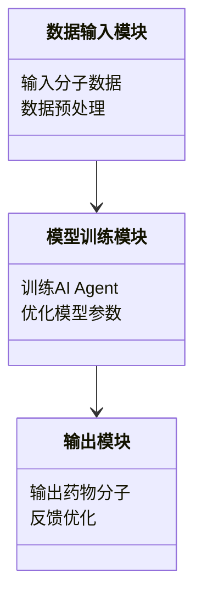
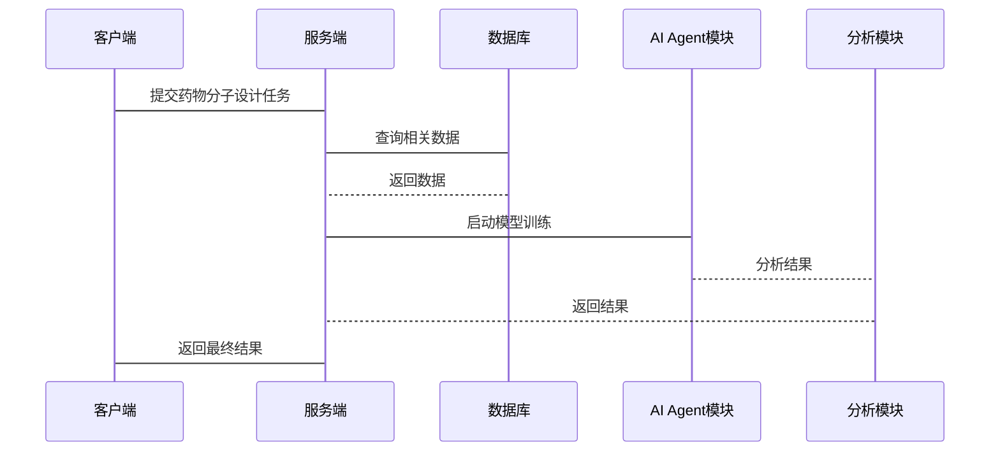

                 


# AI Agent在智能药物研发中的角色

> 关键词：AI Agent, 智能药物研发, 人工智能, 药物分子设计, 临床试验优化, 多智能体协作

> 摘要：AI Agent在智能药物研发中扮演着越来越重要的角色，通过智能化的分析和决策，显著提高了药物研发的效率和精准度。本文将从AI Agent的基本概念、核心原理、算法模型、系统架构、项目实战等方面进行深入分析，探讨其在药物研发中的具体应用场景和未来发展趋势。

---

## 第1章 AI Agent的基本概念与技术基础

### 1.1 AI Agent的定义与核心原理

#### 1.1.1 AI Agent的定义
AI Agent（人工智能代理）是指能够感知环境、自主决策并采取行动以实现特定目标的智能实体。它能够通过与环境的交互，不断优化自身的决策策略，以达到最优解决方案。

#### 1.1.2 AI Agent的核心技术特点
- **自主性**：能够在没有外部干预的情况下自主运行。
- **反应性**：能够实时感知环境并做出反应。
- **学习能力**：通过数据和经验不断优化自身的决策能力。
- **协作性**：能够与其他AI Agent或人类协同工作。

#### 1.1.3 AI Agent与传统AI的区别
传统AI（如专家系统）依赖于预定义的规则和逻辑，而AI Agent具备更强的自主性和适应性，能够动态调整策略以应对复杂环境。

### 1.2 AI Agent在药物研发中的应用背景

#### 1.2.1 药物研发的复杂性与挑战
药物研发是一个耗时、耗力且成本高昂的过程，涉及分子设计、临床试验等多个环节，传统方法效率低下。

#### 1.2.2 AI Agent在药物研发中的优势
- **高效数据处理**：能够快速分析海量生物数据，识别潜在药物分子。
- **精准决策**：通过强化学习优化临床试验设计，提高研发效率。
- **多智能体协作**：能够协调多个AI Agent共同完成复杂任务。

#### 1.2.3 当前AI Agent在药物研发中的应用现状
AI Agent已应用于药物分子设计、临床试验优化等领域，显著提高了研发效率和精准度。

---

## 第2章 AI Agent的核心概念与技术架构

### 2.1 AI Agent的核心概念

#### 2.1.1 知识表示与推理
- **知识表示**：通过符号逻辑或概率模型表示药物研发中的知识。
- **推理**：通过逻辑推理或概率推理从已知信息中推导出新结论。

#### 2.1.2 问题求解与规划
- **问题求解**：通过搜索算法或启发式算法寻找最优解。
- **规划**：制定行动计划以实现目标。

#### 2.1.3 多智能体协作
- **多智能体系统**：多个AI Agent协同工作，共同完成复杂任务。
- **协作机制**：通过通信协议实现信息共享和协同决策。

### 2.2 AI Agent的技术架构

#### 2.2.1 基于规则的AI Agent
- **规则驱动**：通过预定义的规则进行决策。
- **优点**：简单易懂，适用于规则明确的任务。

#### 2.2.2 基于机器学习的AI Agent
- **数据驱动**：通过机器学习模型从数据中学习决策策略。
- **优点**：适应性强，适用于复杂任务。

#### 2.2.3 基于强化学习的AI Agent
- **强化学习**：通过与环境的交互，学习最优策略。
- **优点**：能够在动态环境中自适应调整策略。

---

## 第3章 AI Agent的算法原理与数学模型

### 3.1 强化学习算法原理

#### 3.1.1 Q-Learning算法
- **定义**：一种基于值函数的强化学习算法。
- **公式**：
  $$
  Q(s, a) = Q(s, a) + \alpha \left[r + \gamma \max Q(s', a') - Q(s, a)\right]
  $$
  其中，$\alpha$ 是学习率，$\gamma$ 是折扣因子。

#### 3.1.2 Deep Q-Network (DQN)
- **原理**：通过深度神经网络近似值函数，实现端到端的决策优化。

### 3.2 监督学习算法原理

#### 3.2.1 神经网络模型
- **结构**：输入层、隐藏层、输出层。
- **训练**：通过反向传播和梯度下降优化权重。

#### 3.2.2 案例分析：药物分子分类
- **输入**：分子结构特征。
- **输出**：药物分子的分类结果。
- **公式**：使用交叉熵损失函数：
  $$
  L = -\sum y_i \log p(y_i) + (1 - y_i) \log (1 - p(y_i))
  $$

---

## 第4章 系统分析与架构设计方案

### 4.1 问题场景介绍

#### 4.1.1 药物分子设计
- **目标**：设计具有特定药效的分子结构。
- **挑战**：分子空间巨大，传统方法效率低下。

### 4.2 系统功能设计

#### 4.2.1 功能模块
- **数据输入与预处理**：处理生物数据。
- **模型训练与优化**：训练AI Agent模型。
- **结果输出与反馈**：输出药物分子设计结果。

#### 4.2.2 领域模型（Mermaid类图）


### 4.3 系统架构设计

#### 4.3.1 系统架构图（Mermaid架构图）


#### 4.3.2 接口设计（Mermaid序列图）


---

## 第5章 项目实战

### 5.1 环境安装

#### 5.1.1 安装Python
```bash
python --version
pip install --upgrade pip
```

#### 5.1.2 安装依赖库
```bash
pip install numpy pandas tensorflow
```

### 5.2 核心代码实现

#### 5.2.1 DQN算法实现
```python
import numpy as np
import tensorflow as tf

class DQN:
    def __init__(self, state_space, action_space):
        self.state_space = state_space
        self.action_space = action_space
        self.model = self.build_model()
    
    def build_model(self):
        model = tf.keras.Sequential([
            tf.keras.layers.Dense(64, activation='relu'),
            tf.keras.layers.Dense(32, activation='relu'),
            tf.keras.layers.Dense(self.action_space, activation='linear')
        ])
        return model
```

#### 5.2.2 训练过程
```python
def train(dqn, env):
    optimizer = tf.keras.optimizers.Adam(learning_rate=0.001)
    for episode in range(1000):
        state = env.reset()
        while True:
            action = dqn.model.predict(state)[0]
            next_state, reward, done = env.step(action)
            target = reward + (1 - done) * np.max(dqn.model.predict(next_state))
            target = target.reshape(-1, 1)
            with tf.GradientTape() as tape:
                predictions = dqn.model.predict(state)
                loss = tf.keras.losses.mse(target, predictions)
            grads = tape.gradient(loss, dqn.model.trainable_weights)
            optimizer.apply_gradients(zip(grads, dqn.model.trainable_weights))
            if done:
                break
```

### 5.3 案例分析与解读

#### 5.3.1 药物分子设计案例
- **输入**：目标疾病相关基因数据。
- **输出**：设计的药物分子结构。
- **分析**：AI Agent通过强化学习优化分子结构，提高药效。

### 5.4 项目小结
- **收获**：掌握AI Agent在药物研发中的具体应用。
- **问题**：模型训练时间较长，需要优化算法。

---

## 第6章 最佳实践 tips

### 6.1 小结
AI Agent在智能药物研发中的应用前景广阔，但仍需进一步优化算法和模型。

### 6.2 注意事项
- 数据隐私保护。
- 模型泛化能力的提升。
- 多智能体协作的优化。

### 6.3 拓展阅读
- 《Deep Learning for Drug Discovery》
- 《Reinforcement Learning in Practice》

---

## 附录

### 参考文献
1. Mnih, V., et al. "Human-level control through deep reinforcement learning." Nature, 2015.
2. LeCun, Y., Bengio, Y., & Hinton, G. "Deep learning." Nature, 2015.

### 工具与资源推荐
- TensorFlow官方文档：https://tensorflow.org
- Keras官方文档：https://keras.io
- Mermaid图表工具：https://mermaid-js.github.io/mermaid-live-editor

### 术语表
- AI Agent：人工智能代理。
- 强化学习：Reinforcement Learning。
- 深度学习：Deep Learning。

---

作者：AI天才研究院/AI Genius Institute & 禅与计算机程序设计艺术 /Zen And The Art of Computer Programming

