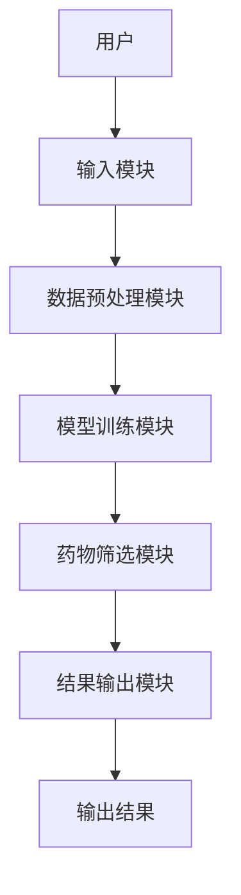

                 


# AI Agent在智能药物筛选中的应用

> 关键词：AI Agent, 药物筛选, 人工智能, 算法原理, 数学模型

> 摘要：本文详细探讨了AI Agent在智能药物筛选中的应用，从基本概念到算法原理，再到系统架构和实际案例，系统地介绍了AI Agent如何通过数据驱动和自适应学习提升药物筛选的效率和准确性。

---

# 第一部分: AI Agent的基本概念与药物筛选背景

## 第1章: AI Agent的定义与特点

### 1.1 AI Agent的定义
#### 1.1.1 什么是AI Agent
AI Agent（人工智能代理）是指能够感知环境、自主决策并执行任务的智能实体。它具备目标导向性、自主性、反应性和社会性等核心特点。

#### 1.1.2 AI Agent的核心特点
- **目标导向性**：AI Agent的行为旨在实现特定目标。
- **自主性**：能够在没有外部干预的情况下自主运作。
- **反应性**：能够根据环境反馈实时调整行为。
- **社会性**：能够与其他系统或人类进行交互协作。

#### 1.1.3 AI Agent与传统AI的区别
传统AI主要依赖预定义规则，而AI Agent具备自主决策和动态调整能力，能够适应复杂多变的环境。

### 1.2 药物筛选的背景
#### 1.2.1 药物筛选的基本概念
药物筛选是通过实验或计算方法，从大量化合物中发现具有潜在药用价值的候选药物的过程。

#### 1.2.2 传统药物筛选的局限性
- **耗时长**：传统筛选方法需要大量实验，周期长且成本高。
- **效率低**：依赖人工经验，筛选效率有限。
- **数据依赖性**：需要大量实验数据支持。

#### 1.2.3 现代药物筛选技术的发展
随着AI技术的发展，AI Agent被广泛应用于药物分子生成、活性预测和高效筛选等环节，显著提升了筛选效率和准确性。

## 第2章: AI Agent在药物筛选中的作用

### 2.1 AI Agent在药物筛选中的应用场景
#### 2.1.1 药物分子的生成与优化
AI Agent通过生成模型（如GAN、VAE）设计新药分子，优化其物理化学性质和药代动力学特性。

#### 2.1.2 药物活性预测
利用监督学习算法（如神经网络）预测化合物的活性，筛选出具有潜在药效的候选药物。

#### 2.1.3 药物筛选的高效性与准确性
AI Agent能够快速分析海量数据，提高筛选效率，并减少实验成本。

### 2.2 AI Agent的核心优势
#### 2.2.1 数据驱动的决策能力
AI Agent能够从大量数据中提取有用信息，支持决策。

#### 2.2.2 自适应学习能力
AI Agent能够根据反馈不断优化模型，提升筛选效果。

#### 2.2.3 并行计算与高效筛选
AI Agent利用并行计算能力，快速处理大量数据，提高筛选效率。

---

# 第二部分: AI Agent的算法原理与数学模型

## 第3章: AI Agent的算法原理

### 3.1 监督学习算法
#### 3.1.1 线性回归
线性回归是一种简单且常用的回归算法，适用于预测连续型变量。

$$ y = \beta_0 + \beta_1x + \epsilon $$

#### 3.1.2 支持向量机
支持向量机（SVM）是一种监督学习算法，适用于分类和回归任务。

$$ \text{目标函数：} \quad \text{min} \frac{1}{2}\|w\|^2 + C\sum_{i=1}^n \xi_i $$
$$ \text{约束条件：} \quad y_i(w \cdot x_i + b) \geq 1 - \xi_i, \quad \xi_i \geq 0 $$

#### 3.1.3 神经网络
神经网络是一种强大的非线性模型，适用于复杂任务。

$$ a^{(l)} = \sigma(W^{(l)}a^{(l-1)} + b^{(l)}) $$

### 3.2 强化学习算法
#### 3.2.1 Q-learning
Q-learning是一种基于值函数的强化学习算法。

$$ Q(s, a) = Q(s, a) + \alpha [r + \max_{a'} Q(s', a') - Q(s, a)] $$

#### 3.2.2 Deep Q-Network
Deep Q-Network（DQN）将Q-learning与深度学习结合，适用于高维状态空间。

#### 3.2.3 Policy Gradient方法
Policy Gradient方法直接优化策略，适用于复杂环境。

### 3.3 生成模型
#### 3.3.1 GAN（生成对抗网络）
GAN由生成器和判别器组成，通过对抗训练生成数据。

$$ \min_G \max_D \mathbb{E}_{x \sim p_{\text{data}}}[\log D(x)] + \mathbb{E}_{z \sim p_z}[\log(1 - D(G(z)))] $$

#### 3.3.2 VAE（变分自编码器）
VAE通过最大化下界似然来学习数据分布。

$$ \mathcal{L} = \mathbb{E}_{z \sim q(z|x)}[\log p(x|z)] - \text{KL}(q(z|x) \parallel p(z)) $$

#### 3.3.3 Diffusion模型
Diffusion模型通过逐步去噪生成数据。

---

## 第4章: AI Agent的数学模型与公式

### 4.1 监督学习的数学模型
#### 4.1.1 线性回归的数学表达式
$$ y = \beta_0 + \beta_1x + \epsilon $$

#### 4.1.2 神经网络的数学表达式
$$ a^{(l)} = \sigma(W^{(l)}a^{(l-1)} + b^{(l)}) $$

### 4.2 强化学习

#### 4.2.1 Q-learning的数学表达式
$$ Q(s, a) = Q(s, a) + \alpha [r + \max_{a'} Q(s', a') - Q(s, a)] $$

### 4.3 生成模型的数学模型

#### 4.3.1 GAN的数学表达式
$$ \min_G \max_D \mathbb{E}_{x \sim p_{\text{data}}}[\log D(x)] + \mathbb{E}_{z \sim p_z}[\log(1 - D(G(z)))] $$

---

# 第三部分: 系统架构与设计

## 第5章: 药物筛选系统的架构设计

### 5.1 问题场景介绍
药物筛选系统需要高效地从大量化合物中筛选出具有潜在药效的候选药物。

### 5.2 系统功能设计
- **数据输入**：接收化合物库数据。
- **模型训练**：训练AI Agent模型。
- **药物筛选**：利用AI Agent进行药物分子生成与活性预测。
- **结果输出**：输出候选药物列表和相关分析结果。

### 5.3 系统架构图


---

## 第6章: 项目实战

### 6.1 环境配置
- **Python版本**：Python 3.8+
- **深度学习框架**：TensorFlow或Keras
- **依赖库**：numpy, pandas, scikit-learn, matplotlib

### 6.2 核心代码实现
#### 6.2.1 数据预处理
```python
import numpy as np
import pandas as pd

# 读取数据
data = pd.read_csv('drug_data.csv')

# 数据清洗
data.dropna(inplace=True)
```

#### 6.2.2 模型训练
```python
from tensorflow.keras.models import Sequential
from tensorflow.keras.layers import Dense, Activation

# 定义神经网络模型
model = Sequential()
model.add(Dense(64, activation='relu', input_dim=10))
model.add(Dense(1, activation='sigmoid'))

# 编译模型
model.compile(optimizer='adam', loss='binary_crossentropy', metrics=['accuracy'])
```

#### 6.2.3 药物筛选
```python
# 生成新药分子
def generate_drug():
    # 使用生成模型生成化合物
    pass

# 预测活性
def predict_activity(drug):
    # 使用训练好的模型预测活性
    pass
```

### 6.3 案例分析与结果解读
通过实际案例，展示AI Agent如何优化药物筛选过程，并分析结果。

---

# 第四部分: 总结与展望

## 第7章: 总结

### 7.1 AI Agent的优势
- **高效性**：快速筛选大量化合物。
- **准确性**：提高药物筛选的命中率。
- **创新性**：生成新型药物分子。

### 7.2 最佳实践
- **数据质量**：确保数据的准确性和完整性。
- **模型优化**：持续优化模型以提高性能。
- **团队协作**：结合领域知识与技术能力。

## 第8章: 未来展望

### 8.1 技术进步
- **更复杂的生成模型**：如改进的Diffusion模型。
- **多模态数据融合**：结合结构、活性等多方面数据。

### 8.2 应用扩展
- **疾病建模**：AI Agent在疾病机制研究中的应用。
- **个性化药物**：基于个体特征定制药物。

---

# 作者：AI天才研究院（AI Genius Institute） & 禅与计算机程序设计艺术（Zen And The Art of Computer Programming）

---

**注**：以上内容为详细的大纲和部分章节内容，实际撰写时需要根据具体需求扩展每个部分的内容，包括更多的算法细节、数学推导和实际案例分析。

