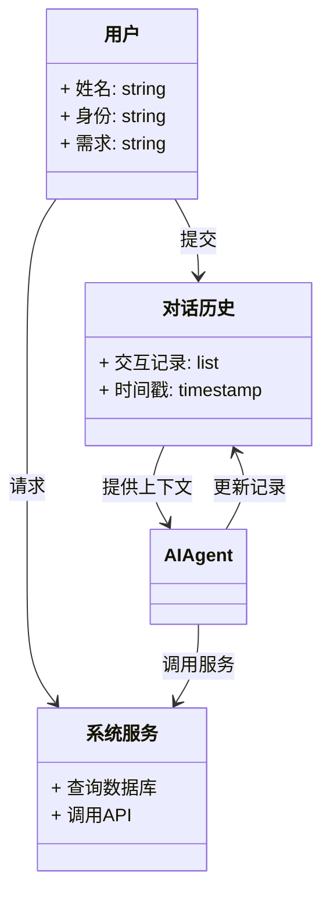

                 


# AI Agent在智能虚拟助理中的角色

## 关键词
AI Agent, 智能虚拟助理, 自然语言处理, 对话管理, 系统架构, 项目实战

## 摘要
AI Agent作为智能虚拟助理的核心驱动力，通过自然语言处理和对话管理等技术，实现与用户的智能交互。本文从AI Agent的基本概念出发，深入探讨其在智能虚拟助理中的角色，详细分析算法原理、系统架构，并通过项目实战和最佳实践，全面解析AI Agent在智能虚拟助理中的应用。

---

# 第一部分：AI Agent与智能虚拟助理的背景介绍

## 第1章：AI Agent的基本概念

### 1.1 AI Agent的定义与核心要素
AI Agent（人工智能代理）是指能够感知环境、自主决策并采取行动以实现目标的智能实体。AI Agent的核心要素包括：

- **感知能力**：通过传感器或数据输入获取环境信息。
- **决策能力**：基于感知信息，通过算法做出决策。
- **执行能力**：通过执行器或输出模块将决策转化为实际操作。
- **学习能力**：通过机器学习算法不断优化自身性能。

AI Agent的类型多样，包括简单反射型AI Agent、基于规则的AI Agent和基于学习的AI Agent。

### 1.2 智能虚拟助理的发展历程
智能虚拟助理（IVA）是一种通过自然语言处理技术与用户进行交互的智能系统。其发展历程可以分为以下几个阶段：

1. **早期阶段**：基于规则的简单对话系统，无法理解复杂语义。
2. **发展阶段**：引入自然语言处理技术，能够理解部分语义并执行任务。
3. **成熟阶段**：结合深度学习技术，实现更复杂的语义理解和多轮对话。

### 1.3 AI Agent在智能虚拟助理中的角色
AI Agent作为智能虚拟助理的核心驱动力，承担了以下主要角色：

- **语义理解**：通过自然语言处理技术，准确理解用户的意图。
- **对话管理**：根据对话上下文，生成合适的回应并驱动交互。
- **任务执行**：根据用户需求，调用后端服务完成任务。

---

## 第2章：AI Agent的核心原理

### 2.1 AI Agent的类型与特点
AI Agent可以根据功能和应用场景分为以下几种类型：

- **简单反射型AI Agent**：基于预定义规则进行简单响应，适用于特定场景。
- **基于规则的AI Agent**：通过规则库进行决策，适用于规则明确的场景。
- **基于学习的AI Agent**：通过机器学习算法不断优化性能，适用于复杂场景。

### 2.2 AI Agent的工作原理
AI Agent的工作原理可以分为以下几个步骤：

1. **感知环境**：通过传感器或输入模块获取环境信息。
2. **语义理解**：通过自然语言处理技术理解用户意图。
3. **决策推理**：基于语义理解和规则库生成响应。
4. **执行反馈**：通过执行器或输出模块完成操作并反馈结果。

---

## 第3章：AI Agent在智能虚拟助理中的算法原理

### 3.1 自然语言处理算法
自然语言处理（NLP）是AI Agent实现语义理解的核心技术。

#### 3.1.1 语言模型
语言模型通过概率分布预测下一个词的概率，常用模型包括：

- **马尔可夫链模型**：基于马尔可夫假设，预测下一个词的概率。
- **循环神经网络（RNN）**：通过循环结构处理序列数据，常用LSTM变体。
- **Transformer模型**：基于注意力机制，提升语义理解能力。

#### 3.1.2 注意力机制
注意力机制通过计算输入序列中每个词的重要性，提升模型的语义理解能力。公式如下：

$$
\text{Attention}(Q, K, V) = \text{softmax}\left(\frac{QK^T}{\sqrt{d_k}}\right)V
$$

其中，$Q$、$K$、$V$分别为查询、键、值向量，$d_k$为键的维度。

### 3.2 对话管理算法
对话管理是AI Agent实现智能交互的关键技术。

#### 3.2.1 对话状态表示
对话状态表示通过将对话历史、用户意图等信息编码为向量，常用技术包括：

- **基于规则的状态表示**：通过预定义规则编码对话状态。
- **基于嵌入的表示**：通过词嵌入技术将对话历史编码为向量。

#### 3.2.2 对话策略
对话策略通过最大化期望奖励实现对话目标，常用算法包括：

- **最大期望奖励（MES）**：通过最大化期望奖励选择最佳响应。
- **策略梯度法（PG）**：通过梯度下降优化对话策略。

---

## 第4章：AI Agent在智能虚拟助理中的系统架构

### 4.1 系统架构设计
智能虚拟助理的系统架构包括以下几个模块：

- **前端交互模块**：负责与用户进行交互，接收输入并返回输出。
- **后端处理模块**：负责处理用户请求，调用后端服务完成任务。
- **AI Agent模块**：负责语义理解、对话管理和任务执行。

### 4.2 系统功能设计
系统功能设计通过领域模型实现，常用Mermaid类图表示。



---

## 第5章：AI Agent在智能虚拟助理中的项目实战

### 5.1 环境安装
项目实战需要以下环境：

- Python 3.8+
- TensorFlow 2.0+
- Keras 2.4+
- NLTK 3.6+

### 5.2 核心代码实现
以下是AI Agent的核心代码实现：

```python
class AI_Agent:
    def __init__(self):
        self.nlp = None
        self.dialogue_manager = None
        self.executor = None

    def initialize(self, nlp, dialogue_manager, executor):
        self.nlp = nlp
        self.dialogue_manager = dialogue_manager
        self.executor = executor

    def process_query(self, query):
        # 语义理解
        intent = self.nlp.predict_intent(query)
        # 对话管理
        response = self.dialogue_manager.generate_response(intent)
        # 任务执行
        self.executor.execute_task(response)
        return response
```

### 5.3 实际案例分析
以下是一个实际案例分析：

- **用户输入**：我需要预订明天的机票。
- **语义理解**：机票预订，时间：明天。
- **对话管理**：生成响应：请提供目的地和乘客信息。
- **任务执行**：调用机票预订系统完成预订。

---

## 第6章：最佳实践

### 6.1 小结
AI Agent在智能虚拟助理中的作用至关重要，通过自然语言处理和对话管理等技术实现智能交互。

### 6.2 注意事项
- 数据质量：确保训练数据的多样性和代表性。
- 模型优化：通过持续学习优化模型性能。
- 安全性：确保用户数据的安全性和隐私保护。

### 6.3 拓展阅读
- 《深度学习》——Ian Goodfellow
- 《自然语言处理实战》——周志华

---

## 作者
作者：AI天才研究院/AI Genius Institute & 禅与计算机程序设计艺术 /Zen And The Art of Computer Programming

---

通过以上内容，我们可以看到AI Agent在智能虚拟助理中的重要性以及其实现的技术细节。希望本文能为相关领域的研究和实践提供有价值的参考。

