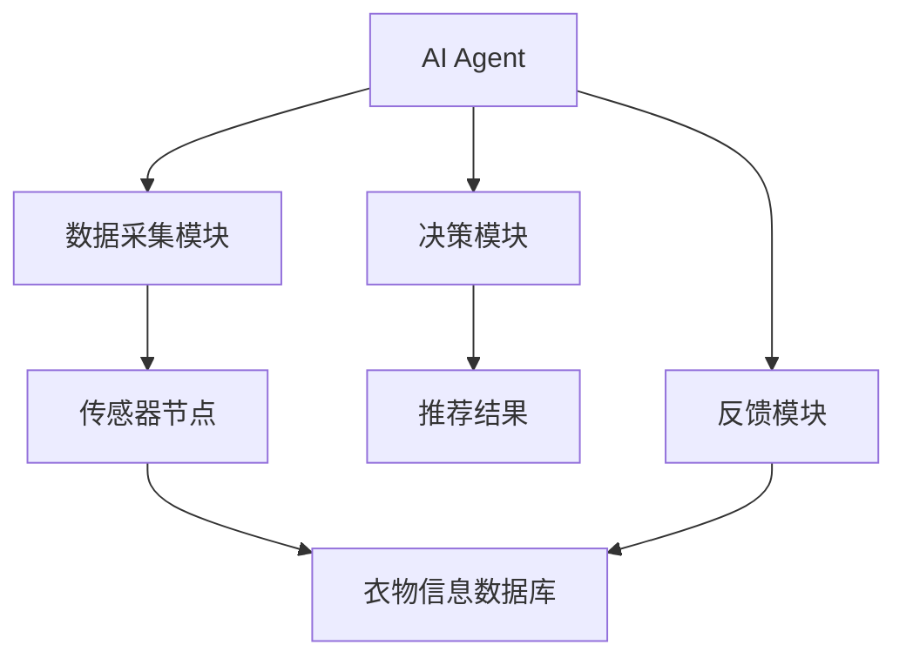

                 


# AI Agent在智能衣架中的季节性衣物管理

## 关键词：AI Agent、智能衣架、季节性衣物、衣物管理、推荐系统、深度学习、协同过滤

## 摘要：  
本文探讨了AI Agent在智能衣架中的应用，重点分析如何通过AI技术实现季节性衣物的智能化管理。从问题背景、算法原理到系统设计和项目实现，文章详细介绍了AI Agent如何帮助用户高效管理衣物，提升生活质量。通过协同过滤和深度学习模型，结合实际案例分析，展示了AI在智能衣架中的巨大潜力。

---

# 第一部分: AI Agent与智能衣架概述

## 第1章: AI Agent与智能衣架概述

### 1.1 问题背景与目标

#### 1.1.1 季节性衣物管理的痛点
季节性衣物（如羽绒服、短袖）在衣柜中占比很大，但管理效率低下。用户常面临以下问题：
- 衣物分类混乱，难以快速找到。
- 季节变化时，手动整理衣物耗时耗力。
- 缺乏智能提醒，导致衣物使用效率低。

#### 1.1.2 AI Agent在衣物管理中的应用价值
AI Agent（人工智能代理）能通过感知环境、自主决策，帮助用户高效管理衣物：
- 自动分类衣物，提升查找效率。
- 根据天气和用户习惯推荐衣物。
- 提供智能提醒，优化衣物使用效率。

#### 1.1.3 智能衣架的核心目标与意义
智能衣架的目标是通过AI技术，实现衣物的智能化管理。其意义在于：
- 提高衣物管理效率，降低用户时间成本。
- 帮助用户更好地规划衣物使用，延长衣物寿命。
- 为智能家居生态提供新的应用场景。

### 1.2 AI Agent的基本概念与特点

#### 1.2.1 什么是AI Agent
AI Agent是一种智能主体，具备以下特点：
- **自主性**：能在无外部干预下执行任务。
- **反应性**：能感知环境并做出实时响应。
- **目标导向**：有明确的目标，持续优化行动以实现目标。
- **学习能力**：能通过数据和经验不断优化性能。

#### 1.2.2 AI Agent的核心特点
在智能衣架中，AI Agent主要负责：
- **数据采集**：通过传感器收集衣物信息。
- **决策制定**：根据数据推荐衣物。
- **执行反馈**：通过衣架结构调整衣物位置。

#### 1.2.3 智能衣架中的AI Agent功能模块
智能衣架中的AI Agent模块包括：
- **数据采集模块**：收集衣物类型、使用频率等数据。
- **决策模块**：基于数据推荐衣物。
- **反馈模块**：根据用户行为优化推荐算法。

### 1.3 智能衣架的系统架构

#### 1.3.1 系统整体架构图
以下是智能衣架的系统架构图：



#### 1.3.2 各功能模块的交互关系
- **数据采集模块**：通过传感器收集衣物信息。
- **决策模块**：根据数据生成推荐。
- **反馈模块**：优化推荐算法。

#### 1.3.3 系统的核心流程与逻辑
1. 数据采集：传感器收集衣物信息。
2. 数据分析：AI Agent分析数据。
3. 决策生成：基于分析结果推荐衣物。
4. 反馈优化：根据用户行为优化算法。

---

## 第2章: 问题建模与数据准备

### 2.1 季节性衣物管理的核心问题

#### 2.1.1 衣物分类与管理的复杂性
- 衣物种类多样，分类复杂。
- 季节变化导致管理需求变化。

#### 2.1.2 用户需求的多样性
- 不同用户有不同需求。
- 用户习惯和偏好影响衣物管理。

#### 2.1.3 系统如何处理季节性变化
- 根据天气变化调整推荐。
- 学习用户习惯优化推荐策略。

### 2.2 数据建模与特征提取

#### 2.2.1 衣物数据的特征定义
- 衣物类型、品牌、颜色、使用频率。
- 衣物的材质、季节适用性。

#### 2.2.2 用户行为数据的建模
- 用户的使用习惯、偏好、使用频率。
- 用户的反馈数据。

#### 2.2.3 时间序列数据的处理
- 处理时间序列数据，分析用户行为随时间的变化。

### 2.3 数据准备与预处理

#### 2.3.1 数据清洗与标准化
- 去除重复数据，填充缺失值。
- 标准化数据格式，便于后续分析。

#### 2.3.2 数据的特征工程
- 提取关键特征，如使用频率、时间戳。
- 转换数据，使其适合模型输入。

#### 2.3.3 数据集的划分与存储
- 划分训练集、验证集、测试集。
- 数据存储于数据库，便于快速访问。

---

## 第3章: 推荐算法与数学模型

### 3.1 协同过滤算法

#### 3.1.1 协同过滤的基本原理
- **用户-物品矩阵**：记录用户对物品的评分。
- **相似度计算**：计算用户间的相似度。
- **推荐生成**：基于相似用户的行为推荐物品。

#### 3.1.2 基于用户的协同过滤
- 计算用户相似度，找到相似用户的推荐。

#### 3.1.3 基于物品的协同过滤
- 计算物品相似度，推荐相似物品。

### 3.2 深度学习模型

#### 3.2.1 基于神经网络的推荐系统
- 使用神经网络建模用户行为。
- 提取高维特征，生成推荐。

#### 3.2.2 基于嵌入的推荐模型
- 使用嵌入技术降低维度。
- 提高推荐系统的效率和准确性。

### 3.3 混合推荐模型

#### 3.3.1 混合推荐模型的优势
- 结合协同过滤和深度学习的优点。
- 提高推荐的准确性和多样性。

#### 3.3.2 混合模型的构建与训练
- 组合多种算法，优化推荐效果。

#### 3.3.3 混合模型的性能评估
- 通过AUC、准确率等指标评估性能。

---

## 第4章: 算法实现与优化

### 4.1 协同过滤算法实现

#### 4.1.1 协同过滤算法实现步骤
1. 构建用户-物品矩阵。
2. 计算用户相似度。
3. 生成推荐列表。

#### 4.1.2 协同过滤算法的代码实现
```python
import numpy as np
from sklearn.metrics import pairwise

# 用户-物品矩阵
user_item_matrix = np.array([[4,3,2,0],
                              [3,4,1,0],
                              [2,3,4,0],
                              [0,2,3,5]])

# 计算用户相似度
user_similarity = pairwise.cosine_similarity(user_item_matrix)
```

#### 4.1.3 协同过滤算法的优化
- 使用高效的数据结构。
- 优化相似度计算方法。

### 4.2 深度学习模型实现

#### 4.2.1 深度学习模型实现步骤
1. 数据预处理。
2. 模型训练。
3. 模型评估。

#### 4.2.2 深度学习模型的代码实现
```python
import tensorflow as tf
from tensorflow.keras import layers

# 定义模型
model = tf.keras.Sequential()
model.add(layers.Dense(64, activation='relu'))
model.add(layers.Dense(1, activation='sigmoid'))
model.compile(optimizer='adam', loss='binary_crossentropy')
```

---

## 第5章: 系统设计与实现

### 5.1 系统架构设计

#### 5.1.1 系统架构图
以下是系统架构图：


### 5.2 接口设计与交互

#### 5.2.1 系统接口设计
- **数据接口**：与传感器交互。
- **用户接口**：提供推荐结果。
- **反馈接口**：收集用户反馈。

#### 5.2.2 交互设计
- 用户通过手机应用查看推荐。
- 系统根据反馈优化推荐。

---

## 第6章: 项目实战与案例分析

### 6.1 环境配置与安装

#### 6.1.1 开发环境
- 操作系统：Windows/Mac/Linux。
- 开发工具：PyCharm/VS Code。
- 依赖库：TensorFlow、Scikit-learn。

### 6.2 代码实现与解读

#### 6.2.1 协同过滤算法的代码实现
```python
import numpy as np
from sklearn.metrics import pairwise

user_item_matrix = np.array([[4,3,2,0],
                              [3,4,1,0],
                              [2,3,4,0],
                              [0,2,3,5]])

user_similarity = pairwise.cosine_similarity(user_item_matrix)
```

#### 6.2.2 深度学习模型的代码实现
```python
import tensorflow as tf
from tensorflow.keras import layers

model = tf.keras.Sequential()
model.add(layers.Dense(64, activation='relu'))
model.add(layers.Dense(1, activation='sigmoid'))
model.compile(optimizer='adam', loss='binary_crossentropy')
```

### 6.3 案例分析与结果展示

#### 6.3.1 实际案例分析
- 用户A的使用习惯。
- 系统推荐结果。

#### 6.3.2 推荐结果展示
- 图表展示推荐结果。
- 总结推荐效果。

---

## 第7章: 总结与展望

### 7.1 总结

#### 7.1.1 本文总结
- AI Agent在智能衣架中的应用价值。
- 算法实现与优化。

### 7.2 未来展望

#### 7.2.1 系统优化方向
- 提升推荐算法的准确性和效率。
- 引入更多AI技术，如自然语言处理。

#### 7.2.2 智能家居生态中的应用
- 与智能家居设备协同工作。
- 提供更智能的衣物管理解决方案。

---

## 作者：AI天才研究院 & 禅与计算机程序设计艺术

---

通过以上内容，我系统地介绍了AI Agent在智能衣架中的应用，从问题背景到算法实现，再到系统设计和项目实战，为读者提供了全面的视角和详细的实现步骤。

