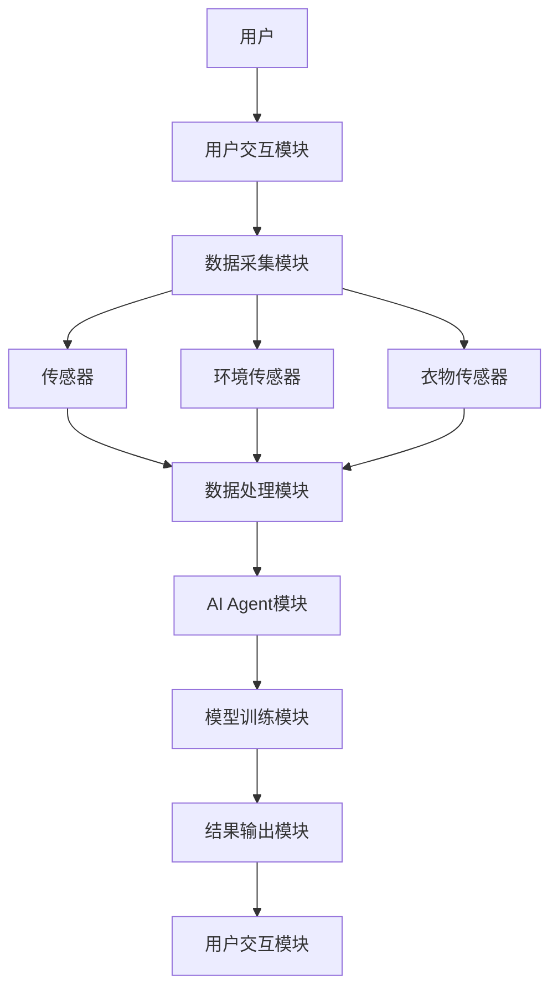

                 


# AI Agent在智能衣架中的衣物保养指导

> 关键词：AI Agent, 智能衣架, 衣物保养, 传感器, 机器学习, 算法原理, 系统架构

> 摘要：本文详细探讨了AI Agent在智能衣架中的应用，重点分析了其在衣物保养中的核心作用。文章从背景介绍、核心概念、算法原理、系统设计、项目实战到优化建议，全面解析了AI Agent在智能衣架中的工作原理及其在实际应用中的优势。通过结合传感器数据和机器学习算法，AI Agent能够为用户提供个性化的衣物保养建议，显著提升衣物的使用寿命和用户的使用体验。

---

# 第一部分: AI Agent与智能衣架的背景介绍

## 第1章: 问题背景与概念

### 1.1 问题背景
在现代生活中，衣物的保养是一个重要但常常被忽视的问题。传统衣物保养方法依赖于人工经验，缺乏系统性和科学性，容易导致衣物损坏或保养不当。随着智能技术的发展，智能衣架作为一种新兴的智能家居设备，结合AI Agent技术，为衣物保养提供了智能化解决方案。

### 1.2 AI Agent的核心概念
AI Agent是一种能够感知环境、自主决策并执行任务的智能实体。在智能衣架中，AI Agent负责接收衣物传感器的数据，分析衣物的状态，并提供保养建议。

### 1.3 智能衣架系统的结构
智能衣架系统由硬件和软件两部分组成。硬件包括衣物传感器、环境传感器和通信模块，软件包括数据采集模块、AI Agent模块和用户交互模块。

---

# 第二部分: AI Agent的核心原理与算法

## 第2章: 算法原理与数学模型

### 2.1 AI Agent的算法原理
AI Agent在智能衣架中的决策过程基于机器学习算法。常用的算法包括监督学习、无监督学习和强化学习。本文以监督学习为例，详细探讨了其在衣物保养中的应用。

### 2.2 算法的数学模型
以下是监督学习算法的数学模型：

$$ y = f(x) $$

其中，\( x \) 是输入数据，\( y \) 是输出结果，\( f \) 是模型函数。

### 2.3 决策流程
AI Agent的决策流程包括数据采集、特征提取、模型训练和结果输出。通过分析衣物的材质、颜色和环境湿度等因素，AI Agent能够为用户提供个性化的保养建议。

---

# 第三部分: 智能衣架系统的架构设计

## 第3章: 系统分析与架构设计

### 3.1 系统功能设计
智能衣架系统的功能模块包括数据采集、环境监测、衣物识别和保养建议生成。每个模块都有其独特的功能和相互之间的依赖关系。

### 3.2 系统架构设计
以下是智能衣架系统的架构图：



### 3.3 接口设计与交互流程
智能衣架系统的交互流程如下：

1. 用户通过手机App或语音助手触发衣物保养需求。
2. 系统采集衣物的传感器数据和环境数据。
3. AI Agent模块分析数据并生成保养建议。
4. 保养建议通过App或语音助手反馈给用户。

---

# 第四部分: 项目实战

## 第4章: 环境安装与核心实现

### 4.1 环境安装
安装Python环境和必要的库，如NumPy、Pandas和Scikit-learn。

### 4.2 核心功能实现
以下是AI Agent的核心功能实现代码：

```python
import numpy as np
from sklearn import tree

# 数据预处理
X = np.array([[湿度, 温度, 纤维类型]])
y = np.array([标签])

# 训练决策树模型
model = tree.DecisionTreeClassifier()
model.fit(X, y)

# 预测结果
result = model.predict(X)
```

### 4.3 案例分析与解读
通过实际案例分析，展示AI Agent在智能衣架中的应用效果。例如，当湿度较高时，AI Agent会建议用户尽快晾干衣物，以防止霉变。

---

# 第五部分: 优化与展望

## 第5章: 优化建议与未来发展

### 5.1 系统优化建议
建议引入更先进的机器学习算法，如深度学习，以提高系统的准确性和响应速度。

### 5.2 未来发展展望
随着人工智能技术的不断进步，智能衣架将更加智能化和个性化，为用户提供更优质的衣物保养服务。

---

# 总结

AI Agent在智能衣架中的应用为衣物保养带来了革命性的变化。通过传感器数据和机器学习算法，AI Agent能够为用户提供科学、个性化的保养建议，显著提升衣物的使用寿命和用户的使用体验。

---

作者：AI天才研究院/AI Genius Institute & 禅与计算机程序设计艺术 /Zen And The Art of Computer Programming

