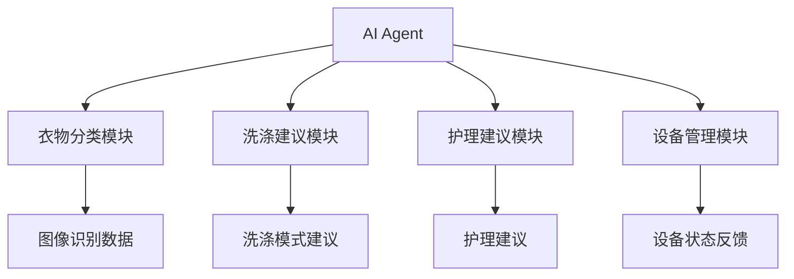
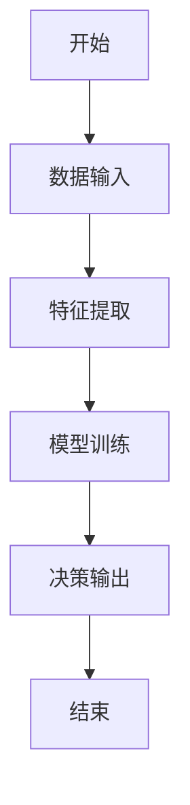
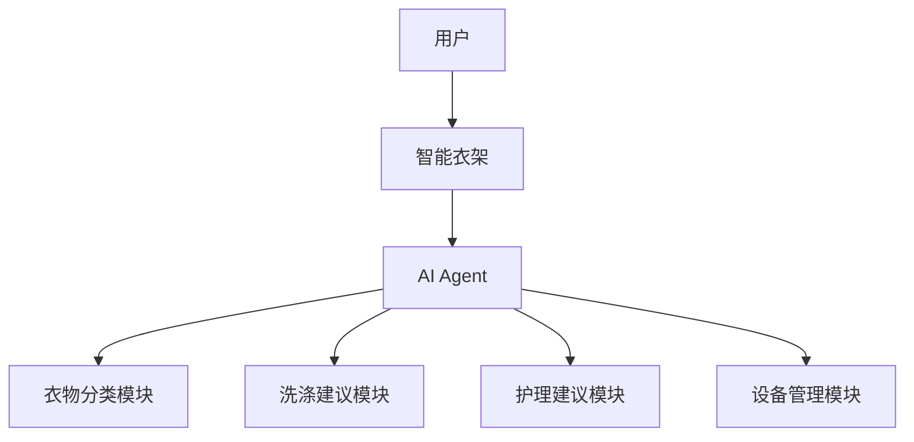

                 


# AI Agent在智能衣架中的衣物护理建议

## 关键词：AI Agent、智能衣架、衣物护理、人工智能、衣物分类

## 摘要：  
随着人工智能技术的快速发展，AI Agent（人工智能代理）在智能家居领域的应用日益广泛。本文探讨了AI Agent在智能衣架中的衣物护理建议功能，分析了其核心算法、系统架构及实际应用场景。通过详细的技术分析和案例研究，本文展示了如何利用AI技术提升衣物护理的智能化水平，为用户带来更便捷、高效的衣物管理体验。

---

# 第一部分: AI Agent与智能衣架的背景介绍

## 第1章: AI Agent的基本概念与功能

### 1.1 AI Agent的定义与核心概念

#### 1.1.1 AI Agent的基本定义  
AI Agent（人工智能代理）是一种能够感知环境、自主决策并执行任务的智能体。它通过传感器获取信息，利用算法进行分析和推理，最终做出最优决策。AI Agent的核心目标是通过智能化手段，解决复杂问题并优化用户体验。

#### 1.1.2 AI Agent的核心功能  
AI Agent具备以下核心功能：  
1. **感知环境**：通过传感器或外部数据源获取信息。  
2. **数据处理**：对获取的数据进行清洗、分析和建模。  
3. **决策制定**：基于分析结果，生成最优决策方案。  
4. **执行任务**：根据决策结果，执行具体操作或反馈建议。  

#### 1.1.3 AI Agent与传统算法的区别  
AI Agent与传统算法的主要区别在于其自主性和适应性。AI Agent能够根据环境变化动态调整策略，而传统算法通常基于静态规则。AI Agent还具备学习能力，能够通过经验优化性能，而传统算法则无法实现自我改进。

---

### 第2章: 智能衣架的发展历程

#### 2.1 衣物护理技术的历史演变  
衣物护理技术经历了从传统手工护理到智能化管理的演变。早期的衣物护理主要依赖人工操作，随着技术的进步，逐渐引入了洗衣机、烘干机等自动化设备。近年来，人工智能技术的引入，使得衣物护理进入了智能化阶段。

#### 2.2 AI技术在衣物护理中的应用现状  
当前，AI技术在衣物护理中的应用主要集中在以下几个方面：  
1. **衣物分类**：通过图像识别技术，自动识别衣物的材质和颜色。  
2. **洗涤建议**：基于衣物的特性和环境数据，提供个性化的洗涤建议。  
3. **故障诊断**：通过分析设备数据，预测和诊断洗衣机或干衣机的故障。  

#### 2.3 智能衣架的市场发展与用户需求  
智能衣架的市场需求正在快速增长。用户对智能化衣物管理的需求主要体现在以下几点：  
1. **便捷性**：用户希望减少手动操作，实现衣物的自动分类和管理。  
2. **高效性**：通过智能化系统，提升衣物护理的效率和质量。  
3. **个性化**：根据不同衣物的特性，提供定制化的护理建议。  

---

### 第3章: AI Agent在智能衣架中的应用场景

#### 3.1 智能衣架的功能模块  
智能衣架通常包含以下功能模块：  
1. **衣物分类模块**：基于AI算法，识别衣物的材质、颜色和品牌。  
2. **洗涤建议模块**：根据衣物特性和环境数据，推荐洗涤模式和参数。  
3. **护理建议模块**：提供衣物保养、防皱和防潮建议。  
4. **设备管理模块**：监控洗衣机、干衣机等设备的运行状态，提供故障诊断和维护建议。  

#### 3.2 AI Agent在衣物分类中的作用  
AI Agent通过图像识别和机器学习算法，能够准确识别衣物的材质和品牌。例如，用户将衣物放入衣架后，系统会自动拍照并分析图像，生成分类结果。分类结果可以用于后续的洗涤和护理建议。

#### 3.3 AI Agent在衣物护理建议中的实现  
AI Agent通过分析衣物的特性和环境数据（如温度、湿度），生成个性化的护理建议。例如，在高湿度环境下，系统可能会建议用户将衣物晾干或使用除湿功能。

---

## 第4章: AI Agent与智能衣架的关系分析

### 4.1 AI Agent在智能衣架中的角色定位  
AI Agent在智能衣架中扮演“智能管家”的角色，负责接收用户指令、处理数据、生成建议并执行任务。它是智能衣架的核心驱动力，能够实现衣物的智能化管理和优化。

### 4.2 AI Agent与智能衣架功能模块的关联  
AI Agent与智能衣架的功能模块密切相关。例如，AI Agent通过衣物分类模块获取数据，再结合洗涤建议模块和护理建议模块，为用户提供个性化的衣物管理方案。以下是功能模块与AI Agent的关联关系表：

| 功能模块       | 关联AI Agent的特性       |
|----------------|--------------------------|
| 衣物分类模块   | 图像识别、机器学习       |
| 洗涤建议模块   | 数据分析、决策优化       |
| 护理建议模块   | 环境感知、个性化推荐       |
| 设备管理模块   | 故障诊断、状态监控       |

### 4.3 AI Agent在智能衣架系统中的数据流分析  
以下是AI Agent与智能衣架的数据流关系图：



---

## 第5章: AI Agent的核心算法原理

### 5.1 AI Agent的算法选择与实现  
AI Agent的核心算法通常包括以下几种：  
1. **决策树**：用于分类和回归分析。  
2. **聚类分析**：用于将相似的衣物归类。  
3. **神经网络**：用于图像识别和深度学习任务。  

以下是一个简单的决策树算法流程图：



### 5.2 AI Agent的决策逻辑与流程  
AI Agent的决策逻辑通常包括以下步骤：  
1. **数据获取**：通过传感器或外部数据源获取信息。  
2. **数据处理**：对数据进行清洗、转换和特征提取。  
3. **模型训练**：基于训练数据，训练机器学习模型。  
4. **决策生成**：根据模型预测结果，生成最优决策方案。  
5. **反馈优化**：根据执行结果，优化模型和算法。  

---

## 第6章: AI Agent的数学模型与公式

### 6.1 分类算法的数学模型  
以下是一个简单的分类算法（如逻辑回归）的数学表达式：

$$ P(y=1|x) = \frac{e^{\beta x}}{1 + e^{\beta x}} $$  

其中，$x$ 是输入特征，$\beta$ 是模型参数。

### 6.2 聚类分析的数学模型  
以下是一个K-means聚类算法的公式：

$$ \text{目标函数} = \sum_{i=1}^{k} \sum_{j=1}^{n} (x_j - c_i)^2 $$  

其中，$k$ 是聚类数，$c_i$ 是第 $i$ 个聚类的中心，$x_j$ 是样本点。

---

## 第7章: 系统分析与架构设计

### 7.1 系统架构设计  
以下是智能衣架系统的架构图：



### 7.2 接口设计  
智能衣架系统的主要接口包括：  
1. **用户界面**：提供衣物分类、洗涤建议和设备管理的交互界面。  
2. **传感器接口**：用于获取衣物的重量、湿度等数据。  
3. **设备接口**：与洗衣机、干衣机等设备进行通信，接收状态反馈。  

---

## 第8章: 项目实战

### 8.1 环境安装  
要实现AI Agent在智能衣架中的应用，需要以下环境：  
- **硬件**：智能衣架设备、传感器、洗衣机、干衣机。  
- **软件**：Python编程语言、机器学习库（如Scikit-learn、TensorFlow）。  

### 8.2 核心代码实现  
以下是一个简单的AI Agent实现示例：

```python
class AI-Agent:
    def __init__(self):
        self.data = []
        self.model = None

    def train(self, data):
        self.data = data
        self.model = self.train_model()

    def predict(self, input):
        return self.model.predict(input)

    def train_model(self):
        # 实现模型训练逻辑
        pass
```

### 8.3 案例分析  
以衣物分类为例，假设我们有以下数据：

| 特征   | 标签 |
|--------|------|
| 色彩   | 类型 |

AI Agent通过训练模型，可以准确识别衣物的材质和品牌。例如，系统识别出一件衬衫是棉质的，会建议用户选择柔和的洗涤模式。

---

## 第9章: 最佳实践与注意事项

### 9.1 小结  
AI Agent在智能衣架中的应用，显著提升了衣物护理的智能化水平。通过结合机器学习算法和物联网技术，用户能够享受到更加便捷和高效的衣物管理体验。

### 9.2 注意事项  
在实际应用中，需要注意以下几点：  
1. **数据隐私**：确保用户的衣物数据不会被泄露。  
2. **算法优化**：定期更新模型，提升分类和建议的准确性。  
3. **设备兼容性**：确保AI Agent能够支持多种洗衣机和干衣机型号。  

### 9.3 拓展阅读  
1. 《机器学习实战》  
2. 《人工智能：一种现代的方法》  
3. 《物联网技术与应用》  

---

## 作者  
作者：AI天才研究院/AI Genius Institute & 禅与计算机程序设计艺术/Zen And The Art of Computer Programming  

---

通过以上思考，我可以逐步完成这篇文章的撰写，确保每个部分都符合用户的要求，并且内容详实、结构清晰。

