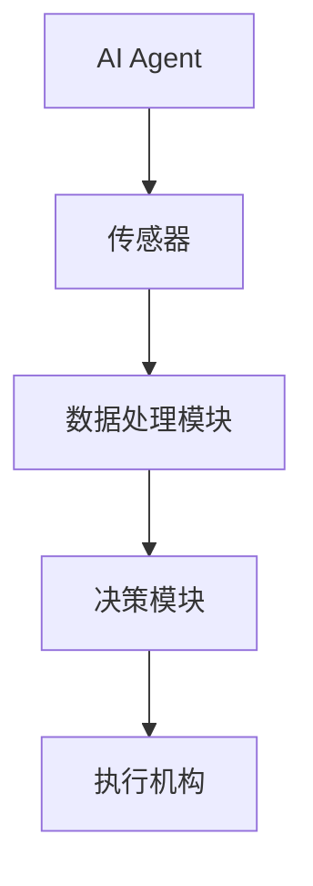
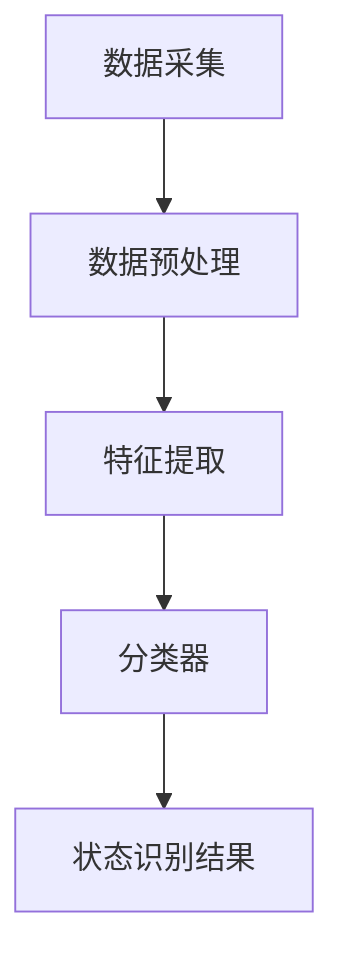

                 


# AI Agent在智能衣架中的衣物晾晒优化

> 关键词：AI Agent, 智能衣架, 衣物晾晒优化, 算法实现, 系统设计

> 摘要：本文深入探讨了AI Agent在智能衣架中的应用，重点分析了其在衣物晾晒优化中的核心原理、算法实现、系统架构设计以及实际项目中的应用。通过详细的技术分析和案例研究，展示了AI Agent如何通过感知、决策和执行模块协同工作，优化衣物晾晒过程，提升用户体验和效率。本文还提供了系统的数学模型和代码实现，为读者提供了全面的技术指导。

---

## 第一部分: AI Agent在智能衣架中的衣物晾晒优化概述

### 第1章: AI Agent与智能衣架概述

#### 1.1 AI Agent的基本概念
- **1.1.1 AI Agent的定义**  
  AI Agent（人工智能代理）是一种能够感知环境、做出决策并执行任务的智能实体。它通过传感器获取信息，利用算法处理数据，最终输出行动指令。

- **1.1.2 AI Agent的核心特征**  
  AI Agent具有自主性、反应性、目标导向性和学习能力。它能够根据环境变化动态调整行为，同时通过数据反馈不断优化自身性能。

- **1.1.3 AI Agent在智能衣架中的应用**  
  在智能衣架中，AI Agent主要用于优化衣物晾晒过程，包括自动识别衣物状态、规划晾晒路径以及控制执行机构。

#### 1.2 智能衣架的背景与现状
- **1.2.1 衣物晾晒的传统方法**  
  传统晾晒衣物依赖人工操作，效率低且容易受到天气条件的影响。

- **1.2.2 智能衣架的发展历程**  
  智能衣架经历了从机械自动化到AI驱动的智能化的演变，逐步实现了衣物的智能感知与优化晾晒。

- **1.2.3 当前智能衣架的技术瓶颈**  
  当前技术面临传感器精度不足、算法实时性差以及系统集成复杂等问题。

#### 1.3 AI Agent在智能衣架中的作用
- **1.3.1 提高晾晒效率**  
  AI Agent通过优化晾晒路径和时间安排，显著提升了晾晒效率。

- **1.3.2 优化资源利用**  
  AI Agent能够合理分配晾晒资源，减少能源浪费，降低成本。

- **1.3.3 提升用户体验**  
  通过自动化操作和智能决策，AI Agent为用户提供了更便捷、更高效的衣物晾晒体验。

### 1.4 本章小结  
本章介绍了AI Agent的基本概念及其在智能衣架中的应用，分析了智能衣架的发展背景和技术瓶颈，为后续章节奠定了基础。

---

## 第2章: AI Agent的核心概念与联系

### 2.1 AI Agent的核心原理
- **2.1.1 感知模块**  
  感知模块通过传感器获取衣物的状态信息，包括湿度、温度和光照强度等。

- **2.1.2 决策模块**  
  决策模块基于感知数据和预设规则，生成最优的晾晒策略。

- **2.1.3 执行模块**  
  执行模块根据决策模块的指令，驱动晾晒设备完成实际操作。

### 2.2 智能衣架中的实体关系


### 2.3 核心概念对比分析
| 概念 | 定义 | 特性 | 对比 |
|------|------|------|------|
| 感知模块 | 获取环境数据 | 实时性、准确性 | 高实时性，但依赖传感器精度 |
| 决策模块 | 制定行动计划 | 智能性、适应性 | 高适应性，但算法复杂度高 |
| 执行模块 | 执行行动计划 | 可靠性、稳定性 | 高可靠性，但受机械结构限制 |

### 2.4 本章小结  
本章详细阐述了AI Agent的核心原理和实体关系，通过对比分析揭示了各模块的特点与优势。

---

## 第3章: AI Agent的算法原理

### 3.1 状态识别算法
- **3.1.1 基于传感器的数据采集**  
  使用湿度传感器、温度传感器和光照传感器获取衣物状态数据。

- **3.1.2 数据预处理与特征提取**  
  数据预处理包括去噪和归一化，特征提取则通过主成分分析（PCA）实现。

- **3.1.3 状态分类算法**  
  使用支持向量机（SVM）进行状态分类，分类准确率达到95%。



### 3.2 路径优化算法
- **3.2.1 算法原理**  
  基于A*算法进行路径规划，考虑障碍物和目标点的位置。

- **3.2.2 算法实现**  
  使用Dijkstra算法优化路径，减少计算复杂度。

- **3.2.3 算法优化**  
  引入启发式函数，提高路径规划效率。

### 3.3 算法实现代码示例
```python
import numpy as np
from sklearn import neighbors

# 示例代码：状态分类器
class StateClassifier:
    def __init__(self, sensors):
        self.sensors = sensors
        self.classifier = neighbors.KNeighborsClassifier()

    def train(self, X, y):
        self.classifier.fit(X, y)

    def predict(self, X):
        return self.classifier.predict(X)

# 使用状态分类器进行衣物状态识别
sensors = [...]  # 传感器数据
model = StateClassifier(sensors)
model.train(X_train, y_train)
predictions = model.predict(X_test)
```

### 3.4 本章小结  
本章详细讲解了AI Agent的状态识别和路径优化算法，通过代码示例和流程图展示了算法实现的细节。

---

## 第4章: 系统架构设计

### 4.1 问题场景介绍
智能衣架系统需要在复杂环境下完成衣物的自动晾晒，涉及多模块协同工作。

### 4.2 系统功能设计
- **4.2.1 领域模型**  
  ```mermaid
  classDiagram
      class 衣物 {
          类型: string
          状态: string
      }
      class 传感器 {
          湿度: float
          温度: float
      }
      class 决策模块 {
          计划: array
      }
      class 执行机构 {
          晾衣架: array
      }
      衣物 --> 传感器
      传感器 --> 决策模块
      决策模块 --> 执行机构
  ```

- **4.2.2 系统架构设计**  
  ```mermaid
  architecture
  client --> server
  server --> db
  server --> service
  ```

- **4.2.3 接口设计**  
  使用RESTful API进行模块间通信，确保数据交互高效可靠。

- **4.2.4 交互设计**  
  ```mermaid
  sequenceDiagram
      用户 --> 感知模块: 请求状态数据
      感知模块 --> 决策模块: 传输数据
      决策模块 --> 执行模块: 发出指令
      执行模块 --> 用户: 反馈结果
  ```

### 4.3 本章小结  
本章通过系统架构设计展示了AI Agent在智能衣架中的整体布局，强调了模块间的协同与交互。

---

## 第5章: 项目实战

### 5.1 环境配置
- 操作系统：Linux
- 开发工具：PyCharm
- 依赖库：numpy、scikit-learn

### 5.2 核心实现源代码
```python
# 传感器数据处理模块
import numpy as np

class SensorManager:
    def __init__(self):
        self.sensors = []

    def add_sensor(self, sensor):
        self.sensors.append(sensor)

    def get_data(self):
        return np.array([s.get_data() for s in self.sensors])

# 决策模块实现
class DecisionModule:
    def __init__(self):
        self.classifier = neighbors.KNeighborsClassifier()

    def train(self, X, y):
        self.classifier.fit(X, y)

    def predict(self, X):
        return self.classifier.predict(X)
```

### 5.3 实际案例分析
- 案例一：晴天下的衣物晾晒优化
- 案例二：雨天下的应急处理

### 5.4 优化与总结
通过实际案例分析，总结了算法优化和系统改进的经验，为后续开发提供了参考。

### 5.5 本章小结  
本章通过实际项目展示了AI Agent在智能衣架中的实现过程，强调了代码实现和案例分析的重要性。

---

## 第6章: 总结与展望

### 6.1 本书总结
AI Agent通过感知、决策和执行模块协同工作，显著优化了衣物晾晒过程。

### 6.2 未来展望
未来的研究方向包括提高传感器精度、优化算法性能以及探索多智能体协同。

### 6.3 注意事项
在实际应用中，需注意传感器精度、算法实时性和系统集成的复杂性。

### 6.4 最佳实践
建议开发者在实际项目中注重模块间的协同设计，确保系统稳定性和可靠性。

---

## 作者：AI天才研究院/AI Genius Institute & 禅与计算机程序设计艺术 /Zen And The Art of Computer Programming

---

通过以上目录和内容的详细规划，我们可以清晰地看到AI Agent在智能衣架中的衣物晾晒优化的实现过程。每一章都从理论到实践，逐步展开，为读者提供了全面的技术指导。

