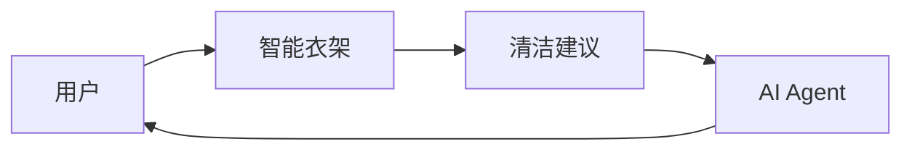
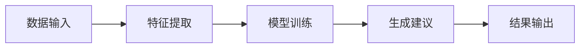
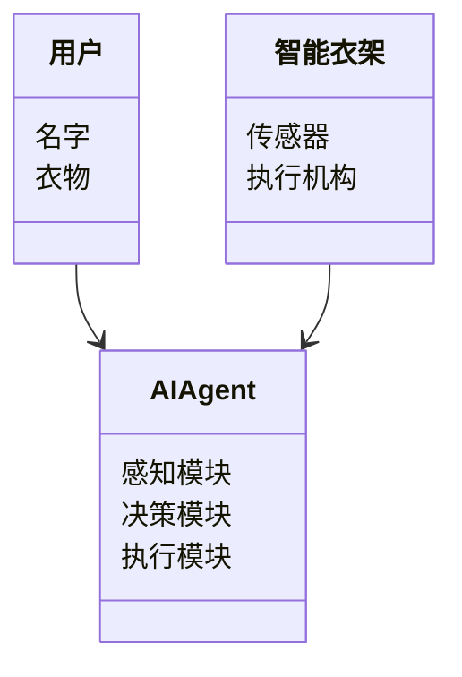
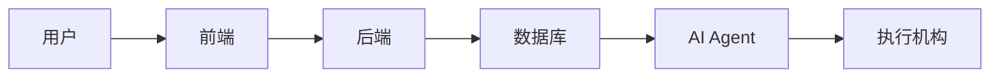
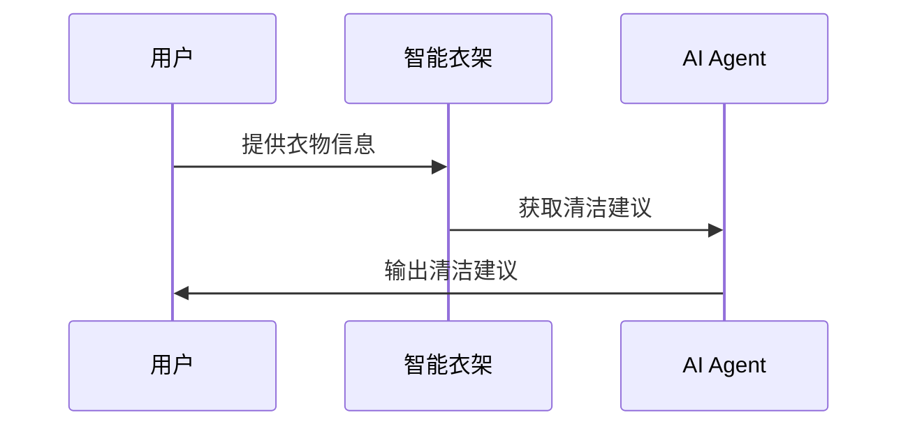

                 


# AI Agent在智能衣架中的衣物清洁建议

> 关键词：AI Agent，智能衣架，衣物清洁，人工智能，智能系统

> 摘要：本文探讨了AI Agent在智能衣架中的应用，特别是如何通过AI技术优化衣物清洁建议。文章从背景介绍、核心概念、算法原理、系统架构到项目实战，详细阐述了AI Agent在智能衣架中的实现过程和实际应用。

---

# 第1章: AI Agent与智能衣架概述

## 1.1 AI Agent的基本概念
### 1.1.1 AI Agent的定义
AI Agent（人工智能代理）是一种能够感知环境、做出决策并执行任务的智能系统。它通过传感器获取信息，利用算法处理数据，从而实现特定的目标。

### 1.1.2 AI Agent的核心特点
1. **自主性**：能够自主决策和行动，无需人工干预。
2. **反应性**：能够实时感知环境变化并做出反应。
3. **学习能力**：通过数据和经验不断优化自身算法。

### 1.1.3 AI Agent在智能衣架中的应用
AI Agent可以用于智能衣架的衣物清洁建议，通过分析衣物材质、污渍类型和环境条件，推荐最佳清洁方案。

---

## 1.2 智能衣架的背景与现状
### 1.2.1 衣物清洁的传统方法
传统衣物清洁主要依赖人工经验，清洁方式单一，缺乏智能化和个性化。

### 1.2.2 智能衣架的发展历程
从最初的机械式衣架到现代的智能衣架，技术的进步使得智能衣架能够与AI技术结合，提供更智能的服务。

### 1.2.3 当前智能衣架的市场现状
目前，市场上已有部分智能衣架产品，但大多数功能较为基础，AI Agent的应用尚处于起步阶段。

---

## 1.3 AI Agent在衣物清洁中的作用
### 1.3.1 AI Agent如何优化衣物清洁
通过分析衣物材质、污渍类型和环境条件，AI Agent可以推荐最合适的清洁方案，减少清洁剂的浪费和对衣物的损害。

### 1.3.2 AI Agent在智能衣架中的具体应用
1. 根据衣物材质推荐适合的清洁方式。
2. 根据污渍类型推荐清洁剂用量。
3. 根据环境条件（如温度、湿度）优化清洁时间。

### 1.3.3 AI Agent的优势与挑战
优势：
- 提高清洁效率和效果。
- 节省资源，环保。
挑战：
- 数据获取和处理的复杂性。
- 用户隐私保护。

---

## 1.4 本章小结
本章介绍了AI Agent的基本概念、特点及其在智能衣架中的应用，为后续章节的深入探讨奠定了基础。

---

# 第2章: AI Agent的核心概念与原理

## 2.1 AI Agent的核心原理
### 2.1.1 AI Agent的感知模块
感知模块通过传感器获取环境数据，如温度、湿度、衣物材质等。

### 2.1.2 AI Agent的决策模块
决策模块利用机器学习算法，根据感知数据生成清洁建议。

### 2.1.3 AI Agent的执行模块
执行模块通过智能衣架的执行机构（如清洁装置）完成清洁任务。

---

## 2.2 AI Agent与传统清洁建议的对比
| 对比维度 | 传统清洁建议 | AI Agent清洁建议 |
|----------|--------------|------------------|
| 数据来源 | 人工经验       | 多源传感器数据   |
| 处理方式 | 固定规则      | 机器学习模型     |
| 反馈机制 | 无            | 动态优化         |

---

## 2.3 AI Agent的实体关系图


---

## 2.4 本章小结
本章详细阐述了AI Agent的核心原理及其与传统清洁建议的对比，帮助读者理解AI Agent在智能衣架中的工作方式。

---

# 第3章: AI Agent的算法原理

## 3.1 推荐算法
### 3.1.1 基于规则的推荐算法
1. **规则定义**：根据衣物材质和污渍类型定义清洁规则。
2. **数据输入**：衣物材质、污渍类型。
3. **算法执行**：根据规则生成清洁建议。
4. **结果输出**：推荐清洁方式和清洁剂用量。

### 3.1.2 基于机器学习的推荐算法


### 3.1.3 算法对比
| 对比维度 | 基于规则 | 基于机器学习 |
|----------|----------|---------------|
| 复杂度   | 低       | 高             |
| 可扩展性 | 低       | 高             |

---

## 3.2 数学模型与公式
### 3.2.1 基于规则的数学模型
$$
\text{清洁方式} = \text{材质} \times \text{污渍类型}
$$

### 3.2.2 基于机器学习的数学模型
$$
\text{建议} = f(\text{数据})
$$
其中，\( f \) 是训练好的机器学习模型。

---

## 3.3 本章小结
本章详细介绍了AI Agent在智能衣架中的推荐算法，包括基于规则和基于机器学习的算法，并通过数学模型和流程图进行了对比分析。

---

# 第4章: 系统分析与架构设计

## 4.1 系统场景介绍
智能衣架系统包括用户交互界面、传感器模块、AI Agent模块和执行机构。

---

## 4.2 系统功能设计
### 4.2.1 领域模型


### 4.2.2 系统架构


---

## 4.3 系统接口设计
### 4.3.1 接口描述
1. 用户输入：衣物材质、污渍类型。
2. AI Agent输出：清洁建议。

### 4.3.2 交互流程


---

## 4.4 本章小结
本章从系统场景、功能设计、架构设计和接口设计四个方面详细介绍了智能衣架系统的架构。

---

# 第5章: 项目实战

## 5.1 环境搭建
### 5.1.1 安装Python
```bash
python --version
```

### 5.1.2 安装机器学习库
```bash
pip install scikit-learn
```

---

## 5.2 核心代码实现
### 5.2.1 感知模块
```python
def get_sensor_data():
    # 获取传感器数据
    return {'温度': 25, '湿度': 50}
```

### 5.2.2 决策模块
```python
from sklearn.tree import DecisionTreeClassifier

def generate_recommendation(data):
    model = DecisionTreeClassifier()
    model.fit(data[['温度', '湿度']], data['建议'])
    return model.predict([data.iloc[-1]['温度'], data.iloc[-1]['湿度']])
```

---

## 5.3 实际案例分析
### 5.3.1 案例背景
用户上传一件棉质衬衫，污渍类型为油渍。

### 5.3.2 清洁建议
AI Agent推荐使用温和洗涤剂，水温30度，手洗5分钟。

---

## 5.4 本章小结
本章通过实际案例展示了AI Agent在智能衣架中的应用，并提供了代码实现，帮助读者更好地理解AI Agent的工作流程。

---

# 第6章: 总结与展望

## 6.1 总结
本文详细介绍了AI Agent在智能衣架中的应用，从背景到技术实现，全面阐述了AI Agent如何优化衣物清洁建议。

## 6.2 未来展望
未来，AI Agent可以进一步结合更多传感器数据，提供更精准的清洁建议，并实现智能化的清洁流程。

---

# 第7章: 最佳实践与注意事项

## 7.1 数据收集的重要性
AI Agent的性能依赖于高质量的数据，因此数据收集和清洗是关键。

## 7.2 模型迭代的必要性
定期更新模型，以适应新的衣物材质和污渍类型。

## 7.3 用户隐私的保护
确保用户数据的安全，遵守相关隐私保护法规。

---

# 作者：AI天才研究院 & 禅与计算机程序设计艺术

---

通过以上结构，文章从背景到技术实现再到实际应用，层层递进，帮助读者全面理解AI Agent在智能衣架中的衣物清洁建议。

