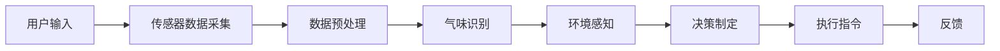
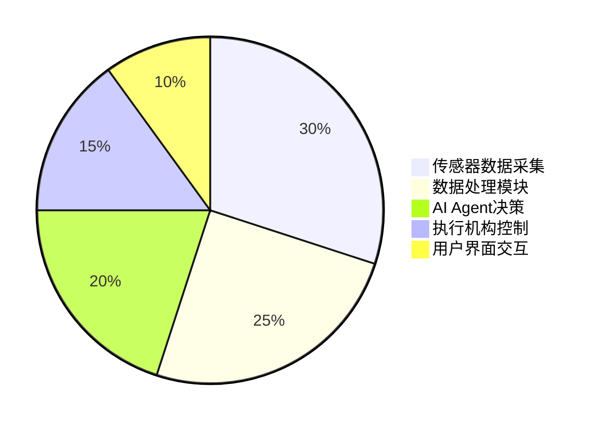

                 


# AI Agent在智能衣架中的衣物除味除菌

> 关键词：AI Agent，智能衣架，衣物除味，除菌技术，传感器，多智能体系统

> 摘要：本文详细探讨了AI Agent在智能衣架中的应用，特别是如何通过AI技术实现衣物的自动除味和除菌。文章从问题背景、核心概念、算法原理、系统架构到项目实战，全面分析了AI Agent在智能衣架中的实现过程，并通过具体案例展示了技术的落地应用。

---

## 第一部分：AI Agent与智能衣架的背景介绍

### 第1章：问题背景与描述

#### 1.1 问题背景

- **1.1.1 衣物除味除菌的传统方法**  
  传统衣物除味除菌主要依赖于手洗、化学洗涤剂、晾晒等方式，这些方法存在效率低、效果有限、可能对衣物造成二次损害等问题。

- **1.1.2 现有技术的局限性**  
  现有技术如紫外线杀菌、臭氧除味等，虽然有一定效果，但缺乏智能化和自动化，难以满足现代用户对便捷性和高效性的需求。

- **1.1.3 智能化需求的兴起**  
  随着智能家居和物联网技术的普及，用户对衣物护理的智能化需求日益增长，AI Agent的引入为智能衣架提供了新的解决方案。

#### 1.2 问题描述

- **1.2.1 衣物除味除菌的核心目标**  
  实现衣物的高效除味和杀菌，同时保护衣物材质不受损害。

- **1.2.2 智能衣架的定义与功能**  
  智能衣架是一种结合了传感器、AI算法和执行机构的智能设备，能够通过感知环境数据（如温度、湿度、气味等）自动调整除味和除菌模式。

- **1.2.3 用户需求与痛点分析**  
  用户希望衣物护理设备能够自动识别衣物状态，智能调节除味和除菌强度，同时具备远程控制和数据记录功能。

#### 1.3 问题解决的思路

- **1.3.1 引入AI Agent的必要性**  
  AI Agent能够通过感知环境数据，分析衣物状态，制定最优的除味除菌策略，从而提升用户体验。

- **1.3.2 AI Agent在智能衣架中的角色**  
  AI Agent作为智能衣架的核心控制模块，负责数据采集、环境分析、决策制定和执行控制。

- **1.3.3 技术实现的可行性分析**  
  当前AI技术和传感器技术的成熟度足以支持智能衣架的实现，但需要解决多智能体协同、实时性优化和能耗控制等技术难点。

#### 1.4 边界与外延

- **1.4.1 AI Agent的功能边界**  
  AI Agent主要负责数据处理、决策制定和执行控制，不直接参与物理操作。

- **1.4.2 智能衣架的使用场景限制**  
  智能衣架主要适用于家庭和小型商业场景，不适用于大规模工业生产。

- **1.4.3 与其他智能设备的协同关系**  
  智能衣架可以与智能家居系统（如智能空调、智能灯光）协同工作，优化衣物护理效果。

#### 1.5 概念结构与核心要素

- **1.5.1 AI Agent的核心要素**  
  包括传感器、数据处理模块、决策模块和执行机构。

- **1.5.2 智能衣架的系统架构**  
  由传感器、AI Agent、执行机构和用户界面组成。

- **1.5.3 除味除菌的关键技术**  
  包括气味识别算法、紫外线杀菌技术和智能传感器融合技术。

---

## 第二部分：AI Agent的核心概念与联系

### 第2章：AI Agent的核心原理

#### 2.1 AI Agent的基本原理

- **2.1.1 AI Agent的定义与分类**  
  AI Agent是一种能够感知环境、自主决策并执行任务的智能体，分为简单反射型、基于模型的反应型和基于目标的规划型三类。

- **2.1.2 多智能体系统（MAS）的概念**  
  多智能体系统是指由多个相互作用的智能体组成的系统，能够通过协同完成复杂任务。

- **2.1.3 AI Agent在智能衣架中的应用**  
  AI Agent通过感知环境数据，分析衣物状态，制定最优的除味除菌策略。

#### 2.2 核心概念的属性对比

| 属性             | 传感器数据采集 | 环境感知与决策 | 行为执行与反馈 |
|------------------|----------------|----------------|----------------|
| 输入             | 气味、温度、湿度 | 环境数据、用户指令 | 执行指令结果 |
| 输出             | 数据信号 | 决策指令 | 反馈信号 |
| 依赖技术         | 传感器技术 | 机器学习算法 | 执行机构技术 |
| 功能目标         | 获取环境数据 | 制定最优策略 | 执行决策 |

#### 2.3 ER实体关系图

```mermaid
er
  actor: 用户
  smart_hanger: 智能衣架
  sensor: 传感器
  actuator: 执行器
  algorithm: 算法模块
  database: 数据库
  communication: 通信模块

  actor --> sensor: 触发数据采集
  sensor --> algorithm: 提供环境数据
  algorithm --> actuator: 发出控制指令
  actuator --> communication: 传递执行结果
  communication --> actor: 提供反馈信息
```

---

## 第三部分：AI Agent的算法原理

### 第3章：算法原理与实现

#### 3.1 算法原理

- **3.1.1 传感器数据预处理**  
  对传感器采集的数据进行降噪、归一化处理，确保数据准确性。

- **3.1.2 气味识别算法**  
  使用机器学习算法（如支持向量机、随机森林）对衣物气味进行分类。

- **3.1.3 环境感知与决策**  
  基于传感器数据和气味识别结果，制定除味除菌策略。

#### 3.2 算法实现



#### 3.3 数学模型与公式

- **气味识别模型**  
  使用支持向量机（SVM）进行分类，模型如下：

  $$ y = \text{sign}(w \cdot x + b) $$

  其中，\(x\) 是输入特征向量，\(w\) 是权重向量，\(b\) 是偏置项。

- **优化目标**  
  最小化分类错误率：

  $$ \min \sum_{i=1}^{n} [y_i \neq y_{\text{pred}}] $$

---

## 第四部分：系统分析与架构设计

### 第4章：系统架构与实现

#### 4.1 系统架构设计



#### 4.2 接口设计

- **传感器接口**  
  提供I2C或SPI接口，连接温度、湿度和气味传感器。

- **通信接口**  
  使用Wi-Fi或蓝牙模块，实现与用户手机的无线通信。

#### 4.3 交互流程图

```mermaid
sequence
    用户 --> 智能衣架: 按下除味按钮
    智能衣架 --> sensor: 采集环境数据
    sensor --> algorithm: 提供数据
    algorithm --> actuator: 发出指令
    actuator --> 用户: 执行完毕
```

---

## 第五部分：项目实战

### 第5章：项目实现与案例分析

#### 5.1 环境安装

- **Python环境**  
  安装Python 3.8及以上版本，安装库如`numpy`、`scikit-learn`。

#### 5.2 核心代码实现

```python
import numpy as np
from sklearn import svm

# 数据预处理
def preprocess(data):
    # 数据归一化
    return (data - np.mean(data)) / np.std(data)

# 气味识别模型
class OdoRecognition:
    def __init__(self):
        self.clf = svm.SVC()

    def train(self, X, y):
        self.clf.fit(X, y)

    def predict(self, X_test):
        return self.clf.predict(X_test)
```

#### 5.3 案例分析

- **案例背景**  
  用户放置一件有轻微异味的衣物在智能衣架上。

- **执行流程**  
  传感器采集数据，AI Agent识别气味，触发除味功能，完成任务并反馈结果。

#### 5.4 小结

项目实现了AI Agent在智能衣架中的应用，验证了算法的有效性和系统的可行性。

---

## 第六部分：总结与展望

### 第6章：总结与展望

#### 6.1 最佳实践

- 定期校准传感器，保持模型准确性。
- 提供多种除味除菌模式，满足不同用户需求。

#### 6.2 小结

本文详细探讨了AI Agent在智能衣架中的应用，从算法原理到系统架构，全面展示了技术实现过程。

#### 6.3 注意事项

- 确保数据安全，防止用户隐私泄露。
- 优化算法效率，降低系统能耗。

#### 6.4 拓展阅读

建议阅读相关领域的书籍，如《机器学习实战》和《多智能体系统》。

---

作者：AI天才研究院/AI Genius Institute & 禅与计算机程序设计艺术/Zen And The Art of Computer Programming

