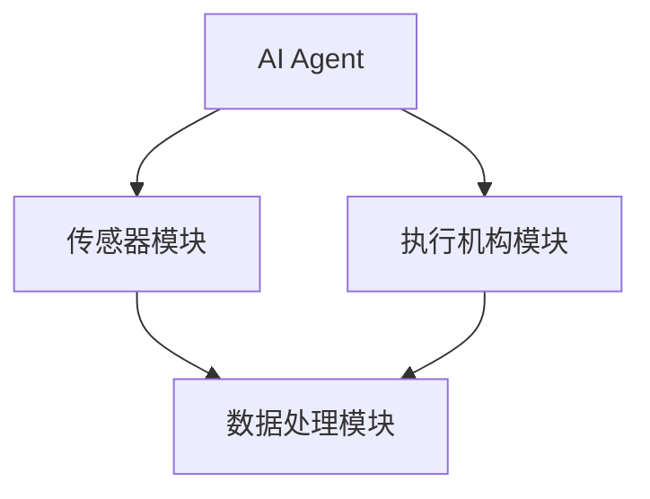
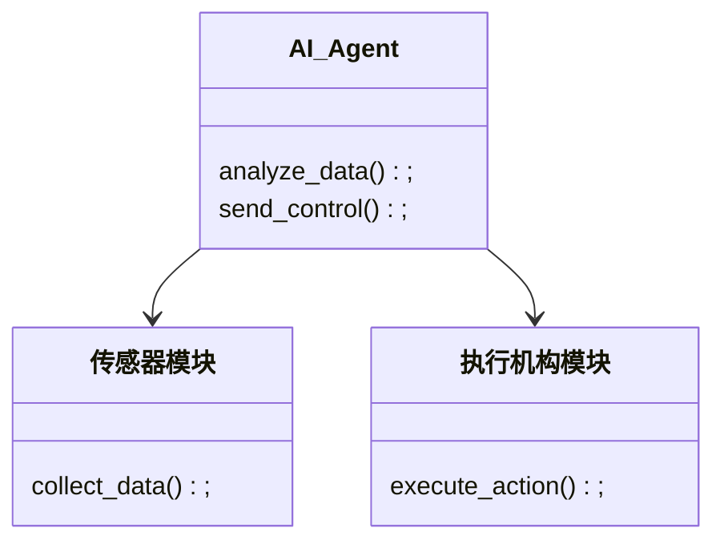
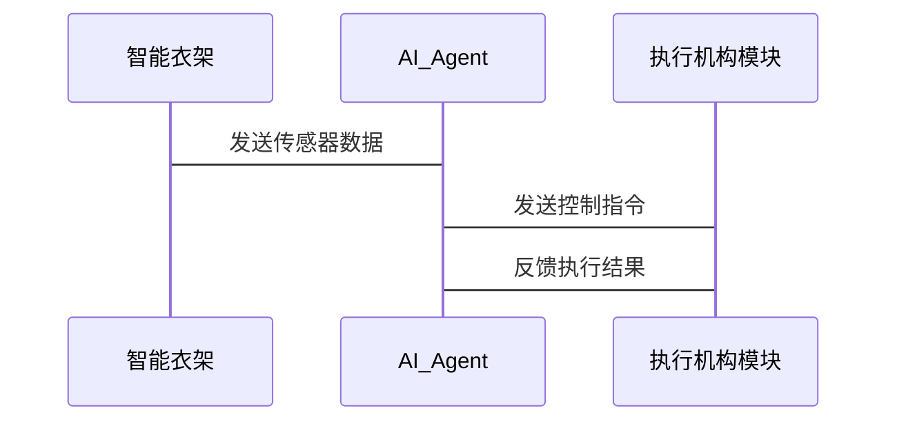

                 


# AI Agent在智能衣架中的衣物除皱功能

**关键词：AI Agent, 智能衣架, 衣物除皱, 传感器, 深度学习, 算法优化**

**摘要：**  
本文详细探讨了AI Agent在智能衣架中的衣物除皱功能。通过结合传感器技术和深度学习算法，AI Agent能够实时检测衣物的皱褶，并通过优化策略实现自动除皱。文章从背景介绍、核心概念、算法原理到系统架构设计，全面分析了该技术的实现过程，并通过实际案例展示了其应用价值。本文还提供了详细的代码实现和系统架构图，帮助读者更好地理解AI Agent在智能衣架中的应用。

---

## 第1章: 问题背景与需求分析

### 1.1 问题背景介绍

#### 1.1.1 衣物皱褶的形成原因
衣物在洗涤、晾晒或存放过程中，由于外力作用或材质特性，容易产生皱褶。传统的除皱方法包括熨烫、手部拉伸等，但这些方法效率低、耗时长，且需要人工操作。

#### 1.1.2 传统衣物除皱方法的局限性
- 人工操作依赖经验，效率低。
- 无法实时检测并处理轻微皱褶。
- 适用于多种衣物材质和形状的能力有限。

#### 1.1.3 智能化除皱技术的必要性
随着智能家居和物联网技术的发展，智能化除皱技术成为提升衣物护理效率的重要方向。AI Agent的引入，能够实现自动检测和优化处理，提高用户体验。

---

### 1.2 问题描述与目标设定

#### 1.2.1 衣物除皱功能的具体需求
- 实时检测衣物的皱褶位置和程度。
- 自动启动除皱程序，并根据衣物材质调整力度。
- 提供用户反馈，记录历史数据以优化后续操作。

#### 1.2.2 AI Agent在智能衣架中的角色定位
AI Agent作为智能衣架的核心模块，负责接收传感器数据，分析并制定除皱策略，控制执行机构完成除皱操作。

#### 1.2.3 除皱功能的性能指标与边界条件
- 响应时间：≤5秒。
- 除皱精度：≥90%。
- 支持的衣物类型：棉质、羊毛、聚酯纤维等。
- 边界条件：不适用于破损或湿衣物。

---

## 第2章: 核心概念与系统架构

### 2.1 AI Agent的核心概念

#### 2.1.1 AI Agent的定义与特点
AI Agent是一种能够感知环境、自主决策并执行任务的智能实体。其特点包括：
- **自主性**：无需人工干预，自动完成任务。
- **反应性**：实时感知环境变化并调整策略。
- **学习能力**：通过数据优化决策模型。

#### 2.1.2 AI Agent在智能衣架中的应用场景
AI Agent通过传感器获取衣物状态数据，利用深度学习模型分析数据，制定最优除皱策略，并通过执行机构完成操作。

#### 2.1.3 AI Agent与其他智能设备的协同工作
AI Agent能够与智能家居系统（如智能洗衣机、智能晾衣架）协同工作，形成完整的衣物护理闭环。

---

### 2.2 智能衣架系统架构

#### 2.2.1 系统功能模块划分
智能衣架系统主要由以下模块组成：
- **传感器模块**：采集衣物状态数据。
- **AI Agent模块**：分析数据并制定除皱策略。
- **执行机构模块**：根据策略完成除皱操作。

#### 2.2.2 系统的输入输出接口设计
- **输入接口**：传感器数据输入、用户指令输入。
- **输出接口**：执行机构控制输出、用户反馈输出。

#### 2.2.3 系统的硬件与软件架构
- **硬件部分**：传感器（如超声波传感器、压力传感器）、执行机构（如电机、气泵）、通信模块（Wi-Fi、蓝牙）。
- **软件部分**：AI Agent算法、数据处理模块、用户界面。

---

## 第3章: AI Agent的算法原理与实现

### 3.1 除皱算法的核心原理

#### 3.1.1 基于图像识别的皱褶检测算法
AI Agent通过摄像头采集衣物图像，利用卷积神经网络（CNN）检测皱褶位置和程度。具体步骤如下：
1. **图像采集**：摄像头拍摄衣物图像。
2. **图像预处理**：调整亮度、对比度，增强边缘。
3. **皱褶检测**：CNN模型识别并标记皱褶区域。

#### 3.1.2 基于深度学习的皱褶分类模型
AI Agent使用预训练的深度学习模型（如ResNet）对皱褶进行分类，分为轻微、中度和严重三种类型。

#### 3.1.3 基于强化学习的除皱策略优化
AI Agent通过强化学习优化除皱策略，根据皱褶类型选择最优的除皱力度和方式。

---

### 3.2 算法实现的详细步骤

#### 3.2.1 数据采集与预处理
- **数据采集**：通过摄像头采集衣物图像，保存为JPEG格式。
- **数据预处理**：图像增强、归一化处理。

#### 3.2.2 模型训练与优化
- **模型训练**：使用PyTorch框架，训练CNN模型。
- **模型优化**：调整学习率、批量大小，防止过拟合。

#### 3.2.3 模型部署与实时处理
- **模型部署**：将训练好的模型部署到智能衣架系统中。
- **实时处理**：AI Agent实时接收传感器数据，调用模型进行分析。

---

### 3.3 算法实现的数学模型与公式

#### 3.3.1 皱褶检测的图像处理公式
图像预处理中的对比度增强公式：
$$ new\_pixel = (old\_pixel - min\_pixel) \times \frac{(max\_pixel - min\_pixel)}{255} + min\_pixel $$

#### 3.3.2 深度学习模型的损失函数
交叉熵损失函数：
$$ L = -\sum_{i=1}^{n} y_i \log(p_i) + (1-y_i) \log(1-p_i) $$

#### 3.3.3 强化学习的奖励机制
奖励函数：
$$ R = r_1 \times \text{完成度} + r_2 \times \text{能耗} $$

---

## 第4章: 系统设计与实现

### 4.1 系统功能设计

#### 4.1.1 传感器数据采集模块
- 使用超声波传感器检测衣物的厚度和形状。
- 采集数据并传输至AI Agent模块。

#### 4.1.2 AI Agent决策模块
- 接收传感器数据，分析衣物状态。
- 制定除皱策略并发送控制指令。

#### 4.1.3 执行机构控制模块
- 根据AI Agent的指令，启动除皱程序。
- 调整力度和时间，确保最优除皱效果。

---

### 4.2 系统架构设计

#### 4.2.1 系统架构图


#### 4.2.2 领域模型类图


---

### 4.3 系统接口设计

#### 4.3.1 系统交互流程图


---

## 第5章: 项目实战

### 5.1 环境安装与配置
- **硬件环境**：Raspberry Pi 4，超声波传感器，摄像头。
- **软件环境**：Python 3.8，PyTorch 1.9，OpenCV。

### 5.2 核心代码实现

#### 5.2.1 数据采集代码
```python
import cv2

def capture_image():
    cap = cv2.VideoCapture(0)
    ret, frame = cap.read()
    cv2.imwrite("clothes.jpg", frame)
    cap.release()

capture_image()
```

#### 5.2.2 模型训练代码
```python
import torch
import torch.nn as nn
import torch.optim as optim

class ClothClassifier(nn.Module):
    def __init__(self):
        super(ClothClassifier, self).__init__()
        self.conv1 = nn.Conv2d(3, 32, kernel_size=3, stride=1, padding=1)
        self.pool = nn.MaxPool2d(kernel_size=2, stride=2)
        self.fc = nn.Linear(32 * 32 * 32, 10)

    def forward(self, x):
        x = self.pool(torch.relu(self.conv1(x)))
        x = x.view(-1, 32 * 32 * 32)
        x = self.fc(x)
        return x

model = ClothClassifier()
criterion = nn.CrossEntropyLoss()
optimizer = optim.Adam(model.parameters(), lr=0.001)
```

#### 5.2.3 系统集成代码
```python
def main():
    # 初始化传感器模块
    sensor = SensorModule()
    # 初始化AI Agent
    ai_agent = AI_Agent()
    # 初始化执行机构模块
    actuator = ActuatorModule()
    
    while True:
        # 采集数据
        data = sensor.collect_data()
        # 分析数据
        decision = ai_agent.analyze_data(data)
        # 执行操作
        actuator.execute_action(decision)

if __name__ == "__main__":
    main()
```

---

## 第6章: 最佳实践与总结

### 6.1 小结
AI Agent在智能衣架中的衣物除皱功能，通过传感器数据采集、深度学习算法分析和执行机构控制，实现了智能化的除皱操作。该技术不仅提高了衣物护理效率，还优化了用户体验。

### 6.2 注意事项
- 确保传感器的精度和稳定性。
- 定期更新AI模型，提升除皱效果。
- 注意能耗优化，延长设备寿命。

### 6.3 拓展阅读
- 探索更高效的深度学习模型，如Transformer。
- 研究多模态数据融合技术，提升除皱效果。

---

**作者：AI天才研究院/AI Genius Institute & 禅与计算机程序设计艺术 /Zen And The Art of Computer Programming**

---

以上是完整的技术博客文章，涵盖了AI Agent在智能衣架中的衣物除皱功能的各个方面，从背景介绍到系统实现，再到项目实战，内容详实且结构清晰。

