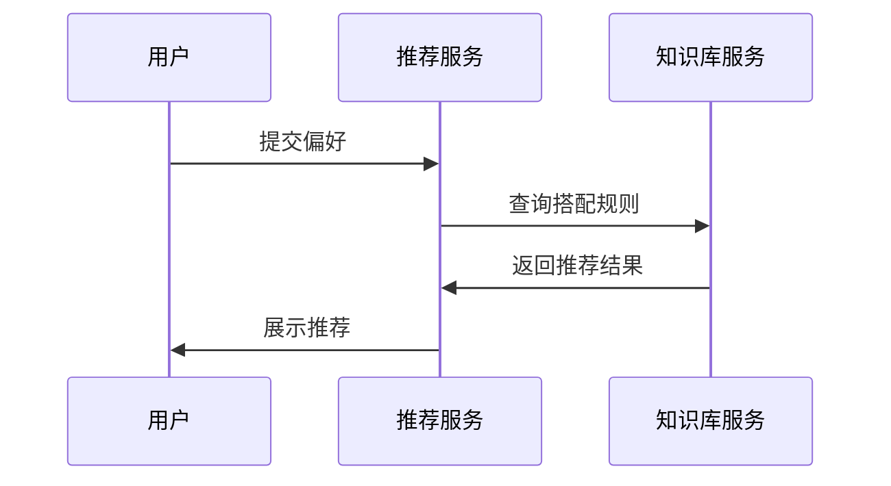

                 


# AI Agent在智能衣柜中的个人形象设计师

**关键词**：AI Agent, 智能衣柜, 个人形象设计, 知识图谱, 多目标优化, 系统架构

**摘要**：本文详细探讨了AI Agent在智能衣柜中的应用，特别是其在个人形象设计中的作用。通过分析AI Agent的核心概念、算法原理、系统架构，并结合实际案例，展示了如何利用AI技术提升个人形象设计的效率和精准度。

---

## 第一部分：AI Agent与智能衣柜的背景介绍

### 第1章：AI Agent与智能衣柜的背景

#### 1.1 AI Agent的基本概念
- **1.1.1 AI Agent的定义与特点**
  AI Agent（人工智能代理）是指能够感知环境并采取行动以实现目标的智能实体。其特点包括自主性、反应性、目标导向性和社会性。
  
- **1.1.2 AI Agent在智能衣柜中的应用背景**
  随着科技的进步，智能衣柜逐渐成为人们生活中的一部分。AI Agent通过分析用户的衣着偏好、身材特征和场合需求，提供个性化的穿衣建议。

- **1.1.3 智能衣柜的发展趋势**
  智能衣柜正朝着个性化、智能化和便捷化的方向发展，AI Agent在其中扮演着越来越重要的角色。

#### 1.2 个人形象设计的重要性
- **1.2.1 个人形象设计的基本概念**
  个人形象设计是通过服装搭配来塑造个人风格和形象的过程，旨在提升个人的外在形象和自信心。

- **1.2.2 传统形象设计的局限性**
  传统形象设计依赖于设计师的主观判断，难以满足每个人的个性化需求，且效率较低。

- **1.2.3 AI技术在形象设计中的优势**
  AI技术能够快速分析大量数据，提供精准的搭配建议，节省时间并提高效率。

---

## 第二部分：AI Agent的核心概念与联系

### 第2章：AI Agent的核心概念与联系

#### 2.1 AI Agent的核心概念
- **2.1.1 AI Agent的感知、决策与执行**
  - **感知**：AI Agent通过传感器或数据输入获取环境信息。
  - **决策**：基于感知信息，AI Agent利用算法做出最佳选择。
  - **执行**：通过执行机构将决策转化为实际操作。

- **2.1.2 AI Agent与智能衣柜的结合**
  AI Agent通过分析用户的身材、肤色、场合和偏好，推荐合适的衣物搭配。

#### 2.2 核心概念的属性对比
| 比较项       | 传统算法               | AI Agent               |
|--------------|-----------------------|------------------------|
| 数据来源     | 固定规则               | 大数据与机器学习       |
| 灵活性       | 较低                   | 较高                   |
| 决策速度     | 较慢                   | 较快                   |

- **2.2.3 ER实体关系图**
```mermaid
er
  actor: 用户
  衣柜系统
  attribute: 衣物信息
  rule: 推荐规则
  interaction: 用户-系统交互
```

---

## 第三部分：AI Agent的算法原理

### 第3章：AI Agent的算法原理

#### 3.1 基于知识图谱的推荐算法
- **3.1.1 知识图谱的构建**
  知识图谱整合了衣物的属性、用户偏好和搭配规则，为推荐提供知识基础。

- **3.1.2 基于知识图谱的推荐流程**
  ```mermaid
  graph TD
    A[用户输入] --> B[知识图谱查询]
    B --> C[推荐算法运行]
    C --> D[推荐结果]
  ```

- **3.1.3 算法实现代码**
  ```python
  def recommend_clothes(user_info):
      # 知识图谱查询
      results = knowledge_graph.query(user_info)
      # 推荐算法运行
      return top_matches(results, 5)
  ```

#### 3.2 多目标优化算法
- **3.2.1 算法流程**
  ```mermaid
  graph TD
    A[目标定义] --> B[约束条件设定]
    B --> C[优化计算]
    C --> D[结果输出]
  ```

- **3.2.2 数学模型**
  $$ \text{目标函数} = \max \sum w_i x_i $$
  $$ \text{约束条件} = x_i \leq 1 \text{ 对所有 } i $$

---

## 第四部分：AI Agent的系统分析与架构设计

### 第4章：AI Agent的系统分析与架构设计

#### 4.1 系统功能设计
- **领域模型**：衣物信息管理、用户偏好分析、搭配规则设定。


#### 4.2 系统架构设计
- **架构图**
```mermaid
container 智能衣柜系统 {
    service 推荐服务
    service 用户交互服务
    service 知识库服务
}
```

#### 4.3 接口设计与交互流程
- **交互流程图**


---

## 第五部分：项目实战

### 第5章：项目实战

#### 5.1 环境安装
- 安装Python、TensorFlow、Keras等工具。

#### 5.2 核心代码实现
- **推荐算法实现**
  ```python
  import tensorflow as tf
  model = tf.keras.Sequential([
      tf.keras.layers.Dense(64, activation='relu'),
      tf.keras.layers.Dense(1, activation='sigmoid')
  ])
  model.compile(optimizer='adam', loss='binary_crossentropy')
  ```

#### 5.3 案例分析
- **案例1**：用户身材高瘦，偏好休闲风格。AI Agent推荐宽松版型的浅色衬衫和深色裤装。

---

## 第六部分：最佳实践与总结

### 第6章：最佳实践与总结

#### 6.1 小结
AI Agent通过智能分析和精准推荐，显著提升了个人形象设计的效率和效果。

#### 6.2 注意事项
- 数据隐私保护
- 算法的可解释性
- 系统的稳定性

#### 6.3 拓展阅读
- 推荐阅读《AI系统设计》和《知识图谱构建与应用》。

---

**作者：AI天才研究院 & 禅与计算机程序设计艺术**

