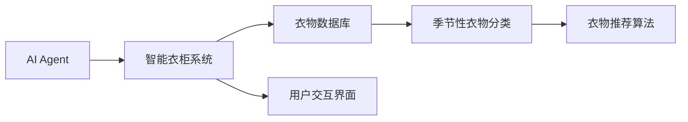
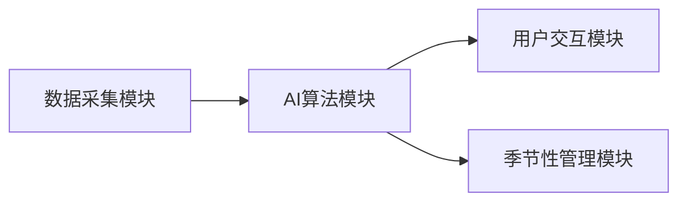

                 

# AI Agent在智能衣柜中的季节性衣物管理

> 关键词：AI Agent, 智能衣柜, 季节性衣物管理, 算法原理, 系统架构

> 摘要：本文深入探讨了AI Agent在智能衣柜中的应用，特别是季节性衣物管理方面。通过详细分析AI Agent的核心原理、算法实现以及系统架构，展示了如何利用AI技术优化衣物管理流程，提升用户体验。

---

## 第1章：AI Agent与智能衣柜概述

### 1.1 AI Agent的基本概念

#### 1.1.1 什么是AI Agent
AI Agent（人工智能代理）是一种能够感知环境并采取行动以实现目标的智能实体。它可以理解、学习和适应用户的需求，提供个性化的服务。

#### 1.1.2 AI Agent的核心特点
- **自主性**：AI Agent能够在没有外部干预的情况下运行。
- **反应性**：能够实时感知环境变化并做出反应。
- **学习能力**：通过数据和经验不断优化自身行为。

#### 1.1.3 AI Agent与传统软件的区别
AI Agent具有智能性和适应性，能够处理复杂问题，而传统软件通常基于固定的规则执行任务。

---

### 1.2 智能衣柜的基本概念

#### 1.2.1 智能衣柜的定义
智能衣柜是一种结合物联网和人工智能技术的智能设备，能够通过传感器和AI算法帮助用户管理衣物。

#### 1.2.2 智能衣柜的功能特点
- **智能分类**：自动将衣物分类存储。
- **智能推荐**：根据天气和用户偏好推荐衣物。
- **库存管理**：实时更新衣物库存信息。

#### 1.2.3 智能衣柜的市场现状
随着物联网和AI技术的发展，智能衣柜市场快速增长，逐渐成为智能家居的重要组成部分。

---

### 1.3 季节性衣物管理的核心问题

#### 1.3.1 季节性衣物管理的定义
季节性衣物管理是指根据季节变化，合理存储和推荐衣物的过程。

#### 1.3.2 季节性衣物管理的挑战
- **存储效率**：如何高效存储大量季节性衣物。
- **推荐准确性**：如何准确推荐适合当前季节的衣物。
- **用户需求多样性**：用户需求因人而异，难以统一满足。

#### 1.3.3 AI Agent在季节性衣物管理中的作用
AI Agent能够通过学习用户的习惯和环境数据，优化衣物存储和推荐策略。

---

## 第2章：AI Agent在智能衣柜中的核心概念与联系

### 2.1 AI Agent的核心原理

#### 2.1.1 感知与决策机制
AI Agent通过传感器感知环境数据（如温度、湿度），并结合用户历史行为数据进行决策。

#### 2.1.2 学习与优化过程
使用机器学习算法（如决策树、聚类算法）优化AI Agent的行为，使其更加智能。

#### 2.1.3 通信与协作能力
AI Agent能够与其他设备（如智能洗衣机、空调）协作，提供更全面的服务。

---

### 2.2 季节性衣物管理的核心要素

#### 2.2.1 季节性衣物的分类标准
- **季节**：春、夏、秋、冬。
- **类型**：T恤、毛衣、大衣等。
- **颜色**：深色和浅色衣物分开存储。

#### 2.2.2 季节性衣物的存储与检索
通过RFID标签和传感器，智能衣柜能够快速定位和取出衣物。

#### 2.2.3 季节性衣物的推荐与搭配
基于用户的穿衣风格和天气数据，AI Agent推荐合适的衣物搭配。

---

### 2.3 AI Agent与智能衣柜的实体关系图

---

## 第3章：AI Agent的算法原理与数学模型

### 3.1 AI Agent的算法原理

#### 3.1.1 基于规则的决策算法
AI Agent根据预设的规则（如“在冬天优先推荐大衣”）进行决策。

#### 3.1.2 基于机器学习的预测算法
使用回归算法预测天气变化，调整衣物推荐策略。

#### 3.1.3 基于强化学习的优化算法
通过强化学习优化衣物推荐的准确率。

---

### 3.2 季节性衣物管理的数学模型

#### 3.2.1 基于聚类的衣物分类模型
$$d(x_i, x_j) = \sqrt{(x_i - x_j)^2 + (y_i - y_j)^2}$$

#### 3.2.2 基于决策树的衣物推荐模型
使用决策树算法分析用户的穿衣偏好，生成推荐列表。

#### 3.2.3 基于时间序列的衣物库存预测模型
$$ARIMA模型$$

---

## 第4章：智能衣柜系统的系统架构设计

### 4.1 系统模块划分

#### 4.1.1 数据采集模块
通过传感器采集环境数据和用户行为数据。

#### 4.1.2 AI算法模块
负责数据分析和处理，生成推荐结果。

#### 4.1.3 用户交互模块
提供用户界面，展示推荐结果和衣物信息。

#### 4.1.4 季节性管理模块
根据季节变化调整衣物存储和推荐策略。

---

### 4.2 系统架构图

---

## 第5章：系统交互流程与数据流设计

### 5.1 用户交互流程

#### 5.1.1 用户登录
用户通过指纹或面部识别登录系统。

#### 5.1.2 衣物录入
用户将衣物放入衣柜，系统自动识别衣物信息。

#### 5.1.3 季节性衣物管理
系统根据当前季节自动调整衣物存储位置。

#### 5.1.4 衣物推荐
系统根据天气和用户偏好推荐衣物。

---

### 5.2 系统数据流设计

#### 5.2.1 数据采集流程
传感器采集环境数据，传输到AI算法模块。

#### 5.2.2 数据处理流程
AI算法模块分析数据，生成推荐结果。

#### 5.2.3 数据存储与检索
数据存储到数据库，用户查询时快速检索。

---

## 第6章：AI Agent的算法实现

### 6.1 环境安装与配置
安装Python和相关机器学习库（如scikit-learn）。

### 6.2 季节性衣物分类算法实现
使用K-means算法对衣物进行分类。

### 6.3 衣物推荐算法实现
使用决策树算法进行衣物推荐。

### 6.4 代码实现与解读
提供完整的Python代码示例，展示算法实现过程。

---

## 第7章：项目实战与案例分析

### 7.1 项目背景与目标
介绍项目目标和实施背景。

### 7.2 数据预处理
对采集的数据进行清洗和转换。

### 7.3 模型训练与优化
训练决策树模型，并进行优化。

### 7.4 案例分析
分析实际应用案例，展示系统效果。

---

## 第8章：总结与展望

### 8.1 本项目的核心成果
展示AI Agent在季节性衣物管理中的应用成果。

### 8.2 项目总结
总结项目的主要工作和成功经验。

### 8.3 未来展望
探讨AI Agent在智能衣柜中的未来发展方向。

---

## 附录与参考文献

### 附录A：AI Agent相关术语解释
解释文中涉及的关键术语。

### 附录B：相关数学公式汇总
汇总所有使用的数学公式。

### 附录C：系统架构图与交互图
展示系统架构图和交互流程图。

### 参考文献
列出所有引用的文献和资料。

---

**作者：AI天才研究院 & 禅与计算机程序设计艺术**

---

以上是《AI Agent在智能衣柜中的季节性衣物管理》的详细目录和内容概要。通过系统化的分析和逐步讲解，本文为读者提供了全面的技术视角，展示了AI Agent在智能衣柜中的实际应用和价值。

