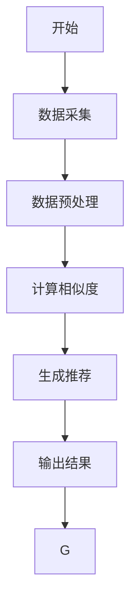
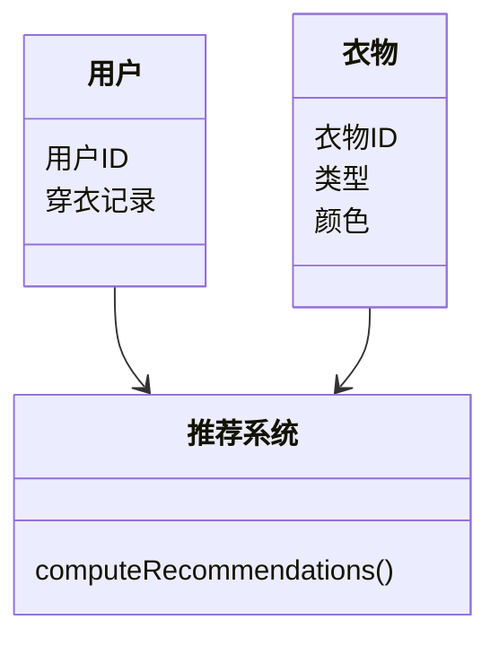
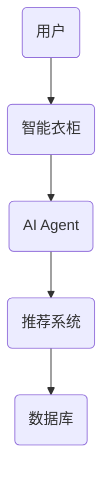
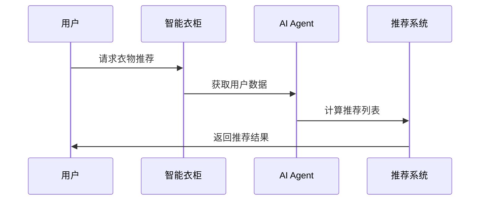

                 


# AI Agent在智能衣柜中的衣物循环利用建议

## 关键词：AI Agent, 智能衣柜, 衣物循环利用, 可持续发展, 资源优化

## 摘要：  
随着全球对可持续发展的关注日益增加，衣物资源的循环利用成为一个重要议题。本文探讨如何利用AI Agent技术优化智能衣柜的功能，以促进衣物的有效管理与循环利用。通过分析AI Agent的核心算法、系统架构以及实际案例，本文提供了一种创新的解决方案，帮助用户减少衣物浪费，实现资源优化。

---

# 第一部分: AI Agent与智能衣柜的背景介绍

## 第1章: AI Agent与智能衣柜的背景

### 1.1 问题背景与重要性  
#### 1.1.1 衣物资源浪费的现状  
全球每年产生的服装垃圾数量惊人，许多衣物因未能得到充分利用而被丢弃。这一现象不仅浪费资源，还对环境造成严重污染。  

#### 1.1.2 AI技术在衣物管理中的潜力  
AI技术能够通过数据分析和智能推荐，帮助用户更好地管理衣物，延长其使用寿命。AI Agent可以实时分析用户的穿衣习惯，优化衣物搭配，减少浪费。  

#### 1.1.3 循环利用对可持续发展的重要性  
通过循环利用衣物，可以减少对自然资源的消耗，降低碳排放，推动可持续发展目标的实现。  

### 1.2 问题描述与解决目标  
#### 1.2.1 衣物管理中的常见问题  
用户常常面临衣物选择困难，导致部分衣物闲置。此外，衣物的不当存储和维护也会缩短其使用寿命。  

#### 1.2.2 AI Agent在智能衣柜中的应用目标  
通过AI Agent技术，智能衣柜能够实现衣物的智能化管理，提供个性化推荐，优化衣物搭配，延长衣物寿命。  

#### 1.2.3 解决方案的边界与外延  
本文的解决方案仅关注AI Agent在智能衣柜中的应用，不涉及衣物的生产与回收环节。  

### 1.3 概念结构与核心要素  
#### 1.3.1 AI Agent的基本概念  
AI Agent是一种能够感知环境、自主决策并执行任务的智能实体，能够通过学习和推理优化任务执行。  

#### 1.3.2 智能衣柜的功能构成  
智能衣柜具备数据采集、智能推荐、用户交互等功能，能够通过传感器和AI算法优化衣物管理。  

#### 1.3.3 核心要素与相互关系  
AI Agent与智能衣柜的结合，通过数据采集、分析和推荐，帮助用户实现衣物的高效利用。  

---

# 第二部分: AI Agent与智能衣柜的核心概念与联系

## 第2章: 核心概念与联系  

### 2.1 AI Agent的基本原理  
#### 2.1.1 AI Agent的定义与分类  
AI Agent可以分为简单反射Agent和基于模型的反射Agent，本文采用基于模型的反射Agent，能够根据环境反馈优化推荐策略。  

#### 2.1.2 AI Agent的核心功能  
AI Agent具备感知、决策、执行和学习功能，能够通过数据驱动的方式优化衣物推荐策略。  

#### 2.1.3 AI Agent与智能衣柜的结合  
通过智能衣柜的数据采集功能，AI Agent能够实时获取用户的穿衣习惯和衣物信息，提供个性化的推荐服务。  

### 2.2 智能衣柜的功能分析  
#### 2.2.1 智能衣柜的硬件构成  
智能衣柜配备RFID传感器和摄像头，能够自动识别衣物的类型、颜色和品牌。  

#### 2.2.2 智能衣柜的软件功能  
软件功能包括数据采集、用户管理、推荐系统和数据分析模块，能够通过AI算法优化衣物推荐策略。  

#### 2.2.3 智能衣柜与AI Agent的协同工作  
AI Agent通过分析用户的穿衣数据，优化衣物搭配建议，帮助用户减少浪费。  

### 2.3 实体关系图  
```mermaid
er
  actor 用户
  actor AI Agent
  actor 衣物
  actor 循环利用平台
  relation 负责管理
  relation 提供建议
  relation 进行交互
```

---

# 第三部分: AI Agent的算法原理与数学模型

## 第3章: 算法原理讲解  

### 3.1 算法选择与流程  
#### 3.1.1 基于协同过滤的推荐算法  
协同过滤算法通过分析用户的相似性，推荐用户可能喜欢的衣物。  

#### 3.1.2 算法流程图  


### 3.2 算法实现  
#### 3.2.1 Python代码实现  
```python
import numpy as np

def compute_similarity(user_matrix):
    # 计算余弦相似度
    similarity = np.zeros(shape=user_matrix.shape)
    for i in range(user_matrix.shape[0]):
        for j in range(user_matrix.shape[0]):
            similarity[i, j] = np.dot(user_matrix[i], user_matrix[j]) / (np.linalg.norm(user_matrix[i]) * np.linalg.norm(user_matrix[j]))
    return similarity

def generate_recommendations(similarity_matrix, user_id):
    # 生成推荐列表
    recommendations = []
    for i in range(similarity_matrix.shape[0]):
        if i != user_id:
            recommendations.append((i, similarity_matrix[user_id, i]))
    recommendations.sort(key=lambda x: x[1], reverse=True)
    return recommendations
```

#### 3.2.2 数学模型  
余弦相似度公式：  
$$ \text{similarity}(u_i, u_j) = \frac{\sum_{k=1}^{n} u_i(k) \cdot u_j(k)}{\sqrt{\sum_{k=1}^{n} u_i(k)^2} \cdot \sqrt{\sum_{k=1}^{n} u_j(k)^2}} $$  

预测模型公式：  
$$ \hat{r}_{u_i, i_j} = \bar{r} + \sum_{k=1}^{n} (w_{u_i, k} \cdot w_{i_j, k}) $$  

---

# 第四部分: 系统分析与架构设计

## 第4章: 系统分析与架构设计  

### 4.1 问题场景介绍  
用户通过智能衣柜管理衣物，AI Agent根据用户数据推荐搭配方案，减少衣物浪费。  

### 4.2 系统功能设计  
#### 4.2.1 领域模型类图  


#### 4.2.2 系统架构图  


### 4.3 系统接口设计  
API接口用于数据传输和推荐结果返回，确保系统的高效运行。  

### 4.4 系统交互序列图  


---

# 第五部分: 项目实战

## 第5章: 项目实战  

### 5.1 环境安装  
安装Python和相关库，如NumPy和Scikit-learn。  

### 5.2 核心代码实现  
实现数据采集、相似度计算和推荐系统功能。  

### 5.3 代码解读  
详细解释代码的功能和实现逻辑，确保读者能够理解并运行代码。  

### 5.4 实际案例分析  
通过实际案例分析AI Agent如何优化衣物推荐，减少浪费。  

### 5.5 项目小结  
总结项目的实现过程和成果，强调AI Agent在智能衣柜中的重要性。  

---

# 第六部分: 最佳实践

## 第6章: 最佳实践  

### 6.1 小结  
AI Agent能够有效优化智能衣柜的功能，促进衣物循环利用。  

### 6.2 注意事项  
确保数据隐私和系统的安全性，避免用户信息泄露。  

### 6.3 拓展阅读  
推荐相关领域的书籍和论文，帮助读者深入学习AI Agent和智能衣柜的技术细节。  

---

作者：AI天才研究院/AI Genius Institute & 禅与计算机程序设计艺术/Zen And The Art of Computer Programming  

---

通过以上结构，文章详细介绍了AI Agent在智能衣柜中的应用，从理论到实践，为读者提供了全面的技术指导和实践建议。

