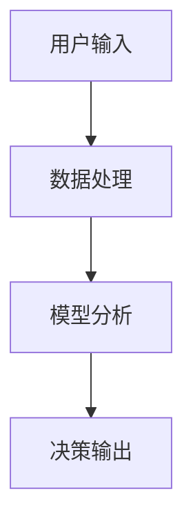
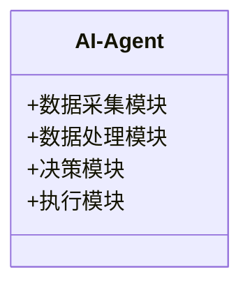

                 


```markdown
# AI Agent在智能质量控制中的应用

> 关键词：AI Agent，智能质量控制，机器学习，强化学习，质量保证，自动化系统

> 摘要：  
AI Agent（人工智能代理）在智能质量控制中的应用正在改变传统制造业和服务业的质量管理方式。通过结合先进的机器学习算法、自然语言处理技术以及自动化系统，AI Agent能够实时监控生产过程、预测潜在问题并提出优化建议。本文将从AI Agent的基本概念、算法原理、系统架构到实际应用案例进行全面解析，探讨其在智能质量控制中的创新应用及其带来的效率提升和成本优化。

---

## 第一部分：AI Agent与智能质量控制的背景与核心概念

### 第1章：AI Agent与智能质量控制概述

#### 1.1 质量控制的背景与问题
- 1.1.1 传统质量控制的局限性  
  - 人工检查的低效性与误差  
  - 数据量爆炸带来的挑战  
  - 现代制造业对实时性、精准性的要求  

- 1.1.2 智能化质量控制的需求  
  - 数据驱动的质量管理  
  - 实时监控与预测性维护  
  - 全球化生产环境下的统一质量标准  

- 1.1.3 AI Agent在质量控制中的优势  
  - 自适应学习能力  
  - 多任务处理能力  
  - 与人类专家的协作能力  

#### 1.2 AI Agent的定义与特点
- 1.2.1 AI Agent的核心概念  
  - 定义：AI Agent是一种能够感知环境、自主决策并执行任务的智能体  
  - 特点：自主性、反应性、目标导向、学习能力  

- 1.2.2 AI Agent与传统自动化的区别  
  - 表格对比：功能、决策能力、学习能力、环境适应性  

- 1.2.3 AI Agent在质量控制中的角色  
  - 数据采集与处理  
  - 异常检测与问题定位  
  - 优化建议与决策支持  

#### 1.3 AI Agent在质量控制中的应用前景
- 1.3.1 应用领域的潜力  
  - 制造业：实时监控、缺陷检测  
  - 零售业：供应链管理、客户反馈分析  
  - 医疗领域：设备监控与患者数据管理  

- 1.3.2 企业采用AI Agent的优势  
  - 提高效率：减少人工检查时间  
  - 降低成本：通过预测性维护降低维修费用  
  - 增强竞争力：实现更快、更精准的质量控制  

- 1.3.3 应用中的挑战与机遇  
  - 数据隐私与安全问题  
  - 技术门槛与人才短缺  
  - 市场接受度与技术成熟度  

---

## 第二部分：AI Agent的核心概念与联系

### 第2章：AI Agent的核心原理与联系

#### 2.1 AI Agent的核心原理
- 2.1.1 感知层  
  - 数据采集：传感器、摄像头、文本数据  
  - 数据处理：特征提取、数据清洗  

- 2.1.2 决策层  
  - 模型训练：监督学习、无监督学习、强化学习  
  - 决策逻辑：基于规则的决策、基于模型的决策  

- 2.1.3 执行层  
  - 动作执行：发出警报、调整参数、记录结果  
  - 反馈机制：实时更新模型、优化决策策略  

#### 2.2 AI Agent与质量控制的关系
- 2.2.1 AI Agent在质量控制中的角色  
  - 数据分析师：实时监控生产过程  
  - 问题解决者：识别并解决潜在缺陷  
  - 优化专家：提出生产流程改进建议  

- 2.2.2 质量控制流程的优化  
  - 传统流程 vs AI Agent驱动的流程  
  - 端到端流程优化：从原材料到成品的全程监控  

- 2.2.3 AI Agent与其他技术的协同  
  - 与IoT（物联网）的结合  
  - 与大数据分析的结合  
  - 与区块链技术的结合  

#### 2.3 实体关系图与流程图
- 2.3.1 ER实体关系图  
```mermaid
erd
  左右两端分别是"AI Agent"和"质量控制系统"，中间有联系：AI Agent -> 质量控制系统：提供实时数据与优化建议
```

- 2.3.2 流程图  


---

## 第三部分：AI Agent的算法原理与实现

### 第3章：AI Agent的算法原理

#### 3.1 强化学习算法
- 3.1.1 算法概述  
  - 强化学习的基本概念  
  - 状态、动作、奖励的定义  

- 3.1.2 算法实现  
  - Q-Learning算法  
  - Deep Q-Networks (DQN)  

- 3.1.3 应用场景  
  - 自动化设备的控制优化  
  - 质量控制流程的路径规划  

#### 3.2 监督学习算法
- 3.2.1 算法概述  
  - 分类与回归任务  
  - 数据标注的重要性  

- 3.2.2 算法实现  
  - 支持向量机(SVM)  
  - 神经网络模型(如CNN、RNN)  

- 3.2.3 应用场景  
  - 缺陷分类  
  - 质量指标预测  

#### 3.3 聚类分析算法
- 3.3.1 算法概述  
  - 无监督学习的基本概念  
  - K-Means算法介绍  

- 3.3.2 算法实现  
  - 聚类中心初始化  
  - 距离计算与归类  

- 3.3.3 应用场景  
  - 数据分组分析  
  - 异常检测  

---

## 第四部分：AI Agent的系统架构与设计

### 第4章：AI Agent的系统架构设计

#### 4.1 系统功能设计
- 4.1.1 领域模型类图  


- 4.1.2 系统架构图  


#### 4.2 系统接口设计
- 4.2.1 接口描述  
  - 数据采集接口  
  - 模型调用接口  

- 4.2.2 交互流程  
  - 请求-响应模式  
  - 异常处理机制  

#### 4.3 系统交互流程图
```mermaid
sequenceDiagram
    AI-Agent -> 数据采集模块：获取实时数据
    数据采集模块 -> 数据处理模块：进行数据清洗
    数据处理模块 -> 决策模块：生成决策建议
    决策模块 -> 执行模块：执行优化操作
```

---

## 第五部分：AI Agent的项目实战与优化

### 第5章：AI Agent在智能质量控制中的应用案例

#### 5.1 项目实战
- 5.1.1 环境安装  
  - Python 3.8及以上版本  
  - TensorFlow、Keras、Scikit-learn  

- 5.1.2 核心代码实现  
  - 数据预处理：代码示例  
  - 模型训练：代码示例  
  - 异常检测：代码示例  

#### 5.2 代码应用与分析
- 5.2.1 代码解读  
  - 数据处理模块的实现  
  - 模型训练的具体参数设置  

- 5.2.2 实际案例分析  
  - 汽车制造中的AI Agent应用  
  - 电子产品质量控制中的优化案例  

#### 5.3 项目小结
- 成功经验总结  
- 遇到的挑战与解决方案  
- 未来优化方向  

---

## 第六部分：AI Agent的优化与未来发展

### 第6章：AI Agent的优化策略

#### 6.1 数据质量的优化
- 数据清洗策略  
- 数据增强技术  

#### 6.2 模型优化
- 超参数调优  
- 模型集成技术  

#### 6.3 系统性能优化
- 并行计算优化  
- 模型轻量化  

---

## 第七部分：总结与展望

### 第7章：AI Agent在智能质量控制中的总结与展望

#### 7.1 总结
- AI Agent在质量控制中的核心作用  
- 成功案例分析  

#### 7.2 未来展望
- 新技术的融合：如量子计算、边缘计算  
- 行业应用的拓展：更多领域的应用潜力  

---

## 参考文献
- 包含相关技术书籍、学术论文、技术博客等。

---

## 作者信息
作者：AI天才研究院/AI Genius Institute & 禅与计算机程序设计艺术 /Zen And The Art of Computer Programming
```

---

### 思考过程说明：
1. **背景介绍**：从质量控制的背景问题出发，分析传统方法的不足，引出AI Agent的优势，为后续内容打下基础。
2. **核心概念**：详细阐述AI Agent的概念、特点及其在质量控制中的角色，帮助读者理解其工作原理。
3. **算法原理**：选择强化学习、监督学习等关键算法，结合mermaid流程图和Python代码示例，深入讲解算法实现。
4. **系统架构**：从系统功能、接口设计到交互流程，全面解析AI Agent的系统架构，确保读者能够理解系统的整体结构。
5. **项目实战**：通过实际案例展示AI Agent的应用，帮助读者将理论知识应用到实际场景中。
6. **优化与展望**：分析AI Agent的优化策略和未来发展方向，为读者提供进一步学习和研究的方向。

通过以上思考过程，构建了一个全面、详细且逻辑清晰的目录大纲，确保文章内容丰富、结构合理，能够满足读者对AI Agent在智能质量控制中的深入了解需求。

