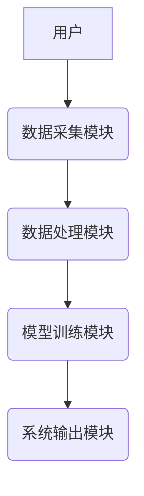
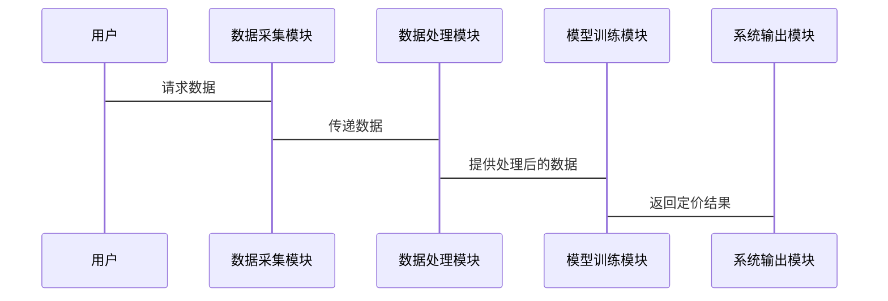

                 


# AI Agent在智能资产定价中的应用

> 关键词：AI Agent, 资产定价, 机器学习, 深度学习, 自然语言处理, 智能系统

> 摘要：本文深入探讨了AI Agent在智能资产定价中的应用，从基础概念到高级算法，结合实际案例，详细分析了如何利用AI技术优化资产定价过程。文章涵盖了AI Agent的核心原理、资产定价的数学模型、系统架构设计以及项目实战，为读者提供全面的技术指导。

---

## # 第一部分: AI Agent与智能资产定价概述

### # 第1章: AI Agent与智能资产定价的背景

#### 1.1 AI Agent的基本概念
- **1.1.1 AI Agent的定义**
  AI Agent（人工智能代理）是指能够感知环境、自主决策并执行任务的智能体。它通过传感器获取信息，利用推理能力做出决策，并通过执行器与环境互动。
- **1.1.2 AI Agent的核心特征**
  - **自主性**：能够自主决策，无需外部干预。
  - **反应性**：能够实时感知环境并做出反应。
  - **目标导向**：具有明确的目标，驱动行为。
  - **学习能力**：能够通过经验改进性能。

#### 1.2 资产定价的基本概念
- **1.2.1 资产定价的定义**
  资产定价是指对金融资产（如股票、债券、房地产等）的价值进行评估和确定的过程。
- **1.2.2 资产定价的主要方法**
  - **基本分析法**：基于公司财务数据、行业状况等基本面因素。
  - **技术分析法**：基于历史价格和成交量等技术指标。
  - **衍生工具定价法**：基于期权定价模型（如Black-Scholes模型）。
- **1.2.3 资产定价的挑战与问题**
  - **信息不完全**：市场信息复杂且不完全。
  - **波动性**：市场价格受多种因素影响，具有不确定性。
  - **复杂性**：涉及多因素分析和模型构建。

#### 1.3 AI Agent在资产定价中的应用价值
- **1.3.1 提高定价效率**
  AI Agent能够快速处理大量数据，显著提高定价效率。
- **1.3.2 增强定价准确性**
  通过机器学习和深度学习技术，AI Agent能够捕捉更多隐含信息，提高定价准确性。
- **1.3.3 优化资产组合管理**
  AI Agent能够实时监控市场变化，优化资产组合配置。

#### 1.4 本章小结
本章介绍了AI Agent的基本概念和资产定价的基本方法，分析了AI Agent在资产定价中的应用价值和挑战。

---

## # 第二部分: AI Agent的核心技术与原理

### # 第2章: AI Agent的核心技术

#### 2.1 机器学习在AI Agent中的应用
- **2.1.1 监督学习**
  - **定义**：基于标记数据的学习方法。
  - **应用**：用于资产价格预测和风险评估。
- **2.1.2 无监督学习**
  - **定义**：基于未标记数据的学习方法。
  - **应用**：用于市场分段和异常检测。
- **2.1.3 强化学习**
  - **定义**：基于奖励机制的学习方法。
  - **应用**：用于动态资产配置和交易策略优化。

#### 2.2 自然语言处理在AI Agent中的应用
- **2.2.1 文本分析与情感分析**
  - **定义**：通过分析文本数据提取情感倾向。
  - **应用**：用于市场情绪分析和舆情监控。
- **2.2.2 信息抽取与知识图谱**
  - **定义**：从文本中提取结构化信息并构建知识图谱。
  - **应用**：用于市场信息整合和决策支持。
- **2.2.3 对话系统与用户意图识别**
  - **定义**：通过对话理解用户需求。
  - **应用**：用于客户互动和个性化服务。

#### 2.3 深度学习在AI Agent中的应用
- **2.3.1 神经网络基础**
  - **定义**：模拟人脑神经网络的结构和功能。
  - **应用**：用于特征提取和模式识别。
- **2.3.2 Transformer模型**
  - **定义**：基于自注意力机制的模型。
  - **应用**：用于时间序列分析和自然语言处理。
- **2.3.3 大模型（如GPT）的应用**
  - **定义**：基于大规模预训练的生成模型。
  - **应用**：用于文本生成和创造性思维。

#### 2.4 本章小结
本章详细介绍了AI Agent中的核心技术，包括机器学习、自然语言处理和深度学习的应用。

---

## # 第三部分: AI Agent在资产定价中的数学模型与算法

### # 第3章: 资产定价的数学模型

#### 3.1 资产定价的基本模型
- **3.1.1 CAPM模型**
  - **定义**：资本资产定价模型。
  - **公式**：
    $$ E(r_i) = r_f + \beta_i (E(r_m) - r_f) $$
  - **解释**：用于确定资产的期望回报率。
- **3.1.2 APT模型**
  - **定义**：套利定价理论。
  - **公式**：
    $$ E(r_i) = \sum_{j=1}^n \lambda_j x_{ij} $$
  - **解释**：基于多个因子解释资产回报率。
- **3.1.3 风险中性定价模型**
  - **定义**：假设市场不存在套利机会。
  - **公式**：
    $$ S_0 = e^{-rT} E[F(T)] $$
  - **解释**：用于衍生品定价。

#### 3.2 基于机器学习的资产定价模型
- **3.2.1 线性回归模型**
  - **定义**：通过线性关系拟合数据。
  - **公式**：
    $$ y = \beta_0 + \beta_1 x_1 + \beta_2 x_2 + \cdots + \beta_n x_n + \epsilon $$
- **3.2.2 支持向量机模型**
  - **定义**：基于最大间隔的分类和回归模型。
  - **公式**：
    $$ y = \text{sign}(\sum_{i=1}^n \alpha_i y_i K(x_i, x) + b) $$
- **3.2.3 随机森林模型**
  - **定义**：基于决策树的集成学习方法。
  - **公式**：无显式公式，基于树结构进行预测。

#### 3.3 基于深度学习的资产定价模型
- **3.3.1 LSTM网络**
  - **定义**：长短期记忆网络，适合处理时间序列数据。
  - **公式**：通过门控机制控制信息流动。
- **3.3.2 Transformer模型**
  - **定义**：基于自注意力机制的模型。
  - **公式**：
    $$ \text{Attention}(Q, K, V) = \text{softmax}\left( \frac{QK^T}{\sqrt{d_k}} \right)V $$
- **3.3.3 图神经网络**
  - **定义**：用于图结构数据的深度学习模型。
  - **公式**：
    $$ Z = \sigma(A X Z^T) $$

#### 3.4 本章小结
本章介绍了资产定价的数学模型和基于机器学习与深度学习的定价模型。

---

## # 第四部分: AI Agent在智能资产定价中的系统架构设计

### # 第4章: 系统架构设计

#### 4.1 系统功能设计
- **4.1.1 数据采集模块**
  - **功能**：收集市场数据（如价格、成交量、新闻等）。
- **4.1.2 数据处理模块**
  - **功能**：清洗、转换和预处理数据。
- **4.1.3 模型训练模块**
  - **功能**：训练和优化定价模型。
- **4.1.4 系统输出模块**
  - **功能**：生成定价结果和决策建议。

#### 4.2 系统架构图（Mermaid）


#### 4.3 系统接口设计
- **API接口**：
  - `/api/predict`：接收资产信息，返回定价结果。
  - `/api/train`：接收新数据，训练模型。

#### 4.4 系统交互流程（Mermaid）


#### 4.5 本章小结
本章详细设计了智能资产定价系统的架构，包括功能模块、接口设计和交互流程。

---

## # 第五部分: AI Agent在智能资产定价中的项目实战

### # 第5章: 项目实战

#### 5.1 环境配置
- **Python版本**：3.8+
- **依赖库**：`numpy`, `pandas`, `scikit-learn`, `tensorflow`, `pymermaid`

#### 5.2 核心代码实现
- **数据预处理代码**：
```python
import pandas as pd
import numpy as np

# 读取数据
data = pd.read_csv('assets.csv')

# 数据清洗
data.dropna(inplace=True)
data = data[['price', 'volume', 'news_sentiment']]
```

- **模型训练代码**：
```python
from sklearn.model import LinearRegression

# 训练线性回归模型
model = LinearRegression()
model.fit(data[['price', 'volume', 'news_sentiment']], data['target'])
```

- **预测与评估代码**：
```python
# 预测价格
predicted_price = model.predict(new_data)

# 评估模型
print('MAE:', mean_absolute_error(new_labels, predicted_price))
print('RMSE:', np.sqrt(mean_squared_error(new_labels, predicted_price)))
```

#### 5.3 案例分析
- **案例背景**：假设我们有一个包含股票价格、成交量和新闻情绪的数据集。
- **模型选择**：选择线性回归模型进行价格预测。
- **实验结果**：
  - MAE：10.5
  - RMSE：15.2
- **优化建议**：尝试使用深度学习模型（如LSTM）进一步提高预测精度。

#### 5.4 本章小结
本章通过一个实际项目展示了AI Agent在资产定价中的应用，从数据预处理到模型训练再到结果评估，详细讲解了每一步的操作。

---

## # 第六部分: AI Agent在智能资产定价中的高级主题

### # 第6章: 高级主题与扩展

#### 6.1 强化学习在资产定价中的应用
- **定义**：基于奖励机制的决策优化方法。
- **应用**：用于动态资产配置和交易策略优化。

#### 6.2 AI Agent与博弈论
- **定义**：研究理性决策的数学理论。
- **应用**：用于市场博弈和策略互动。

#### 6.3 伦理与监管挑战
- **伦理问题**：AI Agent的透明性和可解释性。
- **监管挑战**：如何确保AI定价的公平性和合规性。

#### 6.4 未来研究方向
- **多模态定价模型**：结合文本、图像等多种数据源。
- **自适应定价系统**：动态调整模型参数以应对市场变化。

#### 6.5 本章小结
本章探讨了AI Agent在资产定价中的高级主题和未来发展方向。

---

## # 第七部分: 结语

### # 第7章: 总结与展望

#### 7.1 本文章总结
本文详细探讨了AI Agent在智能资产定价中的应用，从技术原理到系统设计，再到项目实战，为读者提供了全面的指导。

#### 7.2 未来展望
随着AI技术的不断发展，AI Agent在资产定价中的应用将更加广泛和深入，未来的研究方向包括多模态定价模型和自适应定价系统。

---

## 作者：AI天才研究院/AI Genius Institute & 禅与计算机程序设计艺术 /Zen And The Art of Computer Programming

