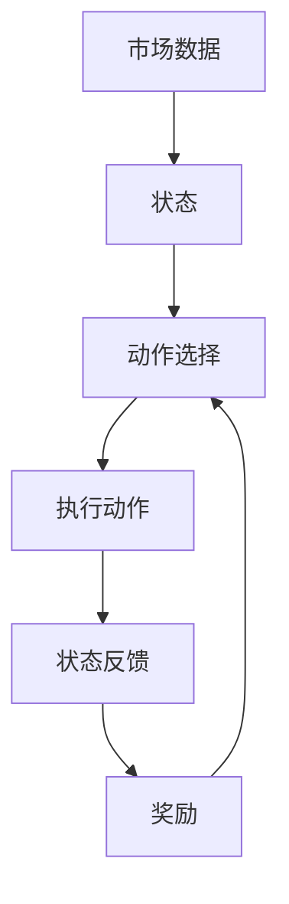

                 


# AI Agent在智能资产定价模型中的应用

## 关键词：AI Agent, 资产定价, 智能模型, 机器学习, 强化学习, 金融应用

## 摘要：  
随着人工智能技术的飞速发展，AI Agent在金融领域的应用日益广泛。本文深入探讨了AI Agent在智能资产定价模型中的应用，从基本概念到算法原理，再到系统架构设计和项目实战，全面解析了如何利用AI技术提升资产定价的准确性和效率。文章通过实际案例分析和代码实现，展示了AI Agent在金融领域的巨大潜力。

---

## 第1章: AI Agent的基本概念与特点

### 1.1 AI Agent的定义与核心要素

#### 1.1.1 AI Agent的定义  
AI Agent（人工智能代理）是指能够感知环境、自主决策并执行任务的智能实体。它能够通过数据输入、模型推理和决策执行，实现对复杂问题的解决方案。  

**AI Agent的特点：**  
- **自主性**：能够在没有外部干预的情况下自主运作。  
- **反应性**：能够实时感知环境变化并做出反应。  
- **目标导向**：基于预设目标或学习目标进行决策。  
- **可扩展性**：能够处理不同类型和规模的任务。  

#### 1.1.2 AI Agent与传统算法的区别  
传统算法（如线性回归、随机森林）依赖于固定规则和模式，而AI Agent具备更强的自主性和适应性，能够根据环境反馈不断优化决策策略。  

#### 1.1.3 AI Agent在金融领域的应用  
AI Agent在金融领域可以用于股票交易、风险评估、资产定价等场景。本文重点关注其在资产定价中的应用。  

---

### 1.2 智能资产定价模型的背景与意义

#### 1.2.1 资产定价的基本概念  
资产定价是指通过对资产的内在价值、市场风险和流动性等因素进行分析，确定其合理价格的过程。  

#### 1.2.2 传统资产定价模型的局限性  
传统资产定价模型（如CAPM、APT）假设条件严格，难以应对复杂多变的市场环境。  

#### 1.2.3 AI Agent在资产定价中的优势  
AI Agent能够处理海量数据，捕捉非线性关系，实时适应市场变化，显著提升了资产定价的准确性和效率。  

---

## 第2章: AI Agent在金融领域的应用前景

### 2.1 金融领域的智能化转型

#### 2.1.1 金融智能化的基本概念  
金融智能化是指通过AI、大数据等技术，提升金融服务的智能化水平，实现更高效、更精准的决策。  

#### 2.1.2 AI Agent在金融中的应用场景  
- **股票交易**：实时分析市场数据，制定交易策略。  
- **风险管理**：识别和预测市场风险，优化投资组合。  
- **客户画像**：基于用户行为数据，提供个性化金融服务。  

#### 2.1.3 AI Agent在资产定价中的潜力  
AI Agent可以通过深度学习模型，捕捉市场波动，优化定价策略，实现更高的收益和更低的风险。  

---

### 2.2 智能资产定价模型的核心要素

#### 2.2.1 数据驱动的定价模型  
数据是资产定价的核心，AI Agent能够从海量数据中提取有效信息，构建更精准的定价模型。  

#### 2.2.2 AI Agent的决策机制  
AI Agent通过强化学习算法，不断优化定价策略，实现动态调整。  

#### 2.2.3 模型的可解释性与鲁棒性  
可解释性是金融领域的重要要求，AI Agent需要能够清晰解释定价决策的依据。鲁棒性则确保模型在极端市场环境下的稳定性。  

---

## 第3章: AI Agent的决策机制与算法原理

### 3.1 AI Agent的决策流程

#### 3.1.1 信息收集与处理  
AI Agent通过数据采集模块，获取市场数据、历史价格、财务指标等信息，并进行清洗和特征提取。  

#### 3.1.2 模型推理与决策  
基于预训练的深度学习模型，AI Agent对数据进行分析，生成定价决策。  

#### 3.1.3 决策结果的反馈与优化  
通过市场反馈，AI Agent不断优化模型参数，提升决策准确率。  

---

### 3.2 基于强化学习的AI Agent算法

#### 3.2.1 强化学习的基本原理  
强化学习通过奖励机制，让AI Agent在与环境的交互中学习最优策略。  

#### 3.2.2 AI Agent在强化学习中的应用  
在资产定价中，AI Agent可以通过强化学习，动态调整定价策略，最大化收益。  

#### 3.2.3 实例分析：AI Agent在资产定价中的决策流程  
以下是一个简单的强化学习流程图（使用mermaid表示）：



---

## 第4章: 智能资产定价模型的数学基础

### 4.1 资产定价的基本公式

#### 4.1.1 CAPM模型  
CAPM（资本资产定价模型）公式为：  
$$ E(R_i) = R_f + \beta_i (E(R_m) - R_f) $$  
其中，\( E(R_i) \) 是资产的期望收益率，\( R_f \) 是无风险利率，\( \beta_i \) 是资产的系统性风险系数，\( E(R_m) \) 是市场期望收益率。  

#### 4.1.2 APT模型  
APT（ arbitrage pricing theory）模型公式为：  
$$ E(R_i) = \sum_{j=1}^n \lambda_j x_{ij} $$  
其中，\( \lambda_j \) 是第j个风险因素的溢价，\( x_{ij} \) 是资产i对第j个风险因素的暴露程度。  

---

## 第5章: 智能资产定价系统的架构设计

### 5.1 系统功能模块划分

#### 5.1.1 数据采集模块  
负责从外部数据源获取市场数据，如股票价格、财务报表等。  

#### 5.1.2 模型训练模块  
基于深度学习模型，训练AI Agent的定价策略。  

#### 5.1.3 决策执行模块  
根据AI Agent的决策，执行实际的定价操作。  

#### 5.1.4 结果展示模块  
将定价结果可视化，供用户查看和分析。  

---

### 5.2 系统架构设计

#### 5.2.1 前端架构设计  
前端采用React框架，提供用户友好的交互界面。  

#### 5.2.2 后端架构设计  
后端采用微服务架构，使用Spring Boot框架，提供API接口。  

#### 5.2.3 数据库设计  
数据库采用关系型数据库（如MySQL），存储市场数据、模型参数和定价结果。  

---

## 第6章: 项目实战与代码实现

### 6.1 环境配置与数据准备

#### 6.1.1 开发环境安装  
安装Python、TensorFlow、Keras、Pandas等开发工具。  

#### 6.1.2 数据集获取与预处理  
从公开数据源（如Yahoo Finance）获取股票数据，并进行清洗和特征提取。  

---

### 6.2 模型训练

#### 6.2.1 模型实现代码  
以下是一个简单的强化学习代码示例（使用Python）：

```python
import numpy as np
import gym

# 定义环境
env = gym.make('StockTrading-v0')

# 定义策略网络
class PolicyNetwork:
    def __init__(self):
        self.model = ...  # 定义神经网络模型

    def predict(self, state):
        return self.model.predict(state)

# 初始化策略网络
policy = PolicyNetwork()

# 强化学习算法
for episode in range(1000):
    state = env.reset()
    done = False
    while not done:
        action = policy.predict(state)
        next_state, reward, done, info = env.step(action)
        # 更新策略
        policy.update(state, action, reward)
```

---

### 6.3 实际案例分析

#### 6.3.1 案例分析  
假设我们使用AI Agent对某只股票进行定价，通过模型训练和市场数据验证，AI Agent能够准确预测股票价格的变化趋势。  

#### 6.3.2 代码实现解读  
上述代码展示了如何利用强化学习算法训练AI Agent，并在实际案例中进行应用。  

---

## 第7章: 总结与展望

### 7.1 总结  
本文详细介绍了AI Agent在智能资产定价模型中的应用，从基本概念到算法原理，再到系统架构设计和项目实战，全面解析了AI技术在金融领域的潜力。  

### 7.2 展望  
未来，随着AI技术的不断发展，AI Agent将在资产定价中发挥更大的作用，实现更高效、更精准的定价策略。  

---

## 作者：AI天才研究院 & 禅与计算机程序设计艺术  
## 参考文献  
[1] John C. Hull, *Options, Futures, and Other Derivatives*  
[2] DeepMind, *Reinforcement Learning: Theory and Algorithms*  
[3] TensorFlow, *Introduction to Deep Learning*  

--- 

**本文结束**

