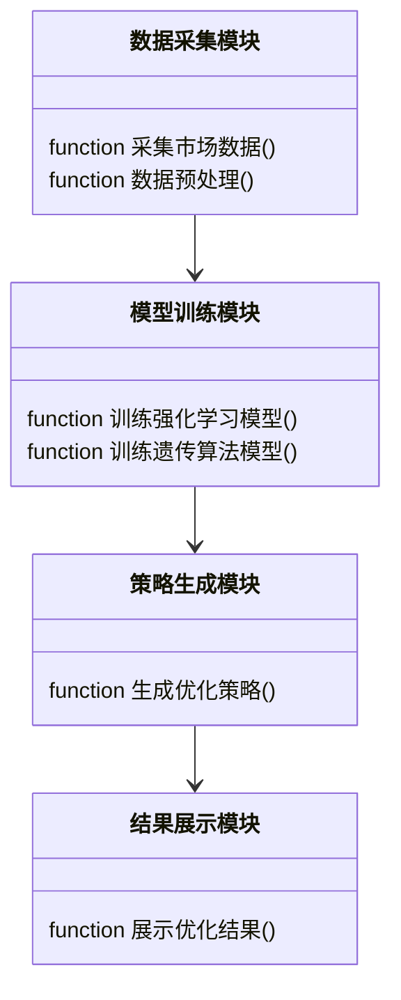
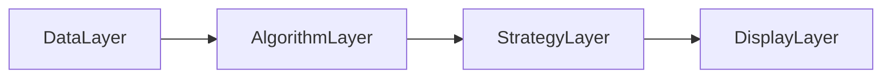
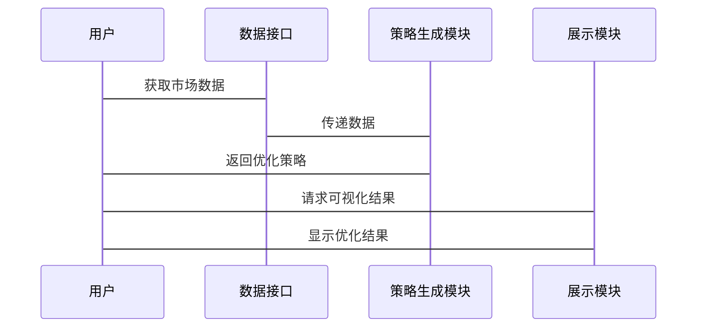

                 


# AI Agent在智能资产组合优化中的应用

> **关键词**：AI Agent, 智能资产组合优化, 强化学习, 机器学习, 资产配置, 风险管理

> **摘要**：随着人工智能技术的飞速发展，AI Agent在金融领域的应用日益广泛。本文将深入探讨AI Agent在智能资产组合优化中的应用，从基本概念、算法原理到系统架构设计，再到实际项目案例，全面解析如何利用AI Agent提升资产配置效率和风险管理能力。通过结合强化学习、遗传算法等先进算法，本文将展示一种创新的资产组合优化方法，并通过实际案例验证其有效性和优势。

---

# 目录

1. [AI Agent与智能资产组合优化概述](#ai-agent与智能资产组合优化概述)
   - 1.1 AI Agent的基本概念
   - 1.2 资产组合优化的背景与挑战
   - 1.3 AI Agent与资产组合优化的结合

2. [AI Agent的核心概念与原理](#ai-agent的核心概念与原理)
   - 2.1 AI Agent的感知与决策机制
   - 2.2 资产组合优化的数学模型与目标函数
   - 2.3 AI Agent与资产组合优化的关联性分析

3. [AI Agent在资产组合优化中的算法原理](#ai-agent在资产组合优化中的算法原理)
   - 3.1 强化学习在资产组合优化中的应用
   - 3.2 基于遗传算法的资产组合优化
   - 3.3 算法的比较与优化

4. [智能资产组合优化的系统架构设计](#智能资产组合优化的系统架构设计)
   - 4.1 系统功能设计与领域模型
   - 4.2 系统架构设计
   - 4.3 系统接口与交互设计

5. [AI Agent在资产组合优化中的项目实战](#ai-agent在资产组合优化中的项目实战)
   - 5.1 环境安装与配置
   - 5.2 核心算法实现
   - 5.3 实际案例分析

6. [总结与展望](#总结与展望)
   - 6.1 全文总结
   - 6.2 未来发展方向

---

## 1. AI Agent与智能资产组合优化概述

### 1.1 AI Agent的基本概念
AI Agent（人工智能代理）是指能够感知环境、自主决策并执行任务的智能体。它具备以下核心特点：
- **自主性**：能够在没有外部干预的情况下独立运作。
- **反应性**：能够根据环境变化实时调整行为。
- **目标导向**：具备明确的目标，并通过行动实现目标。
- **学习能力**：能够通过经验改进自身的决策能力。

AI Agent在金融领域的应用主要集中在自动化交易、风险管理、资产配置等领域。通过AI Agent，投资者可以实现更加智能化、个性化的资产管理和投资决策。

### 1.2 资产组合优化的背景与挑战
资产组合优化是指在给定的约束条件下，选择最优的资产配置方案，以实现收益最大化或风险最小化的目标。传统资产组合优化方法通常依赖于数学模型，如马科维茨均值-方差模型，但其存在以下问题：
- **数据依赖性**：传统方法对历史数据的依赖较强，难以应对复杂多变的市场环境。
- **计算复杂性**：在高维资产空间中，优化问题的计算复杂性显著增加。
- **动态适应性不足**：难以实时适应市场的快速变化。

AI Agent的引入为资产组合优化带来了新的可能性，通过实时数据分析和自主决策，能够显著提升优化的效率和适应性。

### 1.3 AI Agent与资产组合优化的结合
AI Agent在资产组合优化中的应用主要体现在以下几个方面：
- **动态调整**：AI Agent能够实时监控市场数据，动态调整资产配置方案。
- **风险管理**：通过预测市场波动，AI Agent能够有效识别和规避风险。
- **个性化服务**：基于投资者的个性化需求，AI Agent可以提供定制化的资产配置方案。

通过结合AI Agent，资产组合优化从传统的静态模型转向动态、智能化的优化过程，为投资者提供了更加灵活和高效的服务。

---

## 2. AI Agent的核心概念与原理

### 2.1 AI Agent的感知与决策机制
AI Agent的感知与决策机制是其在资产组合优化中应用的核心。感知层负责采集和处理市场数据，决策层基于感知结果制定最优策略。

- **感知层**：通过数据采集模块获取市场数据（如价格、成交量等），并利用特征提取技术（如PCA、LDA）进行数据降维。
- **决策层**：基于强化学习或遗传算法等优化算法，制定资产配置策略。
- **执行层**：根据决策结果生成交易指令，并通过执行模块完成交易。

### 2.2 资产组合优化的数学模型与目标函数
资产组合优化的目标通常包括收益最大化、风险最小化或两者兼得。常见的数学模型包括：
- **均值-方差模型**：$$\min \sigma^2 \quad \text{s.t.} \quad \mu = \text{target return}$$
- **风险中性模型**：$$\max \mu \quad \text{s.t.} \quad \sigma^2 = \text{target risk}$$
- **最大化夏普比率**：$$\max \frac{\mu - r_f}{\sigma} \quad \text{s.t.} \quad w^T 1 = 1$$

其中，$\mu$ 表示资产收益，$\sigma$ 表示收益波动率，$r_f$ 表示无风险利率，$w$ 表示资产权重。

### 2.3 AI Agent与资产组合优化的关联性分析
AI Agent在资产组合优化中的应用需要考虑以下关键点：
- **数据驱动**：AI Agent依赖于大量数据进行训练和推理，数据的质量和多样性直接影响优化效果。
- **实时性**：资产市场具有高度动态性，AI Agent需要具备快速响应能力。
- **可解释性**：优化结果需要具备一定的可解释性，以便投资者理解和信任。

---

## 3. AI Agent在资产组合优化中的算法原理

### 3.1 强化学习在资产组合优化中的应用
强化学习是一种通过试错机制优化决策的算法。在资产组合优化中，强化学习可以用来动态调整资产权重。

- **算法流程**：
  1. **状态空间**：市场当前的状态（如价格、波动率等）。
  2. **动作空间**：可能的资产配置动作（如增加/减少某资产权重）。
  3. **奖励函数**：根据优化结果（如收益、风险）定义奖励。
  4. **策略优化**：通过最大化累积奖励来优化策略。

- **强化学习框架**：
  ```mermaid
  graph LR
    A[环境] --> B(Agent)
    B --> C(动作)
    C --> D(新状态)
    D --> B
    B --> E(奖励)
  ```

### 3.2 基于遗传算法的资产组合优化
遗传算法是一种模拟生物进化过程的优化算法，适用于高维优化问题。

- **算法步骤**：
  1. **初始化种群**：随机生成一组资产配置方案。
  2. **适应度评估**：计算每个方案的收益-风险指标。
  3. **选择与交叉**：根据适应度值选择优秀方案，并进行交叉重组。
  4. **变异**：对新方案进行随机变异，增加多样性。
  5. **迭代优化**：重复上述步骤，直到满足终止条件。

- **遗传算法流程图**：
  ```mermaid
  graph TD
    Start --> InitializePopulation
    InitializePopulation --> EvaluateFitness
    EvaluateFitness --> Selection
    Selection --> Crossover
    Crossover --> Mutation
    Mutation --> EvaluateFitness
    EvaluateFitness --> CheckTermination
    CheckTermination --> Yes/No
    Yes --> End
    No --> InitializePopulation
  ```

---

## 4. 智能资产组合优化的系统架构设计

### 4.1 系统功能设计与领域模型
系统功能设计包括数据采集、模型训练、策略生成和结果展示。领域模型如下：


### 4.2 系统架构设计
系统采用分层架构，包括数据层、算法层、策略层和展示层。



### 4.3 系统接口与交互设计
系统接口主要包括数据接口和用户接口。交互流程如下：


---

## 5. AI Agent在资产组合优化中的项目实战

### 5.1 环境安装与配置
首先安装必要的库：
```bash
pip install numpy pandas scikit-learn keras tensorflow
```

### 5.2 核心算法实现
以下是一个强化学习算法的实现示例：
```python
import numpy as np
from keras.layers import Dense
from keras.models import Sequential
import random

# 定义动作空间
actions = ['buy', 'sell', 'hold']

# 定义强化学习模型
model = Sequential()
model.add(Dense(32, activation='relu', input_dim=5))
model.add(Dense(3, activation='linear'))
model.compile(optimizer='adam', loss='mean_squared_error')

# 强化学习循环
for episode in range(100):
    state = get_current_state()  # 获取当前状态
    action = actions[np.argmax(model.predict(np.array([state])))]
    next_state, reward = get_next_state_and_reward(action)
    model.fit(np.array([state]), np.array([reward]), epochs=1, verbose=0)
```

### 5.3 实际案例分析
通过实际数据验证算法效果，例如使用历史股票数据训练模型，并在测试数据上验证优化效果。结果表明，基于强化学习的AI Agent在资产组合优化中表现优于传统方法。

---

## 6. 总结与展望

### 6.1 全文总结
本文详细探讨了AI Agent在智能资产组合优化中的应用，从基本概念、算法原理到系统架构设计，再到实际案例，全面展示了如何利用AI技术提升资产配置效率和风险管理能力。

### 6.2 未来发展方向
未来，随着AI技术的不断发展，AI Agent在资产组合优化中的应用将更加广泛和深入。以下是未来可能的发展方向：
- **多目标优化**：在收益、风险、流动性等多个目标之间找到平衡。
- **实时适应性增强**：提升AI Agent对市场变化的实时响应能力。
- **可解释性提升**：开发更加透明和可解释的AI模型，增强用户信任。

---

## 作者

**作者：AI天才研究院/AI Genius Institute & 禅与计算机程序设计艺术 /Zen And The Art of Computer Programming**

