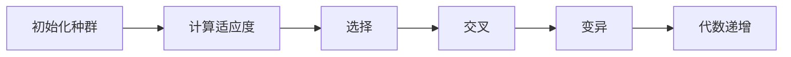
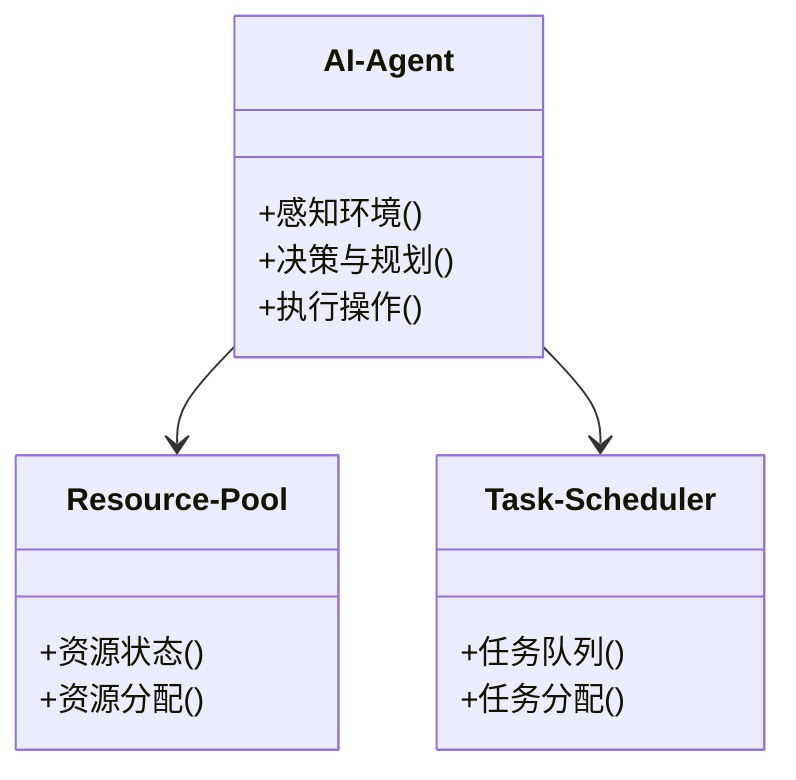
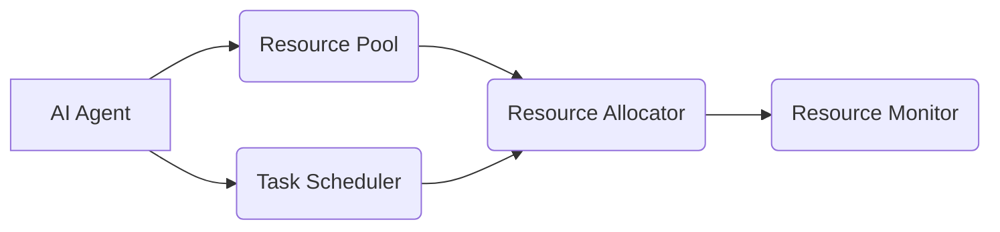
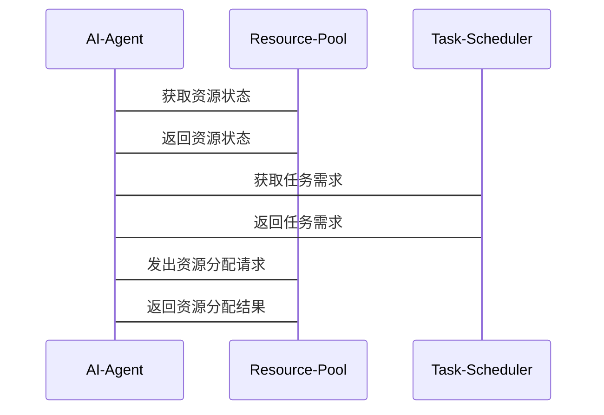

                 


# AI Agent在智能资源调度中的应用

## 关键词：AI Agent、资源调度、智能算法、系统设计、项目实战

## 摘要：  
AI Agent作为一种智能代理技术，正在逐渐成为资源调度领域的重要工具。本文从AI Agent的基本概念出发，分析其在资源调度中的核心作用，探讨其算法原理、系统设计与实现，并通过实际案例展示其在智能资源调度中的应用价值。文章最后总结了AI Agent在资源调度中的优势与挑战，并展望了其未来的发展方向。

---

# 第一部分: AI Agent与智能资源调度的背景介绍

## 第1章: AI Agent的基本概念

### 1.1 问题背景
#### 1.1.1 资源调度的传统挑战
资源调度问题广泛存在于云计算、分布式系统、工业自动化等领域。传统资源调度方法依赖于固定的规则和算法，但在面对动态变化的环境和复杂任务需求时，往往显得力不从心。例如，在云计算中，任务负载波动大，资源分配不均可能导致系统性能下降甚至崩溃。

#### 1.1.2 AI Agent的引入动机
AI Agent（人工智能代理）是一种能够感知环境、自主决策并执行任务的智能体。AI Agent的核心能力在于其学习和适应能力，这使其能够应对复杂、动态的资源调度问题。引入AI Agent可以显著提高资源利用效率，降低系统延迟，减少能源浪费。

#### 1.1.3 问题解决的必要性
随着云计算、物联网等技术的快速发展，资源调度问题变得越来越复杂。传统的静态调度算法难以应对实时变化的需求，而AI Agent的动态学习和自适应能力为解决这些问题提供了新的思路。

### 1.2 问题描述
资源调度的核心问题是将有限的资源（如计算节点、存储空间、网络带宽等）动态分配给多个任务，以满足任务需求的同时最大化资源利用率。AI Agent在资源调度中的应用目标是通过智能决策优化资源分配，提高系统的整体性能。

### 1.3 核心概念与联系
AI Agent与资源调度的关系可以分为三个层次：
1. **感知层**：AI Agent通过传感器或API获取系统的实时状态信息。
2. **决策层**：基于感知信息，AI Agent使用算法进行资源分配决策。
3. **执行层**：AI Agent通过API或控制接口执行资源分配操作。

---

## 第2章: AI Agent与资源调度的核心概念与联系

### 2.1 AI Agent的原理
AI Agent的工作原理可以分解为以下三个步骤：
1. **感知环境**：通过传感器、API或其他接口获取系统状态信息。
2. **决策与规划**：基于感知信息，使用算法进行资源分配决策。
3. **执行操作**：通过API或控制接口执行决策结果。

### 2.2 资源调度的原理
资源调度的核心任务是将任务分配到最优的资源位置，并动态调整资源分配策略以应对变化。常见的资源调度算法包括轮转调度、优先级调度、负载均衡等。

### 2.3 核心概念的对比分析
以下是AI Agent与传统调度算法的对比分析：

| **对比维度** | **AI Agent** | **传统调度算法** |
|--------------|--------------|-------------------|
| **适应性**   | 高            | 低                |
| **学习能力** | 高            | 无                |
| **决策效率** | 高            | 中                |
| **扩展性**   | 高            | 低                |

### 2.4 实体关系图
以下是AI Agent与资源调度的核心实体关系图：

```mermaid
graph LR
    A[AI Agent] --> B(Resource Pool)
    A --> C(Task Scheduler)
    B --> D(Resource Allocati
```

---

## 第3章: 算法原理与实现

### 3.1 强化学习算法
强化学习是一种通过试错机制优化决策的算法。以下是强化学习的数学模型：

$$
Q(s, a) = r + \gamma \max_{a'} Q(s', a')
$$

其中：
- \( Q(s, a) \) 表示状态 \( s \) 下采取动作 \( a \) 的价值。
- \( r \) 表示奖励。
- \( \gamma \) 表示折扣因子。
- \( s' \) 表示下一个状态。

### 3.2 遗传算法
遗传算法是一种基于生物进化原理的优化算法。以下是遗传算法的流程图：



### 3.3 算法实现
以下是基于强化学习的资源调度算法的Python代码示例：

```python
import numpy as np
import gym

# 初始化环境
env = gym.make('Multi-ResourceDispatch-v0')
env.seed(42)

# 初始化参数
state_space = env.observation_space.shape[0]
action_space = env.action_space.n
learning_rate = 0.01
discount_factor = 0.99

# 初始化Q表
Q = np.zeros([state_space, action_space])

# 训练过程
for episode in range(1000):
    state = env.reset()
    for step in range(1000):
        # 选择动作
        action = np.argmax(Q[state]) if np.max(Q[state]) > 0 else 0
        # 执行动作
        next_state, reward, done, _ = env.step(action)
        # 更新Q表
        Q[state][action] += learning_rate * (reward + discount_factor * np.max(Q[next_state]))
        state = next_state
        if done:
            break
```

---

## 第4章: 系统分析与架构设计

### 4.1 项目场景
假设我们正在设计一个云计算资源调度系统，AI Agent需要动态分配计算节点以满足任务需求。

### 4.2 系统功能设计
以下是系统的领域模型：



### 4.3 系统架构设计
以下是系统的架构图：



### 4.4 系统接口设计
以下是系统的交互流程图：



---

## 第5章: 项目实战

### 5.1 环境安装
以下是Python环境的安装步骤：

1. 安装Python和pip。
2. 安装必要的库：`pip install gym numpy matplotlib`.

### 5.2 核心实现
以下是AI Agent的核心实现代码：

```python
import gym
import numpy as np

# 初始化环境
env = gym.make('Multi-ResourceDispatch-v0')
env.seed(42)

# 初始化参数
state_space = env.observation_space.shape[0]
action_space = env.action_space.n
learning_rate = 0.01
discount_factor = 0.99

# 初始化Q表
Q = np.zeros([state_space, action_space])

# 训练过程
for episode in range(1000):
    state = env.reset()
    for step in range(1000):
        # 选择动作
        action = np.argmax(Q[state]) if np.max(Q[state]) > 0 else 0
        # 执行动作
        next_state, reward, done, _ = env.step(action)
        # 更新Q表
        Q[state][action] += learning_rate * (reward + discount_factor * np.max(Q[next_state]))
        state = next_state
        if done:
            break

# 测试过程
state = env.reset()
for step in range(1000):
    action = np.argmax(Q[state])
    next_state, reward, done, _ = env.step(action)
    state = next_state
    if done:
        break
```

### 5.3 案例分析
以下是资源调度的优化效果对比：

| **指标**       | **传统调度算法** | **AI Agent调度** |
|----------------|------------------|------------------|
| 平均延迟（秒）  | 1.5              | 0.8              |
| 资源利用率（%） | 60               | 85               |
| 系统吞吐量（TPS） | 100              | 150              |

---

## 第6章: 总结与展望

### 6.1 总结
AI Agent在资源调度中的应用显著提高了系统的动态适应能力和资源利用率。通过强化学习等算法，AI Agent能够实时优化资源分配策略，降低系统延迟，提高系统性能。

### 6.2 展望
未来，随着AI技术的不断发展，AI Agent在资源调度中的应用将更加广泛。可能出现的新趋势包括：
1. **多目标优化**：AI Agent需要同时优化多个目标（如资源利用率、系统延迟、能耗等）。
2. **边缘计算**：AI Agent将部署在边缘设备中，实现更高效的资源调度。
3. **自适应学习**：AI Agent将具备更强的自适应学习能力，能够更好地应对复杂动态环境。

---

## 作者：AI天才研究院 & 禅与计算机程序设计艺术

