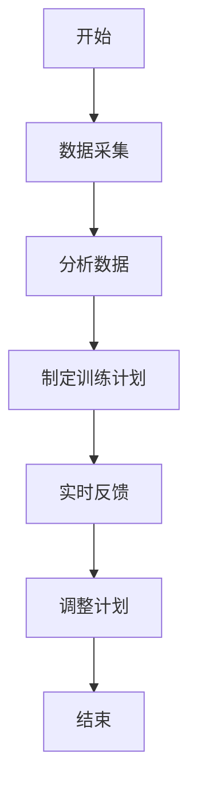
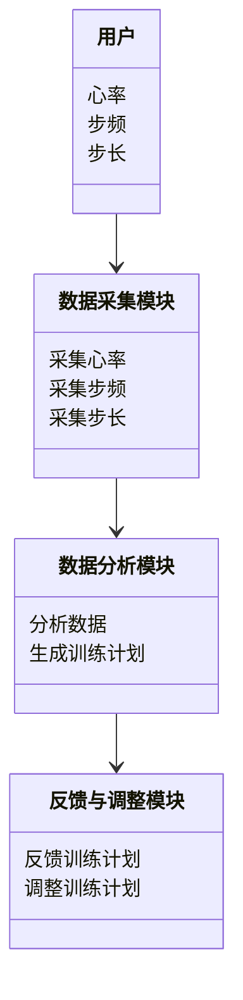

                 


# AI Agent在智能跑步机中的训练计划

> **关键词**：AI Agent, 智能跑步机, 训练计划, 机器学习, 实时反馈, 数据分析

> **摘要**：本文探讨AI Agent在智能跑步机中的应用，分析其如何通过机器学习和实时反馈优化用户的训练计划，提升健身效果。文章从背景、核心概念、算法原理、系统架构到项目实战，全面解析AI Agent在智能跑步机中的实现与应用。

---

## 第1章：AI Agent与智能跑步机的背景

### 1.1 问题背景

#### 1.1.1 传统跑步机的局限性
传统跑步机仅提供固定的速度和坡度设置，无法根据用户的实时反馈动态调整训练计划。用户在使用过程中可能会感到单调或强度不足，导致训练效果不佳。

#### 1.1.2 智能健身设备的兴起
随着科技的进步，智能健身设备逐渐普及。这些设备能够通过传感器收集用户的运动数据，如心率、步频、步长等，为用户提供更个性化的健身体验。

#### 1.1.3 AI技术在健身领域的应用潜力
AI技术可以通过分析用户的运动数据和健康状况，提供实时反馈和个性化建议，帮助用户更科学地进行训练。AI Agent在其中扮演了关键角色，能够动态调整训练计划，确保用户在不同阶段获得最佳的锻炼效果。

### 1.2 问题描述

#### 1.2.1 用户健身需求的多样化
现代用户对健身的需求日益多样化，他们不仅希望锻炼身体，还希望在锻炼过程中获得乐趣和科学指导。

#### 1.2.2 传统训练计划的不足
传统的训练计划通常是静态的，无法根据用户的实时反馈和身体状况进行调整。这可能导致用户在锻炼过程中感到疲劳或受伤的风险增加。

#### 1.2.3 实时反馈与个性化需求
用户希望在锻炼过程中获得实时反馈，如运动状态、心率、卡路里消耗等，并根据这些数据动态调整训练计划。

### 1.3 问题解决

#### 1.3.1 AI Agent的核心作用
AI Agent通过实时分析用户的运动数据和健康状况，动态调整训练计划，确保用户在锻炼过程中的安全性和效果。

#### 1.3.2 AI Agent如何优化训练计划
AI Agent可以根据用户的运动数据和健康目标，制定个性化的训练计划，并根据实时反馈动态调整训练强度和时间。

#### 1.3.3 实时反馈与动态调整
AI Agent通过传感器收集用户的运动数据，并实时反馈给用户，帮助用户在锻炼过程中保持最佳状态。

### 1.4 边界与外延

#### 1.4.1 AI Agent的应用范围
AI Agent主要应用于智能跑步机，但也可能扩展到其他类型的健身设备，如椭圆机、自行车等。

#### 1.4.2 与其他智能设备的联动
AI Agent可以与其他智能设备联动，如智能手表、心率带等，进一步丰富用户的健身数据。

#### 1.4.3 未来的扩展方向
未来，AI Agent可能会集成更多的健康数据，如睡眠质量、饮食习惯等，提供更全面的健康管理和健身建议。

### 1.5 概念结构与核心要素

#### 1.5.1 AI Agent的核心组成
AI Agent由感知层、决策层和执行层组成。感知层负责数据采集，决策层负责分析和决策，执行层负责输出指令。

#### 1.5.2 智能跑步机的关键属性
智能跑步机具有传感器、数据采集模块、显示界面和AI Agent控制系统。

#### 1.5.3 训练计划的要素对比
传统的训练计划是静态的，而AI Agent优化的训练计划是动态的，能够根据用户的实时反馈进行调整。

---

## 第2章：AI Agent的核心概念

### 2.1 AI Agent的基本原理

#### 2.1.1 感知层：数据采集与分析
AI Agent通过传感器收集用户的运动数据，如心率、步频、步长等，并实时分析这些数据。

#### 2.1.2 决策层：算法与模型
AI Agent使用机器学习算法，如线性回归、决策树等，分析用户的运动数据，制定个性化的训练计划。

#### 2.1.3 执行层：反馈与调整
AI Agent根据分析结果，实时调整训练计划，并通过跑步机的显示界面反馈给用户。

### 2.2 核心概念对比

#### 2.2.1 实体关系图（ER图）
以下是AI Agent与智能跑步机的核心实体关系图：

```mermaid
er
actor 用户
   --> 感知层 数据采集
   --> 决策层 算法分析
   --> 执行层 反馈与调整
```

#### 2.2.2 算法流程图
以下是AI Agent的算法流程图：



---

## 第3章：AI Agent的算法原理

### 3.1 算法原理讲解

#### 3.1.1 数据预处理
数据预处理是AI Agent优化训练计划的第一步。以下是数据预处理的Python代码示例：

```python
import pandas as pd
import numpy as np

# 假设data是一个包含用户运动数据的DataFrame
data = pd.DataFrame({
    '心率': [80, 85, 90, 95, 100],
    '步频': [120, 130, 140, 150, 160],
    '步长': [0.5, 0.6, 0.7, 0.8, 0.9]
})

# 数据清洗
data = data.dropna()  # 删除空值
data = data[~data['心率'].isin([0])]  # 删除无效数据
```

#### 3.1.2 训练计划生成
AI Agent通过机器学习算法生成训练计划。以下是训练计划生成的Python代码示例：

```python
from sklearn.linear_model import LinearRegression

# 假设X是输入特征，y是目标变量
X = data[['心率', '步频', '步长']]
y = data['目标训练强度']

# 训练模型
model = LinearRegression()
model.fit(X, y)

# 预测训练强度
predicted_intensity = model.predict(X)
```

### 3.2 数学模型与公式

#### 3.2.1 线性回归模型
AI Agent使用线性回归模型来预测用户的训练强度。以下是线性回归模型的公式：

$$ y = \beta_0 + \beta_1x_1 + \beta_2x_2 + \beta_3x_3 + \epsilon $$

其中：
- $y$ 是目标变量（训练强度）
- $x_1, x_2, x_3$ 是输入特征（心率、步频、步长）
- $\beta_0, \beta_1, \beta_2, \beta_3$ 是回归系数
- $\epsilon$ 是误差项

---

## 第4章：系统分析与架构设计方案

### 4.1 系统功能设计

#### 4.1.1 功能模块
AI Agent系统主要包括以下功能模块：
1. 数据采集模块：收集用户的运动数据。
2. 数据分析模块：分析数据，生成训练计划。
3. 反馈与调整模块：实时反馈训练计划，动态调整。

#### 4.1.2 领域模型（类图）
以下是AI Agent系统的领域模型：



---

## 第5章：项目实战

### 5.1 环境安装

#### 5.1.1 安装Python
安装Python 3.8及以上版本。

#### 5.1.2 安装依赖库
安装以下依赖库：

```bash
pip install pandas numpy scikit-learn
```

### 5.2 系统核心实现

#### 5.2.1 数据预处理代码
```python
import pandas as pd
import numpy as np

# 假设data是一个包含用户运动数据的DataFrame
data = pd.DataFrame({
    '心率': [80, 85, 90, 95, 100],
    '步频': [120, 130, 140, 150, 160],
    '步长': [0.5, 0.6, 0.7, 0.8, 0.9]
})

# 数据清洗
data = data.dropna()
data = data[~data['心率'].isin([0])]
```

#### 5.2.2 训练计划生成代码
```python
from sklearn.linear_model import LinearRegression

# 假设X是输入特征，y是目标变量
X = data[['心率', '步频', '步长']]
y = data['目标训练强度']

# 训练模型
model = LinearRegression()
model.fit(X, y)

# 预测训练强度
predicted_intensity = model.predict(X)
```

### 5.3 实际案例分析

#### 5.3.1 案例分析
假设用户的心率为90，步频为140，步长为0.7。AI Agent将根据这些数据生成个性化的训练计划。

#### 5.3.2 分析结果
AI Agent分析后，生成以下训练计划：
- 速度：12 km/h
- 坡度：5%
- 持续时间：30分钟

---

## 第6章：最佳实践

### 6.1 小结
AI Agent通过实时分析用户的运动数据，动态调整训练计划，能够显著提升用户的健身效果和安全性。

### 6.2 注意事项
- 数据采集的准确性是关键，传感器需要定期校准。
- 训练计划的动态调整需要考虑用户的实时反馈和健康状况。

### 6.3 拓展阅读
- 《机器学习实战》
- 《深度学习》

---

## 作者：AI天才研究院 & 禅与计算机程序设计艺术

