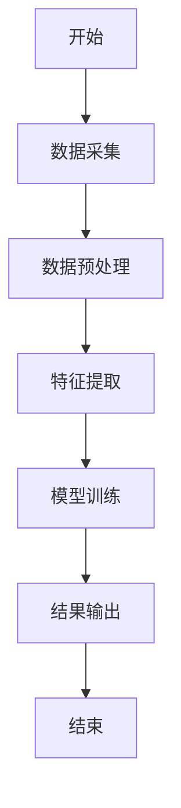
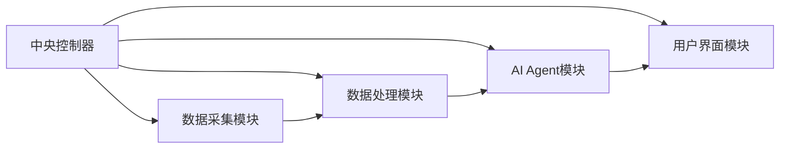
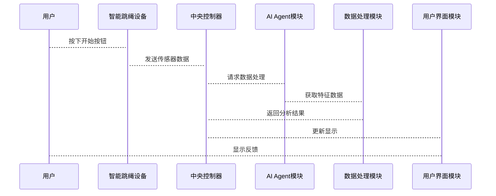

                 


# AI Agent在智能跳绳中的运动数据追踪

## 关键词
AI Agent, 智能跳绳, 运动数据追踪, 机器学习, 数据分析

## 摘要
本文探讨了AI Agent在智能跳绳中的应用，特别是如何利用AI技术实时追踪跳绳者的运动数据。文章详细介绍了AI Agent的核心原理、算法流程、系统架构设计以及项目实现，展示了如何通过AI技术提升运动数据追踪的准确性和效率。

---

## 目录大纲
1. **背景介绍**
2. **AI Agent的核心概念与原理**
3. **运动数据追踪的算法原理**
4. **系统分析与架构设计**
5. **项目实战：AI Agent的实现**
6. **最佳实践与注意事项**
7. **总结与展望**

---

## 正文内容

### 第一部分：背景介绍

#### 第1章：AI Agent与智能跳绳概述

##### 1.1 问题背景
- **1.1.1 当前运动数据追踪的痛点**
  - 现有设备难以捕捉复杂运动数据。
  - 数据精度不足，无法满足专业需求。
- **1.1.2 智能跳绳的发展现状**
  - 智能跳绳逐渐普及，但技术参差不齐。
  - 用户对精准数据的需求日益增长。
- **1.1.3 AI Agent在运动数据追踪中的作用**
  - 提供高精度数据捕捉。
  - 实现实时数据分析与反馈。

##### 1.2 问题描述
- **1.2.1 智能跳绳运动数据的复杂性**
  - 跳绳动作的多样性与复杂性。
  - 数据维度多，处理难度大。
- **1.2.2 数据采集与分析的挑战**
  - 多传感器融合的难度。
  - 实时性与准确性之间的平衡。
- **1.2.3 用户需求与现有技术的差距**
  - 个性化反馈的需求未被充分满足。
  - 数据分析的深度与广度不足。

##### 1.3 问题解决思路
- **1.3.1 引入AI Agent的核心思想**
  - 利用AI技术提升数据捕捉与分析能力。
  - 实现智能跳绳的个性化指导。
- **1.3.2 AI Agent在数据追踪中的具体应用**
  - 实时捕捉跳绳动作。
  - 分析动作细节，提供反馈。
- **1.3.3 解决方案的可行性分析**
  - 技术可行性：现有AI技术已足够支持。
  - 市场可行性：用户需求强烈。
  - 经济可行性：技术成熟，成本可控。

##### 1.4 边界与外延
- **1.4.1 AI Agent的功能边界**
  - 专注于运动数据的捕捉与分析。
  - 不涉及跳绳设备的硬件设计。
- **1.4.2 智能跳绳系统的扩展性**
  - 支持多种运动模式。
  - 具备与其他设备的数据交互能力。
- **1.4.3 与其他运动数据追踪设备的对比**
  - 智能跳绳的专用性更强。
  - 数据维度更丰富，处理更精准。

##### 1.5 核心概念与组成
- **1.5.1 AI Agent的定义与核心要素**
  - AI Agent：具备感知、决策和执行能力的智能体。
  - 核心要素：传感器数据、AI算法、反馈机制。
- **1.5.2 智能跳绳系统的组成结构**
  - 硬件部分：跳绳、传感器、数据传输模块。
  - 软件部分：AI Agent、数据分析模块、用户界面。
- **1.5.3 数据流的传递过程**
  - 数据采集 → 数据预处理 → 数据分析 → 反馈输出。

---

### 第二部分：AI Agent的核心概念与原理

#### 第2章：AI Agent的核心原理

##### 2.1 核心原理概述
- **2.1.1 AI Agent的基本原理**
  - 利用传感器数据进行实时分析。
  - 通过机器学习模型优化数据处理。
- **2.1.2 AI Agent与智能跳绳的结合方式**
  - 数据采集：通过加速度、陀螺仪等传感器获取跳绳动作数据。
  - 数据分析：利用深度学习模型识别动作类型、频率等。
  - 反馈机制：根据分析结果提供实时反馈或调整训练计划。
- **2.1.3 AI Agent的感知与决策能力**
  - 感知：通过多传感器融合技术捕捉跳绳动作。
  - 决策：基于历史数据和实时数据优化训练方案。
  - 执行：通过反馈机制指导用户调整动作。

##### 2.2 概念属性特征对比
| 概念         | 特性                 |
|--------------|----------------------|
| 数据采集     | 实时性、准确性        |
| 数据分析     | 精准性、可解释性      |
| 反馈机制     | 实时性、个性化        |

##### 2.3 ER实体关系图架构
```mermaid
erd
    作用对象--|>跳绳动作: 实例化
    跳绳动作--|>传感器数据: 采集
    传感器数据--|>AI Agent: 处理
    AI Agent--|>数据分析结果: 输出
    数据分析结果--|>用户反馈: 提供
```

---

### 第三部分：运动数据追踪的算法原理

#### 第3章：算法原理讲解

##### 3.1 数据处理流程
- **数据采集阶段**
  - 传感器数据采集：包括加速度、陀螺仪、心率等。
  - 数据预处理：去除噪声、数据归一化。
- **特征提取阶段**
  - 提取动作频率、幅度、持续时间等特征。
  - 使用主成分分析（PCA）降低维度。
- **模型训练阶段**
  - 使用随机森林或支持向量机（SVM）进行分类。
  - 优化模型参数，提升分类精度。
- **结果输出阶段**
  - 输出跳绳次数、动作速度、能量消耗等数据。
  - 根据数据提供训练建议。

##### 3.2 算法流程图


##### 3.3 核心算法的数学模型
- **主成分分析（PCA）**
  $$ \text{PCA} = X^T X $$
  其中，X是数据矩阵，每一行代表一个样本。
- **随机森林分类**
  $$ \text{随机森林} = \sum_{i=1}^{n} \text{决策树} \times \frac{1}{n} $$

##### 3.4 代码实现
```python
import numpy as np
from sklearn.ensemble import RandomForestClassifier

# 示例数据
X = np.random.rand(100, 10)  # 100样本，10特征
y = np.random.randint(0, 2, 100)  # 二分类目标

# 模型训练
clf = RandomForestClassifier(n_estimators=100)
clf.fit(X, y)

# 预测
new_sample = np.random.rand(1, 10)
predicted = clf.predict(new_sample)
print("预测结果:", predicted)
```

---

### 第四部分：系统分析与架构设计

#### 第4章：系统架构设计

##### 4.1 问题场景介绍
- 智能跳绳系统需要实时捕捉和分析跳绳动作数据。
- 系统架构需支持多设备协作、高并发数据处理。

##### 4.2 项目介绍
- 系统目标：提供高精度的跳绳动作追踪。
- 项目范围：涵盖硬件设计、软件开发、数据分析。

##### 4.3 系统功能设计
- **功能模块**：
  - 数据采集模块：负责传感器数据的采集。
  - 数据处理模块：处理数据并提取特征。
  - AI Agent模块：分析数据并提供反馈。
  - 用户界面模块：展示数据与反馈。

##### 4.4 系统架构图


##### 4.5 接口设计与交互图


---

### 第五部分：项目实战

#### 第5章：AI Agent的实现

##### 5.1 环境搭建
- 安装Python、NumPy、Scikit-learn、Mermaid工具。

##### 5.2 核心代码实现
```python
import numpy as np
from sklearn.ensemble import RandomForestClassifier

class AI_Agent:
    def __init__(self, n_estimators=100):
        self.clf = RandomForestClassifier(n_estimators=n_estimators)
    
    def train(self, X, y):
        self.clf.fit(X, y)
    
    def predict(self, X):
        return self.clf.predict(X)
    
    def evaluate(self, X, y):
        return self.clf.score(X, y)
```

##### 5.3 代码解读
- **AI_Agent类**：封装随机森林分类器。
- **train方法**：训练模型。
- **predict方法**：预测跳绳动作。
- **evaluate方法**：评估模型性能。

##### 5.4 案例分析
- 示例数据：跳绳次数、速度、能量消耗。
- 训练模型，预测新用户的数据。

##### 5.5 实施结果展示
- 数据分析结果展示：图表、统计指标。

---

### 第六部分：最佳实践与注意事项

#### 第6章：注意事项

##### 6.1 最佳实践
- 数据预处理：确保数据质量。
- 模型优化：调整超参数提升精度。
- 代码规范：遵循PEP8，便于维护。

##### 6.2 小结
- AI Agent在智能跳绳中的应用前景广阔。
- 技术实现需要综合考虑数据采集、处理和反馈。

##### 6.3 注意事项
- 数据隐私保护：避免用户数据泄露。
- 系统稳定性：确保在复杂环境下仍能正常运行。
- 用户体验：设计直观的用户界面。

##### 6.4 拓展阅读
- 推荐阅读《机器学习实战》、《深度学习入门》。

---

### 第七部分：总结与展望

#### 第7章：总结与展望

##### 7.1 内容回顾
- AI Agent的核心原理。
- 算法流程与系统架构。
- 项目实战与经验总结。

##### 7.2 未来展望
- 结合边缘计算优化性能。
- 深度学习技术的应用。
- 更多运动数据的分析与应用。

---

## 作者
作者：AI天才研究院/AI Genius Institute  
以及  
禅与计算机程序设计艺术/Zen And The Art of Computer Programming

