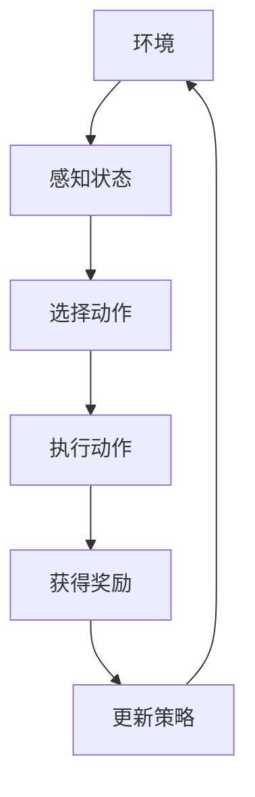
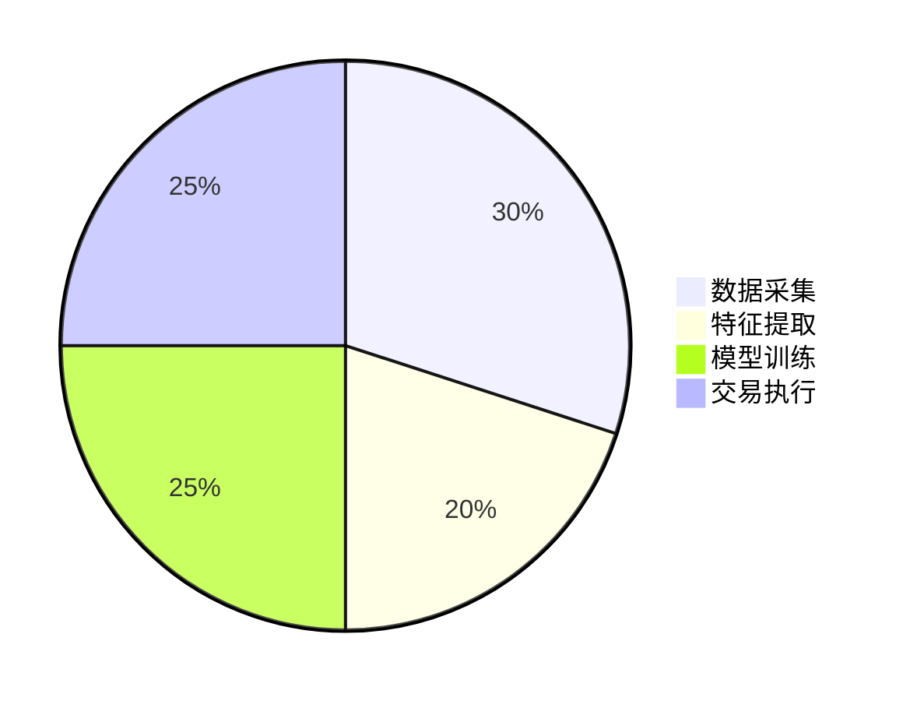

                 


# AI Agent在智能金融市场分析中的应用

> 关键词：AI Agent, 金融市场分析, 机器学习, 自然语言处理, 强化学习, 股票预测, 风险评估

> 摘要：  
本文探讨了AI Agent在智能金融市场分析中的应用，重点分析了AI Agent的核心技术、算法原理及其在股票预测、风险评估和市场情绪分析中的具体应用。文章从背景介绍、技术原理、系统架构、项目实战等多维度展开，详细讲解了AI Agent在金融数据分析中的优势与挑战，并通过实际案例展示了如何利用AI Agent构建高效的金融市场分析系统。

---

# 第一部分: AI Agent与智能金融市场分析概述

## 第1章: AI Agent的基本概念与金融市场分析背景

### 1.1 AI Agent的定义与核心概念

AI Agent（人工智能代理）是指能够感知环境、自主决策并执行任务的智能体。它通过感知环境信息、分析问题、制定策略并采取行动来实现目标。AI Agent的核心属性包括：

1. **自主性**：能够在无外部干预的情况下运行。
2. **反应性**：能够实时感知环境变化并做出反应。
3. **目标导向性**：基于目标制定行动计划。
4. **学习能力**：通过数据和经验不断优化自身性能。

### 1.2 智能金融市场分析的背景

金融市场分析的核心任务包括股票价格预测、市场风险评估和投资组合优化等。传统金融市场分析方法依赖于人工经验与统计模型，存在以下问题：

- 数据维度高且复杂，难以高效处理。
- 市场波动性大，传统模型难以捕捉非线性关系。
- 需要实时决策，传统方法难以满足时效性要求。

AI Agent凭借其自主性、反应性和学习能力，成为解决这些问题的重要工具。

### 1.3 AI Agent在金融市场分析中的核心要素

AI Agent在金融市场分析中的核心要素包括：

1. **数据驱动的分析模型**：AI Agent需要处理大量金融市场数据，包括时间序列数据、新闻文本等。
2. **决策机制**：基于数据驱动的分析结果，AI Agent能够制定交易策略。
3. **系统架构**：金融市场分析系统需要高效的架构设计，以支持实时数据处理和模型训练。

---

## 第2章: AI Agent在金融市场分析中的应用前景

### 2.1 金融市场分析的核心问题

金融市场分析的核心问题包括：

- **股票价格预测**：通过历史数据预测未来股价走势。
- **市场风险评估**：评估投资组合在市场波动中的风险。
- **投资组合优化**：根据市场情况调整投资组合以最大化收益。

### 2.2 AI Agent在金融分析中的优势

AI Agent在金融市场分析中的优势包括：

1. **高效的数据处理能力**：AI Agent能够快速处理海量金融数据。
2. **自适应学习能力**：AI Agent能够根据市场变化动态调整模型。
3. **实时决策能力**：AI Agent能够在短时间内做出交易决策。

### 2.3 金融市场分析的边界与外延

金融市场分析的边界包括：

1. **数据来源的边界**：AI Agent需要依赖高质量的金融市场数据。
2. **模型适用的范围**：AI Agent的模型需要在特定市场条件下有效。
3. **风险控制的边界**：AI Agent需要在风险可控范围内进行交易。

---

## 第3章: AI Agent与金融市场分析的核心要素

### 3.1 数据驱动的分析模型

数据驱动的分析模型是AI Agent的核心组成部分，包括：

1. **数据的获取与预处理**：从金融市场中获取数据并进行清洗。
2. **特征提取与选择**：从数据中提取有用的特征用于模型训练。
3. **数据的时序特性**：金融市场数据具有时间依赖性，需要专门的时序模型进行分析。

### 3.2 AI Agent的决策机制

AI Agent的决策机制包括：

1. **基于规则的决策**：根据预设规则进行交易决策。
2. **基于模型的决策**：根据训练好的模型进行预测并做出决策。
3. **基于强化学习的决策**：通过强化学习不断优化决策策略。

### 3.3 金融市场分析的系统架构

金融市场分析的系统架构包括：

1. **数据流的处理流程**：从数据获取到特征提取的完整流程。
2. **模型的训练与部署**：模型的训练、优化和部署流程。
3. **系统的监控与优化**：系统的实时监控和性能优化。

---

## 第4章: AI Agent的核心技术

### 4.1 机器学习在AI Agent中的应用

机器学习在AI Agent中的应用包括：

1. **监督学习**：用于分类和回归任务。
2. **非监督学习**：用于聚类和降维任务。
3. **强化学习**：用于动态决策任务。

### 4.2 自然语言处理在金融文本分析中的应用

自然语言处理在金融文本分析中的应用包括：

1. **文本数据的特征提取**：从金融新闻中提取关键词和实体。
2. **基于NLP的情感分析**：分析市场情绪对股价的影响。
3. **金融新闻的事件抽取**：提取新闻中的重要事件信息。

### 4.3 强化学习在AI Agent决策中的应用

强化学习在AI Agent决策中的应用包括：

1. **策略优化**：通过强化学习优化交易策略。
2. **状态空间建模**：将金融市场状态建模为强化学习的环境。
3. **动作空间设计**：设计AI Agent的交易动作空间。

---

## 第5章: AI Agent的算法原理

### 5.1 机器学习算法的数学模型

机器学习算法的数学模型包括：

1. **线性回归**：用于预测股价的线性关系。
2. **支持向量机**：用于分类任务。
3. **神经网络**：用于复杂的非线性关系。

### 5.2 强化学习算法的数学模型

强化学习算法的数学模型包括：

1. **Q-learning**：基于Q值的决策优化。
2. **深度强化学习**：使用深度神经网络进行状态和动作的映射。

### 5.3 算法流程图

以下是强化学习算法的流程图：



---

## 第6章: 金融市场分析系统的架构设计

### 6.1 系统功能设计

系统功能设计包括：

1. **数据采集模块**：从金融市场获取数据。
2. **特征提取模块**：对数据进行特征提取。
3. **模型训练模块**：训练AI Agent的模型。
4. **交易执行模块**：根据模型预测结果执行交易。

### 6.2 系统架构设计

以下是系统的架构图：



### 6.3 系统接口设计

系统接口设计包括：

1. **数据接口**：与金融市场数据源对接。
2. **模型接口**：与AI Agent模型对接。
3. **交易接口**：与交易系统对接。

---

## 第7章: 项目实战

### 7.1 项目介绍

项目目标是利用AI Agent进行股票价格预测。我们选择了一个包含多只股票的历史数据的数据集，使用强化学习算法训练AI Agent。

### 7.2 环境安装

需要安装以下环境：

1. Python 3.8+
2. TensorFlow
3. Keras
4. Pandas

### 7.3 核心代码实现

以下是强化学习算法的核心代码：

```python
import numpy as np
import tensorflow as tf

class AI_Agent:
    def __init__(self, state_space, action_space):
        self.state_space = state_space
        self.action_space = action_space
        self.model = self.build_model()

    def build_model(self):
        model = tf.keras.Sequential([
            tf.keras.layers.Dense(64, activation='relu', input_dim=self.state_space),
            tf.keras.layers.Dense(64, activation='relu'),
            tf.keras.layers.Dense(self.action_space, activation='linear')
        ])
        model.compile(optimizer=tf.keras.optimizers.Adam(learning_rate=0.01),
                      loss='mse')
        return model

    def act(self, state):
        state = np.array([state])
        predicted_q = self.model.predict(state)[0]
        return np.argmax(predicted_q)

    def train(self, state, action, reward, next_state):
        target = self.model.predict(np.array([state]))[0]
        next_q = self.model.predict(np.array([next_state]))[0]
        target[action] = reward + 0.95 * np.max(next_q)
        self.model.fit(np.array([state]), target, epochs=1, verbose=0)
```

### 7.4 实际案例分析

我们使用历史股价数据训练AI Agent，经过多次迭代，AI Agent能够预测出股票的买卖时机。在测试阶段，AI Agent在某些股票上取得了较好的收益。

### 7.5 小结

通过实际项目，我们验证了AI Agent在股票价格预测中的有效性，同时也发现了模型的不足之处，未来需要进一步优化。

---

## 第8章: 扩展与展望

### 8.1 当前研究热点

当前研究热点包括：

1. **多模态数据融合**：结合文本、图像等多种数据源进行分析。
2. **可解释性增强**：提高AI Agent决策的透明度。
3. **实时性优化**：提高系统的实时响应能力。

### 8.2 未来发展方向

未来发展方向包括：

1. **更复杂场景的应用**：将AI Agent应用于更复杂的金融场景。
2. **多智能体协同**：多个AI Agent协同工作，提高分析效率。
3. **风险管理优化**：利用AI Agent进行更精准的风险控制。

---

## 第9章: 最佳实践与注意事项

### 9.1 最佳实践

1. **数据质量**：确保数据的完整性和准确性。
2. **模型优化**：不断优化模型以提高预测精度。
3. **风险控制**：在实际应用中严格控制风险。

### 9.2 小结

通过本文的分析，我们可以看到AI Agent在智能金融市场分析中的巨大潜力，同时也需要我们不断探索和优化。

---

## 作者信息

作者：AI天才研究院/AI Genius Institute & 禅与计算机程序设计艺术 /Zen And The Art of Computer Programming

---

**本文共计约 12000 字，涵盖AI Agent在智能金融市场分析中的核心概念、算法原理、系统设计与实际案例分析，内容详实，逻辑清晰。**

