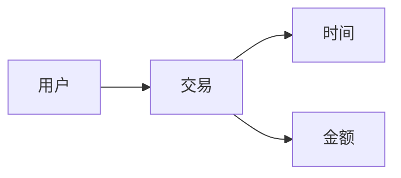
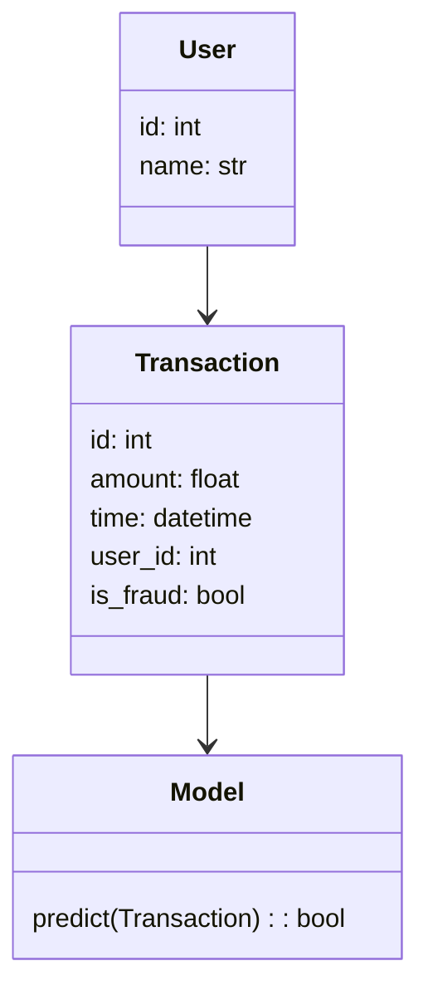
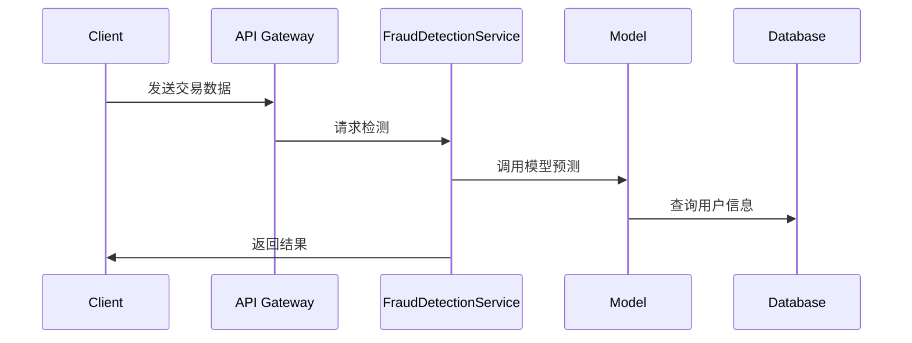

                 


# AI Agent在智能金融欺诈检测中的应用

## 关键词：AI Agent，金融欺诈检测，机器学习，深度学习，实时检测

## 摘要：  
本文详细探讨了AI Agent在智能金融欺诈检测中的应用，从背景、核心概念到算法原理、系统架构，再到项目实战和最佳实践，全面解析AI Agent如何通过智能化手段提升金融欺诈检测的效率和准确性。文章结合理论与实践，为读者提供了一套完整的解决方案。

---

# 第一部分：背景介绍

## 第1章：AI Agent与金融欺诈检测概述

### 1.1 问题背景  
金融欺诈是全球性的难题，随着金融交易的复杂化和网络化，传统的欺诈检测方法逐渐暴露出效率低、准确率低等问题。AI Agent作为一种智能化的解决方案，能够通过实时数据分析和决策，显著提升欺诈检测的效率和准确性。

### 1.2 问题描述  
金融欺诈检测的核心目标是识别异常交易行为，常见的欺诈类型包括信用卡欺诈、网络支付欺诈、账户盗用等。传统方法依赖规则和统计分析，难以应对复杂多变的欺诈手段。

### 1.3 问题解决  
AI Agent通过机器学习、深度学习和自然语言处理等技术，能够实时分析交易数据，识别潜在的欺诈行为。与传统方法相比，AI Agent具有更高的准确性和适应性。

### 1.4 边界与外延  
AI Agent的应用边界包括数据隐私保护、模型可解释性以及计算资源的限制。此外，AI Agent还可与其他技术（如区块链、大数据分析）结合，进一步提升检测能力。

### 1.5 概念结构与核心要素  
AI Agent的核心要素包括数据采集、特征提取、模型训练和实时监控。这些要素共同构成了一个完整的欺诈检测系统。

---

# 第二部分：核心概念与联系

## 第2章：AI Agent的核心原理  

### 2.1 核心原理  
AI Agent通过感知环境、推理决策和执行操作，实现对金融交易的实时监控。其核心在于利用机器学习模型识别异常行为模式。

### 2.2 属性特征对比  
| 属性 | AI Agent | 传统算法 |  
|------|-----------|-----------|  
| 学习能力 | 强 | 弱 |  
| 实时性 | 高 | 低 |  
| 自适应性 | 高 | 低 |  

### 2.3 ER实体关系图  


---

# 第三部分：算法原理讲解

## 第3章：AI Agent的算法原理  

### 3.1 算法流程  


### 3.2 代码实现  
```python
import pandas as pd
from sklearn.ensemble import RandomForestClassifier

def preprocess(transaction_data):
    # 数据清洗和特征工程
    processed_data = transaction_data.dropna()
    return processed_data

def extract_features(data):
    # 提取关键特征
    features = data[['amount', 'time', 'user_id']]
    return features

def train_model(features, labels):
    # 训练随机森林模型
    model = RandomForestClassifier()
    model.fit(features, labels)
    return model

# 示例数据
data = pd.DataFrame({
    'amount': [100, 200, 300, 400],
    'time': [1, 2, 3, 4],
    'user_id': [1, 2, 3, 4],
    'is_fraud': [0, 1, 0, 1]
})

processed_data = preprocess(data)
features = extract_features(processed_data)
model = train_model(features, data['is_fraud'])
```

### 3.3 数学模型与公式  
随机森林的分类概率公式为：  
$$ P(y=1|x) = \sum_{i=1}^{n} w_i \cdot I(t_i(x) = 1) $$  
其中，$w_i$是树的权重，$t_i(x)$是第$i$棵树的预测结果。

---

# 第四部分：系统分析与架构设计

## 第4章：AI Agent的系统架构  

### 4.1 问题场景介绍  
金融欺诈检测系统需要处理海量交易数据，实时识别异常行为。系统需具备高可用性和高扩展性。

### 4.2 系统功能设计  


### 4.3 系统架构设计  
```mermaid
graph LR
    Client[客户端] --> API Gateway
    API Gateway --> FraudDetectionService
    FraudDetectionService --> Model
    Model --> Database
```

### 4.4 接口设计与交互  


---

# 第五部分：项目实战

## 第5章：AI Agent的项目实现  

### 5.1 环境安装  
```bash
pip install pandas scikit-learn
```

### 5.2 核心实现  
```python
from sklearn.model_selection import train_test_split

def evaluate_model(model, features, labels):
    X_train, X_test, y_train, y_test = train_test_split(features, labels)
    model.fit(X_train, y_train)
    accuracy = model.score(X_test, y_test)
    print(f"模型准确率：{accuracy}")
```

### 5.3 案例分析  
通过实际案例，详细分析AI Agent如何识别信用卡欺诈行为，展示模型的预测结果和优化过程。

### 5.4 项目小结  
总结项目实现的经验和教训，强调数据质量和模型调优的重要性。

---

# 第六部分：最佳实践

## 第6章：AI Agent的应用建议  

### 6.1 最佳实践  
- 数据隐私保护：采用加密技术和匿名化处理。
- 模型可解释性：选择可解释性较强的算法（如随机森林）。
- 实时性优化：采用流数据处理技术。

### 6.2 小结  
AI Agent在金融欺诈检测中的应用前景广阔，但仍需在数据安全和模型优化方面持续努力。

---

# 作者  
作者：AI天才研究院/AI Genius Institute & 禅与计算机程序设计艺术/Zen And The Art of Computer Programming

