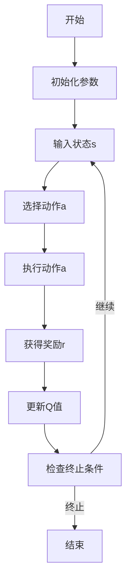
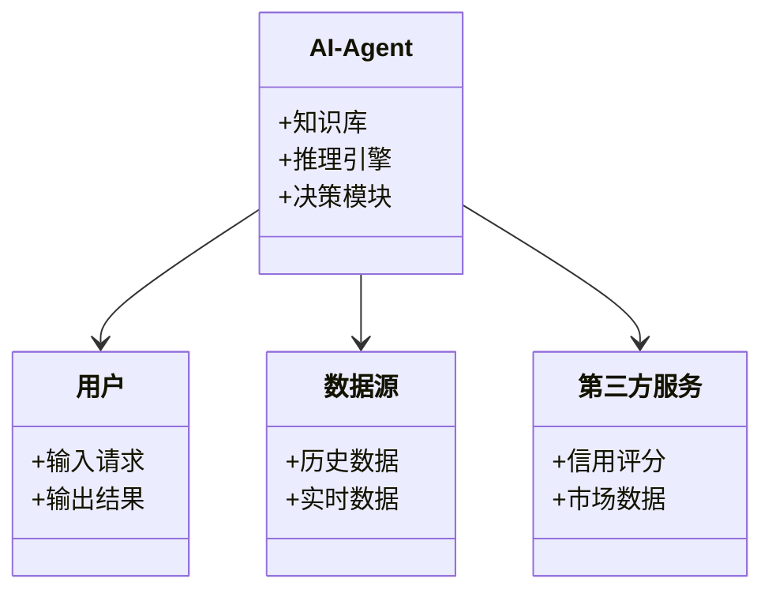
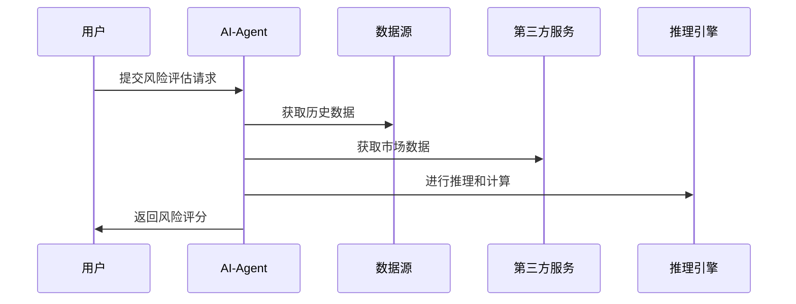

                 


# AI Agent在智能金融风险评估中的应用

> 关键词：AI Agent, 金融风险评估, 强化学习, 多智能体协同, 知识图谱, 系统架构设计

> 摘要：本文深入探讨了AI Agent在智能金融风险评估中的应用，结合了AI Agent的基本概念、算法原理、系统架构设计和实际案例分析，详细介绍了如何利用AI Agent提高金融风险评估的准确性和实时性。文章从理论到实践，全面解析了AI Agent在金融领域的优势与挑战，为读者提供了清晰的思路和实践指导。

---

# 目录

## 第1章: 引言

### 1.1 AI Agent的基本概念
- 1.1.1 AI Agent的定义与特征
  - 自主性、反应性、主动性
  - 与传统算法的对比

### 1.2 金融风险评估的重要性
- 1.2.1 金融风险的定义与分类
  - 市场风险、信用风险、操作风险
- 1.2.2 传统金融风险评估方法的局限性
  - 人为误差、计算复杂度高、实时性差

### 1.3 AI Agent在金融风险评估中的应用价值
- 1.3.1 提高评估准确性与实时性
- 1.3.2 降低人工干预的成本
- 1.3.3 支持复杂场景下的决策优化

---

## 第2章: AI Agent的核心概念与原理

### 2.1 AI Agent的核心概念
- 2.1.1 知识表示与推理机制
  - 逻辑推理、语义理解
- 2.1.2 多智能体协同与博弈论基础
  - 通信机制、协作策略
- 2.1.3 强化学习与目标驱动的决策过程
  - 奖励机制、动作空间

### 2.2 实体关系图（ER图）架构
```mermaid
er
actor(AI Agent, [用户, 数据源, 第三方服务])
```

### 2.3 核心概念对比表
| 概念 | 特征 |
|------|------|
| 知识表示 | 逻辑推理、语义理解 |
| 多智能体协同 | 通信机制、协作策略 |
| 强化学习 | 奖励机制、动作空间 |

---

## 第3章: AI Agent的算法原理与数学模型

### 3.1 强化学习算法原理
- 3.1.1 基于强化学习的决策过程
  - 状态、动作、奖励的关系
- 3.1.2 数学模型
  $$ V(s) = \max_a Q(s,a) $$
  其中，$s$表示状态，$a$表示动作。

### 3.2 知识图谱推理机制
- 3.2.1 基于知识图谱的推理过程
  - 实体识别、关系抽取、语义理解
- 3.2.2 表示学习模型
  $$ entity\_embedding = G(neighbor\_embedding) $$
  其中，$G$表示图神经网络。

### 3.3 算法流程图（Mermaid）


---

## 第4章: 系统架构设计与实现

### 4.1 系统功能设计
- 4.1.1 领域模型设计（Mermaid类图）


### 4.2 系统架构设计（Mermaid架构图）
```mermaid
context diagram
客户 --> 中间件
客户 <---> 数据库
中间件 --> 服务1
中间件 --> 服务2
中间件 --> 服务3
```

### 4.3 接口设计与交互流程
- 4.3.1 API接口设计
  - 输入接口：风险评估请求
  - 输出接口：风险评分结果
- 4.3.2 交互流程（Mermaid序列图）


---

## 第5章: 项目实战与案例分析

### 5.1 环境安装与配置
- 安装Python、TensorFlow、Keras、Scikit-learn等工具
- 安装Jupyter Notebook用于实验

### 5.2 核心代码实现
#### 5.2.1 强化学习算法实现
```python
import numpy as np

class AI-Agent:
    def __init__(self, state_space, action_space):
        self.state_space = state_space
        self.action_space = action_space
        self.Q = np.zeros((state_space, action_space))

    def choose_action(self, state):
        # 探索与利用策略
        if np.random.random() < 0.1:
            return np.random.randint(self.action_space)
        else:
            return np.argmax(self.Q[state])

    def update_Q(self, state, action, reward):
        self.Q[state, action] = self.Q[state, action] * 0.8 + reward * 0.2
```

#### 5.2.2 知识图谱推理实现
```python
from kg import KnowledgeGraph

kg = KnowledgeGraph()
entities = kg.get_entities()
relations = kg.get_relations()
```

### 5.3 案例分析
- 案例：股票市场风险评估
  - 数据输入：历史股价、市场指数、新闻情绪
  - AI Agent推理：预测股价波动风险
  - 结果输出：风险评分（低、中、高）

### 5.4 代码应用解读
- 解释代码实现的每一步
- 分析AI Agent如何通过强化学习优化风险评估过程

---

## 第6章: 总结与展望

### 6.1 总结
- AI Agent在金融风险评估中的优势
  - 高效性、准确性、实时性
- 实际应用中的挑战
  - 数据隐私、模型解释性、计算资源需求

### 6.2 展望
- 未来发展方向
  - 更复杂的多智能体协同
  - 更强大的知识图谱推理能力
  - 更智能的自适应学习机制

### 6.3 最佳实践Tips
- 数据预处理的重要性
- 模型调参的注意事项
- 实际应用中的伦理问题

---

## 作者：AI天才研究院 & 禅与计算机程序设计艺术

---

# 附录

### 附录A: 常见问题解答
- Q1: AI Agent在金融领域还有哪些其他应用？
- Q2: 如何保证AI Agent的决策透明性？
- Q3: 强化学习在金融中的优势是什么？

### 附录B: 参考文献
- [1] DeepMind. "Deep Reinforcement Learning from Human Preferences." arXiv, 2018.
- [2] Google Research. "Graph Neural Networks: A Review of Methods, Applications, and Open Challenges." arXiv, 2020.

---

希望这个目录大纲能满足您的需求，涵盖从理论到实践的各个方面，结构清晰，逻辑严谨。

