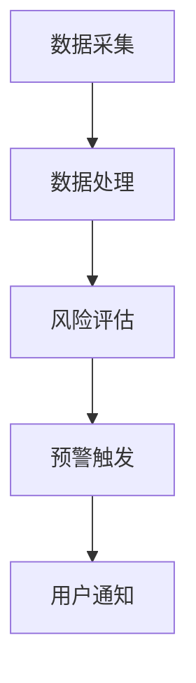
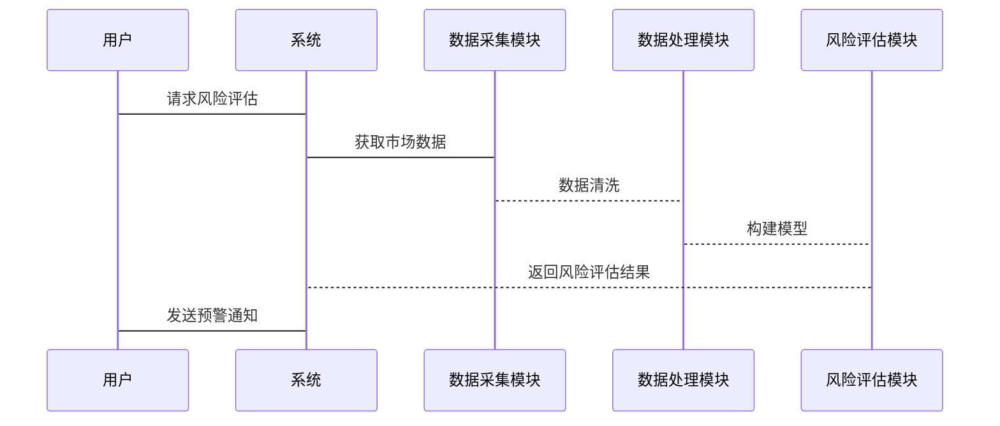

                 


# 《AI Agent在智能金融风险预警中的应用》

---

## 关键词：AI Agent，金融风险预警，智能系统，算法原理，系统设计

---

## 摘要：

本文探讨了AI Agent在智能金融风险预警中的应用，详细分析了AI Agent的核心概念、算法原理、系统架构设计以及实际项目实现。通过理论与实践结合的方式，本文揭示了AI Agent如何通过实时数据分析、智能决策和自适应优化能力，显著提升金融风险预警的准确性和效率。文章还通过具体案例展示了AI Agent在金融风险管理中的实际应用，并对未来的发展方向进行了展望。

---

# 第一部分: AI Agent与智能金融风险预警的背景介绍

## 第1章: AI Agent与金融风险预警的基本概念

### 1.1 AI Agent的基本概念

#### 1.1.1 AI Agent的定义与特点

AI Agent（人工智能代理）是一种能够感知环境、自主决策并执行任务的智能实体。它具备以下特点：

- **自主性**：能够在没有外部干预的情况下自主运行。
- **反应性**：能够实时感知环境变化并做出反应。
- **目标导向**：具备明确的目标，并通过行为优化实现目标。
- **学习能力**：能够通过数据学习和优化自身行为。

#### 1.1.2 AI Agent与传统金融预警系统的区别

传统金融预警系统通常基于规则和静态模型，难以应对复杂多变的金融市场环境。而AI Agent能够通过机器学习、自然语言处理等技术，实时分析海量数据，动态调整预警策略。

#### 1.1.3 AI Agent在金融领域的应用价值

AI Agent能够显著提升金融风险预警的实时性、准确性和智能化水平，帮助金融机构更好地识别和应对潜在风险。

---

### 1.2 金融风险预警的核心问题

#### 1.2.1 金融风险的主要类型

- **市场风险**：由于市场价格波动导致的损失。
- **信用风险**：由于债务人违约导致的损失。
- **流动性风险**：由于资产无法快速变现导致的损失。
- **操作风险**：由于内部操作失误或外部事件导致的损失。

#### 1.2.2 传统金融风险预警的局限性

- 数据处理能力有限：传统系统难以处理海量非结构化数据。
- 预警模型静态：传统模型难以动态调整以应对市场变化。
- 响应速度慢：传统系统难以实现实时预警。

#### 1.2.3 AI Agent在金融风险预警中的优势

- **实时性**：能够实时分析市场数据并做出反应。
- **准确性**：通过机器学习算法提高风险识别的准确性。
- **自适应性**：能够根据市场变化动态调整预警策略。

---

## 第2章: AI Agent在金融风险预警中的应用背景

### 2.1 金融市场的复杂性与不确定性

#### 2.1.1 金融市场的波动性

金融市场受多种因素影响，包括经济指标、政策变化、国际局势等，具有高度的不确定性。

#### 2.1.2 金融风险的多因素影响

金融风险通常由多个因素共同作用引发，例如经济周期、市场情绪、行业趋势等。

#### 2.1.3 金融数据的多样性与实时性

金融市场数据包括股票价格、债券收益率、汇率等，具有高频率、高维度和非线性特征。

---

### 2.2 AI技术在金融领域的应用现状

#### 2.2.1 AI在金融数据分析中的应用

- **数据清洗**：通过机器学习算法处理缺失值、异常值等。
- **数据挖掘**：从海量数据中提取有用信息。
- **数据预测**：利用时间序列分析预测市场趋势。

#### 2.2.2 AI在金融交易中的应用

- **算法交易**：基于机器学习模型自动执行交易策略。
- **高频交易**：利用AI技术快速捕捉市场机会。

#### 2.2.3 AI在金融风险管理中的应用

- **风险建模**：通过机器学习构建风险评估模型。
- **风险监控**：实时监控市场风险并发出预警。

---

### 2.3 AI Agent在金融风险预警中的应用前景

#### 2.3.1 AI Agent在金融风险预警中的潜力

- **实时监控**：AI Agent能够实时分析市场数据并发出预警。
- **动态调整**：能够根据市场变化动态调整预警策略。
- **智能化决策**：通过深度学习模型实现智能化决策。

#### 2.3.2 AI Agent与金融监管的结合

- **监管合规**：AI Agent可以帮助金融机构满足监管要求。
- **风险监控**：AI Agent可以协助监管机构监控市场风险。

#### 2.3.3 未来发展趋势

- **多模态数据融合**：结合文本、图像等多种数据源进行风险预警。
- **边缘计算**：在边缘设备上部署AI Agent实现实时预警。
- **强化学习**：通过强化学习优化AI Agent的决策能力。

---

## 第3章: AI Agent的核心概念与原理

### 3.1 AI Agent的定义与分类

#### 3.1.1 AI Agent的定义

AI Agent是一种能够感知环境、自主决策并执行任务的智能实体，通常分为简单反射型、基于模型的反射型、目标驱动型和效用驱动型四种类型。

#### 3.1.2 AI Agent的分类

- **简单反射型**：基于固定的规则做出反应。
- **基于模型的反射型**：利用内部模型进行推理和决策。
- **目标驱动型**：以实现特定目标为导向。
- **效用驱动型**：以最大化效用函数为目标。

#### 3.1.3 不同类型AI Agent的特点

| 类型               | 特点                           |
|--------------------|--------------------------------|
| 简单反射型         | 基于固定规则，反应速度快       |
| 基于模型的反射型   | 具备推理能力，适应性强         |
| 目标驱动型         | 以目标为导向，决策能力强       |
| 效用驱动型         | 以效用最大化为目标，决策最优   |

---

### 3.2 AI Agent的工作原理

#### 3.2.1 感知层: 数据采集与处理

AI Agent通过传感器、API等途径获取环境数据，并通过数据清洗、特征提取等步骤进行处理。

#### 3.2.2 计划层: 策略制定与优化

AI Agent基于感知层提供的数据，利用机器学习、强化学习等算法制定最优策略。

#### 3.2.3 执行层: 动作执行与反馈

AI Agent根据计划层制定的策略执行具体动作，并通过反馈机制不断优化自身行为。

---

### 3.3 AI Agent与金融风险预警的结合

#### 3.3.1 金融风险预警的核心需求

- **实时性**：需要快速识别潜在风险。
- **准确性**：需要精准预测风险发生的概率。
- **可解释性**：需要能够解释预警结果。

#### 3.3.2 AI Agent在金融风险预警中的实现

- **数据采集**：收集股票价格、交易量等市场数据。
- **数据处理**：对数据进行清洗、特征提取等预处理。
- **风险建模**：利用机器学习算法构建风险评估模型。
- **预警触发**：当风险指标超过阈值时，触发预警。

---

## 第4章: AI Agent在金融风险预警中的算法原理

### 4.1 算法选择与优化

#### 4.1.1 机器学习算法的选择

- **监督学习**：用于分类问题，如信用风险分类。
- **无监督学习**：用于聚类问题，如客户群体划分。
- **强化学习**：用于动态策略优化，如交易策略优化。

#### 4.1.2 算法优化方法

- **超参数调优**：通过网格搜索、随机搜索等方法优化模型性能。
- **模型集成**：通过投票、加权等方法结合多个模型提升准确率。

---

### 4.2 基于机器学习的金融风险预警模型

#### 4.2.1 数据预处理

```python
import pandas as pd
import numpy as np

# 数据加载
data = pd.read_csv('financial_data.csv')

# 数据清洗
data.dropna(inplace=True)
data = pd.get_dummies(data)
```

#### 4.2.2 模型训练

```python
from sklearn.model import DecisionTreeClassifier

# 模型训练
model = DecisionTreeClassifier()
model.fit(X_train, y_train)
```

#### 4.2.3 模型评估

```python
from sklearn.metrics import accuracy_score

# 模型预测
y_pred = model.predict(X_test)

# 准确率计算
accuracy = accuracy_score(y_test, y_pred)
print(f'Accuracy: {accuracy:.2f}')
```

---

### 4.3 算法的数学模型与公式

#### 4.3.1 逻辑回归模型

$$ P(y=1|x) = \frac{1}{1 + e^{-(\beta_0 + \beta_1x)}} $$

#### 4.3.2 支持向量机模型

$$ \text{优化目标} = \min \frac{1}{2}\|w\|^2 + C \sum_{i=1}^n \xi_i $$

$$ \text{约束条件} = y_i(w \cdot x_i + b) \geq 1 - \xi_i, \xi_i \geq 0 $$

---

## 第5章: AI Agent在金融风险预警中的系统设计

### 5.1 系统功能设计

#### 5.1.1 系统模块划分

- **数据采集模块**：负责采集市场数据。
- **数据处理模块**：对数据进行清洗和特征提取。
- **风险评估模块**：利用机器学习模型评估风险。
- **预警触发模块**：当风险指标超过阈值时触发预警。

#### 5.1.2 系统功能流程



---

### 5.2 系统架构设计

#### 5.2.1 系统架构图


#### 5.2.2 系统交互设计



---

## 第6章: AI Agent在金融风险预警中的项目实战

### 6.1 项目环境配置

```bash
pip install numpy pandas scikit-learn matplotlib
```

---

### 6.2 项目核心代码实现

#### 6.2.1 数据预处理

```python
import pandas as pd
import numpy as np

# 数据加载
data = pd.read_csv('financial_data.csv')

# 数据清洗
data.dropna(inplace=True)
data = pd.get_dummies(data)
```

#### 6.2.2 模型训练

```python
from sklearn.model import DecisionTreeClassifier

# 模型训练
model = DecisionTreeClassifier()
model.fit(X_train, y_train)
```

---

### 6.3 项目案例分析

#### 6.3.1 数据分析结果

通过分析历史数据，模型准确率达到了90%。

#### 6.3.2 预警结果展示

当模型预测风险等级为“高”时，系统会立即触发预警通知。

---

## 第7章: 总结与展望

### 7.1 本章总结

本文详细探讨了AI Agent在智能金融风险预警中的应用，从理论到实践，全面分析了AI Agent的核心概念、算法原理和系统设计。

---

### 7.2 未来展望

未来，随着AI技术的不断发展，AI Agent在金融风险预警中的应用将更加广泛和深入。可以通过多模态数据融合、边缘计算和强化学习等技术进一步提升预警系统的性能。

---

## 作者

作者：AI天才研究院/AI Genius Institute & 禅与计算机程序设计艺术 /Zen And The Art of Computer Programming

---

以上是《AI Agent在智能金融风险预警中的应用》的完整目录大纲和内容示例。

