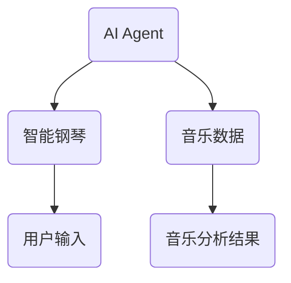
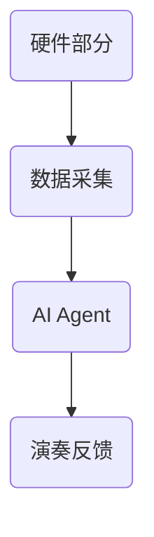

                 


# AI Agent在智能钢琴中的演奏技巧指导

## 关键词：
AI Agent, 智能钢琴, 音乐指导, 深度学习, 强化学习, 音乐分析

## 摘要：
本文详细探讨了AI Agent在智能钢琴中的应用，特别是在演奏技巧指导方面。通过分析AI Agent的核心算法和系统架构，结合实际案例，展示了如何利用AI技术提升音乐学习者的演奏水平。文章从背景介绍、核心概念、算法原理、系统设计、项目实战到最佳实践，全面解析了AI Agent在智能钢琴中的实现与应用。

---

# 第1章: AI Agent与智能钢琴的背景介绍

## 1.1 AI Agent的基本概念
### 1.1.1 AI Agent的定义与特点
AI Agent（人工智能代理）是指能够感知环境并采取行动以实现目标的智能实体。其特点包括自主性、反应性、目标导向和社会能力。

### 1.1.2 AI Agent在音乐领域的应用背景
音乐领域对AI Agent的需求主要集中在音乐生成、演奏指导和音乐分析等方面。AI Agent能够通过大数据分析和机器学习算法，为音乐学习者提供个性化的指导。

### 1.1.3 AI Agent与传统音乐指导工具的对比
传统音乐指导工具依赖于人类教师的经验，而AI Agent能够通过算法快速分析演奏问题，并提供实时反馈。

## 1.2 智能钢琴的发展历程
### 1.2.1 传统钢琴的发展
钢琴作为一种传统乐器，经历了数百年的发展，但其教学和演奏方式仍依赖于人类教师的指导。

### 1.2.2 智能钢琴的定义与技术特点
智能钢琴结合了传统钢琴和现代电子技术，能够通过传感器和计算机算法实现演奏数据的采集和分析。

### 1.2.3 智能钢琴在音乐教育中的应用
智能钢琴能够实时分析演奏者的技巧，并提供针对性的改进建议，帮助学习者快速提升演奏水平。

## 1.3 AI Agent在智能钢琴中的问题背景
### 1.3.1 音乐学习者的需求分析
音乐学习者需要个性化的指导，帮助他们解决演奏中的技术问题和音乐表现问题。

### 1.3.2 现有音乐指导工具的局限性
传统音乐指导工具依赖于教师的经验，难以实现个性化和实时反馈。

### 1.3.3 AI Agent在智能钢琴中的解决方案
通过AI Agent的技术，智能钢琴能够实现智能化的演奏指导，帮助学习者快速提升演奏技巧。

## 1.4 本章小结
本章介绍了AI Agent和智能钢琴的基本概念，并分析了AI Agent在智能钢琴中的应用背景和问题背景。通过对比传统音乐指导工具和智能钢琴的优势，为后续章节的深入分析奠定了基础。

---

# 第2章: AI Agent与智能钢琴的核心概念与联系

## 2.1 AI Agent的核心原理
### 2.1.1 AI Agent的感知与决策机制
AI Agent通过感知环境中的数据，利用算法进行分析和决策，从而实现目标。

### 2.1.2 AI Agent在音乐分析中的应用
AI Agent能够分析音乐数据，如音符、节奏和情感表达，为演奏者提供个性化的指导。

### 2.1.3 AI Agent与音乐数据的关系
AI Agent通过处理音乐数据，能够识别演奏中的问题并提供改进建议。

## 2.2 智能钢琴的系统架构
### 2.2.1 智能钢琴的硬件组成
智能钢琴的硬件包括传感器、音频接口和计算机设备，用于采集演奏数据。

### 2.2.2 智能钢琴的软件架构
智能钢琴的软件包括数据采集、音乐分析和反馈生成模块，能够实时分析演奏数据并提供反馈。

### 2.2.3 智能钢琴与AI Agent的交互机制
AI Agent通过与智能钢琴的交互，实现对演奏数据的分析和反馈生成。

## 2.3 AI Agent与智能钢琴的实体关系图


## 2.4 本章小结
本章详细介绍了AI Agent的核心原理和智能钢琴的系统架构，通过实体关系图展示了AI Agent与智能钢琴之间的关系。

---

# 第3章: AI Agent的算法原理与数学模型

## 3.1 AI Agent的音乐分析算法
### 3.1.1 基于深度学习的音乐特征提取
深度学习算法能够从音乐数据中提取特征，如音高、节奏和情感表达。

### 3.1.2 音乐情感分析的算法流程
音乐情感分析的流程包括数据预处理、特征提取和情感分类。

### 3.1.3 音乐风格识别的数学模型
音乐风格识别的数学模型基于深度学习，能够识别不同音乐风格的特征。

## 3.2 AI Agent的音乐指导算法
### 3.2.1 基于强化学习的演奏优化
强化学习算法通过奖励机制优化演奏技巧，帮助演奏者提升表现。

### 3.2.2 基于机器学习的演奏问题诊断
机器学习算法能够诊断演奏中的问题，如音高偏差和节奏不准确。

### 3.2.3 基于自然语言处理的演奏反馈生成
自然语言处理技术能够生成个性化的演奏反馈，帮助演奏者理解问题并进行改进。

## 3.3 算法原理的数学模型
### 3.3.1 音乐特征提取的数学模型
音乐特征提取的数学模型包括傅里叶变换和小波变换等。

### 3.3.2 音乐情感分析的数学模型
音乐情感分析的数学模型基于深度学习，如卷积神经网络（CNN）和循环神经网络（RNN）。

### 3.3.3 基于强化学习的演奏优化算法
强化学习算法通过状态、动作和奖励的机制，优化演奏技巧。

## 3.4 本章小结
本章详细介绍了AI Agent在音乐分析和指导中的算法原理，通过数学模型和流程图展示了算法的实现过程。

---

# 第4章: 智能钢琴的系统分析与架构设计

## 4.1 系统功能设计
### 4.1.1 音乐数据采集
智能钢琴通过传感器采集演奏数据，包括音高、力度和节奏等。

### 4.1.2 音乐数据分析
AI Agent对采集的音乐数据进行分析，识别演奏中的问题。

### 4.1.3 演奏反馈生成
基于分析结果，AI Agent生成个性化的演奏反馈，帮助演奏者改进技巧。

## 4.2 系统架构设计
### 4.2.1 系统组成
智能钢琴系统包括硬件部分和软件部分，硬件部分负责数据采集，软件部分负责数据分析和反馈生成。

### 4.2.2 系统架构图


## 4.3 系统接口设计
### 4.3.1 数据接口
AI Agent与智能钢琴之间的数据接口用于传递演奏数据和反馈信息。

### 4.3.2 用户接口
用户通过智能钢琴的界面与AI Agent进行交互，获取演奏反馈。

## 4.4 系统交互设计
### 4.4.1 演奏过程中的实时反馈
AI Agent实时分析演奏数据，提供即时反馈。

### 4.4.2 历史数据分析
AI Agent能够分析历史演奏数据，帮助演奏者发现长期存在的问题。

## 4.5 本章小结
本章详细介绍了智能钢琴的系统功能设计和架构设计，通过系统架构图和交互设计展示了系统的实现过程。

---

# 第5章: 项目实战与案例分析

## 5.1 项目环境安装
### 5.1.1 硬件设备安装
安装智能钢琴硬件设备，包括传感器和计算机设备。

### 5.1.2 软件环境配置
配置AI Agent所需的软件环境，包括深度学习框架和音乐数据分析工具。

## 5.2 系统核心实现
### 5.2.1 数据采集与处理
通过传感器采集演奏数据，并进行预处理。

### 5.2.2 AI Agent算法实现
基于深度学习和强化学习算法，实现音乐分析和演奏优化。

### 5.2.3 演奏反馈生成
根据分析结果，生成个性化的演奏反馈。

## 5.3 代码实现与分析
### 5.3.1 数据采集代码
```python
import numpy as np
import pandas as pd

def collect_data():
    # 采集演奏数据
    data = pd.DataFrame(columns=['time', 'pitch', 'velocity'])
    # 模拟数据采集
    for i in range(100):
        data.loc[i] = [i, np.random.randint(60, 80), np.random.randint(60, 127)]
    return data
```

### 5.3.2 AI Agent算法实现
```python
import tensorflow as tf
from tensorflow.keras import layers

def music_analysis_model():
    model = tf.keras.Sequential()
    model.add(layers.Conv2D(32, (3, 3), activation='relu', input_shape=(128, 128, 1)))
    model.add(layers.MaxPooling2D((2, 2)))
    model.add(layers.Flatten())
    model.add(layers.Dense(64, activation='relu'))
    model.add(layers.Dense(10, activation='softmax'))
    return model
```

## 5.4 案例分析
### 5.4.1 演奏技巧优化案例
通过AI Agent的分析，帮助演奏者优化音高和节奏。

### 5.4.2 情感表达提升案例
AI Agent通过分析音乐情感，帮助演奏者提升情感表达。

## 5.5 本章小结
本章通过项目实战展示了AI Agent在智能钢琴中的实现过程，通过具体案例分析了AI Agent在演奏技巧指导中的应用效果。

---

# 第6章: 最佳实践与注意事项

## 6.1 最佳实践
### 6.1.1 数据质量的重要性
高质量的演奏数据是AI Agent分析的基础，数据采集和预处理是关键。

### 6.1.2 算法优化的技巧
通过调整模型参数和优化算法，提升AI Agent的分析精度。

### 6.1.3 用户体验的提升
通过优化用户界面和反馈机制，提升用户的使用体验。

## 6.2 注意事项
### 6.2.1 数据隐私问题
智能钢琴的数据采集和处理需要注意用户隐私保护。

### 6.2.2 算法的可解释性
AI Agent的算法需要具有可解释性，以便用户理解和信任。

### 6.2.3 系统的稳定性
智能钢琴系统需要具备良好的稳定性和容错能力，确保演奏过程中的实时反馈。

## 6.3 本章小结
本章总结了AI Agent在智能钢琴中的最佳实践和注意事项，为后续的优化和扩展提供了参考。

---

# 第7章: 未来展望与总结

## 7.1 未来发展方向
### 7.1.1 AI Agent的算法优化
通过不断优化AI Agent的算法，提升音乐分析和演奏指导的精度。

### 7.1.2 智能钢琴的硬件创新
智能钢琴的硬件技术将不断创新，提升数据采集和处理能力。

### 7.1.3 音乐教育的智能化
AI Agent和智能钢琴将推动音乐教育的智能化发展，为音乐学习者提供更高效的指导。

## 7.2 本总结
本文全面探讨了AI Agent在智能钢琴中的应用，从背景介绍到系统设计，再到项目实战和最佳实践，详细分析了AI Agent在演奏技巧指导中的实现过程和应用效果。

---

作者：AI天才研究院/AI Genius Institute & 禅与计算机程序设计艺术 /Zen And The Art of Computer Programming

