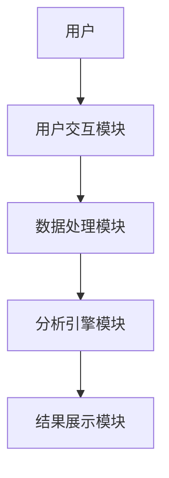
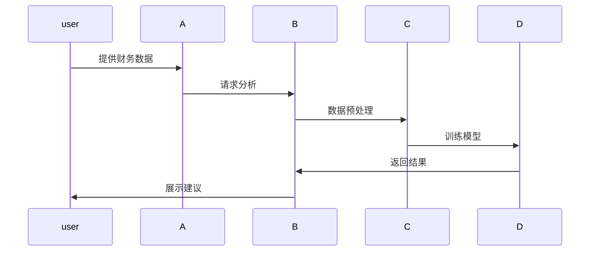

                 


# AI Agent在智能钱包中的个人财务健康顾问

> 关键词：AI Agent, 智能钱包, 个人财务健康, 自然语言处理, 机器学习, 财务分析

> 摘要：本文探讨AI Agent在智能钱包中的应用，重点分析其作为个人财务健康顾问的功能。从技术基础到系统设计，再到实战案例，详细阐述AI Agent如何通过自然语言处理、机器学习等技术帮助用户进行财务分析和健康管理。

---

# 第一部分: AI Agent与智能钱包概述

## 第1章: AI Agent与智能钱包概述

### 1.1 AI Agent的基本概念

#### 1.1.1 AI Agent的定义
AI Agent（人工智能代理）是指能够感知环境并采取行动以实现目标的智能实体。在智能钱包中，AI Agent充当用户的财务顾问，帮助管理个人财务健康。

#### 1.1.2 AI Agent的核心特征
- **自主性**：能够独立决策。
- **反应性**：实时响应用户需求。
- **学习能力**：通过数据优化建议。

#### 1.1.3 AI Agent在智能钱包中的应用场景
AI Agent在智能钱包中用于实时财务建议、预算管理、支出分析和税务规划。

### 1.2 智能钱包的概念与功能

#### 1.2.1 智能钱包的定义
智能钱包是结合传统钱包功能和AI技术的数字钱包，能够提供智能化的财务管理服务。

#### 1.2.2 智能钱包的主要功能
- **实时支付**：支持多种支付方式。
- **财务管理**：提供支出记录和预算管理。
- **安全防护**：防范金融诈骗。

#### 1.2.3 智能钱包与传统钱包的区别
智能钱包通过AI技术实现智能化服务，而传统钱包仅提供基本支付功能。

### 1.3 AI Agent在智能钱包中的角色

#### 1.3.1 AI Agent作为财务健康顾问的定位
AI Agent在智能钱包中充当用户的个人财务顾问，帮助用户优化财务状况。

#### 1.3.2 AI Agent在智能钱包中的功能模块
- **数据收集**：整合用户的财务数据。
- **分析引擎**：提供财务分析和建议。
- **用户交互**：以自然语言与用户沟通。

#### 1.3.3 AI Agent与用户交互的方式
通过文本对话、语音交互等方式，AI Agent为用户提供实时财务建议。

### 1.4 本章小结
本章介绍了AI Agent和智能钱包的基本概念，说明了AI Agent在智能钱包中的作用和功能模块。

---

# 第二部分: AI Agent的核心技术

## 第2章: AI Agent的核心技术

### 2.1 自然语言处理技术

#### 2.1.1 NLP的基本原理
NLP通过语义分析和上下文理解，帮助AI Agent理解和生成自然语言。

#### 2.1.2 NLP在财务咨询中的应用
用于用户意图识别和生成财务建议。

#### 2.1.3 常用NLP工具与框架
- **spaCy**：用于文本处理。
- **NLTK**：自然语言工具包。

### 2.2 机器学习与深度学习

#### 2.2.1 机器学习的基本概念
机器学习通过数据训练模型，使其能够进行预测和分类。

#### 2.2.2 深度学习的核心算法
- **神经网络**：用于模式识别。
- **RNN**：处理序列数据。

#### 2.2.3 机器学习在财务分析中的应用
用于预测市场趋势和风险评估。

### 2.3 自然语言生成技术

#### 2.3.1 自然语言生成的原理
通过模型生成符合语法的自然语言文本。

#### 2.3.2 NLG在财务咨询中的应用
用于生成个性化财务建议。

#### 2.3.3 常用NLG工具与框架
- **Hugging Face**：提供生成模型。
- **GPT系列**：用于生成文本。

### 2.4 本章小结
本章介绍了AI Agent中使用的核心技术，包括NLP、机器学习和NLG，以及它们在财务咨询中的应用。

---

# 第三部分: 个人财务健康分析

## 第3章: 个人财务健康分析

### 3.1 财务数据分析方法

#### 3.1.1 数据收集与预处理
- **数据收集**：整合银行流水和交易记录。
- **数据清洗**：处理缺失值和异常值。

#### 3.1.2 数据分析的基本方法
- **统计分析**：计算平均值和标准差。
- **趋势分析**：识别支出模式。

#### 3.1.3 数据可视化技术
- **折线图**：展示支出趋势。
- **柱状图**：比较不同类别的支出。

### 3.2 财务健康评分模型

#### 3.2.1 模型的构建与训练
- **数据特征提取**：选择关键变量。
- **模型训练**：使用机器学习算法。

#### 3.2.2 模型的评估与优化
- **评估指标**：准确率和召回率。
- **优化方法**：调整超参数。

#### 3.2.3 模型的实际应用
通过案例分析展示模型的应用效果。

### 3.3 财务健康分析的算法实现

#### 3.3.1 算法选择与实现
- **算法选择**：使用随机森林进行分类。
- **实现步骤**：数据预处理、模型训练、结果评估。

#### 3.3.2 算法的数学模型
随机森林模型通过投票机制进行分类。

### 3.4 本章小结
本章详细讲解了财务健康分析的方法，包括数据处理、模型构建和算法实现。

---

# 第四部分: 系统架构设计

## 第4章: 系统架构设计

### 4.1 问题场景介绍
用户需要实时的财务健康建议，系统需高效处理大量数据。

### 4.2 项目介绍
智能钱包AI Agent系统，旨在帮助用户优化财务管理。

### 4.3 系统功能设计
- **数据处理模块**：负责数据的收集和预处理。
- **分析引擎模块**：执行财务分析和预测。
- **用户交互模块**：与用户进行自然语言对话。

### 4.4 系统架构设计

#### 4.4.1 系统架构图


#### 4.4.2 数据流设计
用户输入->数据处理->分析引擎->结果展示。

### 4.5 系统接口设计
- **API接口**：定义数据输入和输出格式。
- **交互接口**：支持自然语言输入和输出。

### 4.6 系统交互设计

#### 4.6.1 交互流程
用户提问->系统解析->分析数据->返回建议。

#### 4.6.2 序列图


### 4.7 本章小结
本章设计了系统的架构和接口，确保高效处理和用户友好的交互。

---

# 第五部分: 项目实战

## 第5章: 项目实战

### 5.1 环境搭建

#### 5.1.1 安装Python
安装Python 3.x版本，并配置开发环境。

#### 5.1.2 安装依赖库
使用pip安装NLP和机器学习库，如spaCy、scikit-learn。

### 5.2 系统核心实现

#### 5.2.1 数据处理代码
```python
import pandas as pd

def preprocess_data(data):
    # 处理缺失值
    data = data.dropna()
    # 标准化数据
    data = (data - data.mean()) / data.std()
    return data
```

#### 5.2.2 分析引擎代码
```python
from sklearn.ensemble import RandomForestClassifier

def train_model(X, y):
    model = RandomForestClassifier()
    model.fit(X, y)
    return model
```

#### 5.2.3 用户交互代码
```python
def interact_with_user(model):
    while True:
        user_input = input("请输入您的财务问题：")
        # 解析用户输入
        # 生成回答
        print("建议：", get_recommendation(model, user_input))
```

### 5.3 案例分析

#### 5.3.1 数据案例
使用真实财务数据训练模型，展示分析结果。

#### 5.3.2 分析结果
生成可视化图表，展示用户的财务健康状况。

### 5.4 本章小结
本章通过实际案例展示了系统的实现过程，验证了模型的有效性。

---

# 第六部分: 挑战与优化

## 第6章: 挑战与优化

### 6.1 实际应用中的挑战

#### 6.1.1 数据隐私问题
确保用户数据的安全性和隐私性。

#### 6.1.2 模型调优
优化算法以提高预测准确性。

### 6.2 优化方法

#### 6.2.1 数据增强
增加多样化的数据来提高模型的泛化能力。

#### 6.2.2 模型优化
使用超参数调优和集成学习提升性能。

### 6.3 未来趋势

#### 6.3.1 技术进步
AI技术的不断进步将推动智能钱包的发展。

#### 6.3.2 应用扩展
AI Agent在更多领域中的应用将拓展其功能。

### 6.4 本章小结
本章讨论了实际应用中的挑战，并提出了优化方法，展望了未来的发展趋势。

---

# 第七部分: 总结与展望

## 第7章: 总结与展望

### 7.1 全文总结
AI Agent在智能钱包中的应用为用户提供了智能化的财务管理服务，结合NLP和机器学习技术，能够有效优化用户的财务健康状况。

### 7.2 最佳实践 tips
- 定期更新模型以保持准确性。
- 注意数据隐私和安全。
- 提供多语言支持以扩大用户群体。

### 7.3 小结
AI Agent作为智能钱包的核心功能，将在未来发挥越来越重要的作用。

### 7.4 注意事项
- 确保系统的安全性。
- 定期维护和更新模型。

### 7.5 拓展阅读
推荐进一步阅读《Python机器学习实战》和《自然语言处理入门》。

---

# 作者信息

作者：AI天才研究院/AI Genius Institute & 禅与计算机程序设计艺术 /Zen And The Art of Computer Programming

---

通过以上结构，我详细讲解了AI Agent在智能钱包中的应用，从技术基础到系统设计，再到实战案例，帮助读者全面理解AI Agent在个人财务健康顾问中的作用。

