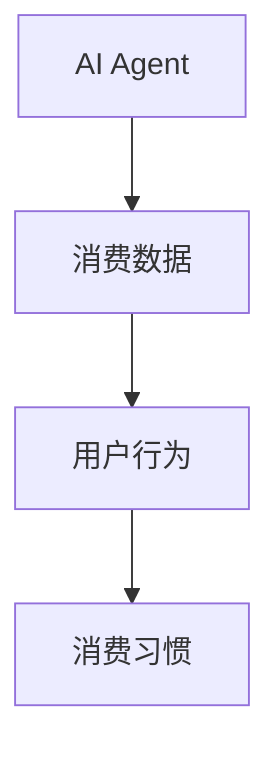
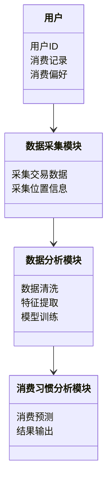
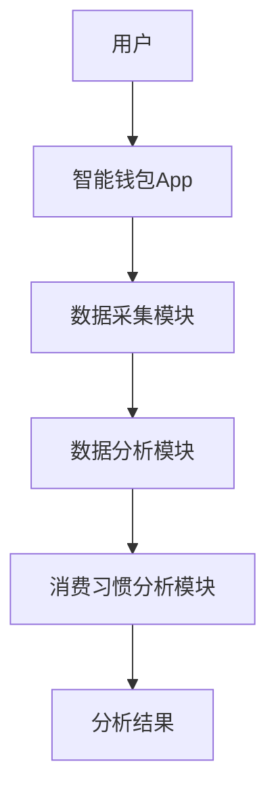
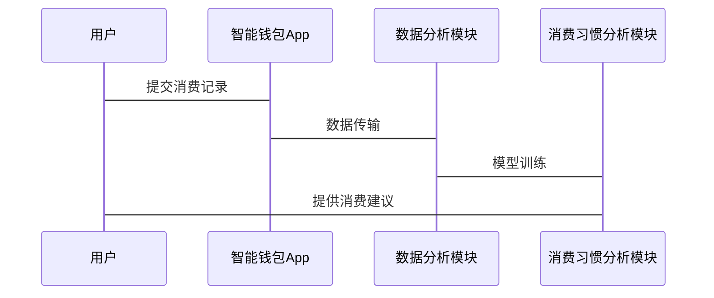

                 


```markdown
# AI Agent在智能钱包中的消费习惯分析

> 关键词：AI Agent，智能钱包，消费习惯，数据挖掘，机器学习，决策树，随机森林

> 摘要：本文探讨了AI Agent在智能钱包中的消费习惯分析，详细介绍了AI Agent的核心概念、算法原理、系统架构及其实现过程，结合实际案例分析了消费行为预测的应用，最后总结了相关经验和未来发展方向。

---

## 第1章: 背景与概述

### 1.1 问题背景
#### 1.1.1 从传统钱包到智能钱包的演进
传统钱包主要依赖实体卡片和现金，交易记录有限且难以分析。随着智能钱包的兴起，通过区块链技术和AI技术，钱包能够实时记录和分析用户的消费行为，为用户和金融机构提供深度洞察。

#### 1.1.2 AI Agent在金融领域的应用现状
AI Agent在金融领域的应用日益广泛，从交易执行到风险管理，再到用户行为分析，AI Agent凭借其高效的处理能力和学习能力，正在改变传统金融行业的运作方式。

#### 1.1.3 消费习惯分析的必要性
通过分析用户的消费习惯，金融机构可以提供个性化的服务，优化资源配置，降低风险，同时为用户提供更精准的消费建议。

### 1.2 问题描述
#### 1.2.1 智能钱包的核心功能
智能钱包不仅支持传统支付功能，还具备消费数据分析、行为预测、安全防护等高级功能。

#### 1.2.2 消费习惯分析的目标
消费习惯分析的目标是通过AI技术，提取用户消费行为的特征，建立预测模型，帮助用户和金融机构优化决策。

#### 1.2.3 AI Agent在消费习惯分析中的作用
AI Agent能够实时采集数据，自动学习用户的消费模式，并根据需求提供预测和建议。

### 1.3 问题解决
#### 1.3.1 AI Agent如何实现消费习惯分析
AI Agent通过数据采集、特征提取、建模分析和结果输出，实现对用户消费习惯的深度分析。

#### 1.3.2 数据采集与处理的解决方案
通过智能钱包App和区块链交易记录，实时采集用户的消费数据，并进行清洗和预处理。

#### 1.3.3 消费行为预测的实现路径
基于机器学习算法，构建消费行为预测模型，通过训练数据优化模型参数，实现高精度的消费行为预测。

### 1.4 边界与外延
#### 1.4.1 AI Agent的边界
AI Agent仅处理消费数据和行为分析，不涉及钱包的安全控制和交易执行。

#### 1.4.2 消费习惯分析的范围
消费习惯分析涵盖用户的消费时间、金额、地点、类别等多维度数据。

#### 1.4.3 相关领域的外延
消费习惯分析与用户画像、信用评估、精准营销等领域密切相关。

### 1.5 概念结构与核心要素
#### 1.5.1 AI Agent的核心要素
- 数据采集模块
- 数据分析模块
- 模型训练模块
- 预测输出模块

#### 1.5.2 消费习惯分析的构成
- 数据预处理
- 特征工程
- 模型训练
- 结果解释

#### 1.5.3 两者结合的逻辑关系
AI Agent通过消费数据的采集和处理，利用机器学习算法构建消费习惯分析模型，输出分析结果并提供决策支持。

---

## 第2章: 核心概念与联系

### 2.1 AI Agent的原理
#### 2.1.1 AI Agent的基本原理
AI Agent通过感知环境、目标设定、行为决策和反馈学习，实现对用户消费行为的分析与预测。

#### 2.1.2 AI Agent的核心算法
- 决策树
- 随机森林
- 支持向量机
- 神经网络

#### 2.1.3 AI Agent的实现框架
1. 数据采集与预处理
2. 特征提取与选择
3. 模型训练与优化
4. 预测结果输出

### 2.2 消费习惯分析的原理
#### 2.2.1 消费数据的采集与处理
通过智能钱包App和区块链记录，获取用户的消费时间、金额、地点、类别等数据。

#### 2.2.2 消费行为的特征提取
提取用户消费的频率、金额分布、时间偏好、类别偏好等特征。

#### 2.2.3 消费习惯的建模与分析
利用机器学习算法，构建用户消费习惯的分类或回归模型，分析用户行为特征。

### 2.3 核心概念对比
#### 2.3.1 AI Agent与传统算法的对比
| 对比维度 | AI Agent | 传统算法 |
|----------|-----------|-----------|
| 处理能力 | 强大的并行计算能力 | 单一的处理逻辑 |
| 学习能力 | 具备自适应学习能力 | 需人工调整参数 |
| 适用场景 | 复杂场景和实时决策 | 简单场景和静态数据 |

#### 2.3.2 消费习惯分析与传统数据分析的对比
| 对比维度 | 消费习惯分析 | 传统数据分析 |
|----------|--------------|--------------|
| 数据来源 | 结构化与非结构化数据 | 结构化数据为主 |
| 分析目标 | 预测与优化 | 描述与总结 |
| 工具支持 | AI算法与大数据平台 | 统计分析工具 |

#### 2.3.3 两者结合的优势与劣势
优势：结合AI Agent的实时性和传统算法的稳定性，能够实现高效且精准的消费行为分析。劣势：计算资源消耗较大，模型解释性较差。

### 2.4 ER实体关系图


---

## 第3章: 数据采集与预处理

### 3.1 数据采集
#### 3.1.1 智能钱包的数据来源
- 用户交易记录
- 场所位置信息
- 消费金额与时间
- 商品类别标签

#### 3.1.2 数据采集的实现方式
通过API接口获取智能钱包的交易数据，结合地理位置API获取消费场所信息。

#### 3.1.3 数据采集的注意事项
确保数据隐私保护，遵守相关法律法规，避免数据泄露。

### 3.2 数据预处理
#### 3.2.1 数据清洗的必要性
去除重复数据、缺失值填充、异常值处理。

#### 3.2.2 数据格式的转换
将文本数据转换为数值型数据，统一数据格式。

#### 3.2.3 数据归一化的处理
使用归一化或标准化方法，将不同量纲的特征数据进行转换。

### 3.3 数据分析
#### 3.3.1 数据可视化的基本方法
- 折线图展示消费时间分布
- 条形图展示消费类别占比
- 饼图展示消费金额分布

#### 3.3.2 数据特征的提取
- 用户平均消费金额
- 用户消费频率
- 用户偏好消费类别

#### 3.3.3 数据的分类与聚类
将用户分为不同的消费群体，识别潜在的消费模式。

---

## 第4章: 算法原理与实现

### 4.1 算法原理
#### 4.1.1 AI Agent的核心算法
使用决策树和随机森林算法，通过特征重要性分析，识别影响用户消费习惯的关键因素。

#### 4.1.2 算法实现流程
1. 数据预处理
2. 特征选择
3. 模型训练
4. 模型评估
5. 模型部署

### 4.2 算法实现
```python
import pandas as pd
from sklearn.tree import DecisionTreeClassifier
from sklearn.ensemble import RandomForestClassifier
from sklearn.metrics import accuracy_score

# 数据加载与预处理
data = pd.read_csv('消费数据.csv')
X = data.drop('消费习惯', axis=1)
y = data['消费习惯']

# 模型训练
dt_model = DecisionTreeClassifier().fit(X, y)
rf_model = RandomForestClassifier().fit(X, y)

# 模型预测
dt_pred = dt_model.predict(X)
rf_pred = rf_model.predict(X)

# 模型评估
print("决策树准确率:", accuracy_score(y, dt_pred))
print("随机森林准确率:", accuracy_score(y, rf_pred))
```

### 4.3 数学模型
#### 4.3.1 决策树模型
决策树算法通过信息增益率选择特征，构建树状分类模型。

公式：
$$
\text{信息增益} = H(X) - H(X|A)
$$

其中，$H(X)$是数据集的熵，$H(X|A)$是特征$A$下的条件熵。

#### 4.3.2 随机森林模型
随机森林通过构建多棵决策树，集成投票机制进行预测，公式如下：
$$
\text{预测结果} = \arg\max_{i} \sum_{j=1}^{n} \text{投票数}_i
$$

### 4.4 算法对比
| 对比维度 | 决策树 | 随机森林 |
|----------|--------|-----------|
| 鲁棒性   | 较低   | 较高      |
| 过拟合   | 易发生 | 较难发生   |
| 计算效率 | 较高   | 较低      |

---

## 第5章: 系统分析与架构设计

### 5.1 项目背景与目标
智能钱包消费习惯分析系统旨在通过AI Agent技术，帮助用户和金融机构优化消费决策。

### 5.2 系统功能设计


### 5.3 系统架构设计


### 5.4 系统接口设计
- 用户接口：提供消费记录查询、消费建议等功能。
- 数据接口：与智能钱包和区块链平台对接，获取交易数据。

### 5.5 系统交互设计


---

## 第6章: 项目实战

### 6.1 环境安装
- Python 3.8+
- scikit-learn、pandas、numpy
- matplotlib、seaborn

### 6.2 核心实现
```python
import pandas as pd
from sklearn.ensemble import RandomForestClassifier
from sklearn.metrics import classification_report

# 数据加载与预处理
data = pd.read_csv('消费数据.csv')
X = data.drop('消费习惯', axis=1)
y = data['消费习惯']

# 特征工程
X = pd.get_dummies(X)

# 模型训练
model = RandomForestClassifier().fit(X, y)

# 模型预测
y_pred = model.predict(X)

# 模型评估
print(classification_report(y, y_pred))
```

### 6.3 代码解读
- 数据加载与预处理：读取CSV文件，去除目标变量。
- 特征工程：使用独热编码处理分类特征。
- 模型训练：训练随机森林分类器。
- 模型预测：预测用户消费习惯，输出分类报告。

### 6.4 实际案例分析
通过实际数据训练模型，分析用户的消费偏好，预测未来消费行为。

### 6.5 项目小结
通过本项目，我们实现了AI Agent在智能钱包中的消费习惯分析，验证了随机森林算法的有效性，为用户提供个性化的消费建议。

---

## 第7章: 总结与展望

### 7.1 总结
本文详细介绍了AI Agent在智能钱包中的消费习惯分析，从数据采集到模型训练，再到结果输出，完整地展示了消费习惯分析的实现过程。

### 7.2 展望
未来，随着AI技术的不断发展，消费习惯分析将更加智能化和个性化。通过引入更复杂的算法和更丰富的数据，AI Agent将在智能钱包中发挥更大的作用。

---

## 第8章: 最佳实践与注意事项

### 8.1 最佳实践
- 数据隐私保护：严格遵守数据保护法规，确保用户数据安全。
- 模型优化：定期更新模型，保持预测精度。
- 用户教育：向用户解释AI分析的结果，增强信任。

### 8.2 小结
消费习惯分析是一个复杂的系统工程，需要结合AI技术与金融场景，通过不断的优化和创新，才能更好地服务于用户和金融机构。

### 8.3 注意事项
- 避免数据泄露，确保系统安全。
- 定期监控模型性能，及时调整。
- 提供透明的解释，增强用户信任。

### 8.4 拓展阅读
- 《机器学习实战》
- 《深入浅出人工智能》
- 《区块链技术与智能合约》

---

## 作者：AI天才研究院（AI Genius Institute） & 禅与计算机程序设计艺术（Zen And The Art of Computer Programming）
```

