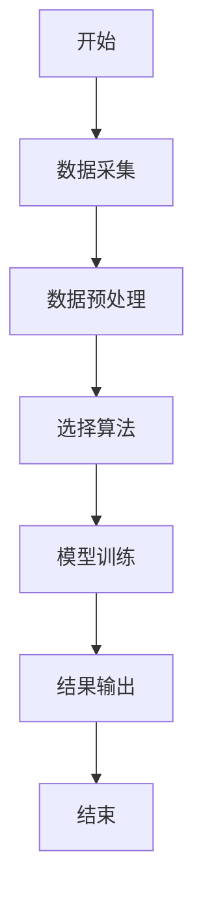
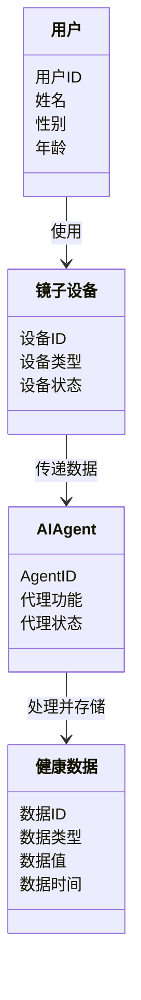

                 


# {{此处是文章标题}}

> 关键词：{{此处列出文章的5-7个核心关键词}}

> 摘要：{{此处给出文章的核心内容和主题思想}}

---

# 第1章: 背景介绍

## 1.1 问题背景
### 1.1.1 智能镜子的发展现状
### 1.1.2 智能健康监测的市场需求
### 1.1.3 AI Agent在健康监测中的作用

## 1.2 问题描述
### 1.2.1 智能镜子的健康监测功能
### 1.2.2 用户健康数据的实时采集与分析
### 1.2.3 AI Agent在健康数据处理中的应用

## 1.3 问题解决
### 1.3.1 AI Agent在智能镜子中的核心功能
### 1.3.2 通过AI Agent实现健康数据的智能化分析
### 1.3.3 AI Agent在健康监测中的具体应用场景

## 1.4 边界与外延
### 1.4.1 系统边界与功能范围
### 1.4.2 AI Agent在智能镜子中的应用边界
### 1.4.3 智能镜子系统的扩展性与可维护性

## 1.5 概念结构与核心要素组成
### 1.5.1 AI Agent的定义与核心要素
### 1.5.2 智能镜子系统的构成要素
### 1.5.3 AI Agent与智能镜子系统的交互关系

## 1.6 本章小结

---

# 第2章: 核心概念与联系

## 2.1 AI Agent的基本原理
### 2.1.1 AI Agent的定义与特点
### 2.1.2 AI Agent的核心算法与技术
### 2.1.3 AI Agent在智能镜子中的具体实现

## 2.2 智能镜子系统的核心概念
### 2.2.1 智能镜子的功能模块
### 2.2.2 健康数据采集与处理
### 2.2.3 AI Agent在健康数据处理中的具体应用

## 2.3 核心概念的对比分析
### 2.3.1 AI Agent与传统算法的对比
### 2.3.2 智能镜子与传统镜子的功能对比
### 2.3.3 健康数据处理的对比分析

## 2.4 ER实体关系图
```mermaid
erd
    用户: 用户ID, 姓名, 性别, 年龄
    镜子设备: 设备ID, 设备类型, 设备状态
    AI Agent: AgentID, 代理功能, 代理状态
    健康数据: 数据ID, 数据类型, 数据值, 数据时间

    用户 --> 镜子设备: 使用
    镜子设备 --> AI Agent: 传递数据
    AI Agent --> 健康数据: 处理并存储
```

---

# 第3章: 算法原理讲解

## 3.1 数据采集与预处理
### 3.1.1 健康数据的采集方法
### 3.1.2 数据预处理的必要性
### 3.1.3 数据清洗与特征提取

## 3.2 AI Agent的核心算法
### 3.2.1 机器学习算法的选择
### 3.2.2 深度学习模型的构建
### 3.2.3 算法实现的代码示例

## 3.3 算法实现的数学模型
### 3.3.1 线性回归模型
$$ y = \beta_0 + \beta_1x + \epsilon $$

### 3.3.2 逻辑回归模型
$$ P(y=1|x) = \frac{e^{\beta_0 + \beta_1x}}{1 + e^{\beta_0 + \beta_1x}} $$

## 3.4 算法流程图


---

# 第4章: 系统分析与架构设计

## 4.1 问题场景介绍
### 4.1.1 用户健康数据的实时监测
### 4.1.2 系统的高可用性要求
### 4.1.3 系统的可扩展性需求

## 4.2 系统功能设计
### 4.2.1 领域模型设计


### 4.2.2 系统架构设计


---

# 第5章: 项目实战

## 5.1 环境安装
### 5.1.1 安装Python
### 5.1.2 安装TensorFlow和Keras
### 5.1.3 安装其他依赖库

## 5.2 核心代码实现
### 5.2.1 数据预处理代码
### 5.2.2 模型训练代码
### 5.2.3 结果输出代码

## 5.3 代码应用解读
### 5.3.1 代码的功能说明
### 5.3.2 代码的优化建议
### 5.3.3 代码的扩展方向

---

# 第6章: 总结与展望

## 6.1 本章总结
### 6.1.1 AI Agent在智能镜子中的应用成果
### 6.1.2 系统实现的关键点总结
### 6.1.3 项目实施的经验与教训

## 6.2 未来展望
### 6.2.1 AI Agent的未来发展
### 6.2.2 智能镜子系统的演进方向
### 6.2.3 健康监测技术的创新与突破

## 6.3 最佳实践 tips
### 6.3.1 数据隐私保护的注意事项
### 6.3.2 系统维护与更新的建议
### 6.3.3 用户体验优化的方向

---

# 作者：AI天才研究院/AI Genius Institute & 禅与计算机程序设计艺术 /Zen And The Art of Computer Programming

