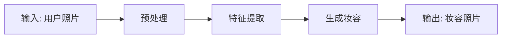
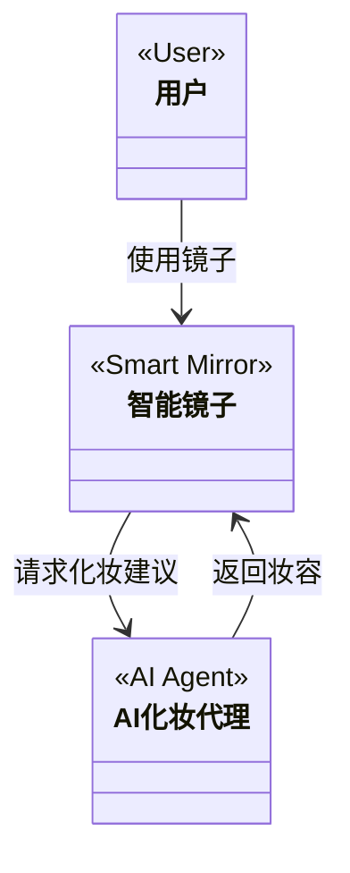
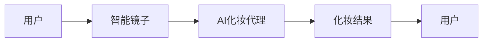

                 


# AI Agent在智能镜子中的虚拟化妆试验

> 关键词：AI Agent, 智能镜子, 虚拟化妆, 计算机视觉, 人机交互, 深度学习

> 摘要：本文探讨AI Agent在智能镜子中的虚拟化妆应用，分析其技术实现、算法原理、系统架构，并通过案例展示实际应用，最后总结最佳实践。

---

## 第一部分：背景介绍

### 第1章：背景介绍

#### 1.1 问题背景

- **智能镜子的发展现状**：智能镜子已进入市场，具备基础的化妆功能，但缺乏智能化。
- **虚拟化妆技术的市场需求**：用户对虚拟试妆需求增长，推动技术发展。
- **AI Agent在化妆中的应用潜力**：AI Agent可提供个性化建议，提升用户体验。

#### 1.2 问题描述

- **虚拟化妆的核心问题**：如何在不同肤质和光照下准确模拟妆容。
- **智能镜子的交互挑战**：实时反馈和高精度计算的平衡。
- **用户需求与技术实现的矛盾**：用户期望无缝体验，技术实现复杂。

#### 1.3 解决方案

- **AI Agent的核心作用**：通过学习用户数据，提供个性化建议。
- **技术实现路径**：结合计算机视觉和深度学习，实现精准化妆模拟。
- **用户体验优化策略**：简化操作流程，提升反馈速度。

#### 1.4 边界与外延

- **技术边界**：仅限于虚拟化妆，不涉及实体产品销售。
- **应用场景的外延**：适用于试妆、教育等领域。
- **与其他技术的关联**：与增强现实、人机交互密切相关。

#### 1.5 核心概念与组成

- **AI Agent的基本概念**：智能代理，能执行任务。
- **虚拟化妆的实现要素**：图像处理、光照模拟。
- **智能镜子的系统架构**：硬件、软件、用户界面。

---

## 第二部分：核心概念与联系

### 第2章：核心概念与联系

#### 2.1 AI Agent的核心原理

- **AI Agent的定义与分类**：基于智能水平分类。
- **AI Agent在化妆中的应用逻辑**：分析用户数据，提供建议。
- **AI Agent与智能镜子的交互机制**：通过传感器和摄像头获取数据。

#### 2.2 虚拟化妆的核心原理

- **虚拟化妆的技术实现**：使用深度学习模型生成妆容。
- **虚拟化妆的数学模型**：基于图像变换的模型。
- **虚拟化妆的用户反馈机制**：实时调整妆容。

#### 2.3 AI Agent与虚拟化妆的关系

- **AI Agent在虚拟化妆中的角色**：提供个性化建议。
- **虚拟化妆对AI Agent的性能要求**：高计算能力和准确性。
- **两者结合的优势与挑战**：提升体验，但技术复杂。

#### 2.4 核心概念对比表格

| **属性**       | **AI Agent**         | **虚拟化妆**         |
|-----------------|----------------------|-----------------------|
| **核心功能**    | 执行任务            | 模拟化妆效果          |
| **技术要求**    | 高计算能力          | 高精度图像处理       |
| **应用场景**    | 多领域              | 化妆、试妆            |

#### 2.5 ER实体关系图

```mermaid
er
actor: 用户
agent: AI化妆代理
product: 化妆产品
妆容: 照片
用户数据: 用户资料
```

---

## 第三部分：算法原理讲解

### 第3章：算法原理讲解

#### 3.1 算法概述

- **算法名称**：基于深度学习的图像生成模型。
- **目标**：生成逼真妆容。

#### 3.2 算法流程



#### 3.3 Python代码实现

```python
import tensorflow as tf
from tensorflow.keras import layers

# 定义生成器模型
def build_generator():
    model = tf.keras.Sequential([
        layers.Dense(256, activation='relu', input_shape=(100,)),
        layers.Conv2DTranspose(256, (4,4), strides=(2,2), padding='same'),
        layers.Conv2DTranspose(128, (4,4), strides=(2,2), padding='same'),
        layers.Conv2DTranspose(64, (4,4), strides=(2,2), padding='same'),
        layers.Conv2DTranspose(3, (4,4), strides=(2,2), padding='same'),
        layers.Activation('sigmoid')
    ])
    return model

# 初始化模型
generator = build_generator()
generator.summary()
```

#### 3.4 数学模型与公式

- **损失函数**：$$ L = \lambda_1 L1 + \lambda_2 GAN\_loss $$
- **优化器**：使用Adam优化器，$$ \beta_1=0.5 $$

---

## 第四部分：系统分析与架构设计

### 第4章：系统分析与架构设计

#### 4.1 问题场景介绍

- **用户需求**：试用虚拟妆容。
- **系统目标**：提供实时反馈。

#### 4.2 领域模型设计



#### 4.3 系统架构设计



---

## 第五部分：项目实战

### 第5章：项目实战

#### 5.1 环境安装

```bash
pip install tensorflow keras numpy
```

#### 5.2 核心代码实现

```python
import cv2
import numpy as np

def apply_makeup(image, model):
    # 图像预处理
    preprocessed = preprocess_image(image)
    # 生成妆容
    result = model.predict(preprocessed)
    return result

def preprocess_image(image):
    # 缩放图像到合适尺寸
    resized = cv2.resize(image, (256, 256))
    # 归一化
    normalized = resized / 255.0
    return normalized

# 使用模型
image = cv2.imread('input.jpg')
makeup_image = apply_makeup(image, generator)
cv2.imwrite('output.jpg', makeup_image)
```

#### 5.3 案例分析

- **案例1**：用户肤色较暗，AI Agent推荐使用浅色粉底。
- **案例2**：用户眼部突出，建议使用深色眼影。

---

## 第六部分：最佳实践

### 第6章：最佳实践

#### 6.1 小结

- AI Agent在智能镜子中的应用潜力巨大。
- 技术实现需要结合深度学习和计算机视觉。

#### 6.2 注意事项

- 数据隐私保护至关重要。
- 硬件性能影响用户体验。

#### 6.3 拓展阅读

- 推荐书籍：《深度学习》
- 推荐博客：Tech blog on AI

---

**作者：AI天才研究院**

