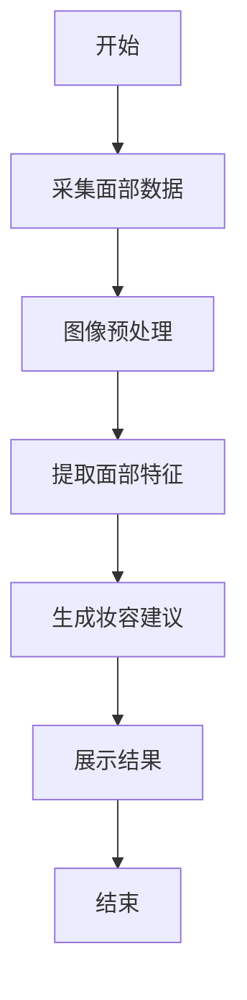
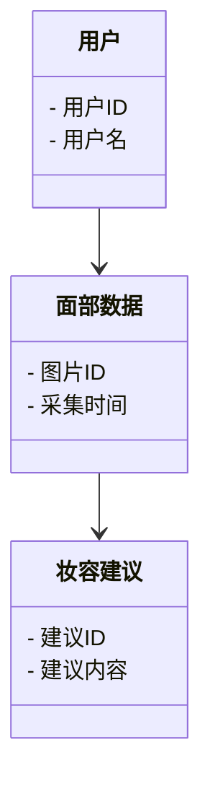
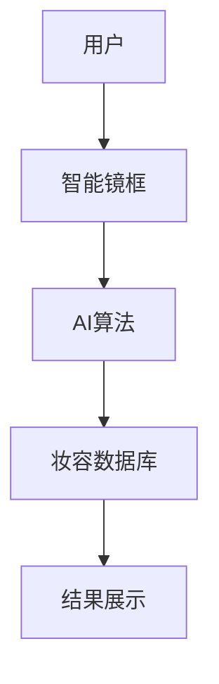
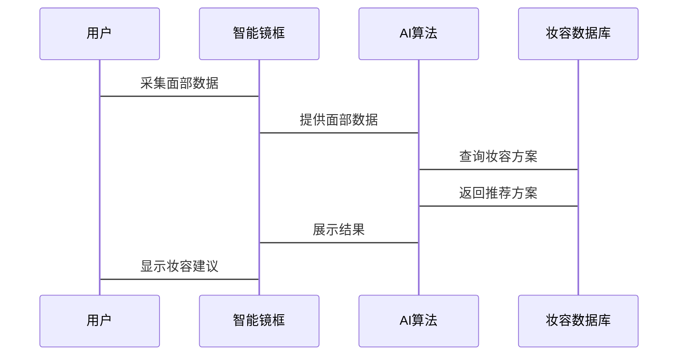

                 


# AI Agent在智能镜框中的妆容建议

> 关键词：AI Agent，智能镜框，妆容建议，计算机视觉，深度学习，自然语言处理

> 摘要：本文将探讨AI Agent在智能镜框中的应用，特别是在妆容建议方面的技术实现。通过分析背景、核心概念、算法原理、系统架构和项目实战，详细阐述AI Agent如何帮助用户实现个性化的妆容推荐。文章还提供了数学模型、系统设计和代码实现，帮助读者全面理解并应用于实际场景。

---

# 第一部分: AI Agent与智能镜框概述

# 第1章: AI Agent与智能镜框的背景介绍

## 1.1 问题背景与描述
### 1.1.1 传统美妆咨询的局限性
传统的美妆咨询依赖于美妆顾问的经验，存在效率低、成本高、个性化不足等问题。AI Agent通过智能化手段，能够快速分析用户的面部特征，提供个性化的妆容建议。

### 1.1.2 AI技术在美妆领域的应用潜力
AI技术在计算机视觉、自然语言处理和机器学习方面取得了显著进展，为美妆领域提供了新的解决方案。AI Agent能够实时分析用户的面部特征，推荐合适的妆容方案。

### 1.1.3 智能镜框的定义与特点
智能镜框是一种结合了AI技术的智能硬件，能够通过摄像头采集用户的面部数据，并通过AI算法生成个性化的妆容建议。其特点包括实时性、个性化和便捷性。

## 1.2 问题解决与边界
### 1.2.1 AI Agent在妆容建议中的作用
AI Agent通过分析用户的面部特征，推荐适合的妆容方案，帮助用户提升美妆效果。

### 1.2.2 智能镜框的技术实现边界
智能镜框主要通过摄像头采集面部数据，并利用AI算法进行处理。其边界包括数据采集、算法处理和结果展示。

### 1.2.3 妆容建议的系统外延
妆容建议系统需要考虑用户的需求、面部特征、妆容趋势等多个因素，确保推荐的妆容既美观又实用。

## 1.3 概念结构与核心要素
### 1.3.1 AI Agent的核心要素
AI Agent在妆容建议中的核心要素包括数据采集、特征提取、模型训练和结果展示。

### 1.3.2 智能镜框的功能模块
智能镜框的功能模块包括摄像头、AI芯片、显示屏和用户界面。

### 1.3.3 妆容建议系统的组成
妆容建议系统由数据采集模块、算法处理模块和用户交互模块组成。

## 1.4 本章小结
本章通过分析AI Agent和智能镜框的背景，明确了其在妆容建议中的作用和技术实现边界，为后续章节奠定了基础。

---

# 第二部分: 核心概念与联系

# 第2章: AI Agent的核心原理

## 2.1 AI Agent的基本原理
### 2.1.1 机器学习基础
机器学习是AI Agent的核心技术，通过训练模型来识别和分类数据。

### 2.1.2 自然语言处理技术
自然语言处理技术用于理解用户的语言输入，生成个性化的建议。

### 2.1.3 计算机视觉原理
计算机视觉技术用于图像识别和处理，提取用户的面部特征。

## 2.2 智能镜框的技术实现
### 2.2.1 图像采集与处理
智能镜框通过摄像头采集用户的面部图像，并进行预处理。

### 2.2.2 人脸识别与分析
利用计算机视觉技术，识别用户的面部特征，如肤色、五官位置等。

### 2.2.3 妆容模拟与推荐
基于用户的面部特征和妆容数据库，生成个性化的妆容建议。

## 2.3 核心概念对比分析
### 2.3.1 AI Agent与传统算法的对比
AI Agent通过深度学习和自然语言处理实现智能化推荐，传统算法依赖规则和经验。

### 2.3.2 智能镜框与其他美妆工具的对比
智能镜框结合了硬件和AI技术，提供实时的个性化建议，其他工具可能仅限于手动操作或简单的推荐。

## 2.4 ER实体关系图
### 2.4.1 用户与妆容建议的关系
用户与妆容建议是多对多的关系，每个用户可以对应多个妆容建议，每个妆容建议可以被多个用户使用。

### 2.4.2 数据与模型的关系
数据是模型训练的基础，模型通过数据不断优化推荐结果。

### 2.4.3 系统功能与模块的关系
系统功能与模块之间是依赖关系，每个功能模块支持系统的整体运行。

## 2.5 本章小结
本章详细介绍了AI Agent和智能镜框的核心原理，并通过对比和ER图展示了其技术优势和系统结构。

---

# 第三部分: 算法原理与数学模型

# 第3章: 妆容建议算法原理

## 3.1 算法概述
### 3.1.1 基于深度学习的推荐算法
深度学习模型（如卷积神经网络）用于图像识别和分类，生成个性化的妆容建议。

### 3.1.2 基于图像处理的妆容生成算法
利用图像处理技术，模拟不同妆容的效果，帮助用户选择最佳方案。

## 3.2 算法流程图
### 3.2.1 使用 Mermaid 绘制算法流程图


## 3.3 数学模型与公式
### 3.3.1 深度学习模型的数学基础
深度学习模型通过多层神经网络进行特征提取和分类，公式如下：
$$ y = f(Wx + b) $$
其中，\( W \) 是权重矩阵，\( x \) 是输入数据，\( b \) 是偏置项，\( f \) 是激活函数。

### 3.3.2 基于损失函数的优化公式
损失函数用于衡量模型预测与实际结果的差异，通过梯度下降优化模型参数：
$$ L = \frac{1}{n}\sum_{i=1}^{n}(y_i - \hat{y_i})^2 $$

## 3.4 本章小结
本章通过算法流程图和数学公式，详细讲解了AI Agent在妆容建议中的算法原理和技术实现。

---

# 第四部分: 系统分析与架构设计方案

# 第4章: 系统分析与架构设计

## 4.1 问题场景介绍
用户使用智能镜框进行面部数据采集，系统通过AI算法生成妆容建议。

## 4.2 系统功能设计
### 4.2.1 领域模型设计


### 4.2.2 系统架构设计


## 4.3 接口设计与交互
### 4.3.1 系统接口设计
- 用户接口：摄像头采集数据
- 算法接口：AI模型处理数据
- 展示接口：显示屏展示结果

### 4.3.2 交互流程图


## 4.4 本章小结
本章通过系统分析和架构设计，明确了智能镜框的技术实现路径和交互流程。

---

# 第五部分: 项目实战

# 第5章: 项目实战

## 5.1 环境安装与配置
### 5.1.1 安装Python和依赖库
安装Python 3.8及以上版本，安装TensorFlow、OpenCV和Keras等库。

```bash
pip install numpy
pip install tensorflow
pip install opencv-python
pip install keras
```

## 5.2 系统核心实现源代码
### 5.2.1 数据预处理代码
```python
import cv2
def preprocess_image(image_path):
    image = cv2.imread(image_path)
    image = cv2.resize(image, (224, 224))
    image = image / 255.0
    return image
```

### 5.2.2 模型训练代码
```python
import tensorflow as tf
from tensorflow.keras import layers

model = tf.keras.Sequential([
    layers.Conv2D(32, (3,3), activation='relu', input_shape=(224,224,3)),
    layers.MaxPooling2D((2,2)),
    layers.Conv2D(64, (3,3), activation='relu'),
    layers.MaxPooling2D((2,2)),
    layers.Flatten(),
    layers.Dense(128, activation='relu'),
    layers.Dense(10, activation='softmax')
])

model.compile(optimizer='adam', loss='sparse_categorical_crossentropy', metrics=['accuracy'])
model.fit(train_images, train_labels, epochs=10, batch_size=32)
```

### 5.2.3 妆容推荐代码
```python
def generate_cosmetics_recommendation(image_path):
    preprocessed_image = preprocess_image(image_path)
    prediction = model.predict(preprocessed_image)
    recommendation = class_names[prediction]
    return recommendation
```

## 5.3 实际案例分析
### 5.3.1 案例背景与数据采集
用户A希望通过智能镜框找到适合自己的口红色号。

### 5.3.2 系统处理与分析
系统采集用户的面部图像，提取肤色和唇部特征，推荐适合的口红色号。

### 5.3.3 推荐结果展示
系统生成推荐结果，并展示在智能镜框的屏幕上。

## 5.4 本章小结
本章通过项目实战，详细讲解了智能镜框的技术实现和实际应用，帮助读者掌握核心代码和技术要点。

---

# 第六部分: 最佳实践

# 第6章: 最佳实践

## 6.1 小结
通过本文的讲解，读者可以全面了解AI Agent在智能镜框中的妆容建议技术，掌握其核心算法和系统架构。

## 6.2 注意事项
- 数据隐私保护
- 算法优化与性能提升
- 系统稳定性和用户体验

## 6.3 拓展阅读
建议读者进一步阅读深度学习和计算机视觉的相关书籍，深入理解AI技术在美妆领域的应用。

## 6.4 本章小结
本章总结了AI Agent在智能镜框中的应用，并提供了注意事项和拓展阅读建议，帮助读者进一步提升技术能力。

---

# 作者

作者：AI天才研究院/AI Genius Institute  
& 禅与计算机程序设计艺术 /Zen And The Art of Computer Programming

