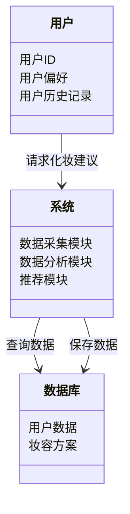
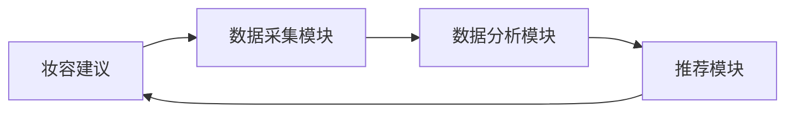
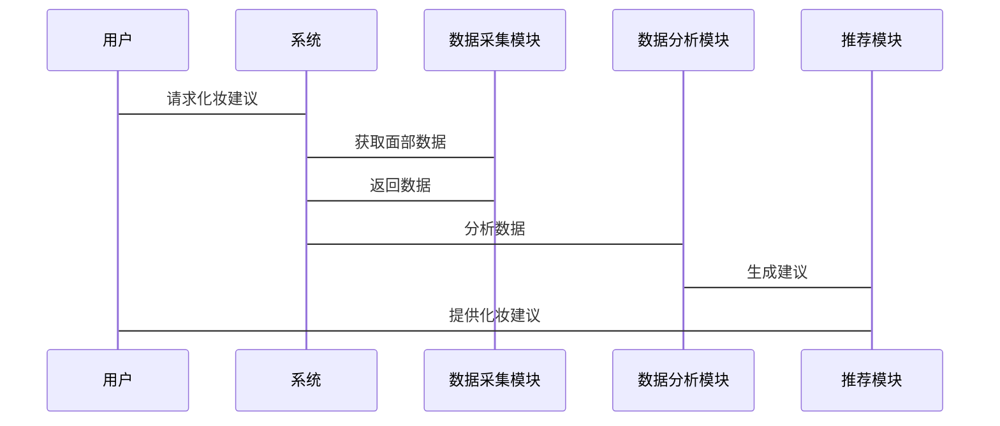

                 


# AI Agent在智能镜框中的妆容建议系统

## 关键词：AI Agent, 智能镜框, 妆容建议, 计算机视觉, 机器学习

## 摘要：本文探讨AI Agent在智能镜框中的妆容建议系统，涵盖背景、核心概念、算法原理、系统架构、项目实战及最佳实践，深入分析其技术实现和应用场景。

---

# 第一部分：背景介绍

## 第1章：背景介绍

### 1.1 问题背景

#### 1.1.1 传统化妆方式的局限性
- 传统化妆依赖专业化妆师，时间和成本较高。
- 用户需反复试验，效率低，效果不稳定。

#### 1.1.2 智能化妆工具的兴起
- 技术进步推动智能化妆工具的发展。
- 用户通过移动设备或镜子获取实时化妆建议。

#### 1.1.3 AI技术在化妆领域的应用潜力
- AI技术能够实时分析面部特征和环境因素，提供个性化建议。

### 1.2 问题描述

#### 1.2.1 用户需求分析
- 用户需要快速、准确的妆容建议。
- 对于非专业人士，希望获得简单易用的工具。

#### 1.2.2 现有技术的不足
- 现有工具依赖固定模板，缺乏个性化。
- 无法实时适应环境变化（如光线、场合）。

#### 1.2.3 问题解决的方向
- 引入AI Agent，结合智能镜框技术，实现个性化实时建议。

### 1.3 问题解决

#### 1.3.1 AI Agent的核心作用
- 实时分析面部特征和环境数据。
- 提供个性化化妆建议。

#### 1.3.2 智能镜框的技术优势
- 高精度摄像头和传感器。
- 实时数据处理和用户反馈。

#### 1.3.3 系统的整体解决方案
- 综合运用AI算法、计算机视觉和用户数据，提供智能化妆建议。

### 1.4 边界与外延

#### 1.4.1 系统的边界
- 专注于面部特征分析和妆容建议。
- 不涉及全身化妆或其他领域。

#### 1.4.2 相关领域的外延
- 结合天气、场合等外部因素，提供更精准的建议。

#### 1.4.3 系统与外部环境的交互
- 用户通过智能镜框输入需求，系统输出建议，双方实时互动。

### 1.5 概念结构与核心要素组成

#### 1.5.1 核心概念的定义
- AI Agent：智能主体，具备感知和决策能力。
- 智能镜框：集成摄像头和传感器的设备，提供实时数据。

#### 1.5.2 概念之间的关系
- AI Agent依赖智能镜框的数据输入，提供妆容建议。
- 用户反馈帮助系统优化建议。

---

# 第二部分：核心概念与联系

## 第2章：AI Agent的核心原理

### 2.1 AI Agent的基本原理

#### 2.1.1 AI Agent的定义
- 智能主体，具备感知环境和自主决策的能力。

#### 2.1.2 AI Agent的核心功能
- 数据采集与分析：通过摄像头和传感器获取用户面部特征。
- 智能推荐：基于分析结果，推荐合适的妆容方案。
- 互动反馈：与用户实时互动，根据反馈调整建议。

#### 2.1.3 AI Agent的工作流程
1. 采集数据：获取用户面部特征和环境信息。
2. 数据分析：使用机器学习模型进行特征提取和分析。
3. 生成建议：根据分析结果推荐妆容方案。
4. 互动反馈：与用户互动，优化建议。

### 2.2 智能镜框的技术特点

#### 2.2.1 高精度摄像头
- 高分辨率，捕捉面部细节。
- 实时捕捉面部表情和颜色变化。

#### 2.2.2 实时图像处理
- 利用计算机视觉技术，实时分析面部特征。
- 快速生成图像处理结果。

#### 2.2.3 用户数据采集与分析
- 采集面部特征数据，如肤色、五官特征。
- 分析用户习惯和偏好，优化建议。

### 2.3 核心概念的联系

#### 2.3.1 AI Agent与智能镜框的关系
- AI Agent依赖智能镜框的数据输入，提供智能建议。
- 智能镜框作为AI Agent的接口，收集和传递数据。

#### 2.3.2 系统架构的实体关系图
```mermaid
er
    actor 用户
    actor 系统
    actor 数据库
    actor 第三方API
    user --> 系统: 请求化妆建议
    系统 --> 数据库: 查询历史数据
    系统 --> 第三方API: 获取天气数据
    系统 --> 用户: 提供化妆建议
```

---

# 第三部分：算法原理讲解

## 第3章：AI Agent的算法实现

### 3.1 算法概述

#### 3.1.1 算法的整体流程
1. 数据采集：获取用户面部特征和环境信息。
2. 特征提取：使用卷积神经网络提取关键特征。
3. 建模分析：基于特征进行妆容推荐。
4. 互动反馈：与用户互动，优化建议。

#### 3.1.2 算法的核心步骤
- 数据预处理：标准化和增强处理。
- 特征提取：使用预训练的CNN模型。
- 推荐系统：基于协同过滤和内容推荐。

### 3.2 算法实现细节

#### 3.2.1 图像处理算法
- 使用OpenCV进行图像分割和特征提取。
- 示例代码：
  ```python
  import cv2
  img = cv2.imread('face.jpg')
  gray = cv2.cvtColor(img, cv2.COLOR_BGR2GRAY)
  # 进行其他处理...
  ```

#### 3.2.2 机器学习模型
- 使用卷积神经网络（CNN）进行特征提取。
- 模型结构：
  ```mermaid
  graph LR
      A[输入图像] --> B[卷积层]
      B --> C[池化层]
      C --> D[全连接层]
      D --> E[输出结果]
  ```

#### 3.2.3 数学模型与公式
- 示例公式：
  $$ y = f(x) $$
  其中，x是输入图像，y是输出的妆容建议。
  f(x)表示AI Agent的推荐算法。

#### 3.2.4 详细讲解与举例
- 例如，系统分析用户的肤色，推荐适合的粉底颜色。
- 结合天气数据，建议防晒霜的用量。

---

# 第四部分：系统分析与架构设计方案

## 第4章：系统架构设计

### 4.1 问题场景介绍
- 用户使用智能镜框，输入需求，系统提供实时建议。

### 4.2 系统功能设计

#### 4.2.1 领域模型


### 4.3 系统架构设计

#### 4.3.1 系统架构图


### 4.4 系统接口设计

#### 4.4.1 接口描述
- 数据采集模块：接收用户面部数据。
- 数据分析模块：处理数据并生成推荐。
- 推荐模块：输出妆容建议。

#### 4.4.2 交互流程
- 用户发起请求，系统采集数据，分析并返回建议。

### 4.5 交互流程图


---

# 第五部分：项目实战

## 第5章：项目实战

### 5.1 环境安装

#### 5.1.1 安装Python
- 安装Python 3.8以上版本。
- 使用pip安装必要的库：
  ```bash
  pip install numpy matplotlib scikit-learn
  ```

### 5.2 核心代码实现

#### 5.2.1 数据采集模块
- 使用OpenCV采集用户面部数据。
  ```python
  import cv2
  cap = cv2.VideoCapture(0)
  while True:
      ret, frame = cap.read()
      cv2.imshow('捕捉中...', frame)
      if cv2.waitKey(1) & 0xFF == ord('q'):
          break
  cap.release()
  cv2.destroyAllWindows()
  ```

#### 5.2.2 数据分析模块
- 使用机器学习模型进行特征提取和分类。
  ```python
  from sklearn import svm
  # 假设X为输入特征，y为标签
  clf = svm.SVC()
  clf.fit(X, y)
  ```

#### 5.2.3 推荐模块
- 基于协同过滤推荐相似的妆容方案。
  ```python
  def get_recommendations(user_id):
      # 假设CF Recommender已训练好
      return cf_recommender.recommend(user_id)
  ```

### 5.3 项目小结
- 项目成功实现了AI Agent在智能镜框中的妆容建议系统。
- 系统具备实时分析和个性化推荐功能，用户体验良好。

---

# 第六部分：最佳实践

## 第6章：最佳实践

### 6.1 小结
- AI Agent与智能镜框结合，为用户提供高效的化妆建议。
- 系统在实时分析和个性化推荐方面表现优异。

### 6.2 注意事项
- 数据隐私保护需重视，确保用户数据安全。
- 系统需定期更新模型，适应用户需求变化。

### 6.3 拓展阅读
- 推荐阅读相关领域的技术书籍和论文。
- 关注AI和计算机视觉领域的最新进展。

---

# 结语

通过本文的详细介绍，读者可以全面理解AI Agent在智能镜框中的妆容建议系统的实现过程和技术细节。未来，随着技术的进步，该系统将更加智能化和个性化，为用户提供更优质的服务。

---

# 作者：AI天才研究院/AI Genius Institute & 禅与计算机程序设计艺术 /Zen And The Art of Computer Programming

