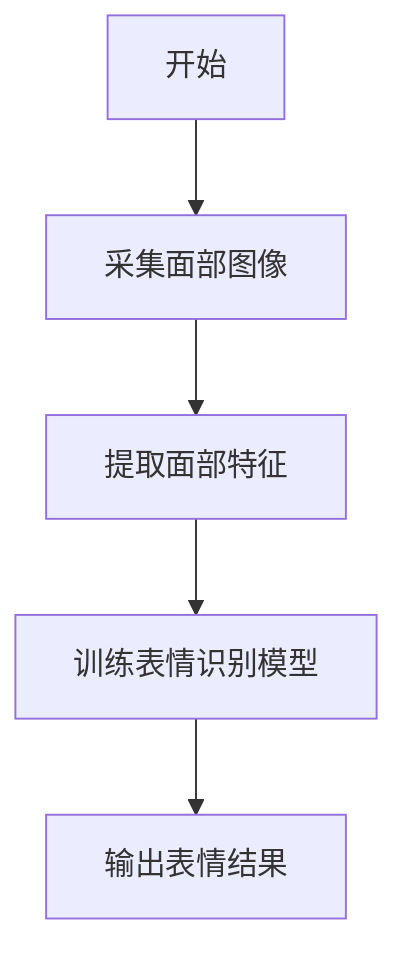
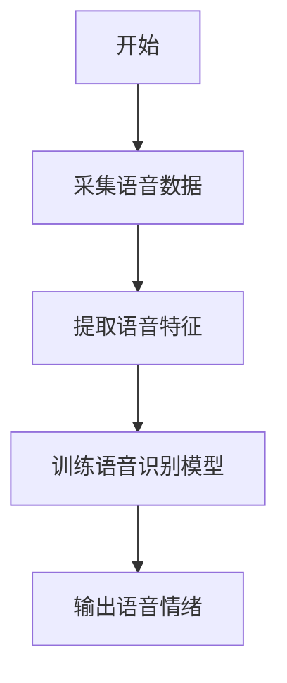
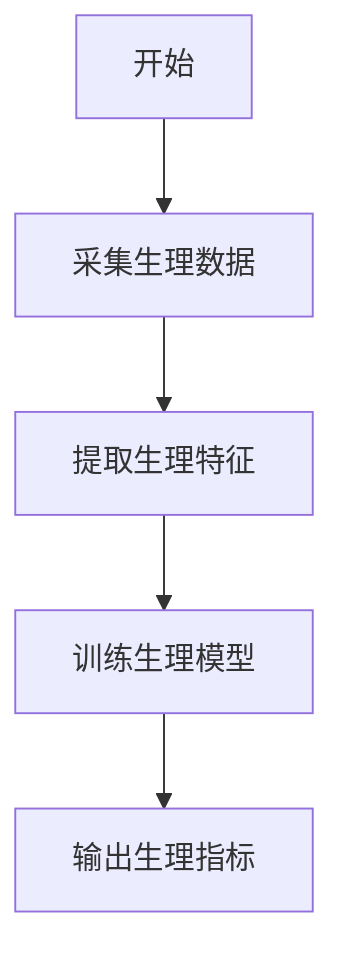
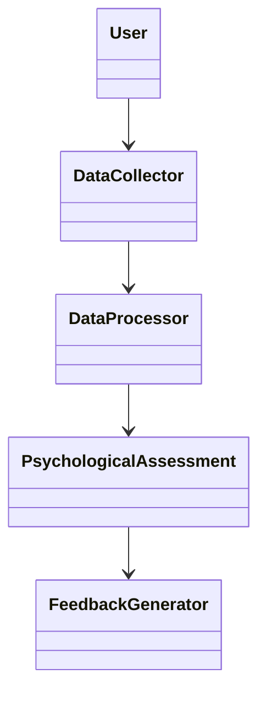
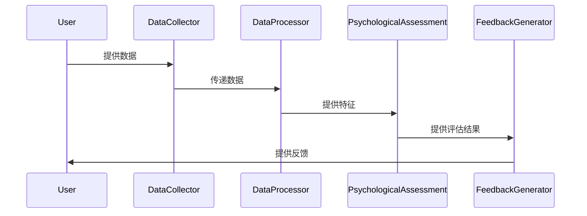

                 


# AI Agent在智能镜框中的心理状态评估

## 关键词
AI Agent, 心理状态评估, 智能镜框, 计算机视觉, 机器学习, 心理学

## 摘要
本文探讨了AI Agent在智能镜框中的应用，重点分析心理状态评估的核心技术和实现方法。通过结合心理学理论、生理指标分析和多模态感知模型，本文详细阐述了AI Agent在智能镜框中的实现原理，并通过实际案例展示了其在现实场景中的应用价值。

---

# 第一部分: AI Agent与心理状态评估概述

## 第1章: AI Agent与心理状态评估的基本概念

### 1.1 AI Agent的定义与特点

#### 1.1.1 AI Agent的基本概念
AI Agent（人工智能代理）是指能够感知环境、自主决策并执行任务的智能实体。它具备以下特点：
- **自主性**：能够自主决策，无需外部干预。
- **反应性**：能够实时感知环境并做出反应。
- **目标导向**：具备明确的目标导向性，能够优化决策以实现目标。
- **学习能力**：能够通过数据学习和优化自身行为。

#### 1.1.2 AI Agent的核心特点
1. **智能性**：AI Agent能够理解、推理和学习。
2. **交互性**：能够与用户或其他系统进行交互。
3. **适应性**：能够根据环境变化调整自身行为。
4. **可扩展性**：能够应用于多种场景和任务。

#### 1.1.3 AI Agent在智能系统中的作用
AI Agent在智能系统中主要负责信息处理、决策支持和任务执行。例如，在智能镜框中，AI Agent可以实时分析用户的生理数据和行为表现，评估其心理状态，并提供相应的反馈或建议。

### 1.2 心理状态评估的定义与方法

#### 1.2.1 心理状态评估的基本概念
心理状态评估是指通过分析个体的生理数据、行为表现和环境信息，推断其心理状态的过程。常见的心理状态包括情绪、压力水平、注意力集中度等。

#### 1.2.2 常见的心理状态评估方法
1. **基于生理指标的方法**：通过心率、皮肤电活动等生理指标分析心理状态。
2. **基于行为表现的方法**：通过用户的动作、表情和语言分析心理状态。
3. **基于问卷调查的方法**：通过用户填写的问卷了解其心理状态。

#### 1.2.3 心理状态评估的挑战与难点
1. **数据多样性**：不同个体的心理状态表现可能差异较大。
2. **数据实时性**：需要实时采集和处理数据，对系统性能要求较高。
3. **隐私保护**：心理状态评估涉及个人隐私，需确保数据安全。

### 1.3 AI Agent在心理状态评估中的应用

#### 1.3.1 AI Agent与心理状态评估的结合
AI Agent可以通过多模态感知技术（如视觉、语音和生理数据）实时分析用户的心理状态，并提供相应的反馈或建议。

#### 1.3.2 智能镜框中的心理状态评估场景
在智能镜框中，AI Agent可以通过以下方式评估用户的心理状态：
1. **视觉分析**：通过摄像头捕捉用户的面部表情和眼神变化。
2. **语音分析**：通过麦克风捕捉用户的语调和语气。
3. **生理数据采集**：通过传感器采集用户的心率和皮肤电活动。

#### 1.3.3 应用前景与潜在价值
AI Agent在智能镜框中的应用具有广阔前景，尤其是在心理健康监测、教育辅助和工作效率提升等领域。通过实时评估用户的心理状态，AI Agent可以帮助用户更好地管理情绪和压力，提升生活质量。

---

## 第2章: 心理状态评估的核心理论与技术

### 2.1 心理学基础

#### 2.1.1 心理状态的基本维度
心理状态可以从多个维度进行分析，常见的维度包括情绪、压力、注意力和动机等。

#### 2.1.2 常见的心理评估指标
1. **情绪指标**：包括快乐、悲伤、愤怒等基本情绪。
2. **压力指标**：包括压力水平和应对方式。
3. **注意力指标**：包括注意力集中度和疲劳程度。

#### 2.1.3 心理状态与行为表现的关系
心理状态与行为表现密切相关。例如，紧张的情绪可能导致用户动作迟缓，而愉悦的情绪可能导致用户动作灵活。

### 2.2 生理指标与心理状态的关系

#### 2.2.1 心理状态的生理指标分析
心理状态可以通过生理指标进行间接评估。例如：
- **心率**：紧张时心率加快。
- **皮肤电活动**：情绪波动时皮肤电活动会增加。
- **体温**：情绪激动时体温可能上升。

#### 2.2.2 生理数据采集与处理方法
1. **数据采集**：通过传感器采集心率、皮肤电活动等生理数据。
2. **数据预处理**：对采集到的数据进行降噪和标准化处理。
3. **数据特征提取**：提取数据中的特征，如均值、标准差等。

#### 2.2.3 生理数据与心理状态的关联性
生理数据与心理状态之间存在一定的关联性。通过分析生理数据，可以推断用户的心理状态。

### 2.3 AI Agent的感知模型

#### 2.3.1 基于视觉的感知模型
基于视觉的感知模型通过分析用户的面部表情和眼神变化来评估心理状态。

#### 2.3.2 基于语音的感知模型
基于语音的感知模型通过分析用户的语调、语速和语气来评估心理状态。

#### 2.3.3 多模态感知模型
多模态感知模型结合视觉、语音和生理数据等多种信息，能够更准确地评估用户的心理状态。

---

## 第3章: AI Agent的算法实现

### 3.1 数据采集与预处理

#### 3.1.1 数据采集流程
1. **用户输入**：用户通过智能镜框输入数据。
2. **数据采集**：通过摄像头、麦克风和传感器采集数据。
3. **数据预处理**：对采集到的数据进行降噪和标准化处理。

#### 3.1.2 数据特征提取
1. **视觉特征提取**：提取面部表情特征，如眼距、嘴角上扬程度等。
2. **语音特征提取**：提取语音特征，如音调、语速等。
3. **生理特征提取**：提取心率、皮肤电活动等特征。

### 3.2 算法实现

#### 3.2.1 基于表情识别的算法


#### 3.2.2 基于语音分析的算法


#### 3.2.3 基于生理数据的算法


### 3.3 算法实现代码

#### 3.3.1 基于表情识别的Python代码
```python
import cv2

def detect_emotion(image):
    # 这里实现表情识别算法
    pass
```

#### 3.3.2 基于语音分析的Python代码
```python
import speech_recognition as sr

def detect_mood(audio):
    # 这里实现语音分析算法
    pass
```

#### 3.3.3 基于生理数据的Python代码
```python
import numpy as np

def detect_physiological_state(data):
    # 这里实现生理数据分析算法
    pass
```

### 3.4 数学模型与公式

#### 3.4.1 表情特征提取的公式
$$
\text{特征提取} = f(x, y)
$$

#### 3.4.2 语音特征提取的公式
$$
\text{特征提取} = g(x, y)
$$

#### 3.4.3 生理特征提取的公式
$$
\text{特征提取} = h(x, y)
$$

---

## 第4章: 系统架构与设计

### 4.1 项目介绍

#### 4.1.1 项目背景
智能镜框是一种集成了AI技术的智能设备，能够实时评估用户的心理状态。

#### 4.1.2 项目目标
通过AI Agent实现智能镜框中的心理状态评估功能。

### 4.2 系统架构设计

#### 4.2.1 系统功能模块
1. **数据采集模块**：负责采集用户的面部图像、语音和生理数据。
2. **数据处理模块**：负责对采集到的数据进行预处理和特征提取。
3. **心理评估模块**：负责基于提取的特征评估用户的心理状态。
4. **反馈模块**：负责向用户反馈评估结果。

#### 4.2.2 系统架构图


### 4.3 系统接口设计

#### 4.3.1 数据采集接口
1. **摄像头接口**：用于采集面部图像。
2. **麦克风接口**：用于采集语音数据。
3. **传感器接口**：用于采集生理数据。

#### 4.3.2 数据处理接口
1. **特征提取接口**：用于提取数据特征。
2. **数据预处理接口**：用于对数据进行降噪和标准化处理。

### 4.4 系统交互流程

#### 4.4.1 系统交互流程图


---

## 第5章: 项目实战

### 5.1 环境搭建

#### 5.1.1 开发环境
1. **操作系统**：Windows 10或更高版本。
2. **开发工具**：PyCharm或Jupyter Notebook。
3. **依赖库**：OpenCV、SpeechRecognition、numpy等。

### 5.2 核心代码实现

#### 5.2.1 基于表情识别的代码实现
```python
import cv2

def detect_emotion(image):
    # 这里实现表情识别算法
    pass
```

#### 5.2.2 基于语音分析的代码实现
```python
import speech_recognition as sr

def detect_mood(audio):
    # 这里实现语音分析算法
    pass
```

#### 5.2.3 基于生理数据的代码实现
```python
import numpy as np

def detect_physiological_state(data):
    # 这里实现生理数据分析算法
    pass
```

### 5.3 案例分析与实际效果

#### 5.3.1 案例分析
通过实际案例分析，验证AI Agent在智能镜框中的心理状态评估功能。

#### 5.3.2 实际效果展示
展示实际应用中的效果，包括评估结果和用户反馈。

### 5.4 项目总结

#### 5.4.1 项目小结
总结项目实施过程中的经验教训，提出改进建议。

---

## 第6章: 总结与展望

### 6.1 总结
本文详细探讨了AI Agent在智能镜框中的心理状态评估技术，分析了其实现原理和应用价值。

### 6.2 未来展望
未来，随着AI技术的不断发展，AI Agent在智能镜框中的应用将更加广泛，心理状态评估的精度和效率也将进一步提升。

### 6.3 注意事项与建议
在实际应用中，需要注意数据隐私保护，确保用户数据的安全性。

---

## 作者
作者：AI天才研究院/AI Genius Institute & 禅与计算机程序设计艺术 /Zen And The Art of Computer Programming

