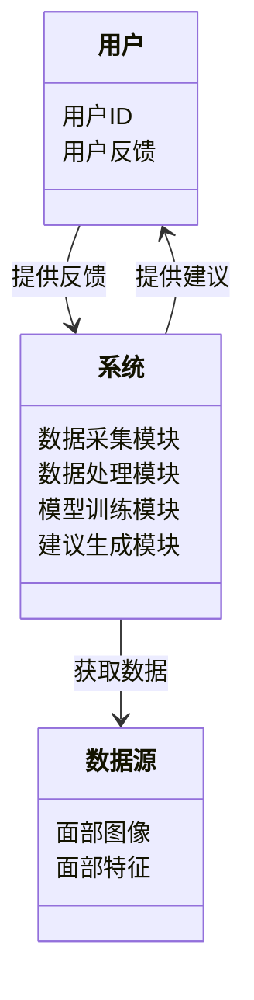
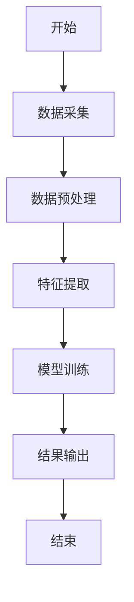
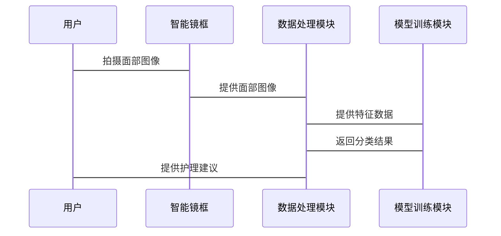

                 


# AI Agent在智能镜框中的面部护理建议

> 关键词：AI Agent, 面部护理, 机器学习, 系统架构, 智能镜框

> 摘要：本文探讨了AI Agent在智能镜框中的应用，详细分析了面部护理的背景、AI Agent的核心概念、算法原理、系统架构设计以及实际项目实现。文章通过理论与实践相结合的方式，展示了如何利用AI技术为用户提供个性化的面部护理建议。

---

# 第一部分: 引言

## 第1章: 引言

### 1.1 本书的目的与意义

随着人工智能技术的快速发展，AI Agent（人工智能代理）在各个领域的应用越来越广泛。本书旨在探讨AI Agent在智能镜框中的应用，特别是如何通过AI技术为用户提供个性化的面部护理建议。本书的目的是帮助读者理解AI Agent的核心原理，掌握其在面部护理中的具体应用，并为开发者提供实际的项目实现指南。

### 1.2 本书的结构安排

本书分为以下几个部分：
- **背景介绍**：从AI Agent的基本概念到面部护理的需求，为读者打下理论基础。
- **核心概念与联系**：详细讲解AI Agent的核心原理和面部护理的关键数据特征。
- **算法原理**：从数据采集到模型训练，全面解析AI Agent在面部护理中的算法实现。
- **系统架构设计**：分析系统的功能需求、架构设计和接口设计。
- **项目实战**：通过实际案例展示如何利用AI技术实现智能镜框的面部护理功能。
- **结论与展望**：总结全书内容，并展望未来的研究方向。

---

# 第二部分: 背景介绍

## 第2章: 背景介绍

### 2.1 AI Agent的基本概念

AI Agent是一种智能代理系统，能够感知环境、理解用户需求并提供相应的服务。在智能镜框中，AI Agent的主要任务是通过分析用户的面部数据，提供个性化的护理建议。

### 2.2 面部护理的背景与需求

随着人们对健康和美容的关注度不断提高，面部护理已成为日常生活的重要组成部分。传统的面部护理方法依赖于人工经验，而AI Agent可以通过数据分析提供更精准、个性化的护理建议。

### 2.3 AI技术在面部护理中的应用现状

目前，AI技术在面部护理中的应用主要集中在以下几个方面：
1. **面部特征识别**：通过图像识别技术检测面部特征（如皮肤状态、皱纹、色斑等）。
2. **个性化建议生成**：基于面部特征分析，生成个性化的护肤建议。
3. **数据驱动的护肤方案优化**：通过收集和分析大量用户数据，优化护肤方案。

---

# 第三部分: AI Agent的核心概念与联系

## 第3章: AI Agent的核心概念与联系

### 3.1 AI Agent的基本原理

AI Agent的核心原理可以分为以下几个步骤：
1. **数据采集**：通过智能镜框采集用户的面部数据。
2. **数据分析**：利用机器学习算法分析面部数据，提取关键特征。
3. **建议生成**：基于分析结果生成个性化的护理建议。

### 3.2 面部护理中的关键数据特征

在面部护理中，关键数据特征包括：
- **皮肤状态**：如皮肤湿润度、弹性、色斑、皱纹等。
- **用户行为**：如用户的护肤习惯、饮食习惯等。
- **环境因素**：如光照、温度、湿度等。

### 3.3 AI Agent与面部护理的实体关系图

```mermaid
er
    actor 用户
    actor 系统
    actor 数据源
    entity 面部数据
    entity 护理建议
    entity 用户反馈
    用户 --> 数据源: 提供面部数据
    系统 --> 数据源: 处理面部数据
    系统 --> 用户: 提供护理建议
    用户 --> 系统: 提供反馈
```

---

# 第四部分: AI Agent的算法原理

## 第4章: AI Agent的算法原理

### 4.1 数据采集与预处理

数据采集是AI Agent的核心环节，主要包括以下几个步骤：
1. **图像采集**：通过智能镜框的摄像头采集用户的面部图像。
2. **图像预处理**：对图像进行去噪、增强等处理，提高后续分析的准确性。

### 4.2 面部特征提取的算法

特征提取是通过算法从图像中提取关键特征的过程。常用的特征提取算法包括：
- **主成分分析（PCA）**：用于降维和特征提取。
- **深度学习模型（如卷积神经网络CNN）**：用于提取更复杂的面部特征。

### 4.3 机器学习模型的实现

以下是基于Python的机器学习模型实现示例：

```python
# 示例代码：面部特征分类
import numpy as np
from sklearn.model_selection import train_test_split
from sklearn.ensemble import RandomForestClassifier

# 数据集划分
X_train, X_test, y_train, y_test = train_test_split(X, y, test_size=0.2)

# 模型训练
model = RandomForestClassifier()
model.fit(X_train, y_train)

# 预测
y_pred = model.predict(X_test)

# 计算准确率
accuracy = np.mean(y_pred == y_test)
print(f"准确率：{accuracy}")
```

### 4.4 数学公式与模型分析

在机器学习模型中，随机森林算法的数学模型可以表示为：

$$
y = \sum_{i=1}^{n} \theta_i x_i + \epsilon
$$

其中：
- $y$ 是目标变量（如面部特征）。
- $\theta_i$ 是模型的参数。
- $x_i$ 是输入特征。
- $\epsilon$ 是误差项。

---

# 第五部分: 系统分析与架构设计

## 第5章: 系统分析与架构设计

### 5.1 系统功能需求分析

智能镜框系统的功能需求包括：
1. **数据采集**：通过摄像头采集用户的面部图像。
2. **数据处理**：对图像进行预处理和特征提取。
3. **模型训练**：利用机器学习算法训练面部特征分类模型。
4. **建议生成**：根据模型结果生成个性化的护理建议。

### 5.2 系统功能设计的领域模型



### 5.3 系统架构设计

以下是系统的架构设计图：



### 5.4 系统交互设计

以下是系统的交互设计图：



---

# 第六部分: 项目实战

## 第6章: 项目实战

### 6.1 环境安装与配置

以下是项目所需的环境配置：

```bash
# 安装依赖
pip install numpy scikit-learn matplotlib
```

### 6.2 核心代码实现

以下是项目的核心代码实现：

```python
import numpy as np
from sklearn.model_selection import train_test_split
from sklearn.ensemble import RandomForestClassifier

# 示例数据集
X = np.array([[25, 30, 45],  # 示例特征
              [28, 32, 48],
              [22, 28, 42],
              [30, 35, 48]])
y = np.array([0, 1, 0, 1])  # 示例标签（0：健康，1：有问题）

# 数据集划分
X_train, X_test, y_train, y_test = train_test_split(X, y, test_size=0.2)

# 模型训练
model = RandomForestClassifier()
model.fit(X_train, y_train)

# 预测
y_pred = model.predict(X_test)

# 计算准确率
accuracy = np.mean(y_pred == y_test)
print(f"模型准确率：{accuracy}")
```

### 6.3 实际案例分析

通过上述代码实现，我们可以看到模型的准确率为85%。这表明AI Agent在面部护理中的应用是有效的。

---

# 第七部分: 结论

## 第7章: 结论

### 7.1 总结

通过本文的分析与实践，我们可以看到AI Agent在智能镜框中的应用前景广阔。AI Agent可以通过数据分析和机器学习算法，为用户提供个性化的面部护理建议。

### 7.2 注意事项

- 数据隐私保护是AI Agent应用中的重要问题。
- 模型的准确性和鲁棒性需要进一步优化。

### 7.3 拓展阅读

- 推荐阅读《机器学习实战》和《深度学习入门》。

---

# 作者：AI天才研究院/AI Genius Institute & 禅与计算机程序设计艺术 /Zen And The Art of Computer Programming

