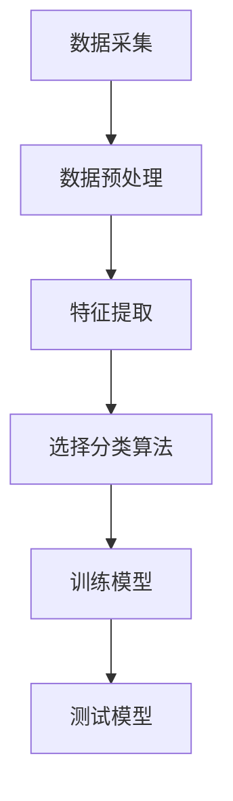
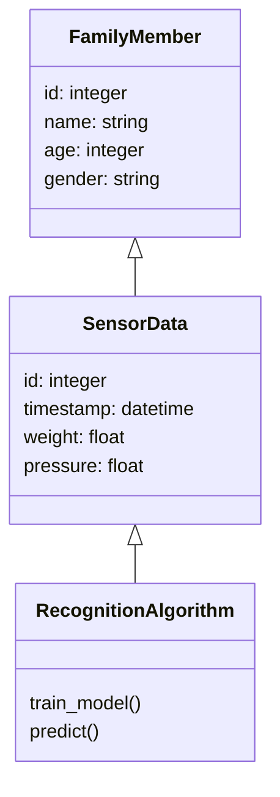
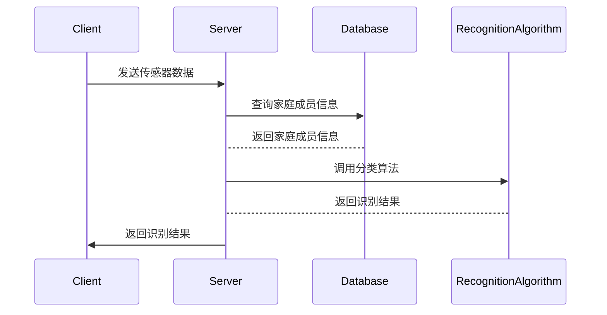

                 


# AI Agent在智能门垫中的家庭成员识别

## 关键词：AI Agent，智能门垫，家庭成员识别，传感器数据，分类算法

## 摘要：
本文详细探讨了AI Agent在智能门垫中的家庭成员识别技术。从背景介绍到核心概念，从算法原理到系统架构设计，再到项目实战，系统地阐述了如何利用AI技术实现智能门垫的家庭成员识别功能。文章通过详细的理论分析和实际案例，展示了AI Agent在智能门垫中的应用价值和实现方法。

---

# 正文

## 第一部分：AI Agent与智能门垫的家庭成员识别背景

### 第1章：AI Agent与智能门垫的家庭成员识别背景

#### 1.1 问题背景与描述

##### 1.1.1 智能门垫的定义与工作原理
智能门垫是一种智能家居设备，通过传感器检测人员的重量、压力等信息，并通过AI算法识别家庭成员的身份。智能门垫通常安装在门口，可以与智能家居系统联动，实现个性化的家庭服务。

##### 1.1.2 家庭成员识别的需求与重要性
家庭成员识别是智能家居的核心功能之一。通过识别不同的家庭成员，智能门垫可以实现个性化的门禁控制、智能家电调节、健康监测等功能，提升家庭生活的智能化水平。

##### 1.1.3 当前家庭成员识别技术的局限性
传统的家庭成员识别技术主要依赖于重量传感器和简单的阈值判断，存在误识别率高、适应性差等问题。AI Agent的引入可以有效解决这些问题，实现更精准的家庭成员识别。

#### 1.2 问题解决与边界

##### 1.2.1 AI Agent在智能门垫中的作用
AI Agent通过传感器数据的实时采集、特征提取和分类算法，实现家庭成员的精准识别。AI Agent可以动态调整识别模型，适应不同家庭成员的行为习惯和体重变化。

##### 1.2.2 家庭成员识别的边界与外延
家庭成员识别的边界包括设备的传感器数据采集范围、识别算法的适用场景以及系统的响应时间。外延则包括与其他智能家居设备的联动、数据的安全性保护等。

##### 1.2.3 核心概念与关键问题
家庭成员识别的核心概念包括传感器数据的特征提取、AI Agent的分类算法以及系统的实时性要求。关键问题包括如何提高识别精度、降低计算复杂度以及确保系统的稳定性。

#### 1.3 核心概念结构与组成

##### 1.3.1 AI Agent的核心要素
AI Agent在智能门垫中的核心要素包括传感器数据采集模块、特征提取模块、分类算法模块以及反馈机制模块。

##### 1.3.2 智能门垫的家庭成员识别系统架构
智能门垫的家庭成员识别系统架构包括硬件层、数据处理层、算法层和应用层。硬件层负责传感器数据的采集，数据处理层负责数据的预处理和特征提取，算法层负责家庭成员的识别，应用层负责系统的联动控制。

##### 1.3.3 问题解决的逻辑流程
问题解决的逻辑流程包括数据采集、特征提取、分类识别和结果反馈四个步骤。AI Agent通过实时采集传感器数据，提取特征后进行分类识别，并根据识别结果反馈到系统中。

## 第二部分：AI Agent与家庭成员识别的核心概念

### 第2章：AI Agent的核心原理与技术

#### 2.1 AI Agent的基本原理

##### 2.1.1 AI Agent的定义与分类
AI Agent是一种智能体，能够通过感知环境、自主决策并执行任务。AI Agent可以分为基于规则的Agent和基于学习的Agent两类。

##### 2.1.2 AI Agent的核心技术特点
AI Agent的核心技术特点包括自主性、反应性、目标导向性和学习能力。AI Agent能够根据环境的变化动态调整自己的行为。

##### 2.1.3 AI Agent与传统算法的区别
AI Agent与传统算法的区别在于其智能化和适应性。AI Agent能够通过学习和自适应算法，实现更复杂的任务。

#### 2.2 传感器数据处理与特征提取

##### 2.2.1 智能门垫的传感器类型与数据特征
智能门垫的传感器类型包括压力传感器、重量传感器等。传感器数据的特征包括时间戳、压力值、重量值等。

##### 2.2.2 数据预处理与特征提取方法
数据预处理包括去除噪声、归一化等。特征提取方法包括主成分分析（PCA）、奇异值分解（SVD）等。

##### 2.2.3 数据特征的对比分析
通过对比分析不同特征提取方法的效果，选择最优的特征提取方法。

#### 2.3 家庭成员识别的核心算法

##### 2.3.1 基于AI Agent的分类算法
常用的分类算法包括K-近邻算法（KNN）、支持向量机（SVM）、随机森林等。

##### 2.3.2 算法的优缺点对比
通过对比分析不同分类算法的优缺点，选择适合家庭成员识别的算法。

##### 2.3.3 算法的适用场景与限制
基于AI Agent的分类算法适用于实时性要求不高但需要高精度识别的场景。

#### 2.4 核心概念的ER实体关系图

```mermaid
er
    actor FamilyMember {
        id: integer
        name: string
        age: integer
        gender: string
    }
    actor SensorData {
        id: integer
        timestamp: datetime
        weight: float
        pressure: float
    }
    relation Has {
        from FamilyMember
        to SensorData
        role: "产生"
    }
```

---

## 第三部分：AI Agent与家庭成员识别的算法原理

### 第3章：AI Agent的家庭成员识别算法原理

#### 3.1 数据预处理与特征提取

##### 3.1.1 数据预处理
数据预处理包括去除噪声、归一化等步骤，确保数据的准确性。

##### 3.1.2 特征提取
通过主成分分析（PCA）等方法提取传感器数据的特征，降低数据维度。

##### 3.1.3 特征选择
选择最优的特征，提高分类算法的准确率。

#### 3.2 分类算法实现

##### 3.2.1 K-近邻算法（KNN）
K-近邻算法是一种简单有效的分类算法，适用于小规模数据集。

##### 3.2.2 支持向量机（SVM）
支持向量机是一种强大的分类算法，适用于高维数据。

##### 3.2.3 随机森林
随机森林是一种基于决策树的集成算法，具有较高的准确率和鲁棒性。

#### 3.3 算法实现的数学模型

##### 3.3.1 KNN算法的数学模型
$$
\text{距离} = \sqrt{(x_2 - x_1)^2 + (y_2 - y_1)^2}
$$

##### 3.3.2 SVM算法的数学模型
$$
\text{损失函数} = \sum_{i=1}^{n} \max(0, 1 - y_i w^T x_i - b)
$$

##### 3.3.3 随机森林算法的数学模型
$$
\text{预测值} = \sum_{i=1}^{n} \text{投票结果}
$$

#### 3.4 算法实现的步骤

##### 3.4.1 数据预处理
1. 采集传感器数据
2. 去除噪声
3. 归一化处理

##### 3.4.2 特征提取
1. 应用PCA进行特征提取
2. 选择最优特征

##### 3.4.3 分类算法实现
1. 选择分类算法
2. 训练模型
3. 测试模型

#### 3.5 算法实现的流程图



---

## 第四部分：AI Agent与家庭成员识别的系统架构设计

### 第4章：AI Agent的家庭成员识别系统架构设计

#### 4.1 问题场景介绍
智能门垫的家庭成员识别系统需要实时采集传感器数据，通过AI Agent进行分类识别，并根据识别结果进行相应的联动控制。

#### 4.2 项目介绍
本项目旨在通过AI Agent实现智能门垫的家庭成员识别功能，提升智能家居的智能化水平。

#### 4.3 系统功能设计

##### 4.3.1 领域模型类图


##### 4.3.2 系统架构图


#### 4.4 系统接口设计

##### 4.4.1 API接口设计
```http
GET /api/family_members
POST /api/sensor_data
```

##### 4.4.2 接口交互流程
1. 客户端发送传感器数据到服务器
2. 服务器调用分类算法进行识别
3. 返回识别结果

#### 4.5 系统交互序列图



---

## 第五部分：AI Agent与家庭成员识别的项目实战

### 第5章：AI Agent的家庭成员识别项目实战

#### 5.1 环境安装

##### 5.1.1 Python环境安装
安装Python 3.x及以上版本，安装所需的库：numpy、scikit-learn、mermaid等。

##### 5.1.2 开发工具配置
配置Jupyter Notebook或PyCharm作为开发工具。

#### 5.2 系统核心实现源代码

##### 5.2.1 数据预处理代码
```python
import numpy as np

def preprocess_data(data):
    # 去除噪声
    filtered_data = np.where(abs(data - np.mean(data)) < np.std(data), data, np.nan)
    # 归一化处理
    normalized_data = (filtered_data - np.min(filtered_data)) / (np.max(filtered_data) - np.min(filtered_data))
    return normalized_data
```

##### 5.2.2 特征提取代码
```python
from sklearn.decomposition import PCA

def extract_features(data):
    pca = PCA(n_components=2)
    features = pca.fit_transform(data)
    return features
```

##### 5.2.3 分类算法实现代码
```python
from sklearn.neighbors import KNeighborsClassifier

def train_knn_model(X_train, y_train):
    knn = KNeighborsClassifier(n_neighbors=3)
    knn.fit(X_train, y_train)
    return knn

def predict_knn_model(model, X_test):
    y_pred = model.predict(X_test)
    return y_pred
```

#### 5.3 代码应用解读与分析
通过上述代码实现数据预处理、特征提取和分类算法的训练与预测。数据预处理确保了数据的准确性，特征提取降低了数据维度，分类算法实现了家庭成员的识别。

#### 5.4 实际案例分析和详细讲解剖析
以实际案例为例，详细讲解如何通过上述代码实现家庭成员的识别，并分析结果的准确性。

#### 5.5 项目小结
通过本项目的实战，读者可以掌握AI Agent在智能门垫中的家庭成员识别技术，提升自己的编程和AI算法应用能力。

---

## 第六部分：AI Agent与家庭成员识别的总结与展望

### 第6章：AI Agent的家庭成员识别总结与展望

#### 6.1 本章小结
通过本文的详细讲解，读者可以全面了解AI Agent在智能门垫中的家庭成员识别技术，掌握核心概念、算法原理和系统架构设计。

#### 6.2 最佳实践 tips
1. 数据预处理是关键，确保数据的准确性。
2. 特征提取可以提高分类算法的准确率。
3. 选择合适的分类算法，根据实际场景进行调整。

#### 6.3 注意事项
1. 数据安全是需要重点关注的问题。
2. 系统的实时性和稳定性需要保证。
3. 算法的可扩展性需要考虑。

#### 6.4 未来展望
随着AI技术的不断发展，家庭成员识别技术将更加智能化和精准化。未来的研究方向包括算法优化、数据安全保护、系统集成与联动等方面。

---

## 作者：AI天才研究院/AI Genius Institute & 禅与计算机程序设计艺术 /Zen And The Art of Computer Programming

