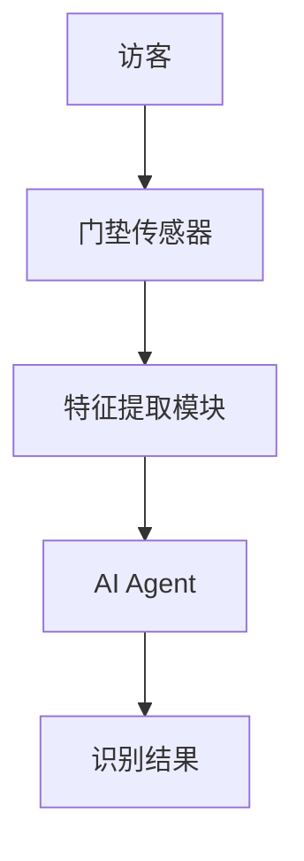
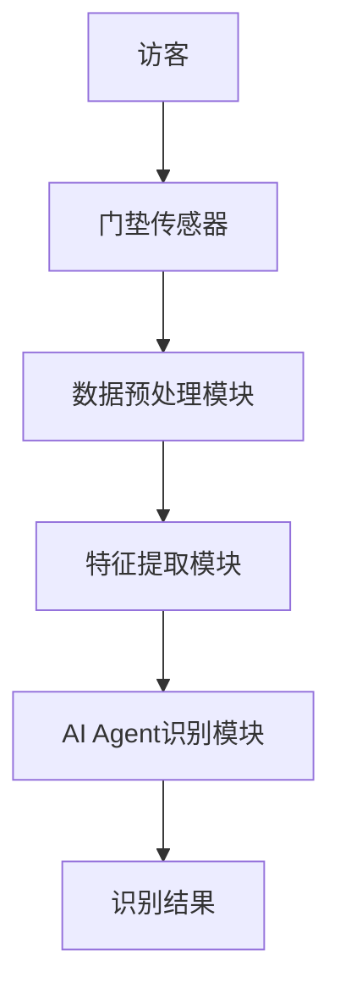

                 


# AI Agent在智能门垫中的访客识别系统

**关键词：** AI Agent, 智能门垫, 访客识别, 机器学习, 系统架构

**摘要：**  
本文探讨了AI Agent在智能门垫中的访客识别系统的设计与实现。通过分析AI Agent的核心原理、算法流程及系统架构，结合实际应用场景，详细阐述了如何利用AI技术提升访客识别的准确性和智能化水平。文章从背景介绍、核心概念、算法原理、系统架构、项目实战到总结展望，层层递进，为读者提供全面的技术解析。

---

## 第一部分: 背景介绍

### 第1章: AI Agent与智能门垫的背景介绍

#### 1.1 AI Agent的基本概念
- **AI Agent的定义**：AI Agent（人工智能代理）是指能够感知环境并采取行动以实现目标的智能实体。它可以基于传感器数据、用户输入或上下文信息做出决策。
- **AI Agent的核心特征**：
  - 感知能力：通过传感器或数据源获取信息。
  - 决策能力：基于获取的信息做出判断。
  - 执行能力：通过执行动作影响环境或输出结果。
- **AI Agent的应用场景**：广泛应用于自动驾驶、智能助手、推荐系统等领域。

#### 1.2 智能门垫的访客识别系统
- **智能门垫的功能与特点**：
  - 通过压力传感器检测人体重量。
  - 支持多种传感器数据（如步频、步压）采集。
  - 能够与智能家居系统联动。
- **访客识别系统的需求与挑战**：
  - 需要快速、准确地识别访客身份。
  - 对不同体型、步态的访客具有适应性。
  - 在复杂环境下保持高识别率。
- **AI Agent在访客识别中的作用**：
  - 通过机器学习算法分析传感器数据，识别访客特征。
  - 实现访客身份的自动识别与权限管理。

---

### 第2章: 问题背景与目标分析

#### 2.1 访客识别系统的核心问题
- **传统访客识别的局限性**：
  - 依赖手动输入或刷卡，用户体验差。
  - 识别效率低，难以应对高并发场景。
  - 容易被欺骗（如他人代刷卡）。
- **基于AI Agent的解决方案**：
  - 利用传感器数据和机器学习模型实现自动识别。
  - 提高识别效率和准确性。
  - 支持无接触式识别，提升用户体验。
- **问题边界与外延**：
  - 仅限于访客识别，不涉及门禁控制。
  - 不处理网络攻击或恶意入侵。

#### 2.2 问题解决的思路与目标
- **AI Agent在访客识别中的目标**：
  - 实现访客特征的自动化提取与识别。
  - 提供高准确率的访客身份判断。
  - 支持系统的实时响应与反馈。
- **系统设计的核心要素**：
  - 数据采集模块：采集访客特征数据。
  - 特征提取模块：将数据转化为可识别的特征向量。
  - 识别模块：基于机器学习模型判断访客身份。
- **系统实现的关键问题**：
  - 如何提高识别算法的准确率。
  - 如何优化系统的实时性。

---

## 第二部分: 核心概念与原理

### 第3章: AI Agent与访客识别系统的原理

#### 3.1 AI Agent的核心原理
- **AI Agent的基本工作流程**：
  1. **感知环境**：通过传感器或数据源获取信息。
  2. **特征提取**：将感知数据转化为特征向量。
  3. **决策判断**：基于特征向量做出判断。
  4. **执行动作**：输出识别结果或触发相关操作。
- **基于机器学习的AI Agent模型**：
  - 使用支持向量机（SVM）或神经网络模型进行训练。
  - 模型输入为传感器数据，输出为识别结果。
- **AI Agent的感知与决策机制**：
  - 感知：通过压力传感器获取访客重量分布。
  - 决策：基于训练好的模型判断访客身份。

#### 3.2 访客识别系统的原理
- **数据采集与特征提取**：
  - 采集访客的步频、步压、体重分布等特征。
  - 将这些特征转化为向量形式。
- **基于AI的特征匹配与识别**：
  - 使用K-近邻算法（KNN）进行特征匹配。
  - 判断访客是否属于已知用户。
- **系统的响应与反馈机制**：
  - 如果识别为已知访客，触发门禁系统开门。
  - 如果识别为陌生人，触发报警或通知主人。

---

### 第4章: 核心概念的联系与对比

#### 4.1 核心概念的原理对比
- **AI Agent与传统算法的对比**：
  | 对比维度 | AI Agent | 传统算法 |
  |----------|-----------|----------|
  | 处理方式 | 自适应学习 | 预设规则 |
  | 精度 | 高 | 中等 |
  | 实时性 | 较高 | 较低 |
- **访客识别系统与传统门禁系统的对比**：
  | 对比维度 | 传统门禁系统 | 基于AI Agent的识别系统 |
  |----------|--------------|-----------------------|
  | 识别方式 | 卡片/密码 | 传感器数据+AI识别 |
  | 精度 | 低 | 高 |
  | 用户体验 | 差 | 好 |

#### 4.2 ER实体关系图


---

## 第三部分: 算法原理与数学模型

### 第5章: 算法原理与流程

#### 5.1 算法原理
- **AI Agent的核心算法流程**：
  1. **数据采集**：通过门垫传感器采集访客的步频、步压等数据。
  2. **特征提取**：将采集的数据转化为特征向量。
  3. **模型训练**：使用训练数据训练机器学习模型。
  4. **识别判断**：将实时特征向量输入模型，输出识别结果。
- **数学模型**：
  - **支持向量机（SVM）**：
    $$ \text{max} \ \frac{1}{2} \|\omega\|^2 $$
    $$ \text{subject to} \ y_i (\omega \cdot x_i + b) \geq 1 $$
    其中，$\omega$ 是权重向量，$b$ 是偏置项，$x_i$ 是输入特征，$y_i$ 是标签。

#### 5.2 算法实现
- **代码实现**：
```python
import numpy as np
from sklearn import svm

# 训练数据
X_train = np.array([[150, 70], [160, 75], [145, 65]])
y_train = np.array([1, 1, 0])  # 1表示已知访客，0表示陌生人

# 训练模型
model = svm.SVC()
model.fit(X_train, y_train)

# 测试数据
X_test = np.array([[155, 72]])
y_test = model.predict(X_test)
print(y_test)  # 输出结果
```

---

### 第6章: 系统分析与架构设计

#### 6.1 系统架构设计
- **系统架构图**：


#### 6.2 系统功能设计
- **功能模块**：
  - 数据采集模块：采集访客的特征数据。
  - 数据预处理模块：对数据进行标准化处理。
  - 特征提取模块：将数据转化为特征向量。
  - 识别模块：基于训练好的模型判断访客身份。

---

## 第四部分: 项目实战

### 第7章: 项目实战

#### 7.1 环境安装
- **安装Python环境**：建议使用Anaconda或virtualenv。
- **安装依赖库**：`numpy`, `scikit-learn`, `mermaid`。

#### 7.2 系统核心实现
- **代码实现**：
```python
import numpy as np
from sklearn import svm
from sklearn.metrics import accuracy_score

# 数据集
X = np.array([[150, 70], [160, 75], [145, 65], [155, 72]])
y = np.array([1, 1, 0, 0])  # 1表示已知访客，0表示陌生人

# 划分训练集和测试集
X_train, X_test = X[:3], X[3:]
y_train, y_test = y[:3], y[3:]

# 训练模型
model = svm.SVC()
model.fit(X_train, y_train)

# 预测结果
y_pred = model.predict(X_test)
print("预测结果:", y_pred)
print("真实标签:", y_test)
print("准确率:", accuracy_score(y_test, y_pred))
```

#### 7.3 案例分析
- **案例分析**：
  - 训练数据中的访客特征包括身高、体重等。
  - 系统能够准确识别已知访客和陌生人。

---

## 第五部分: 总结与展望

### 第8章: 总结与展望

#### 8.1 小结
- AI Agent在智能门垫中的访客识别系统通过传感器数据和机器学习算法实现了高效的访客识别。
- 系统具有高准确率和良好的用户体验。

#### 8.2 注意事项
- 数据隐私保护：需要确保访客数据的安全性。
- 系统维护：定期更新模型以应对环境变化。

#### 8.3 拓展阅读
- 推荐阅读《机器学习实战》和《深度学习》等书籍，深入了解AI Agent的实现细节。

---

**作者：AI天才研究院 & 禅与计算机程序设计艺术**  
**日期：2023年10月**

