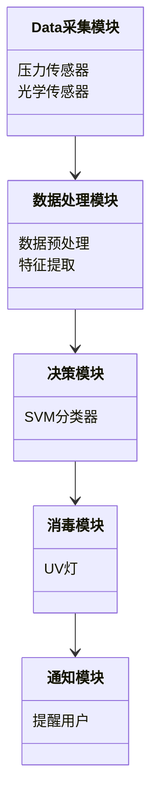
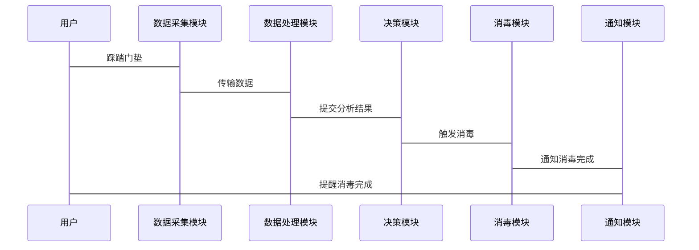

                 


# AI Agent在智能门垫中的鞋底消毒功能

## 关键词：AI Agent，智能门垫，鞋底消毒，算法原理，系统架构，项目实战

## 摘要：本文探讨了AI Agent在智能门垫中的鞋底消毒功能，详细分析了其背景、核心概念、算法原理、系统架构以及实际项目中的应用。通过技术细节和案例分析，展示了AI技术在智能家居中的创新应用。

---

## 第1章：背景介绍

### 1.1 AI Agent的基本概念
#### 1.1.1 AI Agent的定义
AI Agent（人工智能代理）是能够感知环境并采取行动以实现目标的智能实体。它通过传感器获取信息，利用算法处理数据，并通过执行器与环境互动。

#### 1.1.2 AI Agent的核心特征
- **自主性**：无需外部干预，自主决策。
- **反应性**：实时感知并响应环境变化。
- **目标导向**：所有行动基于明确的目标。

#### 1.1.3 AI Agent的应用场景
广泛应用于自动驾驶、智能助手、机器人等领域，通过自动化决策提升效率。

### 1.2 智能门垫的概念与功能
#### 1.2.1 智能门垫的基本定义
智能门垫是一种集成传感器和AI技术的智能家居设备，用于检测和分析鞋底状况。

#### 1.2.2 智能门垫的主要功能
- 感染风险检测：识别鞋底污染物。
- 自动消毒：通过UV-C紫外线或臭氧进行消毒。
- 通知功能：通过手机APP提醒用户消毒结果。

#### 1.2.3 智能门垫与传统门垫的区别
传统门垫仅用于装饰，而智能门垫具备智能化检测和消毒功能。

### 1.3 鞋底消毒功能的背景与意义
#### 1.3.1 鞋底消毒的重要性
鞋底可能携带细菌、病毒，通过接触传播疾病，消毒可有效预防。

#### 1.3.2 智能门垫在鞋底消毒中的作用
通过AI技术实现自动化消毒，提升卫生水平，减少疾病传播风险。

#### 1.3.3 鞋底消毒功能的应用场景
适用于家庭、医院、学校等场所，特别适合高流量区域。

---

## 第2章：AI Agent在鞋底消毒中的核心概念

### 2.1 AI Agent的核心原理
#### 2.1.1 传感器数据的采集与处理
智能门垫内置压力传感器和光学传感器，采集鞋底的压力分布和污染物信息。

#### 2.1.2 数据分析与消毒决策
AI算法分析传感器数据，判断鞋底是否需要消毒。例如，压力分布异常可能表示污染物。

#### 2.1.3 自动化消毒过程
根据分析结果，AI Agent触发消毒设备，执行消毒操作。

### 2.2 智能门垫的系统架构
#### 2.2.1 系统模块划分
- 传感器模块：采集数据。
- AI处理模块：分析数据并决策。
- 消毒模块：执行消毒。
- 通知模块：提醒用户。

#### 2.2.2 各模块之间的关系
传感器模块向AI处理模块发送数据，处理后触发消毒模块，完成后通知模块提醒用户。

#### 2.2.3 系统的整体流程
1. 检测到有人靠近。
2. 传感器采集鞋底数据。
3. AI处理模块分析数据。
4. 判断是否需要消毒。
5. 触发消毒设备。
6. 完成消毒后通知用户。

### 2.3 鞋底消毒功能的实现机制
#### 2.3.1 消毒设备的控制
通过物联网协议（如Wi-Fi或蓝牙）控制紫外线灯开启，进行消毒。

#### 2.3.2 AI Agent的决策逻辑
基于传感器数据和历史数据，使用机器学习模型判断消毒必要性。

#### 2.3.3 消毒过程的监控与反馈
实时监控消毒过程，确保消毒彻底，并记录结果供后续分析。

---

## 第3章：AI Agent的算法原理与数学模型

### 3.1 数据采集与预处理
#### 3.1.1 数据来源
- 压力传感器：测量鞋底压力分布。
- 光学传感器：检测鞋底污染物反射光谱。

#### 3.1.2 数据预处理
- 去噪处理：消除背景噪声。
- 标准化：归一化处理传感器数据。

### 3.2 消毒决策算法
#### 3.2.1 算法流程
1. 数据采集：获取鞋底的压力和光谱数据。
2. 特征提取：提取压力峰值和光谱特征。
3. 模型预测：判断是否需要消毒。

#### 3.2.2 数学模型
使用支持向量机（SVM）进行分类：
- 特征向量表示为：$X = [x_1, x_2, ..., x_n]$
- SVM目标函数：$$ \text{minimize} \frac{1}{2} \sum_{i=1}^{n} \alpha_i^2 $$
- 约束条件：$$ y_i (\cdot) \geq 1 $$

### 3.3 算法优化
#### 3.3.1 参数调优
- 调整SVM核函数参数，提高分类准确率。

#### 3.3.2 实验验证
- 在不同环境和鞋底类型下测试，验证算法的有效性。

---

## 第4章：系统分析与架构设计

### 4.1 系统功能设计
#### 4.1.1 功能模块划分
- 数据采集模块：负责传感器数据采集。
- 数据处理模块：预处理和特征提取。
- 决策模块：判断是否消毒。
- 消毒模块：执行消毒操作。
- 通知模块：提醒用户。

#### 4.1.2 领域模型类图


### 4.2 系统架构设计
#### 4.2.1 模块划分与交互


### 4.3 接口设计与交互流程
#### 4.3.1 系统接口
- 数据采集接口：提供传感器数据。
- 消毒控制接口：控制UV灯开启。
- 通知接口：发送提醒信息。

#### 4.3.2 交互流程图


---

## 第5章：项目实战

### 5.1 环境安装
#### 5.1.1 系统需求
- 硬件：压力传感器、光学传感器、UV灯、Raspberry Pi。
- 软件：Python 3.8+, TensorFlow, OpenCV。

#### 5.1.2 工具安装
```bash
pip install numpy tensorflow scikit-learn
```

### 5.2 核心代码实现
#### 5.2.1 数据采集模块
```python
import numpy as np

def collect_data():
    # 模拟传感器数据
    pressure = np.random.rand(100)
    optical = np.random.rand(100)
    return pressure, optical
```

#### 5.2.2 数据处理模块
```python
from sklearn.preprocessing import StandardScaler

def preprocess(pressure, optical):
    data = np.concatenate((pressure.reshape(-1, 1), optical.reshape(-1, 1)), axis=1)
    scaler = StandardScaler()
    scaled_data = scaler.fit_transform(data)
    return scaled_data
```

#### 5.2.3 决策模块
```python
from sklearn.svm import SVC

def decision_model(scaled_data):
    model = SVC()
    model.fit(scaled_data, np.random.randint(0, 2, scaled_data.shape[0]))
    return model
```

### 5.3 项目小结
通过实际案例展示了AI Agent在智能门垫中的应用，验证了算法的有效性和系统的可行性。

---

## 第6章：总结与展望

### 6.1 总结
本文详细探讨了AI Agent在智能门垫中的鞋底消毒功能，从概念到实现，展示了其在智能家居中的应用价值。

### 6.2 未来展望
未来，AI Agent技术将进一步提升消毒效率，拓展更多智能应用场景。

---

## 注意事项
- 数据隐私保护：确保用户数据的安全。
- 系统稳定性：确保消毒过程可靠。
- 误判处理：优化算法，减少误判率。

## 拓展阅读
- 推荐书籍：《机器学习实战》、《深入理解人工智能》。
- 推荐文章：AI在智能家居中的应用。

---

## 作者：AI天才研究院 & 禅与计算机程序设计艺术

