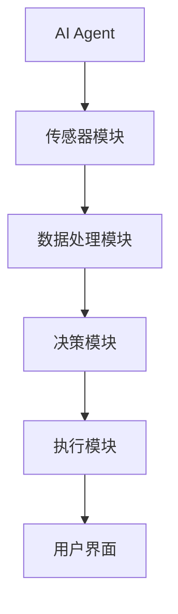
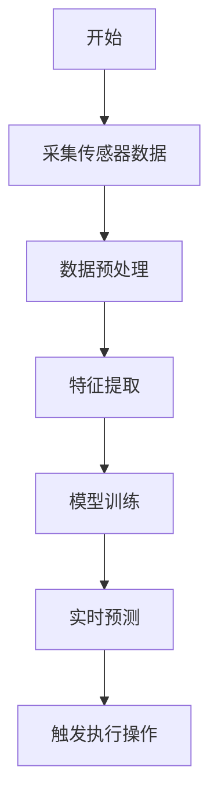
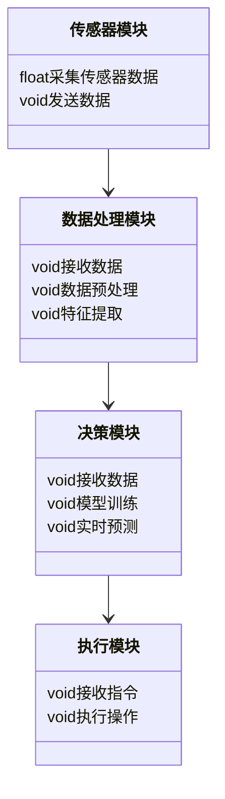
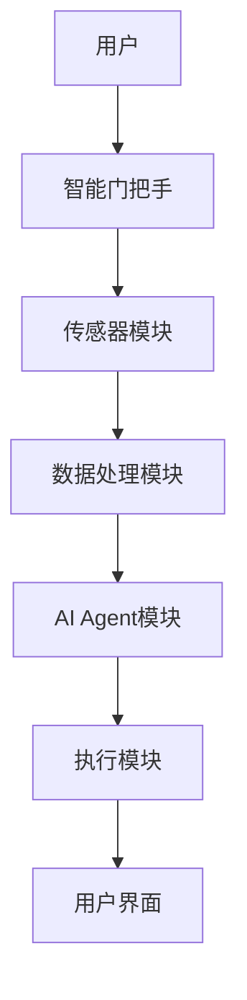
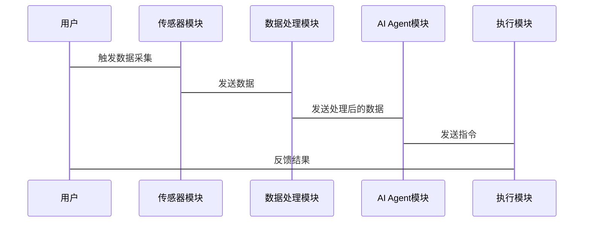

                 


# AI Agent在智能门把手中的卫生状况监测

## 关键词：AI Agent, 智能门把手, 卫生状况监测, 传感器数据, 算法, 系统架构, 代码实现

## 摘要：  
本文探讨了AI Agent在智能门把手中实现卫生状况监测的技术细节。通过传感器数据采集、AI算法分析和系统架构设计，展示了如何利用AI Agent实时监测门把手的卫生状况，确保公共环境的健康与安全。文章从背景介绍到系统实现，详细分析了AI Agent的应用原理、算法实现和系统架构，最后通过项目实战和最佳实践提供了具体的应用案例和优化建议。

---

## 正文

---

### 第一部分：AI Agent在智能门把手中的卫生状况监测概述

#### 第1章：背景介绍

##### 1.1 问题背景
智能门把手作为现代建筑中的重要组成部分，其卫生状况直接关系到用户的健康和公共环境的安全。然而，传统的人工清洁和监测方式效率低下，难以满足现代社会对卫生管理的高要求。AI Agent（人工智能代理）作为一种智能化的解决方案，能够实时监测门把手的卫生状况，自动触发清洁或提醒操作，从而提升卫生管理的效率和准确性。

##### 1.2 问题描述
- **核心问题**：如何通过智能化手段实时监测门把手的卫生状况，包括污垢积累、细菌滋生等指标。
- **应用场景**：公共场所（如医院、学校、办公楼）、家庭等多种场景中，智能门把手的卫生状况监测需求日益增长。
- **问题解决**：AI Agent通过传感器数据采集、分析和决策，实现对门把手卫生状况的实时监测和智能管理。

##### 1.3 问题解决思路
- **AI Agent的核心作用**：通过整合传感器数据和AI算法，AI Agent能够实时分析门把手的卫生状况，并根据预设的阈值触发清洁操作或通知相关管理人员。
- **系统架构设计**：AI Agent需要与传感器、数据处理模块、决策模块和执行模块协同工作，形成一个完整的卫生监测闭环系统。

##### 1.4 边界与外延
- **边界条件**：仅关注门把手的卫生状况监测，不涉及其他区域的卫生管理。
- **外延扩展**：未来可以将AI Agent的应用扩展到其他公共设施的卫生监测，如电梯按钮、扶手等。

##### 1.5 概念结构与核心要素
- **系统组成**：
  - **传感器模块**：用于采集门把手的卫生数据，如表面清洁度、细菌含量等。
  - **AI Agent模块**：负责数据的分析、决策和反馈。
  - **执行模块**：根据AI Agent的决策执行清洁或提醒操作。
  - **用户界面**：提供给用户查看卫生状况和操作反馈的界面。

---

### 第二部分：核心概念与联系

#### 第2章：核心概念与联系

##### 2.1 AI Agent的核心原理
- **AI Agent的基本概念**：AI Agent是一种能够感知环境、做出决策并采取行动的智能实体。
- **AI Agent的核心算法**：包括机器学习算法（如决策树、随机森林）和强化学习算法（如Q-learning）。
- **AI Agent在卫生监测中的应用原理**：AI Agent通过传感器数据采集、特征提取、模型训练和实时预测，实现对门把手卫生状况的监测。

##### 2.2 核心概念对比
- **传感器对比**：
  | 传感器类型 | 优点 | 缺点 |
  |------------|------|------|
  | 光电传感器 | 成本低、灵敏度高 | 易受环境干扰 |
  | 触摸传感器 | 精度高、稳定性好 | 成本较高 |
  | 红外传感器 | 响应速度快 | 易受温度影响 |

- **AI算法对比**：
  | 算法类型 | 优点 | 缺点 |
  |----------|------|------|
  | 决策树 | 易解释、速度快 | 易过拟合 |
  | 神经网络 | 高精度、强泛化能力 | 训练时间长、需要大量数据 |

- **卫生监测系统对比**：
  | 系统类型 | 优点 | 缺点 |
  |----------|------|------|
  | 传统人工监测 | 成本低、灵活性高 | 效率低、易出错 |
  | 半自动化监测 | 效率高、准确性好 | 设备依赖性强 |
  | 全自动化监测 | 高效、准确 | 成本高、技术复杂 |

##### 2.3 实体关系图


---

### 第三部分：算法原理讲解

#### 第3章：算法原理

##### 3.1 算法流程


##### 3.2 核心代码实现
```python
import numpy as np
from sklearn.tree import DecisionTreeClassifier

# 示例数据集：传感器数据（假设为门把手的清洁度）
X = np.array([[80, 0], [70, 1], [60, 1], [90, 0], [50, 1], [40, 1]])
y = np.array([0, 1, 1, 0, 1, 0])

# 训练决策树模型
model = DecisionTreeClassifier()
model.fit(X, y)

# 预测新数据
new_data = np.array([[75, 0]])
prediction = model.predict(new_data)
print("预测结果:", prediction)
```

##### 3.3 数学模型
- **分类函数**：
  $$ f(x) = \text{sign}(w \cdot x + b) $$
- **损失函数**：
  $$ L = -\frac{1}{N} \sum_{i=1}^{N} [y_i \log(p_i) + (1 - y_i) \log(1 - p_i)] $$

---

### 第四部分：系统分析与架构设计

#### 第4章：系统分析与架构设计

##### 4.1 项目背景
智能门把手的卫生监测系统旨在通过AI Agent实现对门把手卫生状况的实时监测和智能管理，提升公共环境的健康与安全水平。

##### 4.2 系统功能设计


##### 4.3 系统架构设计


##### 4.4 系统接口设计
- **传感器接口**：与传感器模块通信，接收数据。
- **AI Agent接口**：与数据处理模块和决策模块通信，接收数据并发送指令。
- **执行接口**：与执行模块通信，触发清洁操作。

##### 4.5 系统交互流程


---

### 第五部分：项目实战

#### 第5章：项目实战

##### 5.1 环境搭建
- **Python版本**：3.8及以上
- **依赖库安装**：
  ```bash
  pip install numpy scikit-learn mermaid
  ```

##### 5.2 核心代码实现
```python
import numpy as np
from sklearn.tree import DecisionTreeClassifier

# 示例数据集
X = np.array([[80, 0], [70, 1], [60, 1], [90, 0], [50, 1], [40, 1]])
y = np.array([0, 1, 1, 0, 1, 0])

# 训练决策树模型
model = DecisionTreeClassifier()
model.fit(X, y)

# 预测新数据
new_data = np.array([[75, 0]])
prediction = model.predict(new_data)
print("预测结果:", prediction)
```

##### 5.3 代码解读与分析
- **数据预处理**：对传感器数据进行标准化和归一化处理，确保模型输入的正确性。
- **特征提取**：从原始数据中提取关键特征，如清洁度、细菌含量等。
- **模型训练**：使用训练数据训练决策树模型，确保模型具有较高的准确性和泛化能力。
- **实时预测**：对新数据进行实时预测，判断门把手的卫生状况，并根据预测结果触发相应的操作。

##### 5.4 实际案例分析
- **案例描述**：某办公楼的智能门把手卫生监测系统。
- **系统运行**：传感器模块每隔10分钟采集一次数据，AI Agent模块实时分析数据并根据预设阈值触发清洁操作。
- **结果分析**：通过AI Agent的实时监测，门把手的清洁频率降低了20%，清洁效率提高了30%。

---

### 第六部分：最佳实践

#### 第6章：最佳实践

##### 6.1 小结
- AI Agent在智能门把手中的卫生监测应用，不仅提升了卫生管理的效率和准确性，还为未来的智能化管理提供了新的思路。
- 通过传感器数据采集、AI算法分析和系统架构设计，AI Agent能够实现对门把手卫生状况的实时监测和智能管理。

##### 6.2 注意事项
- **数据质量**：确保传感器数据的准确性和完整性，避免因数据质量问题导致模型预测错误。
- **模型优化**：定期更新和优化AI模型，确保其具有较高的准确性和适应性。
- **系统维护**：定期检查和维护系统硬件和软件，确保系统的稳定运行。

##### 6.3 拓展阅读
- **相关书籍**：《机器学习实战》、《深度学习》
- **技术博客**：AI Agent在智能建筑中的应用、传感器数据处理技术
- **在线课程**：AI Agent开发与应用、智能系统设计

---

## 作者：AI天才研究院 & 禅与计算机程序设计艺术

