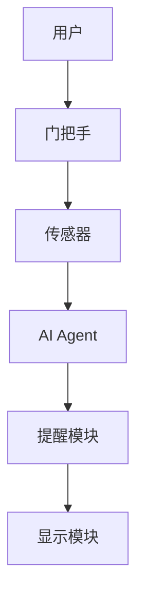
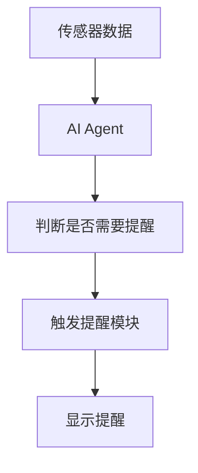

                 


# AI Agent在智能门把手中的手部卫生提醒

> 关键词：AI Agent，智能门把手，手部卫生，传感器，机器学习，物联网

> 摘要：本文探讨了如何利用AI Agent技术在智能门把手中实现手部卫生提醒。通过分析问题背景、设计AI Agent的核心算法、构建系统架构，结合实际案例，详细阐述了如何通过传感器数据和机器学习模型，实现智能、高效的卫生提醒系统，提升用户体验和健康安全。

---

## 第一部分: 背景介绍

### 第1章: 问题背景与描述

#### 1.1 问题背景
手部卫生是预防疾病传播的重要措施。在公共场所，如办公楼、学校、医院等，门把手是最常被触摸的物品之一，也是细菌和病毒传播的主要媒介。传统的门把手不具备提醒功能，无法主动引导用户进行手部清洁，存在卫生隐患。

#### 1.2 问题描述
- **手部卫生提醒的必要性**：在高频率接触的门把手处，及时提醒用户清洁手部，可以有效减少交叉感染的风险。
- **智能门把手的现状**：目前市面上的智能门把手主要集中在身份识别、远程控制等智能化功能，缺乏主动的卫生管理能力。
- **AI Agent在智能门把手中的应用潜力**：AI Agent（人工智能代理）能够通过传感器数据和机器学习模型，实时分析用户行为，主动触发提醒功能。

#### 1.3 问题解决
AI Agent可以实时监测门把手的使用情况，结合传感器数据和用户行为模式，主动提醒用户进行手部清洁，从而提升公共卫生水平。

#### 1.4 概念结构与核心要素
- **系统整体架构**：AI Agent、传感器、用户、门把手。
- **核心要素的组成与关系**：
  - 传感器：收集用户触碰门把手的行为数据。
  - AI Agent：分析数据，触发提醒。
  - 用户：接收提醒并进行手部清洁。
  - 门把手：物理设备，提供触控界面。

---

## 第二部分: 核心概念与联系

### 第2章: 核心概念与联系

#### 2.1 核心概念
- **AI Agent**：能够感知环境、自主决策、执行任务的智能代理。
- **智能门把手**：集成传感器和AI Agent的智能设备，具备数据采集和主动提醒功能。

#### 2.2 实体关系与系统架构
- **实体关系**：用户-门把手-传感器-AI Agent。
- **系统架构**：传感器采集数据，AI Agent分析并触发提醒，用户接收反馈。

#### 2.3 系统架构图（Mermaid）


---

## 第三部分: 算法原理

### 第3章: 算法原理

#### 3.1 数据流与算法流程
- **数据流**：传感器采集触碰数据 → AI Agent处理 → 提醒模块触发反馈。
- **算法流程**：
  1. 传感器采集触碰门把手的频率和时间。
  2. AI Agent分析数据，判断是否需要触发提醒。
  3. 触发提醒模块，通过显示或声音提醒用户清洁手部。

#### 3.2 算法流程图（Mermaid）


#### 3.3 算法实现
- **数据采集**：使用加速度传感器采集门把手的触碰数据。
- **数据处理**：计算触碰频率和时间，判断是否需要提醒。
- **提醒策略**：基于时间阈值触发提醒。

#### 3.4 代码实现
```python
import time
from sensor import Accelerometer

class AIAssistant:
    def __init__(self, sensor):
        self.sensor = sensor
        self.last_triggered = 0

    def should_trigger(self, threshold=60):
        current_time = time.time()
        if current_time - self.last_triggered > threshold:
            return True
        return False

# 初始化传感器
accelerometer = Accelerometer()
ai_assistant = AIAssistant(accelerometer)

# 模拟数据采集
while True:
    data = accelerometer.read_data()
    if ai_assistant.should_trigger():
        ai_assistant.triggerreminder()
    time.sleep(1)
```

---

## 第四部分: 系统分析与架构设计

### 第4章: 系统分析与架构设计

#### 4.1 项目背景
本项目旨在通过AI Agent技术，提升智能门把手的卫生管理能力，减少疾病传播风险。

#### 4.2 系统功能设计
- **领域模型**：用户-门把手-传感器-AI Agent。
- **功能模块**：
  - 传感器数据采集。
  - AI Agent分析与决策。
  - 提醒模块反馈。

#### 4.3 系统架构图（Mermaid）


#### 4.4 接口设计
- **传感器接口**：提供数据采集API。
- **AI Agent接口**：接收传感器数据，返回是否需要提醒的信号。

---

## 第五部分: 项目实战

### 第5章: 项目实战

#### 5.1 环境安装
- **硬件**：安装加速度传感器模块。
- **软件**：安装Python环境，配置传感器库。

#### 5.2 核心代码实现
```python
class Sensor:
    def read_data(self):
        # 模拟传感器数据
        return time.time()

class Reminder:
    def trigger(self):
        print("请清洁手部！")

class AIAssistant:
    def __init__(self, sensor, reminder):
        self.sensor = sensor
        self.reminder = reminder
        self.last_triggered = 0

    def monitor(self, threshold=60):
        current_time = self.sensor.read_data()
        if current_time - self.last_triggered > threshold:
            self.reminder.trigger()
            self.last_triggered = current_time

# 实例化组件
sensor = Sensor()
reminder = Reminder()
ai_assistant = AIAssistant(sensor, reminder)

# 启动监控
while True:
    ai_assistant.monitor()
    time.sleep(1)
```

#### 5.3 代码解读与分析
- **Sensor类**：模拟传感器数据。
- **Reminder类**：负责触发提醒。
- **AIAssistant类**：实现监控逻辑，判断是否需要触发提醒。

#### 5.4 案例分析
- **案例描述**：用户频繁触碰门把手，AI Agent在设定时间后触发提醒。
- **结果分析**：用户收到提醒后进行手部清洁，减少细菌传播风险。

---

## 第六部分: 总结

### 第6章: 总结

#### 6.1 最佳实践
- **传感器选择**：选择高精度传感器，确保数据采集的准确性。
- **AI Agent设计**：优化算法，提升判断的准确性。
- **用户体验**：设计直观的提醒方式，确保用户及时收到反馈。

#### 6.2 小结
通过AI Agent技术，智能门把手能够实现手部卫生提醒功能，有效提升公共卫生水平。

#### 6.3 注意事项
- 定期校准传感器，确保数据准确性。
- 提醒频率不宜过高，避免打扰用户。

#### 6.4 拓展阅读
- 《AI在物联网中的应用》
- 《智能传感器技术与实现》

---

## 作者信息

作者：AI天才研究院 & 禅与计算机程序设计艺术

---

以上就是《AI Agent在智能门把手中的手部卫生提醒》的完整目录和内容结构。希望这篇文章能够为读者提供清晰的思路和技术实现方案。

