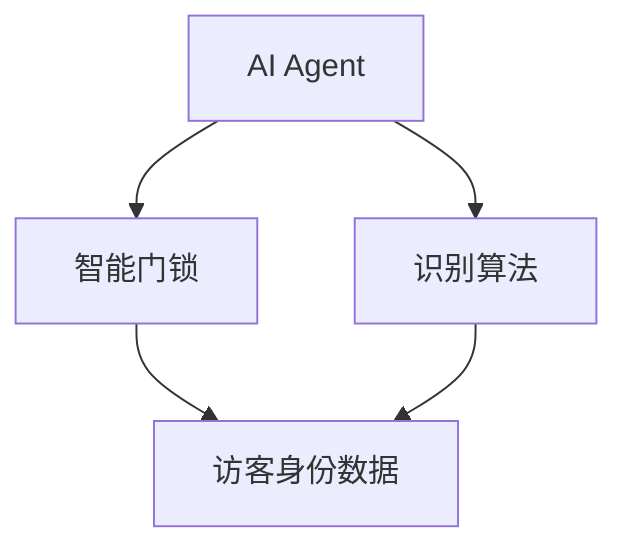
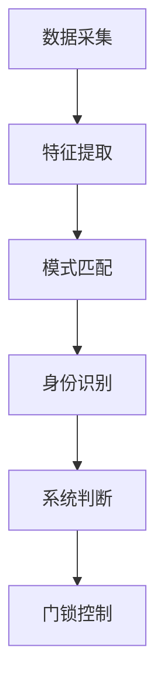

                 

# AI Agent在智能门把手中的访客身份识别

## 关键词：AI Agent，智能门锁，访客识别，人脸识别，指纹识别，系统架构

## 摘要：本文探讨AI Agent在智能门锁中的应用，重点分析访客身份识别的技术实现。通过背景介绍、核心概念、算法原理、系统架构、项目实战等多维度解析，深入剖析AI Agent在智能门锁中的应用潜力与实际价值。

---

# 第1章：背景介绍

## 1.1 问题背景

### 1.1.1 智能门锁的发展历程

智能门锁经历了从机械锁到电子锁的演变，近年来随着物联网和人工智能技术的发展，智能门锁逐渐普及。传统的钥匙开门方式逐渐被密码、指纹、人脸识别等更安全、便捷的方式取代。智能门锁的每一次进化都是为了提升安全性和用户体验。

### 1.1.2 访客身份识别的需求与挑战

随着智能门锁的普及，访客身份识别的需求日益增长。访客身份识别的主要目的是确保只有经过授权的访客才能进入，从而保障用户的安全。然而，访客身份识别也面临诸多挑战，如如何快速准确地识别访客身份，如何处理大量的访客数据，如何确保系统的安全性与稳定性等。

### 1.1.3 AI Agent在智能门锁中的应用潜力

AI Agent（人工智能代理）是一种能够感知环境并采取相应行动以实现目标的智能实体。AI Agent在智能门锁中的应用潜力巨大，尤其是在访客身份识别方面。通过AI Agent，智能门锁可以实现更智能、更高效的访客识别，从而提升系统的整体性能。

## 1.2 问题描述

### 1.2.1 访客身份识别的核心问题

访客身份识别的核心问题是如何准确识别访客身份，并确保识别过程的快速性和准确性。这涉及到数据采集、特征提取、模式匹配等多个环节。传统的访客识别方式存在效率低、易被欺骗等问题，而AI Agent可以通过深度学习等技术提升识别的准确性和效率。

### 1.2.2 AI Agent在访客识别中的角色定位

AI Agent在访客识别中扮演着关键角色。它不仅负责数据的采集与处理，还需要对数据进行分析和判断，最终决定是否允许访客进入。AI Agent通过实时数据分析和决策，确保访客识别的准确性和及时性。

### 1.2.3 系统边界与外延

访客身份识别系统的边界包括智能门锁、访客识别设备、用户授权数据库等。系统外延则涉及网络通信、数据安全、用户隐私保护等方面。AI Agent需要在这些方面进行综合考虑，以确保系统的安全性和稳定性。

## 1.3 问题解决

### 1.3.1 AI Agent在访客识别中的解决方案

AI Agent通过结合机器学习、深度学习等技术，实现对访客身份的准确识别。具体来说，AI Agent可以利用人脸识别、指纹识别等技术，对访客的身份进行验证。同时，AI Agent还可以通过数据分析，识别异常行为，进一步提升系统的安全性。

### 1.3.2 系统架构与实现思路

智能门锁访客识别系统的架构包括前端设备、后端系统和用户终端。前端设备负责数据的采集与传输，后端系统负责数据的处理与存储，用户终端则用于用户授权和系统管理。AI Agent作为系统的核心，负责协调各个部分的工作，确保系统的高效运行。

### 1.3.3 系统功能与性能指标

智能门锁访客识别系统的主要功能包括访客身份识别、用户授权管理、访问记录查询等。系统的性能指标包括识别速度、识别准确率、系统稳定性等。AI Agent通过优化算法和系统架构，不断提升系统的性能指标。

## 1.4 概念结构与核心要素

### 1.4.1 AI Agent的核心概念

AI Agent是一种能够感知环境并采取相应行动以实现目标的智能实体。它具备自主性、反应性、目标导向性等核心特征。在智能门锁中，AI Agent主要负责数据处理、决策判断和系统控制。

### 1.4.2 智能门锁的系统组成

智能门锁系统包括硬件部分和软件部分。硬件部分包括门锁本体、传感器、通信模块等。软件部分包括AI Agent、数据库、用户界面等。硬件和软件的协同工作，确保智能门锁的正常运行。

### 1.4.3 访客身份识别的关键要素

访客身份识别的关键要素包括数据采集、特征提取、模式匹配等。数据采集是通过传感器获取访客的身份信息，特征提取是对采集到的数据进行处理和分析，模式匹配则是将提取的特征与数据库中的授权信息进行匹配，以确定访客的身份。

---

## 本章小结

本章主要介绍了AI Agent在智能门锁中的应用背景，详细阐述了访客身份识别的需求与挑战，以及AI Agent在其中的角色定位。通过分析系统边界与外延，进一步明确了访客身份识别系统的整体架构和功能需求。为后续章节的详细分析奠定了基础。

---

# 第2章：核心概念与联系

## 2.1 AI Agent的基本原理

### 2.1.1 AI Agent的定义与分类

AI Agent可以根据应用场景和功能进行分类。在智能门锁中，AI Agent主要负责数据处理、决策判断和系统控制。AI Agent通过感知环境并采取相应行动，实现对门锁的智能控制。

### 2.1.2 AI Agent的核心算法

AI Agent的核心算法包括机器学习、深度学习等。这些算法用于处理和分析数据，实现对访客身份的识别和判断。例如，可以使用卷积神经网络（CNN）进行人脸识别，或者使用支持向量机（SVM）进行指纹识别。

### 2.1.3 AI Agent与智能门锁的结合

AI Agent与智能门锁的结合主要体现在数据处理和系统控制方面。AI Agent通过采集和分析访客的身份信息，判断是否允许访客进入，并通过门锁的控制模块实现门锁的开启或关闭。

## 2.2 智能门锁的系统架构

### 2.2.1 系统组成与功能模块

智能门锁系统由前端设备、后端系统和用户终端组成。前端设备包括摄像头、指纹传感器等，负责数据的采集与传输。后端系统包括AI Agent、数据库等，负责数据的处理与存储。用户终端包括手机APP、电脑等，用于用户授权和系统管理。

### 2.2.2 系统交互流程

系统交互流程包括数据采集、数据传输、数据处理、决策判断和系统控制等步骤。AI Agent在数据处理和决策判断阶段发挥着关键作用，确保系统的高效运行。

### 2.2.3 系统架构图

## 2.3 访客身份识别的核心算法

### 2.3.1 基于AI的特征提取

特征提取是访客身份识别的关键步骤。通过AI算法，可以从采集到的数据中提取出有效的特征信息，例如人脸的特征点、指纹的纹路等。这些特征信息用于后续的身份识别和验证。

### 2.3.2 人脸识别算法

人脸识别是访客身份识别的重要技术之一。基于深度学习的人脸识别算法，如卷积神经网络（CNN），可以实现高精度的人脸识别。通过训练大量的面部数据，AI Agent能够准确识别访客的身份。

### 2.3.3 指纹识别算法

指纹识别是另一种常用的访客身份识别技术。基于AI的指纹识别算法，如支持向量机（SVM），可以实现高精度的指纹匹配。指纹识别具有较高的安全性，适用于高安全级别的场景。

### 2.3.4 算法流程图

## 2.4 核心概念对比分析

### 2.4.1 AI Agent与传统门锁控制系统的对比

传统的门锁控制系统主要依赖于机械锁和电子锁，缺乏智能化和个性化。AI Agent通过引入人工智能技术，提升了门锁系统的智能化水平，能够实现更复杂的功能，如访客身份识别、异常行为检测等。

### 2.4.2 人脸识别与指纹识别的优劣势对比

人脸识别和指纹识别各有优缺点。人脸识别具有非接触性，方便快捷，但易受光线、角度等因素影响。指纹识别具有高安全性，但需要接触指纹传感器，用户体验较差。AI Agent可以根据具体场景选择合适的识别方式，或同时结合两种技术，提升识别的准确性和可靠性。

### 2.4.3 系统实体关系图

## 2.5 本章小结

本章详细介绍了AI Agent的基本原理及其在智能门锁中的应用。通过分析智能门锁的系统架构和访客身份识别的核心算法，进一步明确了AI Agent在系统中的角色和作用。通过对人脸识别和指纹识别的对比分析，为后续的系统设计和实现提供了理论基础。

---

## 总结

通过以上两章的介绍，我们已经对AI Agent在智能门把手中的访客身份识别有了全面的了解。接下来，我们将深入探讨系统的算法原理、系统架构设计、项目实战等内容，帮助读者更好地理解和实现这一系统。

