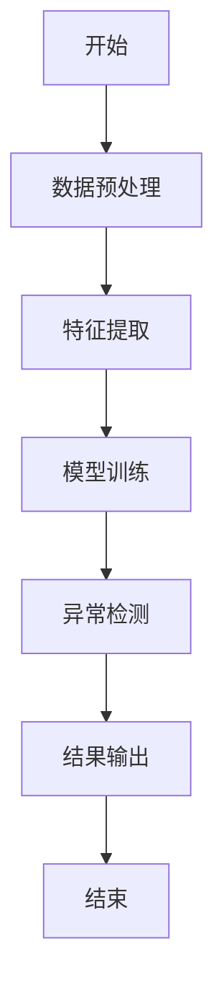

                 


# AI Agent在智能门禁中的异常行为检测

> 关键词：AI Agent, 异常行为检测, 智能门禁, 机器学习, 深度学习

> 摘要：本文详细探讨了AI Agent在智能门禁系统中的应用，特别是异常行为检测的实现。通过结合强化学习、监督学习和深度学习等技术，提出了基于AI Agent的解决方案，并通过实际案例分析验证了其有效性和可扩展性。

---

## 第1章: 异常行为检测的背景与问题背景

### 1.1 异常行为检测的定义与概念
- 1.1.1 什么是异常行为检测
  - 异常行为检测的目标是识别与正常行为模式不符的事件或行为。
  - 异常行为检测在安全、金融、医疗等领域中的重要性。

- 1.1.2 异常行为检测的核心目标
  - 识别潜在的安全威胁、异常事件。
  - 提供实时监控和预警机制。

- 1.1.3 异常行为检测的边界与外延
  - 明确异常行为与正常行为的界限。
  - 外延包括异常行为的分类、预测和响应。

### 1.2 AI Agent在智能门禁中的应用背景
- 1.2.1 智能门禁系统的现状与挑战
  - 当前门禁系统的功能和应用场景。
  - 面临的安全威胁和管理难题。

- 1.2.2 异常行为检测在门禁系统中的重要性
  - 提高安全性，防止未经授权的访问。
  - 实时监控和响应，减少潜在风险。

- 1.2.3 AI Agent在智能门禁中的角色与价值
  - AI Agent作为智能门禁的核心组件。
  - 提供自适应学习和决策能力，增强系统智能化水平。

### 1.3 问题描述与解决思路
- 1.3.1 异常行为检测的核心问题
  - 如何准确识别异常行为。
  - 如何在复杂场景下保持高准确性。

- 1.3.2 传统方法的局限性
  - 基于规则的检测方法的局限性。
  - 统计方法的鲁棒性和实时性问题。

- 1.3.3 基于AI Agent的解决方案
  - 利用机器学习和深度学习技术。
  - 实现自适应学习和动态调整检测模型。

---

## 第2章: AI Agent与异常行为检测的核心概念

### 2.1 AI Agent的基本原理
- 2.1.1 AI Agent的定义与分类
  - 定义：AI Agent是一个能够感知环境、采取行动以实现目标的智能体。
  - 分类：基于任务、基于学习、基于推理的AI Agent。

- 2.1.2 基于强化学习的AI Agent
  - 强化学习的基本原理。
  - 在异常行为检测中的应用。

- 2.1.3 基于监督学习的AI Agent
  - 监督学习在异常检测中的优势。
  - 模型训练和优化方法。

### 2.2 异常行为检测的核心原理
- 2.2.1 异常行为检测的特征提取
  - 特征选择：行为模式、时间戳、用户权限等。
  - 特征提取方法：基于统计、基于模型的方法。

- 2.2.2 基于概率的异常检测方法
  - 概率密度函数的构建。
  - 异常概率的计算与阈值设定。

- 2.2.3 基于深度学习的异常检测方法
  - 卷积神经网络（CNN）、循环神经网络（RNN）的应用。
  - 深度学习模型的训练与优化。

### 2.3 AI Agent与异常行为检测的结合
- 2.3.1 AI Agent在行为建模中的作用
  - 建立用户行为模型，识别异常模式。
  - 行为模型的动态更新与维护。

- 2.3.2 基于AI Agent的异常检测流程
  - 数据采集、特征提取、模型训练、异常判断。
  - AI Agent的实时监控和决策机制。

- 2.3.3 AI Agent的自适应学习能力
  - 在线学习和离线学习方法。
  - 系统的自适应调整和优化。

### 2.4 核心概念对比分析
- 2.4.1 异常行为检测与正常行为检测的对比
  - 检测目标的不同。
  - 检测方法的异同。

- 2.4.2 AI Agent与其他异常检测方法的对比
  - 基于规则、统计、深度学习的对比。
  - AI Agent的优势与局限性。

- 2.4.3 不同AI Agent算法的性能对比
  - 强化学习、监督学习的性能差异。
  - 实验数据支持的分析结果。

### 2.5 本章小结
- 本章介绍了AI Agent的基本原理和异常行为检测的核心概念。
- 探讨了AI Agent在异常行为检测中的应用及其优势。

---

## 第3章: 异常行为检测的算法原理与数学模型

### 3.1 异常行为检测的算法原理
- 3.1.1 基于监督学习的异常检测
  - 标签数据的获取与处理。
  - 分类模型的训练与应用。

- 3.1.2 基于无监督学习的异常检测
  - 聚类分析、主成分分析（PCA）方法。
  - 无监督学习的优势与挑战。

- 3.1.3 基于强化学习的异常检测
  - 强化学习在行为预测中的应用。
  - 奖励机制的设计与实现。

### 3.2 基于深度学习的异常检测模型
- 3.2.1 卷积神经网络（CNN）在异常行为检测中的应用
  - 图像数据的特征提取。
  - 模型结构设计与优化。

- 3.2.2 循环神经网络（RNN）在行为序列建模中的应用
  - 时间序列数据的处理。
  - 长短期记忆网络（LSTM）的优势。

- 3.2.3 图神经网络（GNN）在行为关联分析中的应用
  - 图结构数据的表示学习。
  - 异常行为的关联分析与预测。

### 3.3 数学模型与公式
- 3.3.1 损失函数与优化目标
  $$L = \frac{1}{N}\sum_{i=1}^{N} (y_i - \hat{y}_i)^2$$

- 3.3.2 强化学习的奖励机制
  $$R(s, a) = r_1 + r_2 + \dots + r_n$$

- 3.3.3 概率密度函数与异常检测
  $$P(x) = \prod_{i=1}^{n} p(x_i | x_{i-1})$$

### 3.4 算法流程图


### 3.5 本章小结
- 本章详细讲解了异常行为检测的算法原理和数学模型。
- 介绍了基于深度学习的异常检测模型及其应用。

---

## 第4章: 智能门禁系统中的异常行为检测系统架构

### 4.1 系统架构设计
- 4.1.1 系统功能模块划分
  - 数据采集模块、特征提取模块、模型训练模块、异常检测模块。

- 4.1.2 系统架构设计图
  ```mermaid
  graph TD
  A[数据采集] --> B[特征提取]
  B --> C[模型训练]
  C --> D[异常检测]
  D --> E[结果输出]
  ```

- 4.1.3 系统接口设计
  - 数据接口：与门禁设备的数据交互。
  - API接口：与其他系统（如报警系统）的集成。

### 4.2 系统实现与优化
- 4.2.1 系统实现流程
  - 数据采集、预处理、特征提取、模型训练、异常检测。

- 4.2.2 系统优化方法
  - 模型优化：参数调整、算法优化。
  - 系统性能优化：并行计算、缓存优化。

### 4.3 本章小结
- 本章详细介绍了智能门禁系统中异常行为检测的系统架构设计与实现。

---

## 第5章: 项目实战与案例分析

### 5.1 项目环境安装
- 操作系统：Linux/Windows/macOS。
- 开发工具：Python、TensorFlow、Keras、Scikit-learn。
- 数据集：公开数据集或自建数据集。

### 5.2 核心代码实现
- 5.2.1 数据预处理代码
  ```python
  import pandas as pd
  df = pd.read_csv('data.csv')
  df.dropna(inplace=True)
  ```

- 5.2.2 模型训练代码
  ```python
  model = Sequential()
  model.add(Dense(64, activation='relu'))
  model.add(Dense(1, activation='sigmoid'))
  model.compile(optimizer='adam', loss='binary_crossentropy', metrics=['accuracy'])
  model.fit(X_train, y_train, epochs=10, batch_size=32)
  ```

- 5.2.3 异常检测代码
  ```python
  predictions = model.predict(X_test)
  anomalies = predictions[predictions < 0.5]
  ```

### 5.3 案例分析与结果解读
- 案例背景：某智能门禁系统中的异常行为检测。
- 实验结果：检测准确率、召回率、F1分数。
- 结果解读：模型性能分析，异常行为的典型例子。

### 5.4 本章小结
- 本章通过实际项目展示了AI Agent在智能门禁中的应用。
- 详细讲解了项目的环境搭建、代码实现和案例分析。

---

## 第6章: 最佳实践与注意事项

### 6.1 最佳实践
- 数据预处理：确保数据的完整性和代表性。
- 模型选择：根据场景选择合适的算法。
- 模型优化：持续监控和更新模型。

### 6.2 小结
- 异常行为检测的关键点。
- AI Agent的优势与局限性。

### 6.3 注意事项
- 数据隐私与安全。
- 模型的可解释性。
- 系统的可扩展性。

### 6.4 扩展阅读
- 推荐书籍：《机器学习实战》、《深度学习》。
- 推荐论文：相关领域的最新研究成果。

---

## 作者

作者：AI天才研究院/AI Genius Institute & 禅与计算机程序设计艺术 /Zen And The Art of Computer Programming

