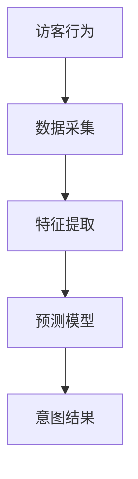
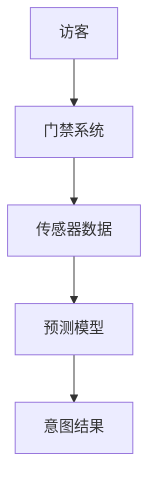
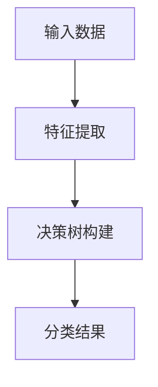
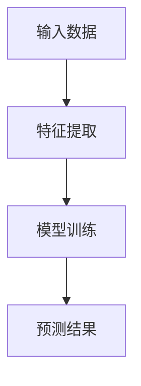
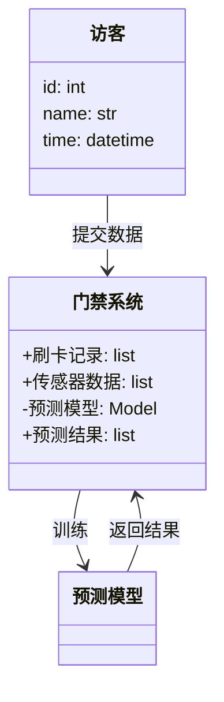
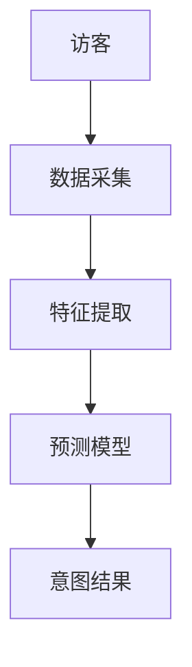
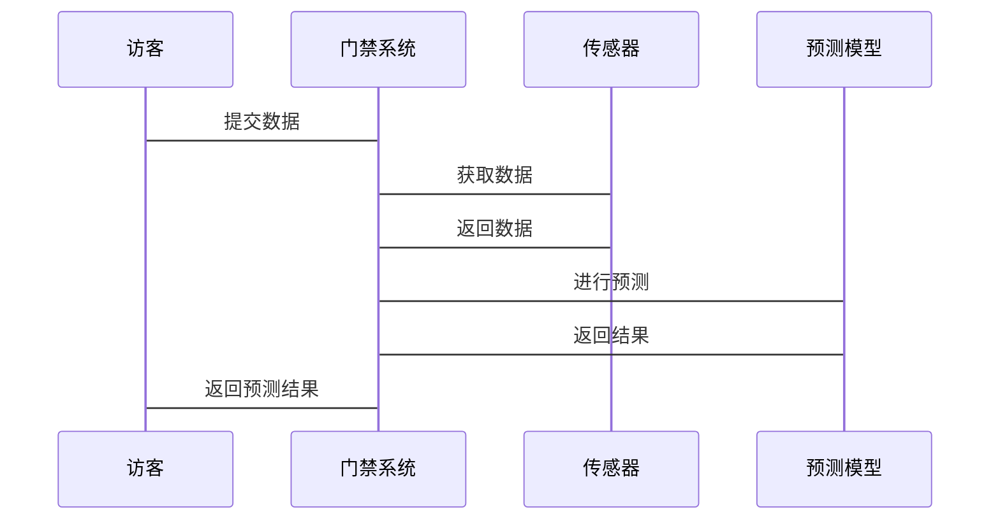

                 


# AI Agent在智能门禁系统中的访客意图预测

**关键词**：AI Agent、智能门禁系统、访客意图预测、机器学习、多模态数据、强化学习

**摘要**：本文深入探讨了AI Agent在智能门禁系统中对访客意图的预测方法。通过分析多模态数据，结合机器学习和强化学习算法，构建了一个高效的预测模型，实现了访客行为的智能化识别与决策。

---

# 正文

## 第一部分：背景介绍

### 1.1 问题背景

#### 1.1.1 智能门禁系统的发展现状

智能门禁系统作为现代安全技术的重要组成部分，经历了从单一的刷卡开门到多模态识别的演变。传统的门禁系统依赖于固定的规则，难以应对复杂的访客行为。随着人工智能技术的发展，引入AI Agent进行智能化管理成为趋势。

#### 1.1.2 访客意图预测的必要性

访客在进入门禁系统时的行为复杂多变，传统的基于规则的系统难以准确预测其意图。例如，访客可能在等待、徘徊或试图尾随他人进入。通过AI Agent分析多模态数据，可以实时预测访客的意图，提升系统的安全性和用户体验。

#### 1.1.3 当前技术的局限性

现有技术主要依赖简单的规则判断，缺乏对复杂行为模式的分析能力。例如，无法区分正常等待与异常行为，难以应对突发事件。

### 1.2 问题描述

#### 1.2.1 访客意图预测的核心问题

访客意图预测的核心在于从多模态数据中提取有效特征，建立预测模型，准确判断访客的行为意图。

#### 1.2.2 智能门禁系统中的访客行为分析

访客行为包括刷卡、徘徊、尾随等，这些行为需要通过多模态数据（如视频、刷卡记录、时间戳）进行分析。

#### 1.2.3 访客意图预测的目标与意义

目标是通过AI Agent实时预测访客意图，提升门禁系统的安全性和智能化水平。意义在于减少人为错误，提高系统效率。

### 1.3 问题解决

#### 1.3.1 AI Agent在访客意图预测中的作用

AI Agent能够实时分析多模态数据，动态调整预测模型，提供高效的访客意图识别。

#### 1.3.2 多模态数据融合的解决方案

通过融合视频、刷卡记录等多模态数据，提高预测的准确性和鲁棒性。

#### 1.3.3 基于机器学习的预测模型

采用机器学习算法，如随机森林和XGBoost，建立访客意图的分类模型。

### 1.4 边界与外延

#### 1.4.1 访客意图预测的边界条件

包括数据采集范围、预测时间窗口等。

#### 1.4.2 相关技术的外延扩展

如边缘计算在门禁系统中的应用，AI Agent与其他系统的协同工作。

#### 1.4.3 与其他系统的接口关系

门禁系统与监控、报警系统的集成，数据接口的设计。

### 1.5 概念结构与核心要素

#### 1.5.1 概念框架图



---

## 第二部分：核心概念与联系

### 2.1 AI Agent的核心原理

#### 2.1.1 AI Agent的基本定义

AI Agent是一种智能体，能够感知环境并采取行动以实现目标。

#### 2.1.2 多智能体系统与协作机制

在门禁系统中，多个AI Agent协同工作，提高预测的准确性。

#### 2.1.3 基于强化学习的决策过程

通过强化学习优化AI Agent的决策策略。

### 2.2 访客意图预测的原理

#### 2.2.1 数据采集与特征提取

从视频流中提取动作特征，从刷卡记录中提取时间特征。

#### 2.2.2 基于时间序列的预测模型

使用LSTM进行时间序列预测。

#### 2.2.3 模型的可解释性与鲁棒性

通过可视化工具分析模型的决策过程，提高可解释性。

### 2.3 核心概念对比分析

#### 2.3.1 AI Agent与传统规则引擎的对比

| 特性         | AI Agent                   | 传统规则引擎               |
|--------------|----------------------------|-----------------------------|
| 灵活性       | 高                          | 低                          |
| 处理复杂性   | 能处理非结构化数据         | 仅处理结构化数据             |
| 学习能力     | 具有自适应学习能力         | 无学习能力                   |

#### 2.3.2 访客意图预测与行为分析的对比

访客意图预测注重未来行为的预测，行为分析注重当前行为的描述。

#### 2.3.3 数据驱动与知识驱动的对比

数据驱动依赖大量数据，知识驱动依赖领域知识。

### 2.4 ER实体关系图



---

## 第三部分：算法原理讲解

### 3.1 基于规则的分类算法

#### 3.1.1 规则定义与特征提取

定义规则，如“若访客在门前停留超过10秒，则判定为异常”。

#### 3.1.2 基于决策树的分类

使用ID3算法构建决策树，进行访客意图分类。

#### 3.1.3 算法流程图



### 3.2 机器学习模型

#### 3.2.1 基于时间序列的预测模型

使用LSTM进行时间序列预测，公式如下：

$$
f(t) = \text{LSTM}(f(t-1), x_t)
$$

#### 3.2.2 算法流程图



#### 3.2.3 算法实现

```python
import numpy as np
from sklearn.ensemble import RandomForestClassifier

# 数据预处理
X = np.array([[1, 2], [3, 4]])
y = np.array([0, 1])

# 模型训练
model = RandomForestClassifier()
model.fit(X, y)

# 预测
new_data = np.array([[5, 6]])
print(model.predict(new_data))
```

---

## 第四部分：系统分析与架构设计

### 4.1 问题场景介绍

#### 4.1.1 门禁系统中的访客管理

访客通过刷卡或生物识别进入系统。

#### 4.1.2 访客行为分析

分析访客的行为模式，预测其意图。

### 4.2 系统功能设计

#### 4.2.1 领域模型



#### 4.2.2 系统架构设计



### 4.3 系统接口设计

#### 4.3.1 API接口

提供RESTful API，如`/predict`，用于接收数据并返回预测结果。

#### 4.3.2 数据接口

定义数据格式，如JSON格式：

```json
{
    "id": 1,
    "time": "2023-10-01T12:00:00",
    "action": "刷卡"
}
```

### 4.4 系统交互流程



---

## 第五部分：项目实战

### 5.1 环境安装

#### 5.1.1 安装Python环境

使用Anaconda安装Python 3.8及以上版本。

#### 5.1.2 安装依赖库

安装以下库：

```bash
pip install numpy scikit-learn mermaid
```

### 5.2 系统核心实现

#### 5.2.1 数据预处理

```python
import pandas as pd

# 加载数据
data = pd.read_csv('visitor.csv')

# 数据清洗
data.dropna(inplace=True)
```

#### 5.2.2 训练模型

```python
from sklearn.ensemble import RandomForestClassifier

# 分割数据
X = data.drop('intent', axis=1)
y = data['intent']

# 训练模型
model = RandomForestClassifier()
model.fit(X, y)
```

#### 5.2.3 应用预测

```python
# 预测新数据
new_data = pd.DataFrame({'feature1': [1], 'feature2': [2]})
print(model.predict(new_data))
```

### 5.3 案例分析

#### 5.3.1 案例场景

访客在门前徘徊，系统预测其意图。

#### 5.3.2 分析结果

系统预测访客意图异常，触发报警。

### 5.4 项目总结

项目通过AI Agent实现了访客意图预测，提升了门禁系统的安全性和智能化水平。

---

## 第六部分：最佳实践与总结

### 6.1 最佳实践

#### 6.1.1 数据质量

确保数据的完整性和准确性。

#### 6.1.2 模型优化

定期更新模型，保持预测的准确性。

#### 6.1.3 系统集成

确保系统与其他安全设备的无缝集成。

### 6.2 总结

本文详细介绍了AI Agent在智能门禁系统中的应用，通过多模态数据和机器学习算法，实现了高效的访客意图预测。

### 6.3 注意事项

数据隐私保护，确保系统安全性。

### 6.4 拓展阅读

推荐阅读相关领域的最新论文和技术报告。

---

# 作者

作者：AI天才研究院 & 禅与计算机程序设计艺术

