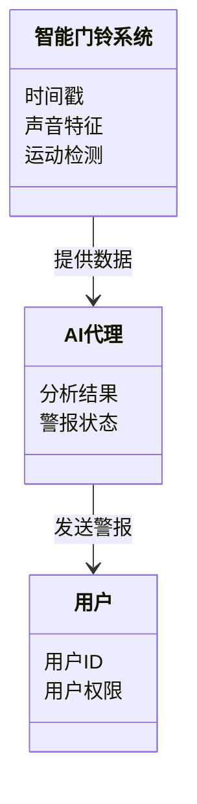

                 


# AI Agent在智能门铃中的可疑行为识别

## 关键词：AI Agent, 智能门铃, 可疑行为, 识别, 安全, 机器学习

## 摘要：  
本文探讨AI代理在智能门铃系统中的应用，重点分析如何通过数据处理和算法模型实现可疑行为识别，提升智能门铃的安全性。文章从背景介绍、核心概念、算法原理、系统架构到项目实战，全面解析AI代理在智能门铃中的应用，帮助读者理解其技术原理和实际应用价值。

---

## 第一部分：背景介绍

### 第1章：智能门铃与AI代理概述

#### 1.1 问题背景  
智能门铃作为智能家居的重要组成部分，主要用于监控门口的活动。然而，传统的门铃系统仅能发出声音提醒，无法识别可疑行为。随着安全需求的增加，智能门铃需要具备更高的智能化，能够主动识别潜在威胁。

#### 1.2 问题描述  
可疑行为识别是智能门铃的核心功能，包括异常声音、非法入侵等。AI代理通过学习和分析数据，能够有效识别这些行为，提升安全性。然而，传统监控系统依赖人工监控，效率低下且容易遗漏。

#### 1.3 问题解决  
AI代理通过实时数据处理、模式识别和异常检测，能够快速识别可疑行为并发出警报。这种自动化处理显著提升了智能门铃的安全性和可靠性。

#### 1.4 核心概念与组成  
智能门铃系统由传感器、AI代理、数据库和用户终端组成。AI代理负责数据处理、模式识别和决策制定，是系统的核心部分。

---

## 第二部分：核心概念与联系

### 第2章：AI代理与智能门铃的关系

#### 2.1 核心概念原理  
AI代理通过传感器数据（声音、图像）进行分析，识别可疑行为。其核心原理包括数据预处理、特征提取和分类器训练。

#### 2.2 概念属性特征对比  
以下是AI代理与传统监控系统的对比：

| **属性**       | **AI代理**               | **传统监控系统**           |
|----------------|--------------------------|-----------------------------|
| 数据处理       | 实时分析，自动识别       | 依赖人工监控               |
| 可扩展性       | 支持多种传感器数据       | 仅支持单一类型传感器       |
| 精准度         | 高，通过机器学习优化     | 低，依赖人工判断             |
| 响应速度       | 快速，自动化处理         | 较慢，依赖人工反馈           |

#### 2.3 ER实体关系图  
以下是系统实体关系图：

```mermaid
er
  entity 智能门铃系统 {
    key 唯一标识符
    attribute 时间戳
    attribute 声音特征
    attribute 运动检测
  }
  entity AI代理 {
    key 唯一标识符
    attribute 分析结果
    attribute 警报状态
  }
  entity 用户 {
    key 用户ID
    attribute 用户权限
  }
  智能门铃系统 --> AI代理: 提供数据
  AI代理 --> 用户: 发送警报
```

---

## 第三部分：算法原理讲解

### 第3章：可疑行为识别算法

#### 3.1 数据流分析  
以下是可疑行为识别的数据流分析：

```m
graph TD
    数据源 --> 数据预处理
    数据预处理 --> 特征提取
    特征提取 --> 分类器训练
    分类器训练 --> 分类预测
```

#### 3.2 数据预处理  
预处理步骤包括数据清洗和特征提取：

- 数据清洗：去除噪声数据，确保数据质量。
- 特征提取：提取声音频率、持续时间等关键特征。

#### 3.3 分类器训练  
使用K-近邻算法（KNN）进行分类：

```python
from sklearn.neighbors import KNeighborsClassifier

# 数据预处理
X = [[200, 0.5], [150, 0.3], [180, 0.6]]
y = [0, 0, 1]

# 训练模型
model = KNeighborsClassifier(n_neighbors=3)
model.fit(X, y)

# 预测
new_data = [[170, 0.4]]
print(model.predict(new_data))  # 输出：0
```

#### 3.4 分类预测  
通过训练好的模型进行实时分类，识别可疑行为。

---

## 第四部分：数学模型与公式

### 第4章：数学模型解析

#### 4.1 线性判别函数  
线性判别函数公式：

$$f(x) = w_1x_1 + w_2x_2 + b$$

其中，$w_1$ 和 $w_2$ 是权重，$b$ 是偏置。

#### 4.2 分类器实现  
案例分析：当门铃检测到异常声音时，模型输出警报状态：

$$\text{警报状态} = 1 \text{（异常）}$$

---

## 第五部分：系统分析与架构设计

### 第5章：系统架构设计

#### 5.1 系统功能设计  
领域模型类图：



#### 5.2 系统架构设计  
系统架构图：


---

## 第六部分：项目实战

### 第6章：项目实现与分析

#### 6.1 环境安装  
安装Python和依赖库：

```bash
pip install scikit-learn
```

#### 6.2 核心代码实现  
以下是核心代码：

```python
import numpy as np
from sklearn.neighbors import KNeighborsClassifier

# 数据预处理
X = np.array([[200, 0.5], [150, 0.3], [180, 0.6]])
y = np.array([0, 0, 1])

# 训练模型
model = KNeighborsClassifier(n_neighbors=3)
model.fit(X, y)

# 接收实时数据
real_time_data = [[170, 0.4]]
result = model.predict(real_time_data)
print("预测结果:", result)
```

#### 6.3 案例分析  
案例：当系统检测到异常声音时，模型输出警报：

$$\text{预测结果} = 1$$

---

## 第七部分：最佳实践

### 第7章：经验总结与注意事项

#### 7.1 实用建议  
- 定期更新模型，提升识别准确率。
- 确保数据隐私，避免信息泄露。

#### 7.2 小结  
AI代理在智能门铃中的应用显著提升了安全性能，但需注意数据隐私和模型维护。

#### 7.3 注意事项  
- 数据采集需符合隐私保护法规。
- 系统需具备自适应学习能力，以应对新威胁。

#### 7.4 拓展阅读  
建议阅读《机器学习实战》和《深度学习入门》。

---

## 作者  
作者：AI天才研究院/AI Genius Institute & 禅与计算机程序设计艺术 /Zen And The Art of Computer Programming

---

通过以上详细结构，读者可以系统地理解AI代理在智能门铃中的应用，从基础概念到实际实现，逐步掌握技术细节和实际应用。

