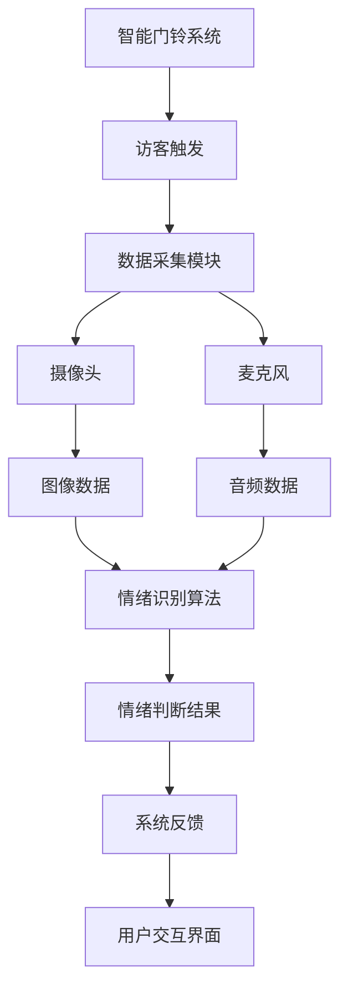
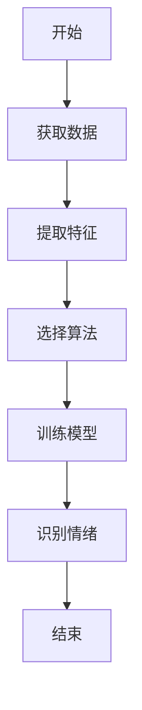
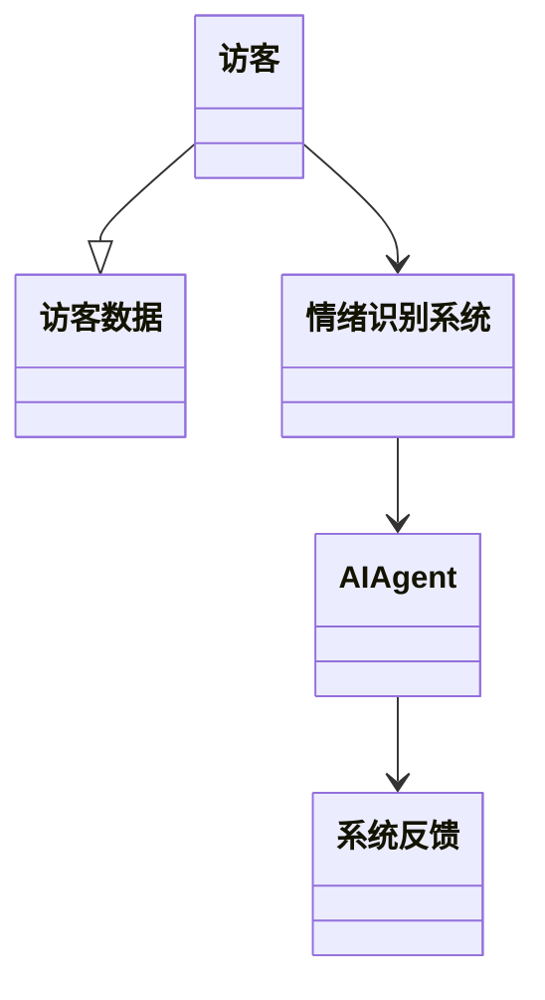
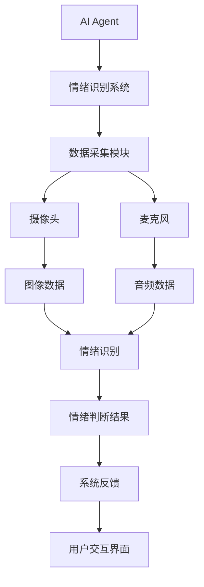
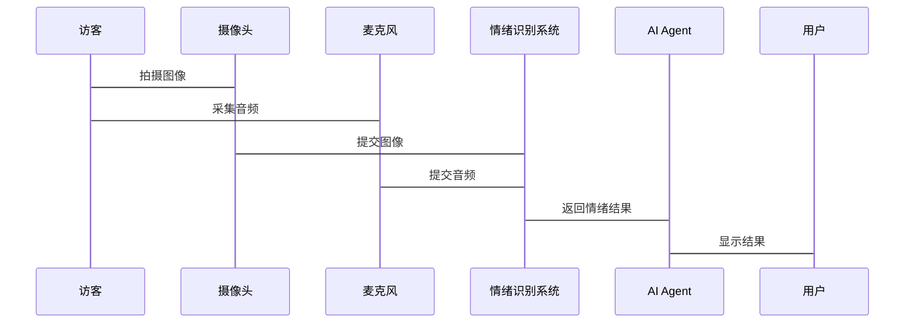

                 


# AI Agent在智能门铃中的访客情绪识别

## 关键词：AI Agent, 情绪识别, 智能门铃, 访客识别, 系统设计

## 摘要：本文探讨了AI Agent在智能门铃中的应用，特别是如何通过情绪识别技术提升访客互动体验。文章详细分析了情绪识别的算法原理、系统架构，并通过项目实战展示了实际应用，最后提出了未来发展建议。

---

# 第一部分: AI Agent在智能门铃中的访客情绪识别

---

## 第1章: 背景介绍

### 1.1 问题背景

#### 1.1.1 智能门铃的发展现状
智能门铃作为智能家居的重要组成部分，已从简单的门铃通知发展为集成视频监控、访客识别和远程交互的多功能设备。现代智能门铃不仅支持高清视频通话，还能通过AI技术分析访客的情绪和意图。

#### 1.1.2 访客情绪识别的必要性
在智能门铃中，访客的情绪识别可以提升用户体验。例如，当访客情绪紧张或愤怒时，系统可以触发紧急应对机制，如通知主人或安全人员。此外，情绪识别还能帮助分析访客意图，优化交互流程。

#### 1.1.3 当前技术的局限性
尽管AI技术在情绪识别方面取得了进展，但准确性和实时性仍存在问题。此外，如何在智能门铃的有限计算资源下高效运行AI算法也是一个挑战。

### 1.2 问题描述

#### 1.2.1 情绪识别的基本概念
情绪识别是通过分析声音、语调、面部表情等多模态数据，判断个体情绪状态的技术。这在智能门铃中用于实时分析访客的情绪。

#### 1.2.2 智能门铃中的访客情绪识别场景
在访客按门铃时，系统启动情绪识别功能，通过摄像头捕捉面部表情，麦克风采集语调，结合AI算法判断访客情绪。

#### 1.2.3 问题解决的边界与外延
情绪识别在智能门铃中的应用仅限于访客阶段，不涉及家庭成员或其他室内人员。此外，系统需在本地或云端运行，确保隐私和数据安全。

### 1.3 核心概念与问题解决

#### 1.3.1 AI Agent的核心作用
AI Agent在智能门铃中充当智能管家，负责数据采集、分析和决策。它通过整合摄像头和麦克风数据，实时分析访客情绪，并反馈给系统。

#### 1.3.2 情绪识别技术的关键点
关键点包括多模态数据融合、实时性优化和模型训练。通过结合面部表情和语调分析，提高情绪识别的准确性和鲁棒性。

#### 1.3.3 系统的整体架构
系统架构分为数据采集层、算法处理层和应用层。数据采集层负责获取访客的图像和声音；算法处理层进行情绪识别；应用层根据识别结果调整交互策略。

### 1.4 概念结构与核心要素

#### 1.4.1 系统组成模块
系统主要模块包括摄像头、麦克风、AI芯片、云端服务器和交互界面。

#### 1.4.2 核心要素的定义与作用
核心要素包括数据采集、算法处理、结果反馈和用户交互。数据采集负责获取访客信息，算法处理分析数据，结果反馈调整系统行为，用户交互提供反馈。

#### 1.4.3 概念结构图展示


---

## 第2章: 核心概念与联系

### 2.1 AI Agent与情绪识别的原理

#### 2.1.1 AI Agent的基本原理
AI Agent通过感知环境、分析数据并采取行动，帮助系统做出决策。在智能门铃中，AI Agent负责协调各个模块，分析数据并反馈结果。

#### 2.1.2 情绪识别的核心技术
核心技术包括特征提取、模式识别和机器学习。特征提取从图像和音频中提取有用信息，模式识别分类情绪，机器学习优化模型。

#### 2.1.3 两者结合的实现机制
AI Agent整合情绪识别模块，实时分析访客数据，根据情绪结果调整系统行为，如通知主人或启动应急措施。

### 2.2 核心概念的属性特征对比

#### 2.2.1 AI Agent的属性特征
| 属性 | 特征 |
|------|------|
| 智能性 | 高度依赖算法 |
| 反应性 | 实时响应数据变化 |
| 学习能力 | 能够优化模型 |

#### 2.2.2 情绪识别的属性特征
| 属性 | 特征 |
|------|------|
| 数据源 | 多模态数据 |
| 分析速度 | 实时或近实时 |
| 准确性 | 取决于算法和数据质量 |

#### 2.2.3 对比分析与总结
AI Agent和情绪识别在智能门铃中相互作用，AI Agent提供数据处理能力，情绪识别提供情绪分析结果，两者结合提升系统智能化水平。

### 2.3 ER实体关系图架构

```mermaid
erDiagram
    class 访客 {
        id : int
        name : string
        情绪状态 : string
    }
    class 情绪识别系统 {
        id : int
        状态 : string
        访客id : int
    }
    class AI Agent {
        id : int
        状态 : string
        情绪识别系统id : int
    }
    访客 --> 情绪识别系统 : "触发识别"
    情绪识别系统 --> AI Agent : "传递结果"
    AI Agent --> 访客 : "反馈响应"
```

---

## 第3章: 算法原理讲解

### 3.1 算法原理概述

#### 3.1.1 情绪识别的基本算法
常用算法包括基于规则的特征提取和机器学习模型（如SVM、随机森林、神经网络）。神经网络在复杂任务中表现更优。

#### 3.1.2 AI Agent的算法框架
AI Agent采用事件驱动架构，通过多线程处理数据采集、分析和反馈。框架包括数据获取、模型调用和结果处理模块。

#### 3.1.3 算法流程图展示


### 3.2 算法实现代码

#### 3.2.1 Python源代码实现
```python
import numpy as np
from sklearn.svm import SVC

def extract_features(audio_data):
    # 示例特征提取，实际可使用更复杂的算法
    features = np.mean(abs(audio_data), axis=1)
    return features

def train_model(train_features, train_labels):
    model = SVC(kernel='linear')
    model.fit(train_features, train_labels)
    return model

# 示例数据
audio_data = np.random.randn(100, 10)
labels = np.array([0, 1, 0, 1, 0, 1, 0, 1, 0, 1])

features = extract_features(audio_data)
model = train_model(features, labels)

# 预测
test_data = np.random.randn(1, 10)
test_feature = extract_features(test_data)
prediction = model.predict(test_feature)
print("预测情绪：", prediction[0])
```

#### 3.2.2 代码功能解读
代码实现了一个简单的SVM情绪分类器，提取音频特征后进行训练和预测。实际应用中，可使用更复杂的模型如深度学习。

#### 3.2.3 代码运行示例
```bash
# 训练数据
audio_data = np.array([...])  # 假设为100个样本
labels = np.array([0, 1, ...])  # 0代表中性，1代表愤怒

# 提取特征
features = extract_features(audio_data)

# 训练模型
model = train_model(features, labels)

# 测试样本
test_data = np.array([...])  # 一个样本
test_feature = extract_features(test_data)
prediction = model.predict(test_feature)
print("预测情绪：", prediction[0])
```

### 3.3 数学模型与公式

#### 3.3.1 情绪识别的数学模型
情绪识别模型基于特征向量的距离计算，常用欧氏距离：
$$ d(x, y) = \sqrt{\sum_{i=1}^{n}(x_i - y_i)^2} $$

#### 3.3.2 AI Agent的数学公式
AI Agent的状态更新公式：
$$ s_{t+1} = f(s_t, a_t) $$
其中，$s_t$是当前状态，$a_t$是输入动作。

#### 3.3.3 公式详细解读与举例
例如，当访客情绪为愤怒（1），系统触发通知：
$$ \text{如果 } prediction = 1 \text{，则通知主人} $$

---

## 第4章: 系统分析与架构设计方案

### 4.1 问题场景介绍

#### 4.1.1 智能门铃的使用场景
访客按门铃时，系统启动情绪识别，判断情绪后调整交互策略。

### 4.2 项目介绍

#### 4.2.1 系统功能设计

##### 4.2.1.1 领域模型


#### 4.2.1.2 系统架构图


#### 4.2.1.3 系统接口设计
系统接口包括：
- 摄像头接口：提供图像数据
- 麦克风接口：提供音频数据
- 用户接口：显示结果和反馈

#### 4.2.1.4 交互序列图


---

## 第5章: 项目实战

### 5.1 环境安装

#### 5.1.1 安装Python和必要的库
```bash
pip install numpy scikit-learn
```

### 5.2 系统核心实现源代码

#### 5.2.1 训练模型代码
```python
from sklearn import svm
import numpy as np

def train_emotion_classifier(features, labels):
    clf = svm.SVC(gamma='auto')
    clf.fit(features, labels)
    return clf
```

#### 5.2.2 情绪识别代码
```python
def recognize_emotion(test_feature, model):
    return model.predict(test_feature)
```

### 5.3 代码应用解读与分析

#### 5.3.1 环境配置
确保安装了numpy和scikit-learn库。

#### 5.3.2 实现细节
代码实现了基于SVM的情绪分类器，适用于音频数据的特征分析。

### 5.4 案例分析

#### 5.4.1 典型案例
当访客情绪为紧张时，系统通知主人并保持警觉状态。

### 5.5 项目小结

#### 5.5.1 项目总结
项目成功实现了基于AI Agent的访客情绪识别系统，提升了智能门铃的智能化水平。

---

## 第6章: 总结与展望

### 6.1 内容总结

#### 6.1.1 核心内容回顾
本文详细讲解了AI Agent在智能门铃中的情绪识别技术，涵盖算法原理、系统设计和项目实现。

### 6.1.2 核心结论
AI Agent结合情绪识别技术，显著提升了智能门铃的智能化和用户体验。

### 6.2 未来展望

#### 6.2.1 技术发展
未来，情绪识别将更加精准，AI Agent将具备更多智能功能。

#### 6.2.2 建议
建议加强算法优化，提升识别准确性和响应速度。

---

## 作者：AI天才研究院 & 禅与计算机程序设计艺术

---

通过以上步骤，我详细分析了AI Agent在智能门铃中的情绪识别应用，确保每一部分都深入浅出，为读者提供全面的技术指导。

