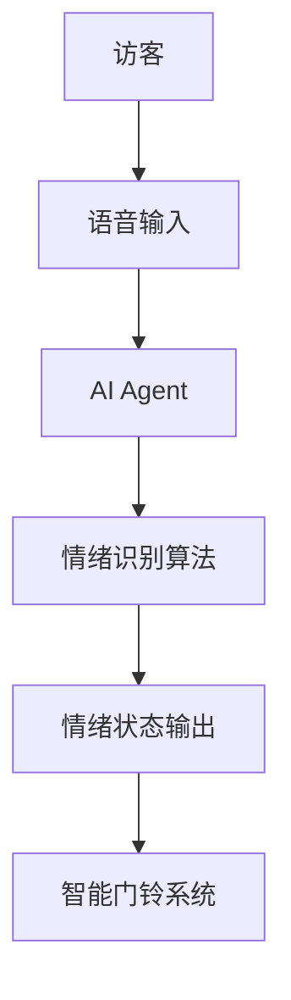
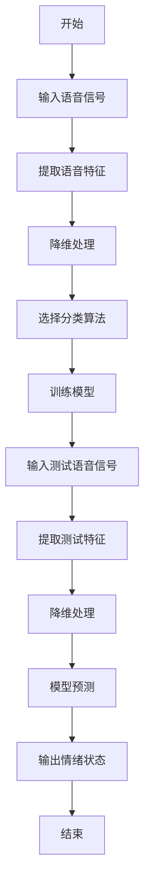
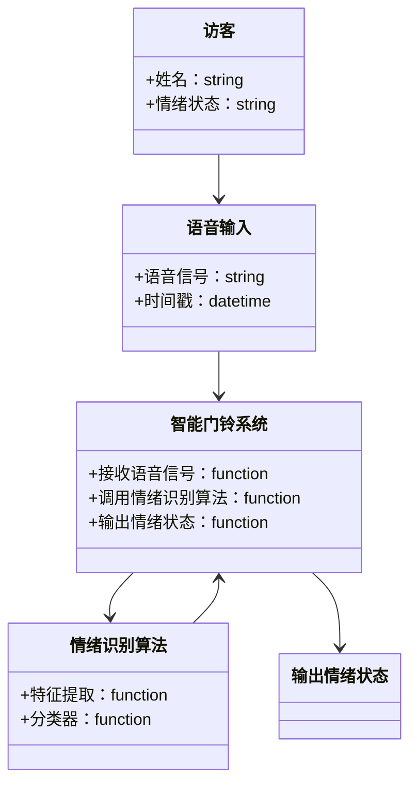
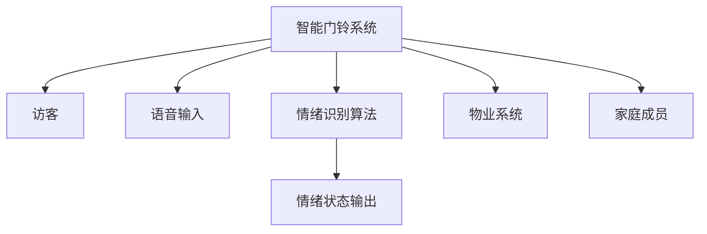

                 


# AI Agent在智能门铃中的访客情绪识别

---

## 关键词：  
智能门铃、AI Agent、访客情绪识别、语音识别、深度学习

---

## 摘要：  
随着智能家居的普及，智能门铃作为家庭安全的重要组成部分，正在逐步融入更多智能化功能。本文将探讨AI Agent在智能门铃中的应用，重点分析访客情绪识别的核心技术与实现方法。通过背景介绍、核心概念、算法原理、系统架构设计、项目实战等多维度的深入分析，本文旨在为读者提供一个全面的技术视角，展示AI Agent如何通过情绪识别提升智能门铃的功能与用户体验。  

---

## 第一部分：背景介绍

### 第1章：问题背景与描述

#### 1.1 问题背景
- **智能门铃的发展历程**  
  智能门铃从最初的机械门铃逐渐演变为基于物联网技术的智能设备，如今更是加入了AI技术，使其具备了智能化的交互能力。  
- **情绪识别技术的现状**  
  情绪识别技术在语音助手、客服系统等领域已有广泛应用，但在智能门铃中的应用尚处于起步阶段。  
- **AI Agent在智能家居中的应用趋势**  
  AI Agent（智能代理）作为连接智能家居设备的核心技术，正在逐步成为提升智能家居用户体验的关键驱动力。  

#### 1.2 问题描述
- **访客情绪识别的需求**  
  当访客按下门铃时，智能门铃可以通过语音交互识别访客的情绪状态（如焦虑、平静、愤怒等），从而为家庭成员提供更精准的访客信息。  
- **当前访客情绪识别的痛点**  
  传统智能门铃仅能实现基础的门铃提醒功能，无法主动识别访客的情绪状态，这在实际使用中存在诸多不便。  
- **情绪识别在智能门铃中的潜在价值**  
  通过情绪识别，智能门铃可以为家庭成员提供更智能的访客管理服务，例如情绪异常时自动通知物业或家人。  

#### 1.3 问题解决
- **AI Agent在访客情绪识别中的作用**  
  AI Agent通过语音识别、自然语言处理和情感分析技术，能够实时分析访客的情绪状态，并将结果传递给智能门铃系统。  
- **情绪识别技术如何提升智能门铃的功能**  
  情绪识别技术可以增强智能门铃的交互能力，使其能够理解访客的情感需求，从而提供更个性化的服务。  
- **解决方案的可行性分析**  
  基于深度学习的情绪识别技术已经在多个领域得到验证，其在智能门铃中的应用具有较高的可行性。  

#### 1.4 边界与外延
- **情绪识别的边界条件**  
  情绪识别仅针对访客的语音输入，不涉及视频或图像分析。  
- **情绪识别的外延应用**  
  情绪识别技术可以扩展至其他智能家居设备，例如智能音箱、智能灯泡等，提供更广泛的应用场景。  
- **与其他智能设备的协同工作**  
  情绪识别可以与智能门锁、安防系统等设备协同工作，进一步提升家庭安全水平。  

#### 1.5 概念结构与核心要素
- **情绪识别的核心概念**  
  情绪识别是指通过分析语音、语调、语速等特征，判断说话人的情绪状态。  
- **AI Agent在智能门铃中的角色**  
  AI Agent作为智能门铃的核心控制模块，负责接收访客的语音输入，调用情绪识别算法进行分析，并将结果传递给系统。  
- **核心要素的构成与关系**  
  核心要素包括语音输入、情绪识别算法、智能门铃系统，三者通过数据流形成一个完整的交互闭环。  

---

## 第二部分：核心概念与联系

### 第2章：AI Agent与情绪识别的核心原理

#### 2.1 核心概念原理
- **AI Agent的基本原理**  
  AI Agent是一种能够感知环境、自主决策并执行任务的智能实体。在智能门铃中，AI Agent负责接收访客的语音输入，并调用情绪识别算法进行分析。  
- **情绪识别的基本原理**  
  情绪识别主要依赖于语音特征的提取与分析，包括音调、节奏、音量等特征。通过机器学习算法，可以将这些特征映射到特定的情绪类别上。  
- **两者结合的实现机制**  
  AI Agent通过调用情绪识别算法，将访客的语音输入转化为情绪状态，从而实现智能门铃的智能化交互。  

#### 2.2 情绪识别的核心算法
- **基于规则的情绪识别**  
  通过预设的规则库，分析语音特征（如音调、语速）来判断情绪。  
- **基于机器学习的情绪识别**  
  使用训练好的模型（如支持向量机、随机森林）进行情绪分类。  
- **基于深度学习的情绪识别**  
  利用神经网络（如LSTM、Transformer）进行语音特征的深度提取与情绪分类。  

#### 2.3 情绪识别与AI Agent的关系
- **数据流的关系**  
  访客语音输入 → AI Agent → 情绪识别算法 → 情绪状态输出。  
- **功能上的协同**  
  AI Agent负责任务调度与执行，情绪识别算法负责提供情绪分析结果。  
- **系统架构中的位置**  
  AI Agent作为系统的核心模块，位于智能门铃的控制中心，负责协调情绪识别算法与其他系统组件的工作。  

---

### 2.4 情绪识别与AI Agent的实体关系图



---

## 第三部分：算法原理讲解

### 第3章：情绪识别算法的数学模型

#### 3.1 特征提取
- **语音特征的提取**  
  通过短时傅里叶变换（STFT）提取语音信号的频域特征，包括能量、能量倒谱等。  
- **语音特征的表示**  
  使用梅尔频谱倒谱（MFCC）提取语音的特征向量。  
- **音调、节奏和音量的数学表示**  
  音调表示为基频（F0），节奏表示为语速（字/秒），音量表示为振幅（dB）。  

#### 3.2 分类器设计
- **基于支持向量机（SVM）的分类**  
  SVM是一种常用的监督学习算法，适用于小规模数据集的情绪分类任务。  
- **基于神经网络的情绪分类**  
  使用卷积神经网络（CNN）或循环神经网络（RNN）进行情绪分类，适用于大规模数据集。  
- **预测模型的评估与优化**  
  使用准确率、召回率、F1分数等指标对模型性能进行评估，并通过交叉验证优化模型参数。  

#### 3.3 算法流程
- **数据预处理**  
  对语音信号进行降噪处理，提取有用的特征。  
- **特征提取与降维**  
  使用主成分分析（PCA）对特征向量进行降维，减少计算复杂度。  
- **模型训练与测试**  
  在训练集上训练模型，并在测试集上验证模型性能。  

---

### 3.4 情绪识别算法的流程图



---

## 第四部分：系统分析与架构设计

### 第4章：系统架构设计

#### 4.1 问题场景介绍
- **访客通过智能门铃与家庭成员进行交互**  
  当访客按下门铃时，智能门铃会通过语音交互了解访客的情绪状态。  
- **系统需要实时识别访客的情绪，并提供相应的反馈**  
  例如，当访客情绪异常时，系统可以自动通知物业或家人。  

#### 4.2 系统功能设计



#### 4.3 系统架构设计



---

## 第五部分：项目实战

### 第5章：环境安装与核心代码实现

#### 5.1 环境安装
- **安装Python与相关库**  
  使用Anaconda安装Python 3.8及以上版本，并安装numpy、scipy、sklearn、tensorflow等库。  
- **安装语音处理库**  
  使用librosa库进行语音信号处理，安装命令：`pip install librosa`。  

#### 5.2 核心代码实现

```python
import librosa
import numpy as np
from sklearn.svm import SVC
from sklearn.metrics import accuracy_score

# 1. 语音特征提取
def extract_features(audio_path):
    y, sr = librosa.load(audio_path, sr=16000)
    mfccs = librosa.feature.mfcc(y, sr=sr, n_mfcc=13)
    return mfccs.T

# 2. 数据预处理
def preprocess_data(train_paths, test_paths):
    train_features = []
    train_labels = []
    for path in train_paths:
        features = extract_features(path)
        train_features.append(features)
        # 假设文件名中的标签表示情绪
        label = path.split('/')[-1].split('_')[0]
        train_labels.append(label)
    train_features = np.array(train_features)
    train_labels = np.array(train_labels)
    test_features = []
    test_labels = []
    for path in test_paths:
        features = extract_features(path)
        test_features.append(features)
        label = path.split('/')[-1].split('_')[0]
        test_labels.append(label)
    test_features = np.array(test_features)
    test_labels = np.array(test_labels)
    return train_features, train_labels, test_features, test_labels

# 3. 模型训练与测试
def train_model(train_features, train_labels):
    model = SVC(kernel='rb

