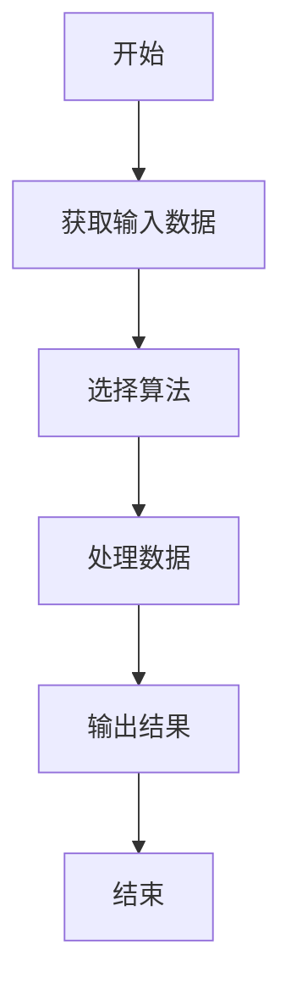
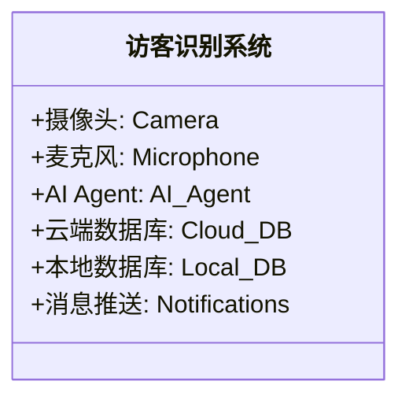
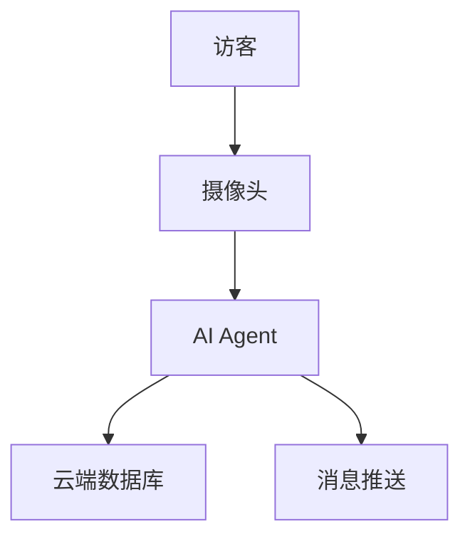
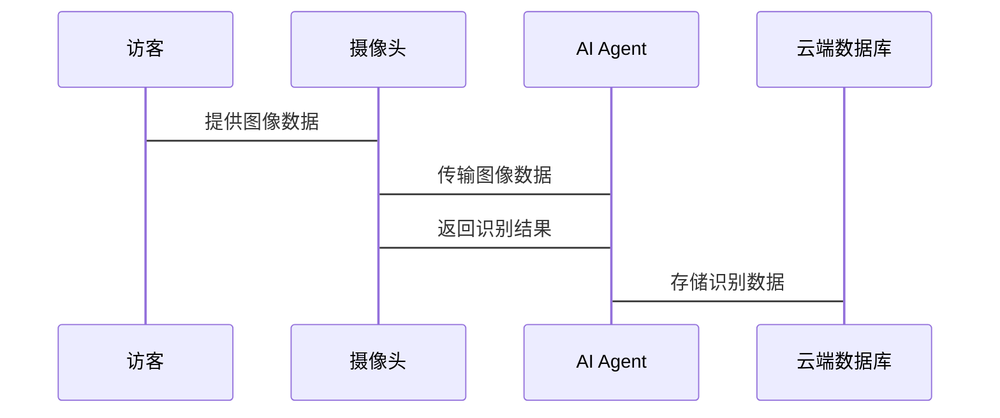

                 


# AI Agent在智能门铃中的访客识别

> 关键词：AI Agent, 智能门铃, 访客识别, 图像识别, 语音识别, 多模态数据融合

> 摘要：本文详细探讨了AI Agent在智能门铃中的访客识别技术，从背景介绍、核心概念到算法原理、系统架构设计，再到项目实战和最佳实践，全面解析了AI Agent如何实现智能门铃的访客识别功能。文章内容丰富，逻辑清晰，旨在为技术爱好者和开发者提供深入的技术见解和实践指导。

---

# 第一部分: AI Agent在智能门铃中的访客识别概述

## 第1章: 智能门铃与AI Agent的背景介绍

### 1.1 智能门铃的基本概念
#### 1.1.1 智能门铃的定义与功能
智能门铃是一种基于物联网技术的智能硬件设备，主要用于家庭或办公场所的门禁系统。它通过传感器和网络通信技术，能够实时监测门铃的状态，并通过云端或本地处理，实现访客识别、消息通知等功能。

#### 1.1.2 AI Agent在智能门铃中的作用
AI Agent（人工智能代理）是一种能够感知环境、执行任务的智能程序。在智能门铃中，AI Agent主要负责处理访客的图像、语音等信息，实现访客的身份识别、行为分析和消息推送。

#### 1.1.3 智能门铃的市场现状与发展前景
随着智能家居的普及，智能门铃市场迅速增长。AI Agent的应用使得智能门铃的功能更加智能化，能够实现访客识别、异常行为检测等高级功能，未来将成为智能家居的核心组件之一。

---

## 第2章: AI Agent在访客识别中的核心概念与联系

### 2.1 核心概念原理
#### 2.1.1 图像识别与AI Agent的关系
图像识别是AI Agent实现访客识别的重要技术。通过摄像头采集访客的图像数据，AI Agent利用深度学习模型（如卷积神经网络CNN）进行图像分类和人脸识别。

#### 2.1.2 语音识别与AI Agent的结合
语音识别是另一种重要的访客识别技术。AI Agent可以通过麦克风采集访客的声音数据，利用语音识别算法（如MFCC、DTW）或深度学习模型（如CRNN）进行语音匹配和识别。

#### 2.1.3 多模态数据融合的原理
多模态数据融合是指将图像、语音等多种数据源进行融合，以提高访客识别的准确性和鲁棒性。AI Agent可以通过多模态数据融合技术，实现更精准的访客识别。

### 2.2 核心概念属性特征对比
| 核心概念 | 特征 |
|----------|------|
| 图像识别 | 高精度、依赖光照、数据量大 |
| 语音识别 | 实时性高、抗噪声能力强、数据量小 |
| 多模态数据融合 | 综合性强、准确率高、鲁棒性好 |

---

## 第3章: AI Agent访客识别的算法原理

### 3.1 算法原理概述
#### 3.1.1 基于图像识别的访客识别算法
图像识别算法通常包括图像采集、预处理、特征提取和分类识别四个步骤。常用的算法包括基于CNN的深度学习算法和基于Haar Cascade的特征检测算法。

#### 3.1.2 基于语音识别的访客识别算法
语音识别算法通常包括语音采集、预处理、特征提取和模式匹配四个步骤。常用的算法包括基于MFCC的传统语音识别算法和基于CRNN的深度学习算法。

#### 3.1.3 多模态数据融合的算法原理
多模态数据融合算法通常包括数据预处理、特征提取、融合策略和分类器设计四个步骤。常用的融合策略包括早期融合和晚期融合。

### 3.2 算法流程图


### 3.3 算法实现代码
```python
import cv2
def face_detection(image):
    face_cascade = cv2.CascadeClassifier('haarcascade_frontalface_default.xml')
    gray = cv2.cvtColor(image, cv2.COLOR_BGR2GRAY)
    faces = face_cascade.detectMultiScale(gray, 1.3, 5)
    return faces
```

---

## 第4章: 系统架构设计

### 4.1 问题场景介绍
智能门铃访客识别系统需要实现以下功能：访客图像采集、访客语音采集、访客识别、消息推送和日志记录。

### 4.2 系统功能设计
#### 4.2.1 领域模型


#### 4.2.2 系统架构设计


### 4.3 系统接口设计
#### 4.3.1 系统接口描述
- 摄像头接口：提供视频流数据
- 麦克风接口：提供音频流数据
- AI Agent接口：提供访客识别服务
- 云端数据库接口：提供数据存储服务

#### 4.3.2 系统交互流程


---

## 第5章: 项目实战

### 5.1 环境安装
- 安装Python和相关库（OpenCV、TensorFlow）
- 安装硬件设备（摄像头、麦克风）

### 5.2 系统核心实现源代码
```python
import cv2
import tensorflow as tf
def main():
    # 初始化摄像头
    cap = cv2.VideoCapture(0)
    while cap.isOpened():
        ret, frame = cap.read()
        if not ret:
            break
        # 调用AI Agent进行访客识别
        result = ai_agent.detect(frame)
        # 处理识别结果
        if result['face detected']:
            print("检测到人脸：", result['face_id'])
        if result['voice detected']:
            print("检测到语音：", result['voice_id'])
    cap.release()
```

### 5.3 实际案例分析
- 案例1：家庭访客识别
- 案例2：办公室访客识别
- 案例3：异常行为检测

---

## 第6章: 小结与注意事项

### 6.1 小结
本文详细介绍了AI Agent在智能门铃中的访客识别技术，从背景介绍到系统架构设计，再到项目实战，全面解析了AI Agent在访客识别中的应用。

### 6.2 注意事项
- 硬件设备的选择需要考虑性能和稳定性
- 数据安全和隐私保护需要高度重视
- 系统的可扩展性和可维护性需要提前规划

---

## 第7章: 拓展阅读

### 7.1 相关技术
- 深度学习在图像识别中的应用
- 语音识别的最新进展
- 多模态数据融合的前沿技术

### 7.2 推荐书籍
- 《深度学习》（Deep Learning）
- 《语音信号处理》（Speech Signal Processing）
- 《人工智能》（Artificial Intelligence）

---

作者：AI天才研究院/AI Genius Institute & 禅与计算机程序设计艺术 /Zen And The Art of Computer Programming

