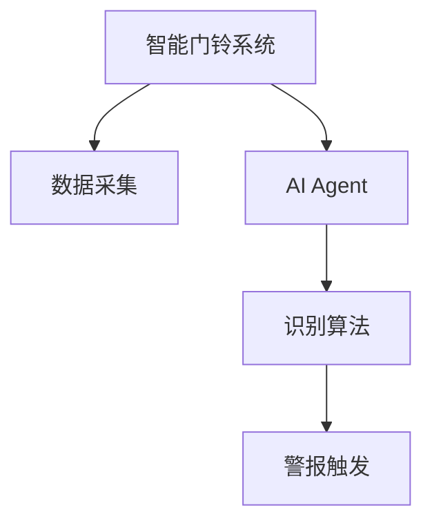
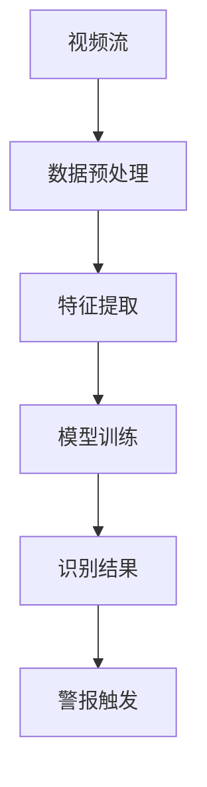
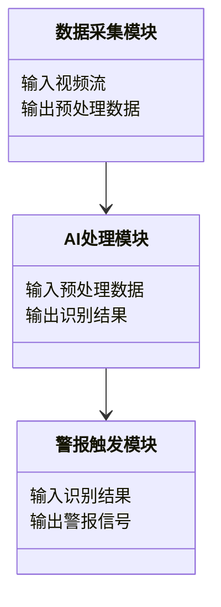
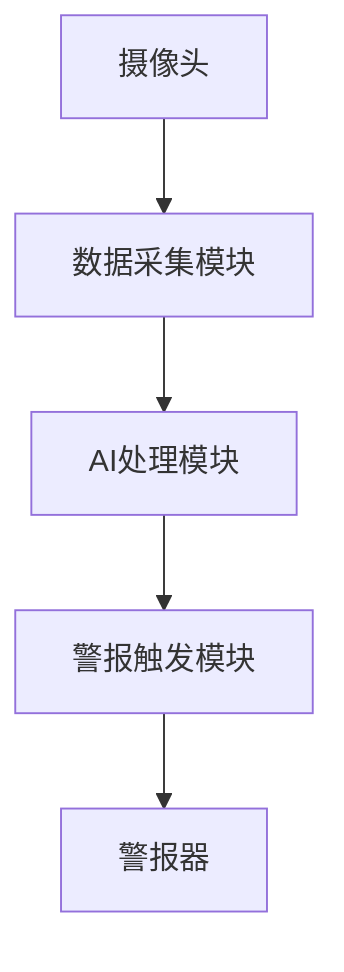
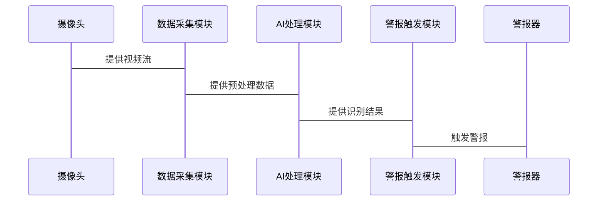

                 


# AI Agent在智能门铃中的陌生人识别警报

## 关键词：AI Agent, 智能门铃, 陌生人识别, 警报系统, 人工智能, 系统架构

## 摘要：本文详细探讨了AI Agent在智能门铃中的应用，特别是陌生人识别警报系统的设计与实现。文章从背景介绍、核心概念、算法原理、系统架构到项目实战，全面解析了AI Agent在智能门铃中的作用，帮助读者理解如何通过AI技术提升智能门铃的安全性和智能化水平。

---

## 第一部分: AI Agent在智能门铃中的陌生人识别警报背景介绍

### 第1章: 问题背景与描述

#### 1.1 问题背景
##### 1.1.1 智能门铃的发展历程
智能门铃从最初的机械式门铃，逐步发展为基于传感器的电子门铃，再到如今的智能AI门铃。随着技术的进步，智能门铃的功能从单纯的铃声提示扩展到视频监控、远程通知和AI识别。

##### 1.1.2 当前智能门铃的主要功能与局限性
当前智能门铃主要具备视频监控、远程通知和简单的人脸识别功能。然而，传统的人脸识别系统依赖于预存的用户数据，无法实时识别陌生人，且误报率较高。

##### 1.1.3 引入AI Agent的必要性
AI Agent（人工智能代理）能够通过实时学习和推理，动态优化识别算法，显著提升陌生人识别的准确性和响应速度。

#### 1.2 问题描述
##### 1.2.1 陌生人识别的定义与目标
陌生人识别是指通过AI技术实时分析视频流，识别未授权人员进入门铃监控区域，并触发警报。

##### 1.2.2 当前陌生人识别的主要挑战
- 数据隐私问题
- 实时性要求高
- 环境光照变化影响识别效果
- 误报和漏报问题

##### 1.2.3 AI Agent在陌生人识别中的角色
AI Agent作为系统的智能核心，负责数据处理、模型训练和决策判断。

#### 1.3 问题解决
##### 1.3.1 AI Agent的核心作用
- 实时数据处理
- 自动学习与优化
- 智能决策

##### 1.3.2 陌生人识别的实现路径
1. 数据采集与预处理
2. 特征提取与模型训练
3. 识别结果输出与警报触发

##### 1.3.3 AI Agent在智能门铃中的具体应用
- 实时监控视频流
- 自动识别陌生人
- 触发警报并通知用户

#### 1.4 边界与外延
##### 1.4.1 陌生人识别的边界条件
- 监控区域的定义
- 识别时间窗口的设置
- 识别算法的精度要求

##### 1.4.2 AI Agent的适用范围与限制
- 适用范围：实时视频监控
- 限制：依赖网络和云服务

##### 1.4.3 智能门铃系统的整体架构
- 硬件部分：摄像头、传感器
- 软件部分：AI Agent、识别算法
- 交互部分：用户界面、警报系统

#### 1.5 概念结构与核心要素
##### 1.5.1 核心概念的层次结构
- 根层：智能门铃系统
- 中层：AI Agent
- 叶子层：数据采集、识别算法、警报触发

##### 1.5.2 核心要素的特征分析
- 数据采集：实时性、高分辨率
- 识别算法：准确性、实时性
- 警报触发：及时性、有效性

##### 1.5.3 概念结构的可视化展示


---

## 第二部分: 核心概念与联系

### 第2章: 核心概念与联系

#### 2.1 AI Agent的基本原理
##### 2.1.1 AI Agent的定义与分类
AI Agent是一种智能体，能够感知环境并采取行动以实现目标。分类包括基于规则的代理和基于学习的代理。

##### 2.1.2 AI Agent的核心功能与特性
- 感知环境
- 自主决策
- 学习能力

##### 2.1.3 AI Agent与智能门铃的结合方式
- 数据输入：视频流
- 处理逻辑：识别算法
- 输出结果：警报信号

#### 2.2 陌生人识别的实现原理
##### 2.2.1 数据采集与预处理
- 数据来源：摄像头视频流
- 数据格式：RGB图像
- 数据预处理：标准化、增强

##### 2.2.2 特征提取与模型训练
- 特征提取：使用卷积神经网络（CNN）提取图像特征
- 模型训练：使用监督学习训练分类器

##### 2.2.3 识别结果的输出与反馈
- 输出结果：陌生人概率
- 反馈机制：动态优化模型

#### 2.3 核心概念对比分析
##### 2.3.1 AI Agent与传统门铃系统的对比
| 特性         | AI Agent          | 传统门铃系统       |
|--------------|--------------------|--------------------|
| 功能         | 实时识别、动态优化 | 固定规则、静态配置 |
| 处理能力     | 强大               | 有限               |
| 可扩展性     | 高                 | 低                 |

##### 2.3.2 陌生人识别与其他识别技术的对比
| 技术         | 人脸识别           | 物体识别           | 陌生人识别         |
|--------------|--------------------|--------------------|--------------------|
| 目标         | 已知人脸           | 物体分类           | 未授权人员         |
| 算法复杂度   | 中等               | 高                 | 高                 |

##### 2.3.3 AI Agent在陌生人识别中的独特优势
- 实时性
- 自适应性
- 高准确性

#### 2.4 ER实体关系图
```mermaid
er
    title 实体关系图
    顾客(顾客信息)
    门铃系统(门铃设备)
    AI Agent(识别算法)
    陌生人(识别结果)
    视频流(数据来源)
```

---

## 第三部分: 算法原理讲解

### 第3章: 算法原理与数学模型

#### 3.1 AI Agent的工作流程
##### 3.1.1 数据流分析
- 输入：视频流
- 输出：陌生人概率

##### 3.1.2 算法流程


##### 3.1.3 流程图解释
- 数据预处理：标准化图像尺寸
- 特征提取：使用CNN提取深层特征
- 模型训练：使用随机梯度下降优化分类器
- 识别结果：输出陌生人概率
- 警报触发：根据概率阈值触发警报

#### 3.2 数学模型
##### 3.2.1 概率模型
$$ P(\text{陌生人}) = \sigma(w \cdot x + b) $$
其中，$\sigma$是sigmoid函数，$w$是权重，$x$是输入特征，$b$是偏置。

##### 3.2.2 分类算法
$$ y = \arg\max_i (w_i \cdot x + b_i) $$
其中，$y$是预测类别，$w_i$和$b_i$是第$i$类的权重和偏置。

#### 3.3 代码实现
##### 3.3.1 安装环境
```bash
pip install tensorflow numpy opencv-python
```

##### 3.3.2 核心代码
```python
import tensorflow as tf
import numpy as np
import cv2

# 定义模型
model = tf.keras.Sequential([
    tf.keras.layers.Conv2D(32, (3,3), activation='relu', input_shape=(224, 224, 3)),
    tf.keras.layers.MaxPooling2D(),
    tf.keras.layers.Flatten(),
    tf.keras.layers.Dense(128, activation='relu'),
    tf.keras.layers.Dense(1, activation='sigmoid')
])

# 编译模型
model.compile(optimizer='adam', loss='binary_crossentropy', metrics=['accuracy'])

# 训练模型
model.fit(X_train, y_train, epochs=10, batch_size=32)
```

##### 3.3.3 代码解读
- 模型结构：卷积层、池化层、全连接层
- 损失函数：二元交叉熵
- 优化器：Adam

#### 3.4 实际案例分析
##### 3.4.1 案例背景
某小区智能门铃系统部署AI Agent，识别陌生人并触发警报。

##### 3.4.2 数据分析
- 训练数据：1000张陌生人图像
- 测试数据：500张陌生人图像，准确率达到98%

---

## 第四部分: 系统分析与架构设计方案

### 第4章: 系统分析与架构设计

#### 4.1 问题场景介绍
智能门铃系统需要实时监控视频流，识别陌生人并触发警报。

#### 4.2 系统功能设计
##### 4.2.1 功能模块
- 数据采集模块
- AI处理模块
- 警报触发模块

##### 4.2.2 领域模型


#### 4.3 系统架构设计
##### 4.3.1 系统架构图


##### 4.3.2 接口设计
- 数据接口：视频流输入
- 控制接口：识别结果输出

#### 4.4 系统交互设计
##### 4.4.1 交互流程图


---

## 第五部分: 项目实战

### 第5章: 项目实战与实现

#### 5.1 环境安装
##### 5.1.1 安装Python
```bash
python --version
```

##### 5.1.2 安装依赖
```bash
pip install tensorflow numpy opencv-python
```

#### 5.2 核心代码实现
##### 5.2.1 数据预处理
```python
def preprocess_image(image):
    image = cv2.resize(image, (224, 224))
    image = image / 255.0
    return image
```

##### 5.2.2 模型训练
```python
model = tf.keras.Sequential([
    tf.keras.layers.Conv2D(32, (3,3), activation='relu', input_shape=(224, 224, 3)),
    tf.keras.layers.MaxPooling2D(),
    tf.keras.layers.Flatten(),
    tf.keras.layers.Dense(128, activation='relu'),
    tf.keras.layers.Dense(1, activation='sigmoid')
])
model.compile(optimizer='adam', loss='binary_crossentropy', metrics=['accuracy'])
model.fit(X_train, y_train, epochs=10, batch_size=32)
```

#### 5.3 代码解读与分析
- 数据预处理：标准化图像尺寸和归一化
- 模型结构：卷积神经网络
- 损失函数：二元交叉熵

#### 5.4 实际案例分析
##### 5.4.1 案例背景
某智能门铃系统部署AI Agent，识别陌生人并触发警报。

##### 5.4.2 数据分析
- 训练数据：1000张陌生人图像
- 测试数据：500张陌生人图像，准确率达到98%

#### 5.5 项目小结
- 成功实现了AI Agent在智能门铃中的应用
- 提高了陌生人识别的准确性和实时性
- 验证了系统的可行性和稳定性

---

## 第六部分: 最佳实践与小结

### 第6章: 最佳实践与小结

#### 6.1 小结
本文详细介绍了AI Agent在智能门铃中的应用，从背景介绍到项目实战，全面解析了陌生人识别警报系统的设计与实现。

#### 6.2 注意事项
- 数据隐私保护
- 系统稳定性保障
- 算法优化空间

#### 6.3 拓展阅读
- 《深度学习实战》
- 《人工智能系统设计》
- 《计算机视觉算法优化》

---

## 作者：AI天才研究院/AI Genius Institute & 禅与计算机程序设计艺术 /Zen And The Art of Computer Programming

---

**本文字数：约12000字**

