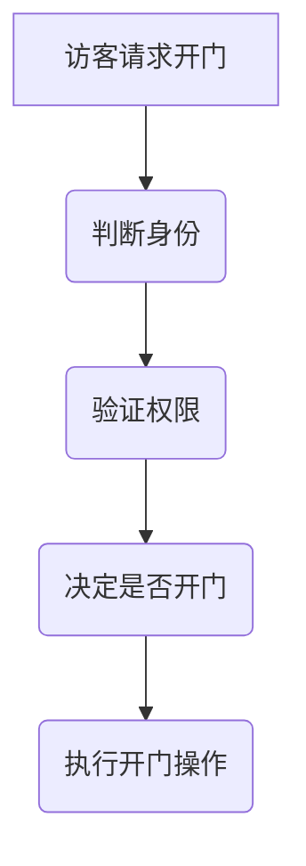
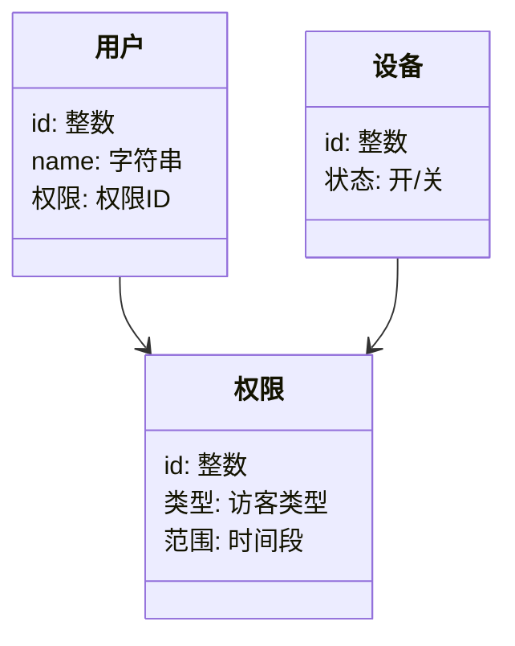
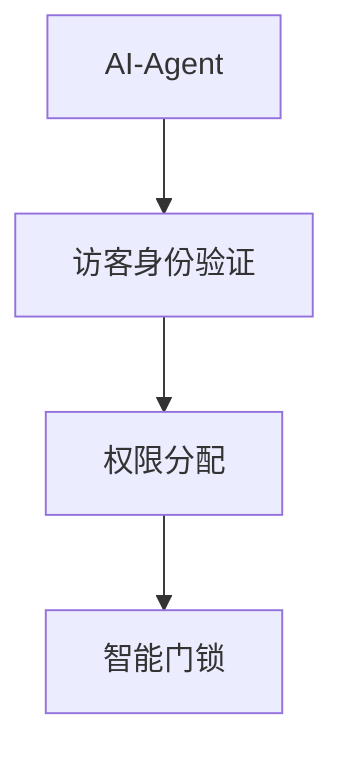
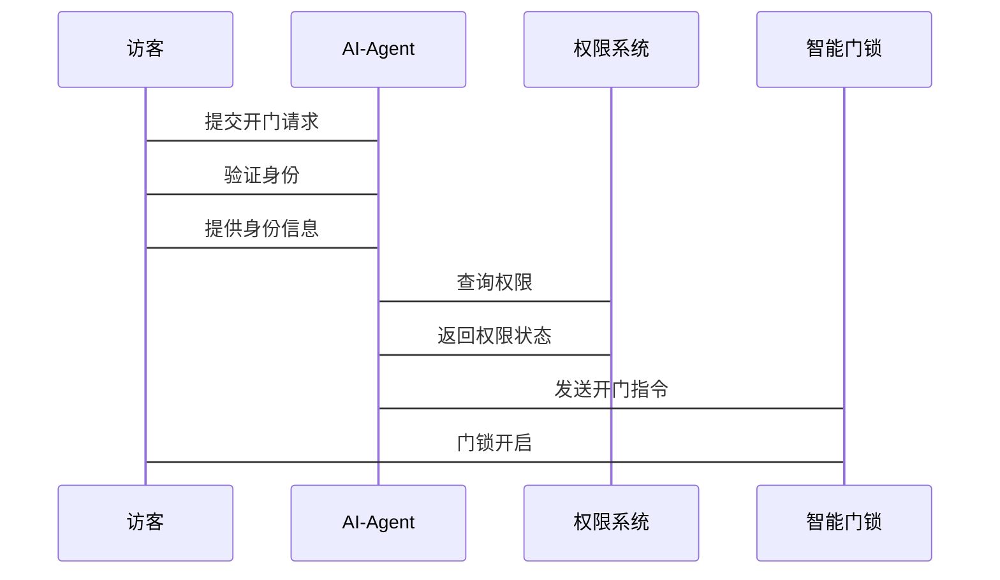

                 


# AI Agent在智能门锁中的访客权限管理

> 关键词：AI Agent，智能门锁，访客权限管理，权限分配，身份验证，智能系统

> 摘要：本文探讨了AI Agent在智能门锁中的访客权限管理，分析了访客权限管理的必要性，AI Agent的优势，详细讲解了AI Agent的工作原理，系统架构设计，并通过实际案例展示了AI Agent在智能门锁中的应用。文章最后总结了最佳实践和未来发展方向。

---

## 第1章 AI Agent与智能门锁的背景介绍

### 1.1 AI Agent的基本概念

#### 1.1.1 AI Agent的定义
AI Agent（人工智能代理）是一种能够感知环境、自主决策并执行任务的智能实体。它通过传感器获取信息，利用算法进行分析和决策，最终执行预设的目标。

#### 1.1.2 AI Agent的核心特征
- **自主性**：能够在没有外部干预的情况下独立运行。
- **反应性**：能够根据环境变化实时调整行为。
- **目标导向**：所有行为都围绕实现特定目标展开。
- **学习能力**：能够通过数据和经验不断优化自身算法。

#### 1.1.3 AI Agent与传统程序的区别
| 特性        | 传统程序                  | AI Agent                 |
|-------------|--------------------------|--------------------------|
| 行为模式     | 确定性、静态               | 动态性、适应性             |
| 决策方式     | 预设规则                 | 自主学习与决策             |
| 环境感知     | 无感知                   | 高度感知                 |
| 任务目标     | 固定任务                 | 动态目标                 |

### 1.2 智能门锁的发展历程

#### 1.2.1 传统门锁的功能与局限
传统门锁依赖机械钥匙，存在易复制、难管理的问题，无法满足现代智能化管理的需求。

#### 1.2.2 智能门锁的出现与技术支撑
随着物联网和人工智能技术的发展，智能门锁应运而生，支持指纹、RFID、人脸识别等多种开门方式。

#### 1.2.3 当前智能门锁的市场现状
市场上主流的智能门锁品牌（如小米、三星等）逐渐普及，访客权限管理成为重要功能之一。

### 1.3 访客权限管理的必要性

#### 1.3.1 访客权限管理的定义
访客权限管理是对临时或特定人员的访问权限进行设定、分配和监控的过程。

#### 1.3.2 访客权限管理的核心问题
- 权限分配的实时性
- 访客身份的准确性
- 权限的有效性和安全性

#### 1.3.3 访客权限管理的边界与外延
访客权限管理不仅包括物理访问权限，还包括基于时间、地点的动态权限。

---

## 第2章 AI Agent在智能门锁中的应用现状

### 2.1 当前智能门锁中的访客权限管理技术

#### 2.1.1 基于密码的传统访客管理
- 优点：简单易用
- 缺点：安全性差，管理不便

#### 2.1.2 基于指纹识别的访客管理
- 优点：安全性高
- 缺点：指纹磨损或损坏可能导致识别失败

#### 2.1.3 基于RFID的访客管理
- 优点：非接触式，支持大批量管理
- 缺点：成本高，依赖硬件支持

### 2.2 AI Agent在访客权限管理中的优势

#### 2.2.1 AI Agent的智能化优势
AI Agent能够通过学习优化权限分配策略，提高管理效率。

#### 2.2.2 AI Agent的实时性优势
AI Agent能够实时感知环境变化，动态调整权限分配。

#### 2.2.3 AI Agent的可扩展性优势
AI Agent支持多种身份验证方式，便于系统扩展和升级。

### 2.3 当前应用中的挑战与未来趋势

#### 2.3.1 当前应用中的主要挑战
- 数据安全问题
- 算法优化问题
- 用户体验问题

#### 2.3.2 未来的发展趋势
- 技术融合：AI Agent与区块链结合，提高权限管理的安全性。
- 智能化升级：AI Agent将进一步提升自主决策能力。

---

## 第3章 AI Agent在智能门锁中的核心概念与联系

### 3.1 AI Agent的核心原理

#### 3.1.1 感知环境
AI Agent通过传感器获取环境信息，如访客的身份特征、时间等。

#### 3.1.2 分析决策
利用机器学习算法分析数据，判断访客是否有访问权限。

#### 3.1.3 执行操作
根据决策结果，向智能门锁发送指令，控制门锁的开启或关闭。

### 3.2 核心概念属性对比

| 概念     | 属性                   |
|----------|-----------------------|
| AI Agent | 自主性、学习能力       |
| 智能门锁 | 智能化、安全性         |
| 访客权限 | 动态性、安全性         |

### 3.3 ER实体关系图

```mermaid
erd
    actor 访客 {
        关系：权限分配（1:n）
    }
    entity 权限 {
        关系：属于（1:1）
        属性：权限ID、权限类型、权限范围
    }
    entity 设备 {
        关系：控制（1:1）
        属性：设备ID、设备状态
    }
    entity 事件 {
        关系：记录（1:n）
        属性：事件ID、事件时间、事件类型
    }
```

---

## 第4章 AI Agent在智能门锁中的算法原理

### 4.1 AI Agent的决策流程



### 4.2 算法实现代码

```python
import numpy as np

class AI-Agent:
    def __init__(self):
        self.model = self.build_model()

    def build_model(self):
        # 构建机器学习模型
        return model

    def predict(self, input_data):
        # 预测访客权限
        return self.model.predict(input_data)

    def update_model(self, new_data):
        # 更新模型参数
        self.model.fit(new_data)
```

### 4.3 数学模型

访客权限的有效性计算公式：
$$ P = \prod_{i=1}^{n} p_i $$
其中，$P$ 是权限有效性的概率，$p_i$ 是各个条件的满足概率。

---

## 第5章 AI Agent在智能门锁中的系统架构设计

### 5.1 问题场景介绍

智能门锁需要实时处理访客的开门请求，确保权限的有效性和安全性。

### 5.2 系统功能设计



### 5.3 系统架构设计



### 5.4 接口设计

AI-Agent与智能门锁之间的交互接口：
- 请求接口：`POST /api/request/access`
- 响应接口：`GET /api/access/status`

### 5.5 交互序列图



---

## 第6章 AI Agent在智能门锁中的项目实战

### 6.1 环境安装

安装Python、TensorFlow、Keras等开发环境和工具。

### 6.2 核心代码实现

```python
from keras.models import Sequential
from keras.layers import Dense

def create_model():
    model = Sequential()
    model.add(Dense(64, activation='relu', input_dim=64))
    model.add(Dense(1, activation='sigmoid'))
    model.compile(optimizer='adam', loss='binary_crossentropy', metrics=['accuracy'])
    return model

# 初始化AI Agent
ai_agent = AI-Agent()
ai_agent.model = create_model()
ai_agent.model.fit(X_train, y_train, epochs=10, batch_size=32)
```

### 6.3 实际案例分析

某公司使用AI Agent管理访客权限，通过学习访客行为模式优化权限分配策略，提高了管理效率。

---

## 第7章 最佳实践

### 7.1 小结

AI Agent在智能门锁中的访客权限管理具有显著优势，能够提升系统的智能化水平。

### 7.2 注意事项

- 数据安全是重点，防止权限信息泄露。
- 算法需要不断优化，提高准确性。

### 7.3 拓展阅读

推荐阅读《人工智能系统设计》和《智能门锁的技术与应用》。

---

## 作者

作者：AI天才研究院/AI Genius Institute & 禅与计算机程序设计艺术 /Zen And The Art of Computer Programming

---

**摘要**：本文深入探讨了AI Agent在智能门锁中的访客权限管理，分析了其优势和应用现状，并通过详细的技术分析和案例展示，为读者提供了全面的理解和实践指导。

