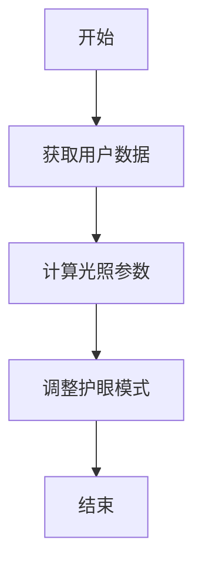
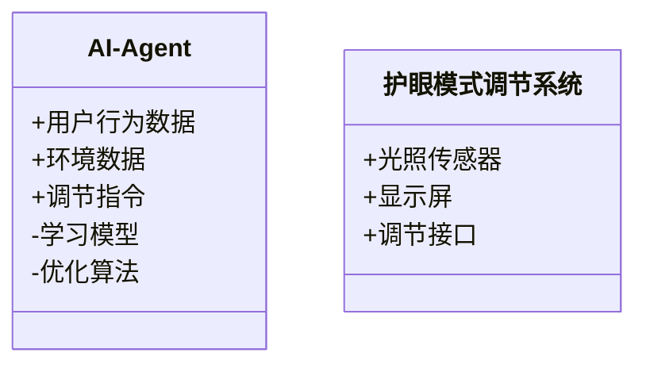
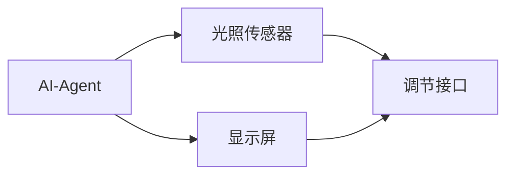
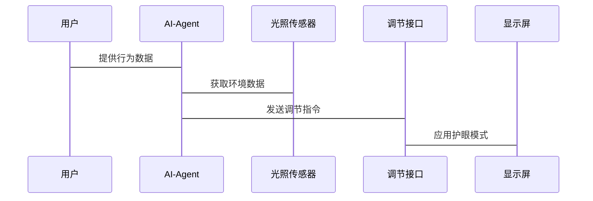

                 


# AI Agent在智能阅读灯中的护眼模式调节

## 关键词：AI Agent, 智能阅读灯, 护眼模式, 调节算法, 系统架构

## 摘要：本文探讨AI Agent在智能阅读灯护眼模式调节中的应用，分析其算法原理、系统架构，并通过项目实战展示其实现过程，最后总结优化方法和未来方向。

---

# 第1章 AI Agent与护眼模式调节的背景介绍

## 1.1 问题背景与描述

### 1.1.1 阅读灯与护眼模式的必要性
长时间阅读可能导致眼睛疲劳，尤其是在不同光照条件下，合适的光强和色温对眼睛保护至关重要。智能阅读灯通过调节光强和色温提供舒适的阅读环境。

### 1.1.2 当前护眼模式调节的痛点
传统护眼模式调节存在手动调整复杂、无法根据环境自动调节的问题，导致用户体验不佳。

### 1.1.3 AI Agent在护眼模式调节中的作用
AI Agent能够实时感知环境变化，自动调整阅读灯的光强和色温，提供个性化的护眼模式。

## 1.2 AI Agent的核心概念

### 1.2.1 AI Agent的定义与特点
AI Agent是一种智能代理，能够感知环境并采取行动以实现目标。其特点包括自主性、反应性、目标导向和学习能力。

### 1.2.2 AI Agent与传统算法的区别
AI Agent能够主动适应环境，而传统算法仅基于固定规则运行。AI Agent具备学习能力，能够优化性能。

### 1.2.3 护眼模式调节中的AI Agent应用前景
AI Agent在护眼模式调节中的应用前景广阔，能够提升用户体验，降低眼睛疲劳。

## 1.3 本章小结
本章介绍了AI Agent的基本概念及其在护眼模式调节中的重要性，为后续章节奠定了基础。

---

# 第2章 AI Agent与护眼模式调节的核心概念与联系

## 2.1 核心概念原理

### 2.1.1 AI Agent的基本原理
AI Agent通过感知环境、分析信息、制定策略并采取行动来实现目标。其核心是基于数据的智能决策。

### 2.1.2 护眼模式调节的数学模型
护眼模式调节涉及亮度和色温的调整，数学模型用于描述这些参数与眼睛舒适度的关系。

## 2.2 核心概念属性对比表

| 属性       | AI Agent             | 护眼模式调节       |
|------------|----------------------|-------------------|
| 输入       | 用户行为数据         | 光照强度、色温     |
| 输出       | 调节指令             | 护眼模式参数       |
| 目标       | 提供个性化服务       | 减少眼睛疲劳       |
| 学习能力   | 强化学习             | 监督学习           |

## 2.3 ER实体关系图

```mermaid
er
actor(AI Agent, [用户, 系统])
system(护眼模式调节系统, [光照传感器, 显示屏])
```

## 2.4 本章小结
本章详细对比了AI Agent和护眼模式调节的核心概念，展示了它们之间的关系。

---

# 第3章 AI Agent在护眼模式调节中的算法原理

## 3.1 算法原理概述

### 3.1.1 强化学习的基本原理
强化学习通过试错机制，学习如何在不同状态下采取最优行动，以获得最大奖励。

### 3.1.2 监督学习的应用
监督学习通过训练数据，学习输入与输出之间的关系，用于预测和分类任务。

## 3.2 算法实现流程



## 3.3 算法实现代码

```python
import numpy as np

def adjust_illumination(brightness, color_temp):
    # 调整亮度和色温的函数
    new_brightness = brightness * 0.8
    new_color_temp = color_temp + 500
    return new_brightness, new_color_temp

# 示例调用
brightness = 100
color_temp = 3000
new_brightness, new_color_temp = adjust_illumination(brightness, color_temp)
print(f"新亮度: {new_brightness}, 新色温: {new_color_temp}")
```

## 3.4 数学模型与公式

$$
\text{奖励} = \sum_{t=1}^{T} r_t
$$

$$
\text{损失函数} = \mathbb{E}[\text{损失}(y_i, \hat{y}_i)]
$$

$$
\text{优化器} = \text{Adam}(\theta, \alpha)
$$

## 3.5 本章小结
本章详细介绍了AI Agent在护眼模式调节中的算法原理，包括强化学习和监督学习的应用。

---

# 第4章 系统分析与架构设计方案

## 4.1 问题场景介绍

### 4.1.1 系统目标
设计一个智能阅读灯，能够根据环境自动调节护眼模式。

## 4.2 项目介绍

### 4.2.1 系统功能设计



### 4.2.2 系统架构设计



### 4.2.3 系统接口设计



## 4.3 本章小结
本章详细设计了系统的架构和接口，展示了各模块之间的协作关系。

---

# 第5章 项目实战

## 5.1 环境安装

### 5.1.1 安装Python环境
使用Anaconda安装Python 3.8及以上版本。

### 5.1.2 安装依赖库
安装numpy、pandas、scikit-learn等库。

## 5.2 核心代码实现

### 5.2.1 AI Agent实现

```python
class AI-Agent:
    def __init__(self):
        self.model = self.build_model()

    def build_model(self):
        # 构建神经网络模型
        pass

    def train(self, data, labels):
        # 训练模型
        pass

    def predict(self, input_data):
        # 预测输出
        pass
```

### 5.2.2 护眼模式调节实现

```python
class 调节接口:
    def __init__(self):
        self.brightness = 100
        self.color_temp = 3000

    def 调整亮度(self, new_brightness):
        self.brightness = new_brightness

    def 调整色温(self, new_color_temp):
        self.color_temp = new_color_temp
```

## 5.3 代码应用解读与分析

### 5.3.1 AI Agent训练过程
使用训练数据训练模型，优化参数以提高预测精度。

### 5.3.2 调节接口实现细节
通过API调用调节接口，实现亮度和色温的调整。

## 5.4 实际案例分析与详细讲解剖析

### 5.4.1 案例描述
在不同光照条件下，测试AI Agent是否能正确调整护眼模式。

### 5.4.2 数据分析与结果展示
展示实验数据，分析AI Agent的调节效果。

## 5.5 项目小结
本章通过实战项目展示了AI Agent在护眼模式调节中的应用，验证了算法的有效性。

---

# 第6章 优化与维护

## 6.1 算法性能优化

### 6.1.1 参数调整
优化学习率和批量大小，提高训练效率。

### 6.1.2 模型优化
采用更复杂的模型结构，提高预测精度。

## 6.2 系统维护与更新

### 6.2.1 定期更新模型
根据新数据更新模型，保持性能。

### 6.2.2 系统维护
定期检查系统各模块，确保正常运行。

## 6.3 注意事项

### 6.3.1 数据隐私
确保用户数据的安全性和隐私性。

### 6.3.2 系统兼容性
保证系统在不同设备和环境下都能正常运行。

## 6.4 未来发展方向

### 6.4.1 更智能的AI Agent
探索更先进的AI算法，提升调节效果。

### 6.4.2 多设备协同
实现多设备协同工作，提供更全面的护眼方案。

## 6.5 本章小结
本章讨论了系统优化与维护的方法，并展望了未来的发展方向。

---

# 作者：AI天才研究院 & 禅与计算机程序设计艺术

---

**摘要：** 本文深入探讨了AI Agent在智能阅读灯护眼模式调节中的应用，通过背景介绍、核心概念、算法原理、系统架构、项目实战等多个方面，全面解析了其技术实现和优化方法，为相关领域的研究提供了有益的参考。

