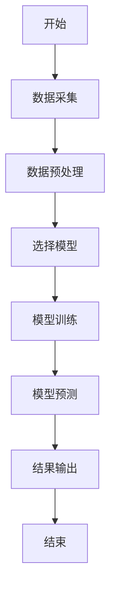
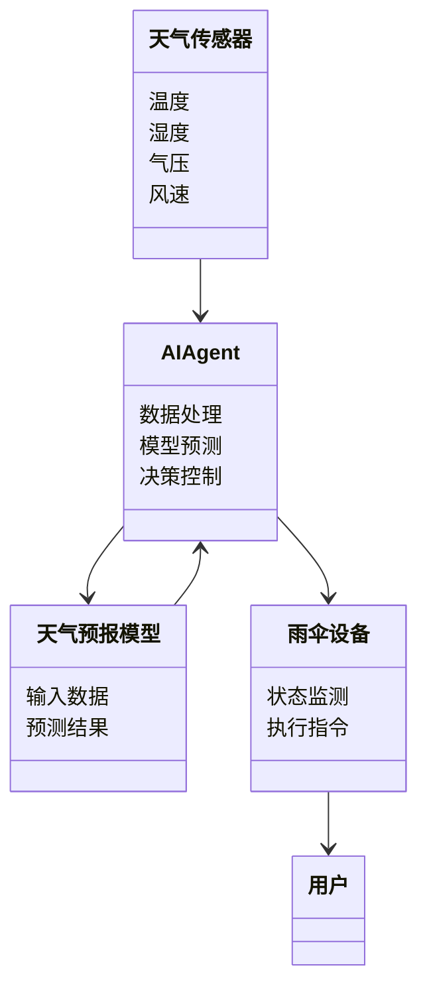
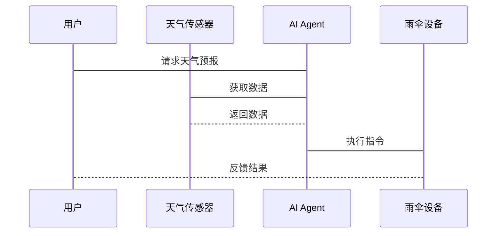

                 


# AI Agent在智能雨伞中的天气预报系统

> 关键词：AI Agent，天气预报系统，智能雨伞，系统设计，算法原理

> 摘要：本文深入探讨AI Agent在智能雨伞中的天气预报系统的应用，从背景介绍、核心概念、算法原理到系统架构设计和项目实战，全面解析该系统的工作原理和实现细节。文章结合理论与实践，通过丰富的图表和代码示例，帮助读者理解并掌握AI Agent在智能雨伞中的天气预报系统的核心技术。

---

# 第一部分：AI Agent与天气预报系统概述

# 第1章：AI Agent与天气预报系统引言

## 1.1 AI Agent的基本概念
### 1.1.1 AI Agent的定义与特点
- AI Agent的定义：智能体（AI Agent）是具有感知和行动能力的实体，能够根据环境信息做出决策并执行任务。
- AI Agent的特点：自主性、反应性、目标导向、社交能力。
- AI Agent的应用场景：天气预报、智能家居、自动驾驶等。

### 1.1.2 AI Agent的核心功能与应用场景
- 核心功能：数据收集、分析、预测、决策和执行。
- 应用场景：智能雨伞、智能家居、医疗辅助、金融分析等。

### 1.1.3 智能雨伞中的AI Agent角色
- 智能雨伞的功能：实时天气监测、自动开合、用户通知。
- AI Agent在智能雨伞中的作用：数据处理、天气预测、用户交互。

## 1.2 天气预报系统的背景与现状
### 1.2.1 天气预报的基本原理
- 天气预报的定义：基于气象数据的分析和预测。
- 天气预报的方法：统计分析、数值模拟、机器学习。

### 1.2.2 天气预报系统的分类与特点
- 分类：基于规则的系统、基于统计的系统、基于机器学习的系统。
- 特点：实时性、准确性、可解释性。

### 1.2.3 智能雨伞与天气预报的结合
- 结合方式：实时天气监测、天气预警、用户通知。
- 智能雨伞的优势：便携性、实时性、用户友好性。

## 1.3 本章小结
- 本章介绍了AI Agent的基本概念及其在智能雨伞中的应用，分析了天气预报系统的背景与现状，为后续内容奠定了基础。

---

# 第二部分：AI Agent在智能雨伞中的天气预报系统核心概念

# 第2章：AI Agent与天气预报系统的核心概念

## 2.1 AI Agent与天气预报系统的概念结构
### 2.1.1 AI Agent在天气预报中的功能模块
- 数据收集模块：传感器数据采集。
- 数据分析模块：数据清洗、特征提取。
- 预测模块：天气预测模型。
- 决策模块：根据预测结果做出开合雨伞的决策。

### 2.1.2 天气预报系统的核心要素
- 数据源：气象传感器、历史天气数据。
- 预测模型：机器学习模型、时间序列模型。
- 用户交互：按钮操作、APP通知。

### 2.1.3 系统边界与外延
- 系统边界：智能雨伞、天气传感器、用户设备。
- 外延：天气数据库、天气服务接口。

## 2.2 AI Agent与天气预报系统的核心联系
### 2.2.1 AI Agent与天气数据的关系
- 数据输入：AI Agent接收天气传感器的数据。
- 数据处理：AI Agent对数据进行清洗和特征提取。
- 数据输出：AI Agent将处理后的数据输入预测模型。

### 2.2.2 天气预报算法与AI Agent的结合
- 预测模型：AI Agent驱动天气预报算法。
- 决策机制：AI Agent根据预测结果做出决策。

### 2.2.3 系统的整体架构与流程
- 整体架构：数据采集、数据处理、模型预测、决策执行。
- 流程图：数据流、信息流和控制流的可视化表示。

## 2.3 核心概念属性特征对比表
| 核心概念 | 属性 | 特征 |
|----------|------|------|
| AI Agent | 数据来源 | 天气传感器、历史数据 |
| 天气预报系统 | 预测模型 | 时间序列分析、机器学习模型 |
| 智能雨伞 | 用户交互 | 按钮操作、APP控制 |

## 2.4 ER实体关系图
```mermaid
erDiagram
    actor 用户
    actor 天气服务
    actor 雨伞设备
    database 天气数据库
    database 雨伞状态数据库
    actor 用户 <<--- 天气服务
    天气服务 --> 天气数据库
    雨伞设备 --> 雨伞状态数据库
    用户 <<--- 雨伞设备
```

---

# 第3章：AI Agent驱动的天气预报算法原理

## 3.1 天气预报算法概述
### 3.1.1 时间序列预测的基本原理
- 时间序列预测的定义：基于历史数据预测未来趋势。
- 时间序列预测的方法：ARIMA、LSTM、Prophet。

### 3.1.2 常见天气预报算法对比
- 对比指标：准确性、计算效率、可解释性。
- 对比结果：LSTM适合时间依赖性较强的天气预测，ARIMA适合平稳时间序列。

### 3.1.3 AI Agent在算法中的作用
- AI Agent作为数据处理和预测执行的驱动者。

## 3.2 基于AI Agent的天气预报模型
### 3.2.1 模型输入与输出
- 输入：温度、湿度、气压、风速。
- 输出：天气状况（晴天、雨天、阴天）。

### 3.2.2 模型训练与优化
- 数据预处理：归一化、缺失值处理。
- 模型选择：LSTM网络。
- 模型优化：调整学习率、批量大小。

### 3.2.3 模型部署与应用
- 模型部署：在智能雨伞中嵌入LSTM模型。
- 应用场景：实时天气监测、天气预警。

## 3.3 算法流程图


---

# 第4章：AI Agent驱动的天气预报系统架构设计

## 4.1 问题场景介绍
### 4.1.1 问题背景
- 雨天使用雨伞的需求。
- 实时天气监测的重要性。

### 4.1.2 项目介绍
- 智能雨伞的功能需求：实时天气监测、自动开合、用户通知。
- 系统目标：开发一个基于AI Agent的智能雨伞天气预报系统。

## 4.2 系统功能设计
### 4.2.1 领域模型设计


### 4.2.2 系统架构设计


### 4.2.3 系统接口设计
- 天气传感器接口：采集环境数据。
- AI Agent接口：接收数据、驱动模型预测、发送指令。
- 雨伞设备接口：接收指令、反馈状态。

### 4.2.4 系统交互流程图


---

# 第5章：AI Agent驱动的天气预报系统项目实战

## 5.1 环境安装与配置
### 5.1.1 安装Python
- 安装步骤：下载Python安装包、配置环境变量。
- 工具选择：使用Anaconda或虚拟环境。

### 5.1.2 安装依赖库
- 必要库：numpy、pandas、keras、tensorflow、matplotlib。
- 安装命令：pip install numpy pandas keras tensorflow matplotlib。

## 5.2 系统核心实现
### 5.2.1 数据处理代码
```python
import numpy as np
import pandas as pd

# 数据加载
data = pd.read_csv('weather.csv')

# 数据预处理
data.dropna(inplace=True)
data['date'] = pd.to_datetime(data['date'])
data.set_index('date', inplace=True)

# 特征提取
features = data[['temperature', 'humidity', 'pressure', 'wind_speed']]
labels = data['weather_condition']
```

### 5.2.2 天气预报模型实现
```python
from keras.models import Sequential
from keras.layers import LSTM, Dense

# 模型构建
model = Sequential()
model.add(LSTM(64, input_shape=(None, 4)))
model.add(Dense(3, activation='softmax'))
model.compile(loss='sparse_categorical_crossentropy', optimizer='adam', metrics=['accuracy'])
```

### 5.2.3 AI Agent的实现
```python
class AIAssistant:
    def __init__(self, model):
        self.model = model
        self.sensor = WeatherSensor()

    def process_data(self, data):
        # 数据预处理
        processed_data = self.sensor.preprocess(data)
        return processed_data

    def predict_weather(self, data):
        processed_data = self.process_data(data)
        prediction = self.model.predict(processed_data)
        return prediction

    def control_umbrella(self, prediction):
        # 根据预测结果发送指令
        if prediction[0][0] > 0.5:
            return 'open'
        else:
            return 'close'
```

## 5.3 代码应用解读与分析
### 5.3.1 数据处理代码解读
- 数据加载：读取CSV文件中的天气数据。
- 数据预处理：删除缺失值、转换日期格式、设置索引。
- 特征提取：提取温度、湿度、气压、风速作为输入特征。

### 5.3.2 天气预报模型解读
- 模型结构：LSTM层+全连接层。
- 模型训练：使用Adam优化器和交叉熵损失函数。
- 模型预测：输出天气状况的概率分布。

### 5.3.3 AI Agent实现解读
- 初始化：加载天气预报模型和天气传感器。
- 数据处理：对传感器数据进行预处理。
- 预测天气：调用模型进行天气预测。
- 控制雨伞：根据预测结果发送开合指令。

## 5.4 实际案例分析与详细讲解
### 5.4.1 案例背景
- 案例目标：预测明天的天气。
- 数据准备：收集今天的温度、湿度、气压、风速。

### 5.4.2 案例实现步骤
1. 数据采集：从天气传感器获取实时数据。
2. 数据处理：清洗和归一化数据。
3. 模型预测：调用AI Agent进行天气预测。
4. 结果分析：预测结果为雨天，发送开伞指令。

### 5.4.3 案例结果与分析
- 预测结果：雨天。
- 执行指令：雨伞自动打开。
- 用户反馈：收到天气预警通知。

## 5.5 项目小结
- 本章通过实际案例展示了AI Agent在智能雨伞中的天气预报系统的实现过程，包括数据处理、模型训练、系统集成和用户交互。

---

# 第6章：总结与展望

## 6.1 本章总结
- AI Agent在智能雨伞中的天气预报系统的实现：从数据采集到模型预测，再到决策执行。
- 系统优势：实时性、准确性、用户友好性。

## 6.2 未来展望
- 技术改进方向：优化天气预报模型、提高系统可解释性。
- 应用拓展：结合其他传感器数据（如空气质量、紫外线强度）提供更全面的天气服务。

## 6.3 最佳实践 Tips
- 数据质量：确保传感器数据的准确性和完整性。
- 模型优化：定期更新模型参数，提高预测精度。
- 系统维护：定期检查硬件设备，确保系统稳定运行。

## 6.4 小结
- 通过本文的介绍，读者可以全面了解AI Agent在智能雨伞中的天气预报系统的实现过程，掌握相关技术的核心要点。

---

# 作者：AI天才研究院/AI Genius Institute & 禅与计算机程序设计艺术 /Zen And The Art of Computer Programming

---

本文通过系统化的分析和实践，深入探讨了AI Agent在智能雨伞中的天气预报系统的实现细节，为相关领域的研究和应用提供了有价值的参考。

